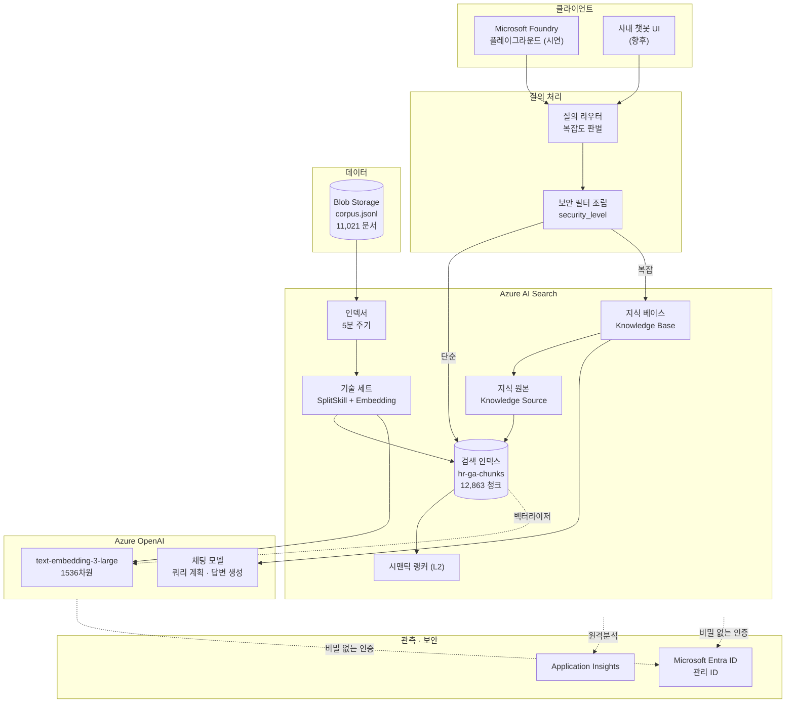

# 01. 시스템 아키텍처 설계서

> **목적** — [분석/](../분석/) 의 결론을 **실제 Azure 리소스로 구성된 아키텍처**로 확정합니다.
> 다음: [02_Azure_서비스_선정서.md](02_Azure_서비스_선정서.md)

---

## 1. 전체 아키텍처



---

## 2. 두 개의 흐름

### 2.1 색인 흐름 (오프라인)

```
   ① 원본 준비    corpus.jsonl 11,021 문서 → Blob Storage
   ② 청킹        SplitSkill (최대 1,200자 · 중첩 120자) → 12,863 청크
   ③ 임베딩      AzureOpenAIEmbeddingSkill → 1536차원 벡터
   ④ 인덱스 프로젝션  청크를 자식 인덱스로 투영 (parent_id 로 원문 연결)
   ⑤ 색인        BM25 역색인 + HNSW 벡터 그래프
```

> **핵심** — ④ 인덱스 프로젝션이 없으면 청크가 부모 문서의 배열 필드로만 들어가
> **개별 청크를 검색할 수 없습니다.** RAG 에서 가장 흔한 구성 실수입니다.

### 2.2 질의 흐름 (온라인)

```
   ① 질의 수신
   ② 복잡도 판별   여러 측면? 조건 여럿? 접속 표현?
   ③ 보안 필터 조립  사용자 등급 → security_level 필터  ★ 사용자 입력이 닿지 않음
   ④ 검색
        단순 → 하이브리드(BM25+벡터+RRF) → 시맨틱 랭커 → 권위 가중
        복잡 → 지식 베이스 (쿼리 분해 → 병렬 → 합성)
   ⑤ 근거 임계값 확인   최고 점수 미달이면 즉시 «모름» 응답
   ⑥ 생성          근거 + 시스템 프롬프트 → 채팅 모델
   ⑦ 응답          답변 + 출처 + 참고용 안내
```

---

## 3. 구성 요소별 역할

| 구성 요소 | Azure 서비스 | 역할 | 대안 대비 근거 |
| --- | --- | --- | --- |
| 원본 저장 | Blob Storage | 코퍼스 보관 | 가장 단순. 인덱서가 직접 읽는다 |
| 청킹 | AI Search SplitSkill | 문서 분할 | 별도 파이프라인 불필요 |
| 임베딩 | Azure OpenAI | 벡터 생성 | 검색 서비스가 직접 호출 (통합 벡터화) |
| **색인** | **AI Search 인덱스** | BM25 + HNSW | 한 인덱스에서 하이브리드가 가능 |
| 융합 | AI Search RRF (k=60) | 키워드+벡터 병합 | 내장. 별도 구현 불필요 |
| 재순위 | AI Search 시맨틱 랭커 | L2 재정렬 | **에이전트 검색의 전제 조건** |
| 에이전트 | 지식 베이스 + 지식 원본 | 분해·병렬·합성 | 다중 홉 질의 대응 |
| 생성 | Azure OpenAI 채팅 | 답변 작성 | |
| 시연 | Foundry 플레이그라운드 | 챗봇 데모 | CON‑04 요구사항 |
| 인증 | Entra ID 관리 ID | 비밀 없는 접근 | SEC‑01 |

---

## 4. 인덱스 구조 — 왜 «청크 인덱스» 하나인가

```
   선택지 A. 문서 인덱스 하나
     · 문서 전체를 하나의 벡터로 → 긴 문서에서 의미가 뭉개진다
     · 청크 단위 인용이 불가능

   선택지 B. 청크 인덱스 + 부모 인덱스 (2개)
     · 청크로 찾고 부모 문서를 반환
     · 문서가 «길 때» 유용하다

   선택지 C. 청크 인덱스 하나  ← 채택
     · 청크마다 메타데이터를 복제해 스스로를 설명하게 한다
     · parent_id 로 원문 링크는 유지
     · 이 코퍼스는 중앙값 204자로 «짧다» → 부모 인덱스의 이득이 작다
```

**되돌릴 조건** — 매뉴얼·규정전문 비중이 크게 늘어 청크만으로 맥락이 부족해지면 B 로 전환.

---

## 5. 환경별 구성

| 항목 | dev | stg | prd |
| --- | --- | --- | --- |
| AI Search 계층 | 기본 | 표준 | 표준 (복제본 2) |
| 시맨틱 랭커 | 무료 할당 | 표준 | 표준 |
| 벡터 압축 | ❌ | ✅ 스칼라 양자화 | ✅ |
| 임베딩 차원 | 1536 | 1536 | 1536 |
| 인덱서 주기 | 수동 | PT15M | **PT5M** |
| 검색 추론 노력 | `low` | `low` | **`medium`** |
| 공용 네트워크 | 허용 | 차단 | **차단** |
| 추적 샘플링 | 100 % | 50 % | 10 % |
| Content Safety | ❌ | ✅ | ✅ |

> ⚠️ **dev 와 prd 의 «기능» 차이를 최소화**했습니다.
> 다만 검색 추론 노력은 비용 차이가 크므로 환경별로 다릅니다.
> 그 결과 «prd 에서만 나타나는 다중 홉 동작»이 있을 수 있어, **stg 에서 medium 을 한 번은 시험**해야 합니다.

---

## 6. 데이터 흐름 상세 — 청크 하나의 여정

```
   corpus.jsonl 의 한 줄
   {"doc_id":"TRP-00002","title":"연차휴가 운영기준 (현행)",
    "content":"[현행] 연차휴가 운영기준 v2.0 …",
    "category":"인사","status":"현행","security_level":"사내", …}
                        │
                        ▼  SplitSkill (1,200자 이하라 분할 없음)
   pages[0] = "[현행] 연차휴가 운영기준 v2.0 …"
                        │
                        ▼  AzureOpenAIEmbeddingSkill
   vector = [0.021, -0.043, …]  (1536차원)
                        │
                        ▼  인덱스 프로젝션
   {"chunk_id":"TRP-00002-c000","parent_id":"TRP-00002",
    "content":"[연차휴가 운영기준 (현행)]\n[현행] 연차휴가 운영기준 v2.0 …",
    "content_vector":[…], "category":"인사","status":"현행", …}
                        │
                        ▼  색인
   BM25 역색인: 연차→[…], 휴가→[…], 한도→[…]
   HNSW 그래프: 이웃 연결
   필터 인덱스: category=인사, status=현행, security_level=사내
```

> **청크에 제목을 머리말로 붙인 이유** — 청크만 떼어 놓으면 무슨 문서의 어느 부분인지 알 수 없습니다.
> 임베딩 품질에도, LLM 이 인용할 때도 도움이 됩니다.

---

## 7. 실패 시 동작 (저하 모드)

| 실패 | 동작 |
| --- | --- |
| Azure OpenAI 임베딩 불가 | 쿼리 벡터화 실패 → **BM25 단독 검색**으로 저하 |
| 시맨틱 랭커 할당 소진 | 재순위 없이 RRF 결과 + 권위 가중 |
| 채팅 모델 불가 | **검색 결과 목록만 제시** (아키텍처 ①로 후퇴) |
| 지식 베이스 오류 | 하이브리드 단일 질의로 폴백 |
| 근거 점수 미달 | LLM 호출 없이 «관련 문서 없음» 응답 |

> 🔑 RAG 는 «검색 + 생성»이므로 **생성이 죽어도 검색은 살아 있습니다.**
> 이 구조적 이점을 살리는 것이 저하 모드 설계입니다.

---

## 8. 아키텍처 품질 검증 매핑

| 품질 목표 ([분석/06](../분석/06_품질속성_및_제약.md)) | 이 아키텍처에서의 구현 |
| --- | --- |
| SEC‑02 제한 문서 노출 0 | 검색 필터 (API 파라미터, 사용자 입력 미접촉) |
| REL‑04 반영 지연 ≤ 1시간 | 인덱서 PT5M + 고수위 변경 감지 |
| REL‑05 LLM 장애 폴백 | 저하 모드 §7 |
| COST‑02 벡터 저장 절감 | 1536차원 + 스칼라 양자화 |
| COST‑03 에이전트 남용 방지 | 질의 라우팅 + 추론 노력 |
| PERF‑01 검색 p95 1.5초 | HNSW + 병렬 하위 쿼리 |
| OPS‑01 코드로 정의 | JSON 생성 스크립트 |
| OPS‑04 근거 추적 | 활동 로그 + 상관 ID |

---

## 9. 다음 문서로의 연결

| 이 문서에서 «정했다»고만 한 것 | 상세 문서 |
| --- | --- |
| 왜 이 Azure 서비스인가 | [02_Azure_서비스_선정서.md](02_Azure_서비스_선정서.md) |
| 인덱스 필드를 어떻게 설계했나 | [03_데이터_모델_및_인덱스_설계서.md](03_데이터_모델_및_인덱스_설계서.md) |
| 청크 크기를 왜 800/1200/120 으로 했나 | [04_청킹_전략_설계서.md](04_청킹_전략_설계서.md) |
| 왜 1536차원인가 | [05_임베딩_전략_설계서.md](05_임베딩_전략_설계서.md) |
| RRF·가중치·권위를 어떻게 정했나 | [06_Hybrid_검색_설계서.md](06_Hybrid_검색_설계서.md) |
| 에이전트 검색을 언제 쓰나 | [07_Agentic_검색_설계서.md](07_Agentic_검색_설계서.md) |
| 프롬프트와 환각 방어 | [08_프롬프트_및_응답_설계서.md](08_프롬프트_및_응답_설계서.md) |
| 품질을 어떻게 재나 | [09_평가_설계서.md](09_평가_설계서.md) |
| 보안·거버넌스 | [10_보안_및_거버넌스_설계서.md](10_보안_및_거버넌스_설계서.md) |
| 운영·비용 | [11_운영_및_비용_설계서.md](11_운영_및_비용_설계서.md) |
