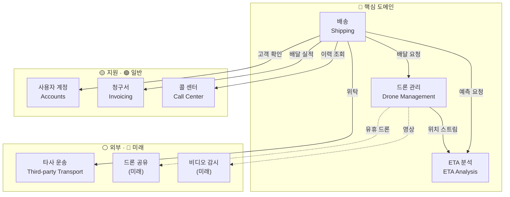
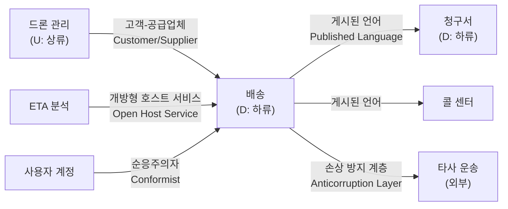

# 02. 전략적 DDD — 도메인 분석

> **목적** — 「도메인 분석을 사용하여 마이크로 서비스 모델링」의 절차를 그대로 따라
> **서브도메인 분류 → 바운디드 컨텍스트 식별 → 컨텍스트 맵 작성** 을 수행합니다.
> 앞 문서: [01_시나리오_요구사항_분석.md](01_시나리오_요구사항_분석.md) · 다음: [03_이벤트_스토밍.md](03_이벤트_스토밍.md)

---

## 1. 왜 «전략적» 설계가 먼저인가

마이크로서비스를 **데이터베이스 테이블**이나 **CRUD 화면** 기준으로 쪼개면 반드시 실패합니다.

| 잘못된 분해 기준 | 결과 |
| --- | --- |
| 테이블 단위 | 하나의 업무를 처리하려고 5개 서비스를 동기 호출 → **분산된 단일체** |
| 화면 단위 | 화면이 바뀔 때마다 서비스 경계가 흔들림 |
| 기술 계층 단위 (Controller/Service/DAO) | 배포 단위가 계층이 되어 독립 배포 불가 |
| **✅ 바운디드 컨텍스트 단위** | 한 서비스 안에서 하나의 업무가 **완결** — 독립 배포·확장 가능 |

> 「도메인 분석」 문서의 핵심 주장: *마이크로서비스는 **비즈니스 역량(business capability)** 을 중심으로 설계해야 하며,
> 서비스 경계는 **바운디드 컨텍스트 경계와 정렬**되어야 한다.*

---

## 2. 절차

```
 ① 도메인 이해        시나리오·이해관계자 인터뷰 → 상위 수준 기능 목록
        │
        ▼
 ② 서브도메인 식별     도메인을 «업무 영역» 단위로 분해
        │
        ▼
 ③ 서브도메인 분류     핵심(Core) / 지원(Supporting) / 일반(Generic)
        │             ← 투자 우선순위 결정. 여기서 «어디에 힘을 쏟을지» 정해집니다
        ▼
 ④ 바운디드 컨텍스트    각 서브도메인에 «모델과 언어가 일관된» 경계를 부여
        │
        ▼
 ⑤ 컨텍스트 맵         컨텍스트 사이의 관계와 통합 방식을 명시
        │
        ▼
 ⑥ 하나의 컨텍스트 선택  → 전술적 DDD 로 심화 (분석/04)
```

---

## 3. ② 서브도메인 식별

시나리오와 요구사항(FR 그룹 A~E)에서 아래 9개 업무 영역이 드러납니다.

| # | 서브도메인 | 무엇을 다루는가 | 근거 요구사항 |
| --- | --- | --- | --- |
| 1 | **배송(Shipping)** | 배달의 예약·일정·상태·완료 | FR‑B‑01~07, FR‑C‑04~05 |
| 2 | **드론 관리(Drone management)** | 드론 상태·위치·할당·정비 | FR‑B‑04, FR‑C‑01~02 |
| 3 | **ETA 분석** | 위치·기상·경로로 도착 시간 예측 | FR‑B‑03, FR‑C‑03, FR‑11 |
| 4 | **타사 운송(Third‑party transportation)** | 드론 커버리지 밖 구간 위탁 | FR‑B‑05 |
| 5 | **사용자 계정** | 기업·사용자 등록, 인증 | FR‑A‑01~03 |
| 6 | **청구서(Invoicing)** | 배달 실적 → 요금 산정·청구 | FR‑A‑04 |
| 7 | **콜 센터** | 고객 문의 응대, 이력 조회 | FR‑D‑02 |
| 8 | **드론 공유(Drone sharing)** | *(미래)* 유휴 드론을 타사에 대여 | — |
| 9 | **비디오 감시** | *(미래)* 드론 카메라 스트림 저장·분석 | — |

> 8·9번은 **현재 범위 밖**이지만 식별해 둡니다. 서브도메인을 아는 것과 지금 구현하는 것은 다릅니다.
> 미래 서브도메인을 알아야 «지금의 경계가 그것을 막지 않는지» 검증할 수 있습니다.

---

## 4. ③ 서브도메인 분류 — 투자 우선순위 결정

> **분류 기준** (「도메인 분석」 문서)
> - **핵심(Core)** — 회사의 **경쟁 우위**. 남이 흉내 낼 수 없어야 하는 것. → 최고의 인재·직접 개발
> - **지원(Supporting)** — 사업에 필요하지만 차별화 요소는 아님. → 직접 개발하되 투자 최소화
> - **일반(Generic)** — 어느 회사나 똑같이 필요. → **기성품(SaaS/PaaS) 구매**

| 서브도메인 | 분류 | 판단 근거 | 구현 전략 |
| --- | --- | --- | --- |
| 배송 | 🔴 **핵심** | Fabrikam의 사업 그 자체 | 직접 개발 · 최우선 투자 |
| 드론 관리 | 🔴 **핵심** | 드론 자산의 효율적 운용이 곧 수익성 | 직접 개발 |
| ETA 분석 | 🟠 **핵심(경계)** | 정확한 ETA가 고객 경험의 차별점 · 다만 **알고리즘은 외부 ML 활용 가능** | 도메인 로직은 직접, 예측 모델은 서비스 활용 |
| 타사 운송 | ⚪ **외부** | 우리가 소유하지 않는 시스템 | **손상 방지 계층**으로 격리 |
| 사용자 계정 | 🟢 **일반** | 인증·계정은 어디나 동일 | **Microsoft Entra ID** 활용 |
| 청구서 | 🟡 **지원** | 필요하지만 차별화 아님 | 최소 구현 · 외부 결제 연동 |
| 콜 센터 | 🟢 **일반** | 상용 CRM 존재 | 기성품 + 조회 API 제공 |
| 드론 공유 | 🔴 (미래 핵심) | 신규 수익 모델 후보 | 지금은 경계만 확보 |
| 비디오 감시 | 🟡 (미래 지원) | 규제·증빙 목적 | 지금은 범위 밖 |

```
   투자 우선순위
   ┌───────────────────────────────────────────────┐
   │ 🔴 핵심   배송 · 드론 관리 · ETA 분석          │  ← 이 과정의 개발 대상
   ├───────────────────────────────────────────────┤
   │ 🟡 지원   청구서                               │  ← 모의(mock) 구현
   ├───────────────────────────────────────────────┤
   │ 🟢 일반   사용자 계정 · 콜 센터                │  ← Entra ID / 모의 구현
   ├───────────────────────────────────────────────┤
   │ ⚪ 외부   타사 운송                            │  ← 손상 방지 계층
   └───────────────────────────────────────────────┘
```

> 🔑 **이 표가 이후 모든 우선순위를 결정합니다.** [분석/05](05_마이크로서비스_경계_식별.md) 에서
> 계정·타사 운송 서비스를 «모의 구현」으로 두는 근거가 바로 이 분류입니다.

---

## 5. ④ 바운디드 컨텍스트

> **바운디드 컨텍스트** = 하나의 도메인 모델과 하나의 유비쿼터스 언어가 **일관되게 통용되는 경계**.
> 같은 단어가 컨텍스트마다 **다른 뜻**을 가질 수 있고, 그것이 정상입니다.

### 5.1 컨텍스트 다이어그램



### 5.2 «같은 단어, 다른 뜻» — 컨텍스트가 필요한 이유

| 단어 | 배송 컨텍스트에서 | 드론 관리 컨텍스트에서 | 청구서 컨텍스트에서 |
| --- | --- | --- | --- |
| **드론(Drone)** | *배달을 수행할 수단* — ID와 현재 ETA만 알면 됨 | *관리 대상 자산* — 배터리·정비 이력·비행 시간 | *비용 단위* — 시간당 운영 원가 |
| **배달(Delivery)** | *상태를 가진 애그리거트 루트* | *할당된 임무(mission)* | *청구 라인 항목* |
| **위치(Location)** | *픽업지/배달지* (주소 개념) | *실시간 좌표* (고도 포함) | (사용 안 함) |
| **고객(Customer)** | *배달 요청자* | (사용 안 함) | *청구 대상 법인* |

> ❗ **하나의 «Drone» 클래스로 이 셋을 모두 표현하려 하면** 필드가 30개인 신(God) 객체가 되고,
> 배터리 필드를 바꾸는 순간 배송 서비스까지 재배포해야 합니다. **컨텍스트를 나누는 이유가 이것입니다.**

---

## 6. ⑤ 컨텍스트 맵 — 관계와 통합 방식

> DDD 의 컨텍스트 매핑 패턴을 이 시나리오에 적용합니다.



| 관계 | 패턴 | 의미 · 이 시나리오에서의 적용 |
| --- | --- | --- |
| 드론 관리 → 배송 | **고객‑공급업체** | 배송(하류)이 드론 관리(상류)의 고객. 배송의 요구가 드론 관리의 계획에 반영되도록 **협상 절차**를 둔다 |
| ETA 분석 → 배송 | **개방형 호스트 서비스 + 게시된 언어** | ETA 분석은 여러 컨텍스트가 쓰므로, 특정 소비자에 맞추지 않고 **공개 프로토콜(OpenAPI)** 을 게시한다 |
| 배송 → 청구서/콜 센터 | **게시된 언어** | 배송이 `DeliveryTracking` 이벤트를 **공개 스키마**로 발행. 소비자는 자기 필요에 맞게 해석 |
| 사용자 계정 → 배송 | **순응주의자** | 계정은 Entra ID 기반의 일반 서브도메인. 배송이 그 모델(사용자 주체 ID)을 **그대로 따른다** |
| 배송 → 타사 운송 | **손상 방지 계층(ACL)** | 외부 시스템의 데이터 모델이 우리 도메인 모델을 오염시키지 않도록 **번역 계층**을 둔다 |
| 배송 ↔ 드론 공유(미래) | **별도의 방법(Separate Ways)** | 지금은 통합하지 않는다. 통합 비용 > 이익 |

### 6.1 손상 방지 계층이 실제로 하는 일

```
   배송 컨텍스트                  ACL                     타사 운송사 API
   ─────────────                ─────                   ──────────────
   Delivery                    ┌─────────────┐          POST /v2/shipments
     ├ deliveryId       ──────▶│  번역기      │────────▶  { "ref_no": "...",
     ├ pickupLocation          │             │             "orig": {...},
     ├ dropoffLocation         │ 도메인 →     │             "dest": {...},
     └ packageInfo             │ 외부 스키마   │             "wt_kg": 2.5 }
                               │             │
   DeliveryStatus     ◀────────│ 외부 →      │◀────────  { "stat_cd": "IN_TR" }
     = InTransit               │ 도메인      │
                               └─────────────┘
   ▲ 우리 도메인은 «ref_no» «stat_cd» 같은 외부 용어를 절대 알지 못한다
```

> 구현 → [설계/07_디자인패턴_적용_설계서.md](../설계/07_디자인패턴_적용_설계서.md) §손상 방지 계층

---

## 7. ⑥ 심화 대상 컨텍스트 선택

전술적 DDD(분석/04)로 깊게 파고들 컨텍스트는 **배송(Shipping)** 입니다.

| 선택 근거 | 설명 |
| --- | --- |
| 핵심 도메인이다 | 잘못 설계하면 사업이 흔들림 |
| 가장 많은 요구사항이 걸린다 | FR 23건 중 13건 |
| 다른 모든 컨텍스트와 연결된다 | 통합 패턴을 모두 시연 가능 |
| 복잡한 수명 주기를 가진다 | 애그리거트·도메인 이벤트·Saga 를 모두 다룰 수 있음 |

---

## 8. 유비쿼터스 언어 — 배송 컨텍스트

> 이 표의 용어는 **문서·코드·테스트·대화에서 동일하게** 씁니다. 번역하거나 축약하지 않습니다.

| 한국어 | 영어 (코드) | 정의 |
| --- | --- | --- |
| 배달 | `Delivery` | 하나의 픽업지에서 하나의 배달지로 패키지를 옮기는 **하나의 업무 단위** |
| 패키지 | `Package` | 배달 대상 물품. 무게·크기를 가지며 배달과 **수명 주기가 다르다** |
| 픽업 | `Pickup` | 드론이 패키지를 확보하는 행위와 그 장소·시각 |
| 배달지 | `Dropoff` | 패키지가 전달되는 장소 |
| 예상 도착 시간 | `ETA` | 현재 시점 기준으로 재계산되는 배달 완료 예측 시각 |
| 확인 | `Confirmation` | 배달 완료를 증명하는 기록 (서명·사진·코드) |
| 알림 | `Notification` | 상태 변화를 사용자에게 전달한 기록 |
| 태그 | `Tag` | 패키지에 부착된 식별 표지 |
| 스케줄러 | `Scheduler` | 배달 처리 단계를 조정하는 **도메인 서비스** |
| 감독자 | `Supervisor` | 스케줄러의 진행을 감시하고 실패를 복구하는 **도메인 서비스** |

> ⚠️ **금지 용어** — «주문(Order)», «화물(Cargo)», «작업(Job)» 은 이 컨텍스트에서 쓰지 않습니다.
> 다른 컨텍스트의 언어를 끌어오면 모델이 흐려집니다.

---

## 9. 체크리스트 — 이 단계를 마쳤는가

- [x] 서브도메인을 9개 식별했다
- [x] 각 서브도메인을 핵심/지원/일반/외부로 분류했다
- [x] 분류에 따라 **구현 전략(직접 개발/모의/구매)** 을 정했다
- [x] 바운디드 컨텍스트를 도출하고 «같은 단어, 다른 뜻» 사례로 검증했다
- [x] 컨텍스트 맵에 **통합 패턴**을 명시했다
- [x] 심화 대상 컨텍스트를 하나 선택했다
- [x] 유비쿼터스 언어 사전을 만들었다
- [ ] ← 다음: 이벤트 스토밍으로 **동적 흐름**을 드러낸다 ([03](03_이벤트_스토밍.md))
