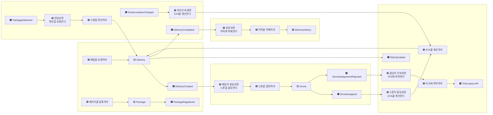
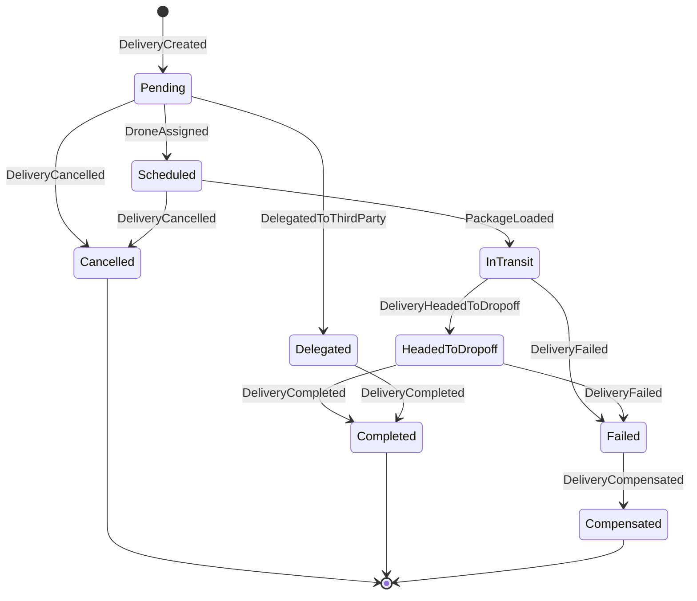

# 03. 이벤트 스토밍 — 동적 흐름에서 애그리거트 도출

> **목적** — [02](02_전략적_DDD_도메인_분석.md) 의 «정적 경계»를 **시간 순서의 흐름**으로 검증하고,
> 그 흐름에서 애그리거트·정책·읽기 모델을 뽑아냅니다. 전술적 DDD([04](04_전술적_DDD_모델링.md))의 입력입니다.
> 대상 컨텍스트: **배송(Shipping)**

---

## 1. 표기법

| 색 | 요소 | 뜻 | 문장 형태 |
| --- | --- | --- | --- |
| 🟧 주황 | **도메인 이벤트** | 이미 일어난 사실 | 과거형 — "배달이 생성되었다" |
| 🟦 파랑 | **커맨드** | 하려는 의도 | 명령형 — "배달을 생성하라" |
| 🟨 노랑 | **애그리거트** | 커맨드를 받아 이벤트를 내는 일관성 단위 | 명사 |
| 🟪 보라 | **정책(Policy)** | "이벤트가 나면 → 커맨드를 낸다" 규칙 | "~하면 ~한다" |
| 🟩 초록 | **읽기 모델** | 결정을 돕는 조회용 데이터 | 명사 |
| 🟫 갈색 | **외부 시스템** | 우리 통제 밖 | 명사 |
| 🔴 빨강 | **핫스팟** | 아직 답이 없는 질문 | 물음표 |

---

## 2. 1차 — 이벤트 나열 (시간 순)

```
[예약]                    [준비]                     [실행]                    [완료]
──────────────────────    ─────────────────────      ────────────────────      ──────────────────
🟧 배달이 요청되었다        🟧 드론이 할당되었다         🟧 드론이 픽업지에 도착했다   🟧 패키지가 전달되었다
🟧 패키지가 등록되었다      🟧 드론 할당이 거부되었다     🟧 패키지가 적재되었다       🟧 수령이 확인되었다
🟧 배달이 생성되었다        🟧 ETA가 산출되었다          🟧 배달이 배달지로 향했다     🟧 배달이 완료되었다
🟧 계정이 검증되었다        🟧 타사 운송으로 위탁되었다   🟧 드론 위치가 변경되었다     🟧 배달 이력이 적재되었다
                                                   🟧 ETA가 갱신되었다
                          [예외]
                          🟧 배달이 취소되었다          🟧 배달이 재조정되었다        🟧 배달이 실패했다
                          🟧 배달 처리가 시간 초과되었다 🟧 보상 처리가 수행되었다
```

**총 21개 도메인 이벤트.** 여기서 이미 두 가지가 드러납니다.

1. 이벤트가 **네 구간(예약·준비·실행·완료)** 으로 자연스럽게 뭉친다 → 배달의 **상태 기계**가 존재한다
2. «드론 위치가 변경되었다»만 발생 빈도가 압도적으로 높다 → **다른 저장소가 필요**하다 (설계/06)

---

## 3. 2차 — 커맨드 · 애그리거트 · 이벤트 연결



---

## 4. 커맨드 → 애그리거트 매핑표

| # | 🟦 커맨드 | 발신 액터 | 🟨 애그리거트 | 🟧 성공 이벤트 | 🟧 실패 이벤트 |
| --- | --- | --- | --- | --- | --- |
| 1 | `RequestDelivery` | 사용자 | Delivery | `DeliveryCreated` | `DeliveryRejected` |
| 2 | `RegisterPackage` | 사용자 | Package | `PackageRegistered` | `PackageRejected` |
| 3 | `AssignDrone` | 정책 | Drone | `DroneAssigned` | `DroneAssignmentRejected` |
| 4 | `CalculateEta` | 정책 | Delivery | `EtaCalculated` | — |
| 5 | `DelegateToThirdParty` | 정책 | Delivery | `DelegatedToThirdParty` | `DelegationFailed` |
| 6 | `ReportDroneLocation` | 드론 | Drone | `DroneLocationChanged` | — |
| 7 | `LoadPackage` | 드론 | Delivery | `PackageLoaded` | — |
| 8 | `HeadToDropoff` | 드론 | Delivery | `DeliveryHeadedToDropoff` | — |
| 9 | `ConfirmDelivery` | 수령인 | Delivery | `DeliveryCompleted` | `ConfirmationFailed` |
| 10 | `CancelDelivery` | 사용자 | Delivery | `DeliveryCancelled` | `CancellationRejected` |
| 11 | `RescheduleDelivery` | 사용자 | Delivery | `DeliveryRescheduled` | — |
| 12 | `CompensateDelivery` | 감독자 | Delivery | `DeliveryCompensated` | — |

> 🔑 **애그리거트 도출 원칙** — «커맨드를 받아 **불변식을 검사**하고 이벤트를 내는 것»이 애그리거트입니다.
> 위 표에서 애그리거트 열에 나타난 것은 **Delivery · Package · Drone** 세 가지뿐입니다.
> (`Account` 는 이 컨텍스트에서 커맨드를 받지 않고 **검증용 참조**로만 쓰입니다 → 순응주의자 관계)

---

## 5. 배달 상태 기계 (불변식의 근거)



### 5.1 상태 기계에서 나온 불변식 (INV)

| ID | 불변식 | 위반 시 |
| --- | --- | --- |
| INV‑01 | `InTransit` 이후에는 취소할 수 없다 | `CancellationRejected` |
| INV‑02 | 드론이 할당되지 않은 배달은 `InTransit` 이 될 수 없다 | 커맨드 거부 |
| INV‑03 | 하나의 드론은 동시에 하나의 배달만 수행한다 | `DroneAssignmentRejected` |
| INV‑04 | 완료·취소된 배달은 상태가 다시 바뀌지 않는다 (종료 상태) | 커맨드 거부 |
| INV‑05 | 배달은 반드시 하나 이상의 패키지를 참조한다 | `DeliveryRejected` |
| INV‑06 | ETA 는 항상 현재 시각보다 미래다 | 재계산 |

> ❗ **INV‑03 은 «드론» 애그리거트 안에서만 보장 가능합니다.** 배달 애그리거트가 드론의 점유 상태를
> 검사하려 하면 두 애그리거트를 한 트랜잭션에 묶게 됩니다 → **애그리거트 경계 위반**.
> 해결 → 드론 애그리거트가 `AssignDrone` 을 받아 스스로 검사하고 결과 이벤트를 낸다.

---

## 6. 정책(Policy) 목록 — 이벤트 → 커맨드 규칙

| ID | 계기 이벤트 | 정책 | 발생 커맨드 | 구현 위치 |
| --- | --- | --- | --- | --- |
| POL‑01 | `DeliveryCreated` | 배달이 생성되면 드론을 할당한다 | `AssignDrone` | Workflow 서비스 |
| POL‑02 | `DroneAssigned` | 드론이 할당되면 ETA 를 산출한다 | `CalculateEta` | Workflow 서비스 |
| POL‑03 | `DroneAssignmentRejected` | 할당이 거부되면 타사에 위탁한다 | `DelegateToThirdParty` | Workflow 서비스 |
| POL‑04 | `DroneLocationChanged` | 위치가 바뀌면 ETA 를 갱신한다 | `CalculateEta` | Delivery 서비스 |
| POL‑05 | `DeliveryCompleted` | 완료되면 이력에 적재한다 | `ArchiveDelivery` | Delivery History 서비스 |
| POL‑06 | `DeliveryFailed` | 실패하면 보상 트랜잭션을 실행한다 | `CompensateDelivery` | Supervisor |
| POL‑07 | *(시간 경과)* 처리 시간 초과 | 시간 초과되면 감독자가 개입한다 | `CompensateDelivery` | Supervisor |
| POL‑08 | 모든 상태 변경 이벤트 | 상태가 바뀌면 사용자에게 알린다 | `SendNotification` | Delivery 서비스 |

> 🔑 **POL‑01~03 이 한곳에 모여 있다** → 이 «조정 책임»을 담당하는 것이 **Scheduler(도메인 서비스)** 이며,
> 실행 단위로는 **Workflow 마이크로서비스**가 됩니다. ([05](05_마이크로서비스_경계_식별.md))
> **POL‑06~07** 은 «감시 책임» → **Supervisor**. 둘의 조합이 **스케줄러 에이전트 감독자 패턴**입니다.

---

## 7. 읽기 모델 (🟩)

| 읽기 모델 | 목적 | 갱신 계기 | 조회 액터 |
| --- | --- | --- | --- |
| `DeliveryStatusView` | 현재 배달 상태 + 드론 위치 + ETA | 상태·위치 이벤트 | 사용자 (매우 잦음) |
| `DroneAvailabilityView` | 할당 가능한 드론 목록 | 드론 상태 이벤트 | Scheduler |
| `DeliveryHistoryView` | 완료된 배달 상세 | `DeliveryCompleted` | 콜 센터·분석 |
| `AccountDeliverySummary` | 계정별 월간 배달 집계 | `DeliveryCompleted` | 청구서 |

> **쓰기 모델과 읽기 모델이 다르다** → [CQRS 패턴](../설계/07_디자인패턴_적용_설계서.md#cqrs) 적용 근거.
> 특히 `DeliveryStatusView` 는 «초당 수천 회 읽기 / 초당 수백 회 쓰기»라 별도 저장소가 필요합니다.

---

## 8. 핫스팟 (🔴) — 답을 미룬 질문과 처리

| # | 질문 | 처리 |
| --- | --- | --- |
| 1 | 드론 할당이 실패하면 **몇 번 재시도**하는가? | 정책 파라미터화 — 기본 3회, 지수 백오프 → 설계/03 |
| 2 | 타사 위탁 후 **추적 정보는 어떻게** 받는가? | ACL 이 폴링으로 정규화. 실시간 아님 → 설계/07 |
| 3 | 드론 위치 이벤트를 **모두 저장**하는가? | 아니다. 최신값만 캐시, 원본은 스트림에 보존 → 설계/06 |
| 4 | 배달 중 드론이 **고장**나면? | `DeliveryFailed` → 감독자 보상 → 재할당 (범위 밖: 물리적 회수) |
| 5 | **동시에 같은 드론**에 두 배달이 할당되면? | INV‑03. 드론 애그리거트의 낙관적 동시성으로 방지 |
| 6 | ETA 계산은 **어디에서** 하는가? | ETA 분석 컨텍스트(개방형 호스트 서비스). 본 과정에서는 단순 거리·속도 모델로 대체 |

---

## 9. 이벤트 스토밍 → 다음 단계 산출물

| 이벤트 스토밍 요소 | 전술적 DDD 에서의 대응 | 문서 |
| --- | --- | --- |
| 🟨 애그리거트 | 애그리거트 루트 클래스 + 불변식 | [04](04_전술적_DDD_모델링.md) §3 |
| 🟧 도메인 이벤트 | 이벤트 클래스 + 게시 스키마 | [04](04_전술적_DDD_모델링.md) §5 |
| 🟦 커맨드 | 애플리케이션 서비스 메서드 | [04](04_전술적_DDD_모델링.md) §6 |
| 🟪 정책 | 도메인 서비스 · 이벤트 핸들러 | [04](04_전술적_DDD_모델링.md) §6 |
| 🟩 읽기 모델 | 조회 전용 저장소 · 프로젝션 | [설계/06](../설계/06_데이터_설계서.md) |
| 🟫 외부 시스템 | 손상 방지 계층 | [설계/07](../설계/07_디자인패턴_적용_설계서.md) |
| 상태 기계 | 애그리거트 상태 전이 메서드 + JUnit 테스트 | [개발/](../개발/) |
