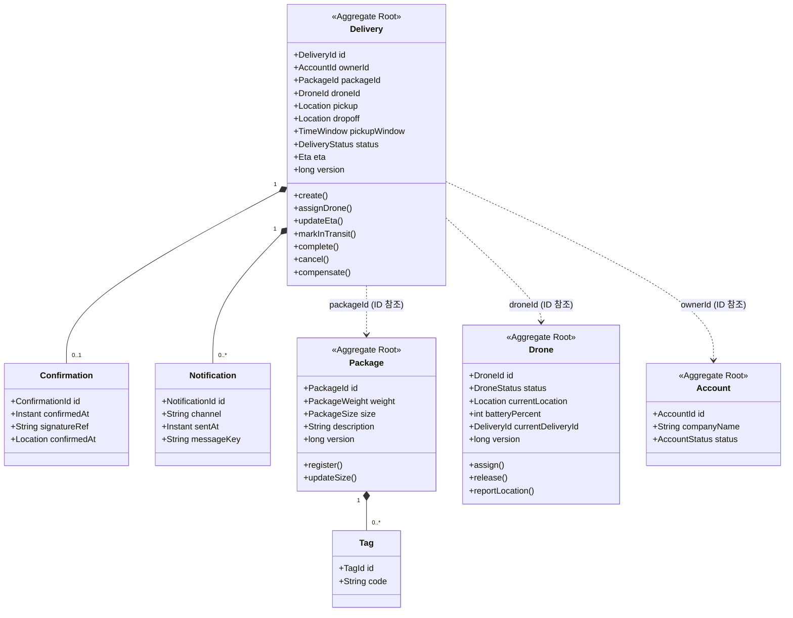
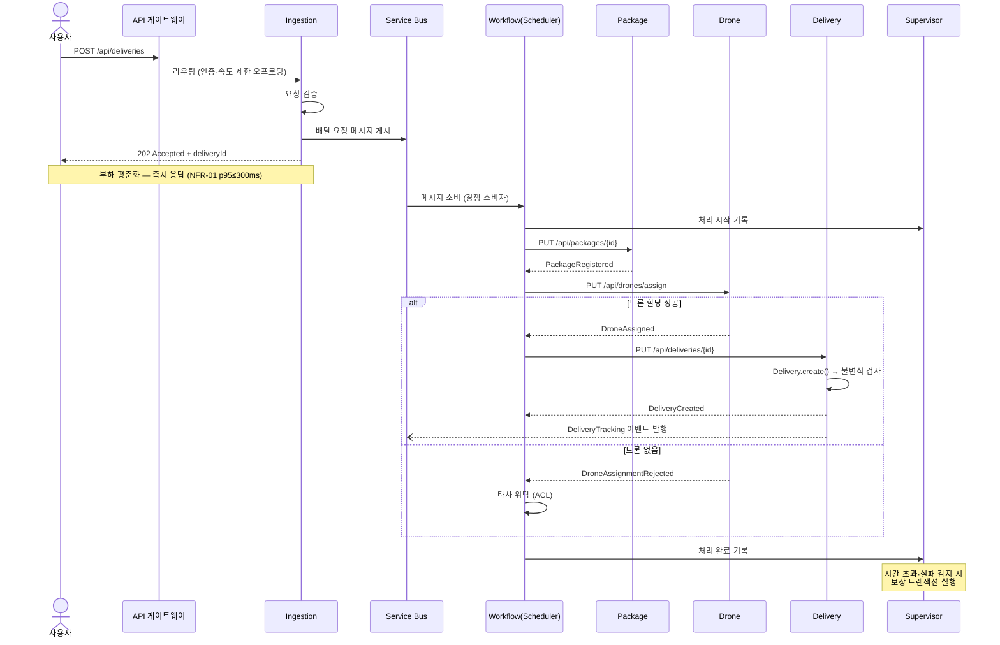
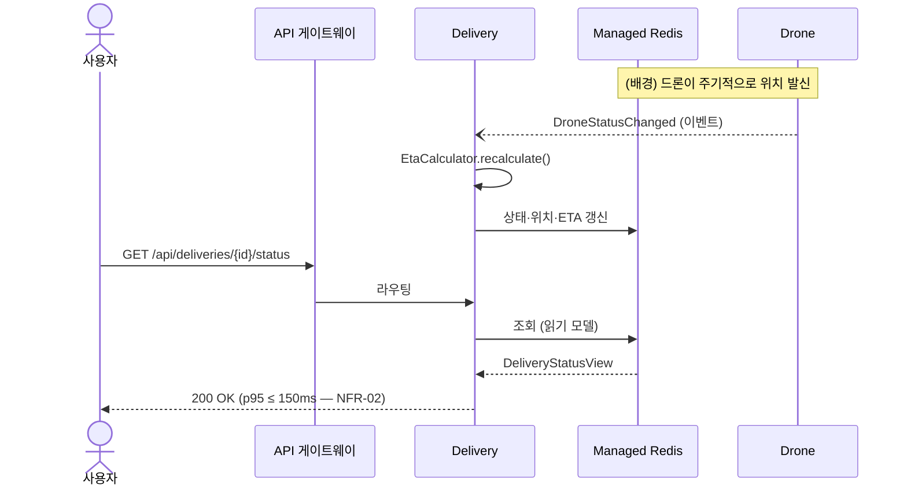

# 04. 전술적 DDD — 도메인 모델링

> **목적** — 「전술 DDD를 사용하여 마이크로 서비스 설계」의 패턴으로 **배송 컨텍스트**의 내부 모델을 정의합니다.
> 앞: [03_이벤트_스토밍.md](03_이벤트_스토밍.md) · 다음: [05_마이크로서비스_경계_식별.md](05_마이크로서비스_경계_식별.md)

---

## 1. 전술적 패턴 요약

| 패턴 | 정의 | 판별 질문 |
| --- | --- | --- |
| **엔터티(Entity)** | 고유 식별자를 가지며 시간에 따라 상태가 변하는 개체 | *"두 개가 모든 속성이 같아도 다른 것인가?"* → 예 |
| **값 개체(Value Object)** | 식별자 없이 **값 자체**로 구별되는 불변 개체 | *"속성이 같으면 같은 것인가?"* → 예 |
| **애그리거트(Aggregate)** | 하나의 트랜잭션 일관성 경계를 이루는 엔터티·값 개체의 묶음 | *"이것들이 항상 함께 일관되어야 하는가?"* |
| **애그리거트 루트** | 애그리거트의 유일한 외부 진입점 | *"밖에서 이 ID 로 찾는가?"* |
| **도메인 이벤트** | 도메인 전문가가 관심 갖는, 이미 일어난 사실 | *"~되었다 로 말할 수 있는가?"* |
| **도메인 서비스** | 어떤 엔터티에도 자연스럽게 속하지 않는 도메인 로직 | *"이 로직의 주어가 누구인가?"* → 없음 |
| **애플리케이션 서비스** | 유스케이스 조정. 도메인 로직 없음 | 트랜잭션·권한·변환만 |
| **리포지토리** | 애그리거트의 영속화 추상 | 애그리거트 **루트 단위**로만 |
| **팩터리** | 복잡한 애그리거트 생성 캡슐화 | 생성 규칙이 복잡한가 |

---

## 2. 엔터티 · 값 개체 판별

### 2.1 엔터티

| 엔터티 | 식별자 | 왜 엔터티인가 |
| --- | --- | --- |
| `Delivery` | `deliveryId` | 같은 픽업지·배달지라도 **다른 배달**이다 |
| `Package` | `packageId` | 동일 규격의 상자라도 **다른 패키지**다 |
| `Drone` | `droneId` | 물리적 개체. 상태가 계속 변한다 |
| `Account` | `accountId` | 계정은 고유하다 (참조용) |
| `Confirmation` | `confirmationId` | 배달마다 다른 확인 기록 |
| `Notification` | `notificationId` | 발송 이력은 각각 구별된다 |
| `Tag` | `tagId` | 물리적 표지. 재사용/폐기 이력이 있다 |

### 2.2 값 개체

| 값 개체 | 구성 | 왜 값 개체인가 |
| --- | --- | --- |
| `Location` | `latitude`, `longitude`, `altitude` | 좌표가 같으면 같은 위치다 |
| `Eta` | `estimatedAt`, `arrivalTime`, `confidence` | 값 자체가 의미. 갱신 시 **교체**한다 |
| `PackageWeight` | `value`, `unit` | 2.5 kg 은 어디서나 2.5 kg |
| `PackageSize` | `Small` \| `Medium` \| `Large` | 열거 값 |
| `TimeWindow` | `earliest`, `latest` | 시간 구간 자체가 값 |
| `DeliveryStatus` | 상태 열거 | 상태 값 자체 |
| `ContactInfo` | `name`, `phone`(마스킹), `email` | 값 묶음 |

> 💡 **왜 이 구별이 중요한가** — 값 개체는 **불변**이므로 동시성 문제가 없고, 캐시·직렬화가 안전하며,
> 공유해도 부작용이 없습니다. 값 개체로 만들 수 있는 것을 엔터티로 만들면 «불필요한 ID 와 잠금»이 생깁니다.

---

## 3. 애그리거트 설계

### 3.1 애그리거트 경계



### 3.2 애그리거트 목록과 근거

| 애그리거트 루트 | 포함 | 트랜잭션 일관성 경계인 이유 |
| --- | --- | --- |
| **Delivery** | `Confirmation`, `Notification` | 배달 상태와 그 확인·알림 이력은 **함께 커밋**되어야 한다. 상태 전이 불변식(INV‑01·02·04·06)이 여기에 있다 |
| **Package** | `Tag` | 패키지와 그 태그는 함께 관리. 배달과 **수명 주기가 다르다** (여러 번 배달될 수 있음) |
| **Drone** | — | 드론의 점유 상태(INV‑03)를 스스로 보장해야 한다 |
| **Account** | — | 이 컨텍스트에서는 읽기 전용 참조. 계정 컨텍스트가 소유 |

### 3.3 애그리거트 3원칙 준수 검증

> 「전술 DDD」 문서의 세 가지 규칙

| 규칙 | 적용 | 검증 |
| --- | --- | --- |
| **① 작게 설계한다** | Delivery 는 Package 를 **포함하지 않고 ID 로 참조** | ✅ Delivery 로드 시 Package 를 함께 읽지 않음 |
| **② 다른 애그리거트는 ID 로만 참조한다** | `packageId`, `droneId`, `ownerId` | ✅ 객체 참조 없음 |
| **③ 애그리거트 간에는 최종 일관성을 쓴다** | 드론 할당은 이벤트 기반 | ✅ Delivery·Drone 을 한 트랜잭션에 묶지 않음 |

### 3.4 ❌ 흔한 잘못된 설계와 비교

```
❌ 잘못된 설계                              ✅ 올바른 설계
─────────────────                          ──────────────────
class Delivery {                           class Delivery {
    Package package;      ← 객체 참조          PackageId packageId;   ← ID 참조
    Drone drone;          ← 객체 참조          DroneId droneId;       ← ID 참조
    Account account;      ← 객체 참조          AccountId ownerId;     ← ID 참조
}                                          }

문제:                                      효과:
· 배달 하나 읽는데 4개 테이블 조인            · 배달만 읽으면 됨
· 드론 상태 변경 시 배달도 잠김                · 잠금 범위가 배달로 한정
· 서비스 분리 불가 (모두 한 DB)               · 서비스별 독립 저장소 가능
```

---

## 4. 애그리거트별 불변식과 구현 위치

| 애그리거트 | 불변식 | 검사 위치 | 위반 시 |
| --- | --- | --- | --- |
| Delivery | INV‑01 `InTransit` 이후 취소 불가 | `Delivery.cancel()` | `IllegalStateTransitionException` |
| Delivery | INV‑02 드론 없이 `InTransit` 불가 | `Delivery.markInTransit()` | 동일 |
| Delivery | INV‑04 종료 상태에서 전이 불가 | 모든 전이 메서드 | 동일 |
| Delivery | INV‑05 패키지 참조 필수 | `Delivery.create()` | `IllegalArgumentException` |
| Delivery | INV‑06 ETA 는 미래 | `Delivery.updateEta()` | 재계산 요청 |
| Drone | INV‑03 동시 1 배달 | `Drone.assign()` + 낙관적 잠금 | `DroneUnavailableException` |
| Package | 무게 > 0 · 최대 적재 한도 이내 | `Package.register()` | `IllegalArgumentException` |

> **모든 불변식은 애그리거트 루트의 메서드 안에서 검사합니다.** 서비스 계층이나 컨트롤러에서 검사하면
> 다른 경로로 우회 가능한 «구멍»이 생깁니다. → JUnit 단위 테스트로 각 불변식을 직접 검증합니다.

---

## 5. 도메인 이벤트

### 5.1 이벤트 카탈로그

| 이벤트 | 발행 애그리거트 | 페이로드 핵심 | 주요 소비자 |
| --- | --- | --- | --- |
| `DeliveryCreated` | Delivery | deliveryId, ownerId, packageId, pickup, dropoff | Workflow, History |
| `DeliveryRescheduled` | Delivery | deliveryId, newPickupWindow | Workflow, 알림 |
| `DeliveryHeadedToDropoff` | Delivery | deliveryId, droneId, currentLocation | 알림, History |
| `DeliveryCompleted` | Delivery | deliveryId, completedAt, confirmationId | History, 청구서 |
| `DeliveryCancelled` | Delivery | deliveryId, reason | History, 알림 |
| `DeliveryFailed` | Delivery | deliveryId, reason, lastStatus | Supervisor |
| `DroneAssigned` | Drone | droneId, deliveryId | Workflow |
| `DroneAssignmentRejected` | Drone | deliveryId, reason | Workflow |
| `DroneStatusChanged` | Drone | droneId, status, location, battery | Delivery, ETA 분석 |
| `PackageRegistered` | Package | packageId, weight, size | Workflow |

### 5.2 이벤트 그룹 — 게시된 언어(Published Language)

```
DeliveryTracking (배달 추적 이벤트 그룹)
├─ DeliveryCreated
├─ DeliveryRescheduled
├─ DeliveryHeadedToDropoff
├─ DeliveryCompleted
├─ DeliveryCancelled
└─ DeliveryFailed
        ↓ 구독
   Delivery History · 알림 · 청구서 · 콜 센터

DroneStatus (드론 상태 이벤트 그룹)
├─ DroneStatusChanged
├─ DroneAssigned
└─ DroneAssignmentRejected
        ↓ 구독
   Delivery · ETA 분석
```

### 5.3 이벤트 스키마 규약

```json
{
  "eventId":      "uuid",              // 멱등 처리용 고유 ID
  "eventType":    "DeliveryCompleted", // 라우팅 키
  "eventVersion": "1.0",               // 스키마 버전 (하위 호환 필수)
  "occurredAt":   "2026-08-29T09:15:00Z",
  "aggregateId":  "dlv-0001",
  "correlationId":"req-abc123",        // 분산 추적 상관 ID
  "causationId":  "evt-prev-id",       // 이 이벤트를 유발한 이벤트
  "data":         { }                  // 이벤트별 페이로드
}
```

| 규약 | 이유 |
| --- | --- |
| `eventId` 필수 | 소비자가 **멱등 소비자** 패턴으로 중복을 걸러낸다 |
| `eventVersion` 필수 | 스키마 진화 시 소비자가 깨지지 않는다 |
| **필드 추가만 허용, 삭제·의미 변경 금지** | 게시된 언어의 하위 호환 원칙 |
| `correlationId` 전파 | NFR‑10 (100 % 분산 추적) 충족 |

---

## 6. 도메인 서비스 · 애플리케이션 서비스

### 6.1 도메인 서비스

| 서비스 | 왜 엔터티에 속하지 않는가 | 책임 |
| --- | --- | --- |
| **`Scheduler`** | *"배달을 예약하는 주체"* 가 배달 자신도, 드론도 아니다 | 여러 애그리거트에 걸친 **단계 조정** — 패키지 등록 → 드론 할당 → ETA 산출 → 배달 생성 |
| **`Supervisor`** | 감시는 어떤 애그리거트의 책임도 아니다 | Scheduler 의 진행 감시 · 시간 초과·실패 감지 · **보상 트랜잭션 실행** |
| **`EtaCalculator`** | 계산 로직이 여러 값 개체를 조합 | 위치·속도·기상으로 `Eta` 값 개체 생성 |

> 🔑 **Scheduler + Supervisor = 스케줄러 에이전트 감독자 패턴**
> Scheduler 는 «작업을 나누어 시키는 에이전트», Supervisor 는 «전체 진행을 지켜보는 감독자».
> 이 둘이 분리되어야 «Scheduler 자신이 죽었을 때» 복구가 가능합니다.

```
   요청 ──▶ [Scheduler] ──┬──▶ Package 서비스
                          ├──▶ Drone 서비스
                          ├──▶ Delivery 서비스
                          └──▶ (상태 기록)
                                  ▲
                                  │ 감시 · 시간 초과 감지
                            [Supervisor] ──▶ 보상 트랜잭션
```

### 6.2 애플리케이션 서비스 (유스케이스별)

| 애플리케이션 서비스 | 유스케이스 | 하는 일 | **하지 않는 일** |
| --- | --- | --- | --- |
| `DeliveryAppService` | 배달 예약·취소·조회 | 권한 확인 → 애그리거트 로드 → 도메인 메서드 호출 → 저장 → 이벤트 발행 | **비즈니스 규칙 판단** (애그리거트가 함)|
| `PackageAppService` | 패키지 등록·조회 | 동일 | 동일 |
| `DroneAppService` | 드론 할당·위치 보고 | 동일 | 동일 |
| `WorkflowAppService` | 큐 메시지 소비 → Scheduler 호출 | 메시지 역직렬화·멱등 검사·재시도 | 도메인 판단 |

> ❗ **안티패턴 경고 — 빈혈 도메인 모델(Anemic Domain Model)**
> 애그리거트가 getter/setter 만 갖고 모든 규칙이 애플리케이션 서비스에 있으면 DDD 가 아닙니다.
> 판별법: *`Delivery` 클래스에서 `if` 문을 찾을 수 없다면 빈혈 모델입니다.*

---

## 7. 리포지토리

| 리포지토리 | 대상 애그리거트 | 인터페이스 (도메인 계층) | 구현 (인프라 계층) |
| --- | --- | --- | --- |
| `DeliveryRepository` | Delivery | `findById`, `save`, `findByOwner` | Redis (Spring Data Redis) |
| `PackageRepository` | Package | `findById`, `save` | Cosmos DB Mongo API (Spring Data MongoDB) |
| `DroneRepository` | Drone | `findById`, `save`, `findAvailable` | Cosmos DB NoSQL (Spring Data Cosmos) |
| `DeliveryHistoryRepository` | *(읽기 모델)* | `findById`, `findByPeriod` | Cosmos DB + Data Lake |

**규칙**

1. 리포지토리는 **애그리거트 루트 단위로만** 존재한다. `ConfirmationRepository` 는 만들지 않는다.
2. 인터페이스는 **도메인 계층**에, 구현은 **인프라 계층**에 둔다 (의존성 역전).
3. 조회 전용 화면 요구는 리포지토리가 아니라 **읽기 모델 + 쿼리 서비스**로 처리한다 (CQRS).

```
   도메인 계층                 인프라 계층
   ─────────────              ────────────
   DeliveryRepository  ◀────  RedisDeliveryRepository
   (interface)                (implements)
        ▲                          │
        │ 사용                      │ 의존
   DeliveryAppService          Spring Data Redis
```

---

## 8. 팩터리

| 팩터리 | 왜 필요한가 |
| --- | --- |
| `DeliveryFactory.create(...)` | 배달 생성 시 ① 계정 상태 확인 ② 패키지 유효성 ③ 초기 상태 `Pending` ④ `DeliveryCreated` 이벤트 등록 — 4단계를 원자적으로 |
| `EtaFactory.from(location, speed, weather)` | 여러 입력에서 `Eta` 값 개체 생성 |

---

## 9. 계층 구조 (헥사고날 / 포트‑어댑터)

```
┌──────────────────────────────────────────────────────────────┐
│  인터페이스 어댑터 (Inbound)                                    │
│  REST Controller · Service Bus Listener · Event Handler       │
└───────────────────────────┬──────────────────────────────────┘
                            ▼
┌──────────────────────────────────────────────────────────────┐
│  애플리케이션 계층                                              │
│  DeliveryAppService · WorkflowAppService (유스케이스 조정)      │
└───────────────────────────┬──────────────────────────────────┘
                            ▼
┌──────────────────────────────────────────────────────────────┐
│  ★ 도메인 계층 (의존성 없음 — 프레임워크·DB 를 모른다)           │
│  Delivery · Package · Drone (애그리거트)                       │
│  Location · Eta · PackageWeight (값 개체)                      │
│  Scheduler · Supervisor · EtaCalculator (도메인 서비스)         │
│  DeliveryRepository (인터페이스)                               │
│  DeliveryCreated · DroneAssigned (도메인 이벤트)                │
└───────────────────────────▲──────────────────────────────────┘
                            │ 구현
┌───────────────────────────┴──────────────────────────────────┐
│  인프라 계층 (Outbound)                                        │
│  RedisDeliveryRepository · ServiceBusEventPublisher            │
│  ThirdPartyTransportAdapter (손상 방지 계층)                    │
└──────────────────────────────────────────────────────────────┘
```

> **의존성 방향은 항상 안쪽(도메인)을 향합니다.** 도메인 계층 소스에 `org.springframework` import 가
> 하나라도 있으면 규칙 위반입니다. → 정적 검증 항목으로 자동 확인합니다.

---

## 10. 시퀀스 — 배달 예약 (핵심 유스케이스)



---

## 11. 시퀀스 — 배달 추적 (읽기 경로)



> **쓰기 경로와 읽기 경로가 완전히 분리**되어 있습니다. 읽기는 Redis 한 번만 치므로 빠르고,
> 쓰기는 큐를 통해 흡수되므로 폭주에 견딥니다. → **CQRS + 큐 기반 부하 평준화**

---

## 12. 체크리스트

- [x] 엔터티/값 개체를 «식별자 필요성»으로 판별했다
- [x] 애그리거트를 **트랜잭션 일관성 경계**로 정의했다
- [x] 애그리거트 3원칙(작게·ID 참조·최종 일관성)을 검증했다
- [x] 모든 불변식이 **애그리거트 루트 메서드 안**에 있다
- [x] 도메인 이벤트에 게시 스키마 규약을 정했다
- [x] 도메인 서비스와 애플리케이션 서비스를 구분했다
- [x] 리포지토리를 애그리거트 루트 단위로만 두었다
- [x] 도메인 계층이 프레임워크에 의존하지 않는다
- [ ] ← 다음: 이 모델을 **배포 단위(마이크로서비스)** 로 변환 ([05](05_마이크로서비스_경계_식별.md))
