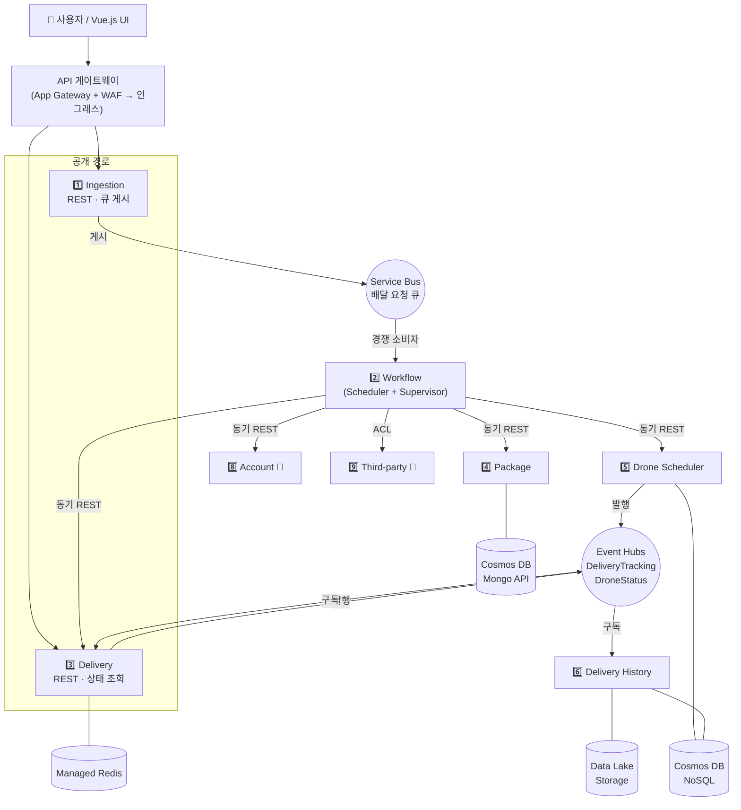

# 05. 마이크로서비스 경계 식별

> **목적** — 도메인 모델을 **배포·확장 단위**로 변환합니다. 「마이크로서비스 경계 식별」 문서의
> «애그리거트 = 후보 서비스» 출발점에서 시작해, **비기능 요구사항으로 다시 합치거나 쪼갭니다.**
> 앞: [04_전술적_DDD_모델링.md](04_전술적_DDD_모델링.md) · 다음: [06_아키텍처_스타일_비교.md](06_아키텍처_스타일_비교.md)

---

## 1. 원칙 — 경계는 «도메인이 정하고, 비기능이 조정한다»

```
   ① 도메인 모델            ② 후보 서비스              ③ 최종 서비스
   ─────────────           ────────────              ─────────────
   애그리거트        ──▶    각 애그리거트를           비기능 요구사항으로
   도메인 서비스            하나의 서비스 후보로       ①합치기 ②쪼개기 ③추가
   바운디드 컨텍스트                                   를 판단
```

> ❗ **후보에서 멈추면 안 됩니다.** 애그리거트를 그대로 서비스로 만들면 서비스가 너무 잘게 쪼개져
> 네트워크 왕복이 폭증합니다(«나노서비스»). 반대로 합치기만 하면 독립 배포·확장이 불가능합니다.

---

## 2. ② 후보 서비스 (도메인 모델에서 직접 도출)

| 후보 | 출처 | 책임 |
| --- | --- | --- |
| Delivery | Delivery 애그리거트 | 배달 상태·ETA 관리 |
| Package | Package 애그리거트 | 패키지 등록·조회 |
| Drone | Drone 애그리거트 | 드론 할당·위치 |
| Account | Account 애그리거트 | 계정 검증 |
| Scheduler | Scheduler 도메인 서비스 | 처리 단계 조정 |
| Supervisor | Supervisor 도메인 서비스 | 감시·보상 |
| Third‑party Transport | 외부 컨텍스트 + ACL | 타사 위탁 |

**7개 후보.**

---

## 3. ③ 비기능 요구사항에 의한 조정

### 3.1 조정 기준 (4가지 질문)

| # | 질문 | 조정 방향 |
| --- | --- | --- |
| Q1 | **확장 특성이 다른가?** | 다르면 → **쪼갠다** (독립 확장) |
| Q2 | **팀 경계와 맞는가?** | 한 팀이 두 서비스를 항상 함께 바꾼다면 → **합친다** |
| Q3 | **함께 배포되어야만 하는가?** | 항상 함께 배포된다면 서비스로 나눈 의미가 없다 → **합친다** |
| Q4 | **장애가 격리되어야 하는가?** | 격리 필요 → **쪼갠다** |

### 3.2 각 후보에 대한 판단

| 후보 | Q1 확장 | Q2 팀 | Q3 배포 | Q4 격리 | **결론** |
| --- | --- | --- | --- | --- | --- |
| **Delivery** | 읽기 폭증(추적) — 독자 확장 필요 | 배송 팀 | 독립 | 필요 | ✅ **유지** |
| **Package** | 쓰기 중심, 중간 부하 | 배송 팀 | 독립 | 필요 | ✅ **유지** |
| **Drone** | 텔레메트리 폭증 | 드론 팀 | 독립 | 필요 | ✅ **유지** |
| **Account** | 낮음. 변경 드묾 | 플랫폼 팀 | 독립 | 낮음 | ✅ **유지 (모의 구현)** — 일반 서브도메인 |
| **Scheduler** | 큐 깊이에 따라 확장 | 배송 팀 | 독립 | 필요 | ✅ **유지 → Workflow 로 명명** |
| **Supervisor** | 낮음. 단일 인스턴스에 가까움 | 배송 팀 | 독립 | **매우 필요** (Scheduler 가 죽어도 살아야 함) | ✅ **유지** |
| **Third‑party** | 외부 API 속도에 종속 | 통합 팀 | 독립 | **매우 필요** (외부 장애 격리) | ✅ **유지 (모의 구현)** |

### 3.3 ➕ 비기능 요구사항이 **새로 요구한** 서비스

기존 후보만으로는 충족할 수 없는 요구사항이 두 개 있습니다.

| 요구사항 | 문제 | 해결 서비스 |
| --- | --- | --- |
| **NFR‑03** 피크 500 req/s · **FR‑B‑03** 즉시 응답 | 예약 요청이 몰리면 Scheduler 가 감당 못 함. Scheduler 를 무한 확장할 수도 없음(하류 서비스가 무너짐) | ➕ **Ingestion** — 요청을 받아 **큐에 넣고 즉시 응답**. 큐 기반 부하 평준화 |
| **FR‑D‑01~03** 이력 적재·조회·집계 | Delivery 서비스에 이력을 두면 «짧은 수명 상태 저장소(Redis)»에 «장기 보관 데이터»가 섞임. 조회 패턴도 완전히 다름 | ➕ **Delivery History** — `DeliveryTracking` 을 구독해 별도 저장. CQRS 읽기 측 |

---

## 4. 최종 서비스 목록 (9개)

| # | 서비스 | 컨텍스트 | 유형 | 확장 트리거 | 저장소 | 구현 범위 |
| --- | --- | --- | --- | --- | --- | --- |
| 1 | **Ingestion** | 배송 | 공개 API | HTTP 요청 수 (HPA/CPU) | 없음 | 🔨 완전 구현 |
| 2 | **Workflow** | 배송 | 오케스트레이터 | **큐 깊이 (KEDA)** | 없음 | 🔨 완전 구현 |
| 3 | **Delivery** | 배송 | 도메인 | 읽기 요청 수 | Azure Managed Redis | 🔨 완전 구현 |
| 4 | **Package** | 배송 | 도메인 | 쓰기 요청 수 | Cosmos DB (Mongo API) | 🔨 완전 구현 |
| 5 | **Drone Scheduler** | 드론 관리 | 도메인 | 텔레메트리 수 | Cosmos DB (NoSQL) | 🔨 완전 구현 |
| 6 | **Delivery History** | 배송(읽기) | 이벤트 소비 | 이벤트 수 | Cosmos DB + Data Lake | 🔨 완전 구현 |
| 7 | **Supervisor** | 배송 | 감시 | 고정 (낮음) | Redis (타이머 상태) | 🔧 Workflow 내 모듈 |
| 8 | **Account** | 사용자 계정 | 일반 | 낮음 | — | 🧪 모의 구현 |
| 9 | **Third‑party Transport** | 외부 | 외부 연동 | 외부 API | — | 🧪 모의 구현 |

> **범례** — 🔨 Azure Spring Apps 에 배포하는 완전한 Spring Boot 서비스
> 🔧 별도 배포 단위가 아닌 모듈 (운영 규모가 작아 분리 이익 < 운영 비용)
> 🧪 계약만 지키는 최소 구현 (일반/외부 서브도메인이므로 실제로는 구매·연동 대상)

### 4.1 Supervisor 를 왜 별도 배포 단위로 만들지 않았는가

| 관점 | 판단 |
| --- | --- |
| 도메인 | Scheduler 와 **다른 책임**이다 → 별도 클래스·별도 패키지로 분리 ✅ |
| 확장 | 큐 깊이와 무관하게 **고정 부하** → 함께 확장할 이유는 없다 |
| 격리 | Scheduler 실패 시 살아 있어야 한다 → **별도 스레드/스케줄러**로 동작 |
| 운영 비용 | 서비스 하나 추가 = 파이프라인·모니터링·ID·네트워크 정책 추가 |
| **결론** | 교육·실습 범위에서는 **Workflow 내 독립 모듈**. 실제 운영 규모가 커지면 분리 가능하도록 **의존성을 단방향으로** 유지 |

> ⚠️ **이 판단은 트레이드오프이며, 문서화되어야 합니다.** «왜 나누지 않았는가»를 적어두지 않으면
> 나중에 «DDD 를 잘못 적용했다»는 오해가 생깁니다.

---

## 5. 서비스 관계도



---

## 6. 통신 방식 결정표

| 발신 | 수신 | 방식 | 이유 |
| --- | --- | --- | --- |
| UI → Ingestion | | 동기 REST | 사용자가 결과를 기다린다 (단, **접수 완료**까지만) |
| Ingestion → Workflow | | **비동기 (Service Bus 큐)** | 부하 평준화. 처리 시간이 응답 시간에 영향을 주면 안 됨 |
| Workflow → Package/Drone/Delivery/Account | | 동기 REST | Workflow 가 각 단계의 **성공·실패를 알아야** 다음을 결정 |
| Workflow → Supervisor | | 비동기 메시지 | 감시 기록은 처리 흐름을 막으면 안 됨 |
| Delivery/Drone → 구독자 | | **비동기 (Event Hubs)** | 발행자는 소비자를 모른다 (게시자‑구독자) |
| Workflow → Third‑party | | 동기 REST + ACL + 회로 차단기 | 외부 시스템. 반드시 격리 |

> 상세 → [설계/03_서비스간_통신_설계서.md](../설계/03_서비스간_통신_설계서.md)

---

## 7. 검증 — «잘 쪼갰는가» 자가 진단

| 진단 항목 | 기준 | 판정 |
| --- | --- | --- |
| **독립 배포 가능한가** | 한 서비스를 배포할 때 다른 서비스를 함께 배포하지 않아도 되는가 | ✅ 이벤트는 하위 호환, REST 는 버전 관리 |
| **독립 확장 가능한가** | 각 서비스가 자기 확장 트리거를 갖는가 | ✅ 표 §4 의 «확장 트리거» 열 |
| **데이터를 공유하지 않는가** | 두 서비스가 같은 저장소를 직접 읽고 쓰지 않는가 | ✅ 서비스별 전용 저장소 |
| **장애가 격리되는가** | 한 서비스가 죽어도 나머지가 «부분적으로» 동작하는가 | ✅ Drone 장애 시 → 타사 위탁. Package 장애 시 → 배달 접수는 계속 (큐에 적재) |
| **분산 트랜잭션이 없는가** | 2PC 를 쓰지 않는가 | ✅ Saga + 보상 트랜잭션 |
| **왕복이 과도하지 않은가** | 하나의 유스케이스가 5회 이상 동기 호출하지 않는가 | ⚠️ Workflow 가 4회 호출 — 허용 범위. 단, **비동기 경로**이므로 사용자 응답 시간과 무관 |
| **한 서비스가 «신 서비스»가 아닌가** | 특정 서비스가 모든 것을 알지 않는가 | ⚠️ Workflow 가 조정자. 단, **도메인 로직은 갖지 않고 순서만 안다** |

### 7.1 남은 위험과 완화

| 위험 | 완화 |
| --- | --- |
| Workflow 가 «분산된 단일체의 중심»이 될 수 있다 | Workflow 는 **순서만 알고 규칙은 모른다**. 규칙은 각 애그리거트에. 코드 리뷰 체크 항목으로 강제 |
| 서비스가 9개 — 운영 부담 | 모의 2개 + 모듈 1개 → **실제 배포 단위는 6개**. Azure Spring Apps 가 서비스 등록·구성·모니터링을 대신 제공 |
| 이벤트 스키마 변경이 여러 소비자를 깨뜨릴 수 있다 | 스키마 버전 필수 · **필드 추가만 허용** · 계약 테스트 (테스트/integration) |

---

## 8. 서비스별 상세 명세

### 8.1 Ingestion

| 항목 | 내용 |
| --- | --- |
| 책임 | 배달 요청 수신 → 형식·권한 검증 → 큐 게시 → `202 Accepted` 반환 |
| **하지 않는 것** | 도메인 규칙 판단, 데이터 저장, 다른 서비스 호출 |
| 노출 API | `POST /api/deliveries`, `DELETE /api/deliveries/{id}` |
| 확장 | HPA (CPU 70 %), 최소 2 · 최대 10 |
| 적용 패턴 | 큐 기반 부하 평준화 · 게이트웨이 오프로딩(인증은 게이트웨이가) |

### 8.2 Workflow

| 항목 | 내용 |
| --- | --- |
| 책임 | 큐 소비 → Scheduler 로 단계 조정 → Supervisor 로 감시 |
| **하지 않는 것** | 도메인 불변식 판단 (각 서비스가 함) |
| 노출 API | `GET /actuator/health` 만 (외부 API 없음) |
| 확장 | **KEDA** — Service Bus 큐 깊이 기준, 최소 1 · 최대 20 |
| 적용 패턴 | 경쟁 소비자 · 스케줄러 에이전트 감독자 · Saga(보상) · 재시도 · 회로 차단기 |

### 8.3 Delivery

| 항목 | 내용 |
| --- | --- |
| 책임 | Delivery 애그리거트 소유. 상태 전이·ETA 관리·추적 조회 |
| 노출 API | `PUT /api/deliveries/{id}`, `GET /api/deliveries/{id}`, `GET /api/deliveries/{id}/status`, `DELETE /api/deliveries/{id}` |
| 구독 | `DroneStatus` (ETA 재계산용) |
| 발행 | `DeliveryTracking` |
| 저장소 | Azure Managed Redis — 높은 읽기·쓰기 처리량, 짧은 수명 |
| 확장 | HPA (CPU 70 % + 요청 수), 최소 2 · 최대 12 |

### 8.4 Package

| 항목 | 내용 |
| --- | --- |
| 책임 | Package 애그리거트 소유. 등록·크기 갱신 |
| 노출 API | `PUT /api/packages/{id}`, `GET /api/packages/{id}`, `DELETE /api/packages/{id}` |
| 저장소 | Cosmos DB for MongoDB — 문서형, 높은 쓰기 처리량, 파티션 키 = `packageId` |
| 확장 | HPA, 최소 2 · 최대 8 |

### 8.5 Drone Scheduler

| 항목 | 내용 |
| --- | --- |
| 책임 | Drone 애그리거트 소유. 할당(INV‑03)·위치 보고 |
| 노출 API | `PUT /api/drones/assign`, `POST /api/drones/{id}/location`, `GET /api/drones/{id}` |
| 발행 | `DroneStatus` |
| 저장소 | Cosmos DB NoSQL — 파티션 키 = `droneId`, 낙관적 동시성(ETag) |
| 확장 | HPA, 최소 2 · 최대 15 (텔레메트리 부하) |

### 8.6 Delivery History

| 항목 | 내용 |
| --- | --- |
| 책임 | `DeliveryTracking` 구독 → 이력 적재 → 조회·집계 제공 |
| 노출 API | `GET /api/history/{deliveryId}`, `GET /api/history?from=&to=&accountId=` |
| 저장소 | **핫**: Cosmos DB (약 1개월) / **콜드**: Data Lake Storage (날짜 파티션) |
| 확장 | 이벤트 처리량 기준 KEDA, 최소 1 · 최대 6 |
| 적용 패턴 | CQRS(읽기 측) · 구체화된 뷰 · 멱등 소비자 |

---

## 9. 체크리스트

- [x] 애그리거트에서 후보 서비스를 도출했다
- [x] 4가지 질문(확장·팀·배포·격리)으로 후보를 조정했다
- [x] 비기능 요구사항이 요구한 서비스(Ingestion·History)를 추가했다
- [x] 합치지 않은 이유·합친 이유를 **문서화**했다
- [x] 각 서비스의 «하지 않는 것»을 명시했다
- [x] 자가 진단 7항목을 통과했다 (2항목은 위험으로 관리)
- [ ] ← 다음: 이 구조가 **어떤 아키텍처 스타일인지** 확인 ([06](06_아키텍처_스타일_비교.md))
