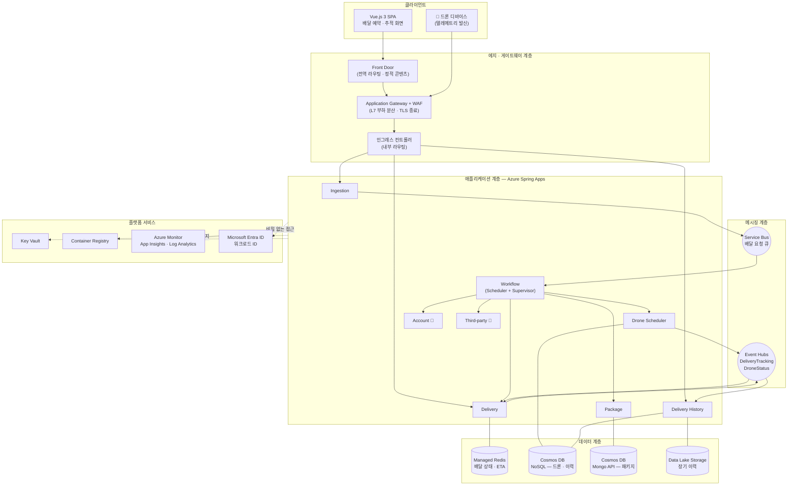
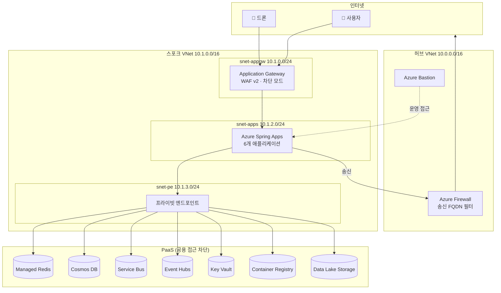

# 01. 시스템 아키텍처 설계서

> **목적** — [분석/](../분석/) 의 결론을 **실제 Azure 리소스로 구성된 아키텍처**로 확정합니다.
> 근거: 「마이크로서비스 아키텍처 디자인」, 「고급 AKS 마이크로 서비스 아키텍처」(`azure-architecture.pdf` p.2611~)
> 다음: [02_컴퓨팅_플랫폼_선정서.md](02_컴퓨팅_플랫폼_선정서.md)

---

## 1. 논리 아키텍처



---

## 2. 워크플로 — 요청 흐름 5단계

> 「고급 AKS 마이크로 서비스 아키텍처」의 워크플로 구조를 이 시스템에 맞게 적용했습니다.

| # | 흐름 | 구현 패턴 |
| --- | --- | --- |
| **①** | 드론 픽업을 예약하는 HTTPS 요청이 **Application Gateway** 를 거쳐 **Ingestion** 에 도달한다 | 게이트웨이 라우팅 · 게이트웨이 오프로딩(WAF·TLS) |
| **②** | Ingestion 이 메시지를 만들어 **Service Bus 큐**에 보낸다. 사용자에게는 즉시 `202 Accepted` | **큐 기반 부하 평준화** |
| **③** | **Workflow** 가 큐에서 메시지를 소비하고 ㉠ Delivery(Redis) ㉡ Drone Scheduler(Cosmos NoSQL) ㉢ Package(Cosmos Mongo) 를 순서대로 호출한다 | **경쟁 소비자 · 스케줄러 에이전트 감독자 · Saga** |
| **④** | 배달 상태 조회 요청이 Application Gateway 를 거쳐 **Delivery** 로 전달된다 | 게이트웨이 라우팅 |
| **⑤** | Delivery 가 **Managed Redis** 에서 읽어 응답한다 | **CQRS 읽기 측 · 구체화된 뷰** |

```
   ①            ②                ③                          ④        ⑤
  사용자 ──▶ Ingestion ──▶ [Service Bus] ──▶ Workflow ──┬─▶ Delivery
                  │                                     ├─▶ Drone Scheduler
                  └─ 202 Accepted (즉시)                 └─▶ Package
                                                              │
  사용자 ──────────────────────────────────────────────▶ Delivery ──▶ Redis
                                                        (조회 경로는 완전히 분리)
```

---

## 3. 물리 아키텍처 — 네트워크 토폴로지 (prd)

> 허브‑스포크. 「고급 AKS 마이크로 서비스 아키텍처」의 구조를 Azure Spring Apps 에 적용.

```
┌──── HUB VNet (10.0.0.0/16) ─────────────────────────────┐
│  ┌──────────────┐   ┌──────────────┐                     │
│  │ Azure Firewall│   │ Azure Bastion│                     │
│  │ 10.0.1.0/26   │   │ 10.0.2.0/26  │                     │
│  └──────┬───────┘   └──────────────┘                     │
└─────────┼───────────────────────────────────────────────┘
          │ VNet 피어링 + 사용자 정의 경로(UDR)
┌─────────┼──── SPOKE VNet (10.1.0.0/16) ─────────────────┐
│  ┌──────▼───────────────┐                                │
│  │ snet-appgw           │  Application Gateway + WAF     │
│  │ 10.1.0.0/24          │                                │
│  ├──────────────────────┤                                │
│  │ snet-runtime         │  Azure Spring Apps 서비스 런타임 │
│  │ 10.1.1.0/24          │                                │
│  ├──────────────────────┤                                │
│  │ snet-apps            │  애플리케이션 인스턴스           │
│  │ 10.1.2.0/24          │                                │
│  ├──────────────────────┤                                │
│  │ snet-pe              │  프라이빗 엔드포인트             │
│  │ 10.1.3.0/24          │  (Redis·Cosmos·SB·EH·KV·ACR)   │
│  └──────────────────────┘                                │
└──────────────────────────────────────────────────────────┘
          │ Private Link
   ┌──────▼──────────────────────────────────────┐
   │ Redis · Cosmos DB · Service Bus · Event Hubs │
   │ Key Vault · Container Registry · Storage     │
   │  ▶ 공용 네트워크 접근 = 사용 안 함             │
   └─────────────────────────────────────────────┘
```

| 서브넷 | CIDR | 용도 | NSG 규칙 요약 |
| --- | --- | --- | --- |
| `snet-appgw` | 10.1.0.0/24 | Application Gateway | 인바운드 443(인터넷) · 65200‑65535(GatewayManager) |
| `snet-runtime` | 10.1.1.0/24 | Spring Apps 서비스 런타임 | 플랫폼 관리 트래픽 |
| `snet-apps` | 10.1.2.0/24 | 애플리케이션 인스턴스 | 인바운드: `snet-appgw` 만 / 아웃바운드: `snet-pe` + Firewall |
| `snet-pe` | 10.1.3.0/24 | 프라이빗 엔드포인트 | 인바운드: `snet-apps` 만 |

> **송신(egress)** 은 모두 Firewall 을 거칩니다. 허용 FQDN 은 [09_보안_아이덴티티_설계서.md](09_보안_아이덴티티_설계서.md) §송신 제어.

---

## 4. 환경별 아키텍처 차이

| 구성 요소 | dev | stg | prd |
| --- | --- | --- | --- |
| **컴퓨팅** | Spring Apps 표준 (1 인스턴스) | 표준 (2 인스턴스) | 엔터프라이즈/표준 (2~12, 자동 확장) |
| **네트워크** | 공용 엔드포인트 (VNet 없음) | 단일 VNet (허브 없음) | **허브‑스포크 + Firewall + Bastion** |
| **게이트웨이** | Spring Apps 기본 인그레스 | App Gateway (WAF 감지 모드) | **App Gateway (WAF 차단 모드) + Front Door** |
| **Redis** | 개발/테스트 최소 SKU | 표준 | **프리미엄 (영역 중복)** |
| **Cosmos DB** | 서버리스 · 단일 지역 | 프로비저닝 자동 확장 | 프로비저닝 자동 확장 · **영역 중복** |
| **Service Bus** | 기본 | 표준 | **프리미엄 (프라이빗 엔드포인트)** |
| **Event Hubs** | 기본 (1 TU) | 표준 (2 TU) | 프리미엄 (자동 팽창) |
| **비밀 접근** | 워크로드 ID | 워크로드 ID | **워크로드 ID (Key Vault 는 예외 경로만)** |
| **관측성 샘플링** | 100 % | 50 % | 10 % (오류·느린 요청은 100 %) |
| **다중 영역** | ❌ | ❌ | ✅ |

> ⚠️ **원칙 — 기능 차이가 아니라 규모 차이만 둡니다.** dev 에서 워크로드 ID 를 쓰지 않고 연결 문자열을 쓰면,
> prd 에서만 발생하는 인증 문제를 dev 에서 잡을 수 없습니다.

---

## 5. 구성 요소 목록과 선정 근거

| 구성 요소 | Azure 서비스 | 왜 이것인가 |
| --- | --- | --- |
| 애플리케이션 호스팅 | **Azure Spring Apps** | Spring Boot 전용 관리형 플랫폼. 서비스 등록·구성·블루그린·분산 추적을 플랫폼이 제공 → 운영 복잡도(ADR‑001 의 대가) 완화 |
| 공개 진입점 | **Application Gateway + WAF** | L7 라우팅 + OWASP 규칙 집합. 게이트웨이 오프로딩 |
| 전역 배포 (prd) | **Front Door** | 전역 라우팅 · 정적 콘텐츠 캐싱 · DDoS |
| 명령 큐 | **Service Bus (큐)** | 피어‑락·DLQ·순서 보장·중복 감지 → 배달 요청은 **유실되면 안 됨** |
| 이벤트 스트림 | **Event Hubs** | 초당 수만 건 처리 · 다중 소비자 그룹 · 재생 가능 → 텔레메트리·도메인 이벤트 |
| 배달 상태 | **Azure Managed Redis** | 높은 읽기·쓰기 처리량 · 짧은 수명 · JSON 문서 지원 |
| 패키지 | **Cosmos DB (Mongo API)** | 문서형 · 높은 쓰기 처리량 · 스키마 유연 |
| 드론 · 이력(핫) | **Cosmos DB (NoSQL)** | ID 기반 조회 최적 · ETag 낙관적 동시성(INV‑03) |
| 이력(콜드) | **Data Lake Storage Gen2** | 날짜 파티션 · 분석 도구 연계 · 저비용 |
| 비밀 | **Key Vault** | Entra 미지원 자원·타사 API 키만 |
| 이미지 | **Container Registry** | 프라이빗 · 취약점 스캔 · 관리 ID 인증 |
| 관측성 | **Azure Monitor / App Insights / Log Analytics** | APM · 분산 추적 · 로그 상관 |
| 아이덴티티 | **Microsoft Entra ID** | 워크로드 ID · RBAC · 암호 없는 연결 |

### 5.1 왜 «Service Bus 와 Event Hubs 를 둘 다» 쓰는가

| | Service Bus (큐) | Event Hubs (스트림) |
| --- | --- | --- |
| 쓰는 곳 | Ingestion → Workflow | Delivery/Drone → 구독자들 |
| 의미 | **명령(Command)** — "이 배달을 처리하라" | **이벤트(Event)** — "이런 일이 있었다" |
| 수신자 | **정확히 하나**가 처리 | **여럿**이 각자 처리 |
| 유실 허용 | ❌ 절대 안 됨 (DLQ 필수) | ⚠️ 보존 기간 내 재생 가능 |
| 처리량 | 중간 (수천/s) | 매우 높음 (수만/s) |
| 순서 | 세션으로 보장 가능 | 파티션 내 보장 |

> ❗ 하나로 통합하면 «명령을 여럿이 중복 처리»하거나 «이벤트 처리량이 부족»해집니다.
> **의미가 다르면 인프라도 다릅니다.**

---

## 6. 데이터 흐름 — 3가지 경로

### 6.1 명령 경로 (쓰기)

```
사용자 ──HTTPS──▶ AppGW ──▶ Ingestion ──큐──▶ Workflow ──REST──▶ Delivery/Package/Drone
                                                                         │
                                                                    각자의 저장소
```
- **특성**: 폭주 가능, 유실 불가, 최종 일관성 허용
- **보호**: 큐 부하 평준화 · 재시도 · 회로 차단기 · Saga 보상

### 6.2 조회 경로 (읽기)

```
사용자 ──HTTPS──▶ AppGW ──▶ Delivery ──▶ Redis (읽기 모델)
                        └──▶ Delivery History ──▶ Cosmos DB / Data Lake
```
- **특성**: 매우 잦음, 초저지연 요구, 약간 오래된 데이터 허용
- **보호**: 캐시 · 파티션 키 정렬 · 읽기 전용 복제본

### 6.3 이벤트 경로 (전파)

```
Delivery ──DeliveryTracking──▶ Event Hubs ──▶ Delivery History
Drone   ──DroneStatus──────▶ Event Hubs ──▶ Delivery (ETA 재계산)
```
- **특성**: 발행자는 소비자를 모름, 순서는 파티션 내 보장
- **보호**: 멱등 소비자 · 스키마 버전 · 체크포인트

---

## 7. 배포 단위와 확장 전략

| 서비스 | 배포 단위 | 확장 트리거 | 최소 | 최대 | 근거 |
| --- | --- | --- | --- | --- | --- |
| Ingestion | Spring Apps 앱 | CPU 70 % | 2 | 10 | 요청 폭주 흡수 |
| Workflow | Spring Apps 앱 | **큐 깊이** (KEDA/자동 확장 규칙) | 1 | 20 | 처리 지연 = 큐 적체 |
| Delivery | Spring Apps 앱 | CPU 70 % + 요청 수 | 2 | 12 | 읽기·쓰기 모두 |
| Package | Spring Apps 앱 | CPU 70 % | 2 | 8 | 쓰기 중심 |
| Drone Scheduler | Spring Apps 앱 | CPU 70 % + 요청 수 | 2 | 15 | 텔레메트리 |
| Delivery History | Spring Apps 앱 | 이벤트 지연 | 1 | 6 | 배치성 |

> **자동 확장 원칙** — 애플리케이션 확장(인스턴스 수)과 인프라 확장은 **함께** 동작해야 합니다.
> Spring Apps 는 인프라를 플랫폼이 관리하므로, 우리는 **앱 인스턴스 규칙만** 정의합니다.

---

## 8. 아키텍처 품질 검증 매핑

| 품질 목표 ([분석/07](../분석/07_품질속성_및_제약사항.md)) | 이 아키텍처에서의 구현 |
| --- | --- |
| REL‑01 가용성 99.9 % | 영역 중복 + 최소 2 인스턴스 + 관리형 서비스 SLA |
| REL‑02 연쇄 실패 격리 | 서비스별 독립 인스턴스 · 회로 차단기 · Bulkhead |
| REL‑05 메시지 유실 0 | Service Bus 피어‑락 + DLQ |
| SEC‑01 평문 비밀 0 | 워크로드 ID (§9 설계서) |
| SEC‑06 프라이빗 엔드포인트 | `snet-pe` 서브넷 + Private Link |
| COST‑01 유휴 비용 ≤ 40 % | 자동 확장 하한 + KEDA |
| PERF‑01 예약 p95 ≤ 300 ms | 큐 부하 평준화 (처리 시간을 응답에서 제거) |
| PERF‑02 추적 p95 ≤ 150 ms | Redis 단일 조회 |
| PERF‑04 텔레메트리 10,000/s | Event Hubs 파티션 |
| OPS‑01 선언적 인프라 | Terraform ([구축/](../구축/)) |
| OPS‑04 분산 추적 100 % | Spring Apps 내장 추적 + `correlationId` |

---

## 9. 아키텍처 다이어그램 — 배포 관점 (prd)



---

## 10. 다음 문서로의 연결

| 이 문서에서 «정했다»고만 한 것 | 상세 근거 문서 |
| --- | --- |
| 왜 Spring Apps 인가 (AKS 가 아니라) | [02_컴퓨팅_플랫폼_선정서.md](02_컴퓨팅_플랫폼_선정서.md) |
| 동기/비동기를 어떻게 나눴는가 | [03_서비스간_통신_설계서.md](03_서비스간_통신_설계서.md) |
| API 형태·버전·멱등성 | [04_API_설계서.md](04_API_설계서.md) |
| 게이트웨이가 무엇을 오프로딩하는가 | [05_API_게이트웨이_설계서.md](05_API_게이트웨이_설계서.md) |
| 왜 저장소를 4종으로 나눴는가 | [06_데이터_설계서.md](06_데이터_설계서.md) |
| 14개 패턴이 어디에 적용됐는가 | [07_디자인패턴_적용_설계서.md](07_디자인패턴_적용_설계서.md) |
| Terraform 모듈 구조 | [08_인프라_설계서.md](08_인프라_설계서.md) |
| 워크로드 ID 구체 구성 | [09_보안_아이덴티티_설계서.md](09_보안_아이덴티티_설계서.md) |
| 메트릭·로그·추적·SLO | [10_관측성_설계서.md](10_관측성_설계서.md) |
