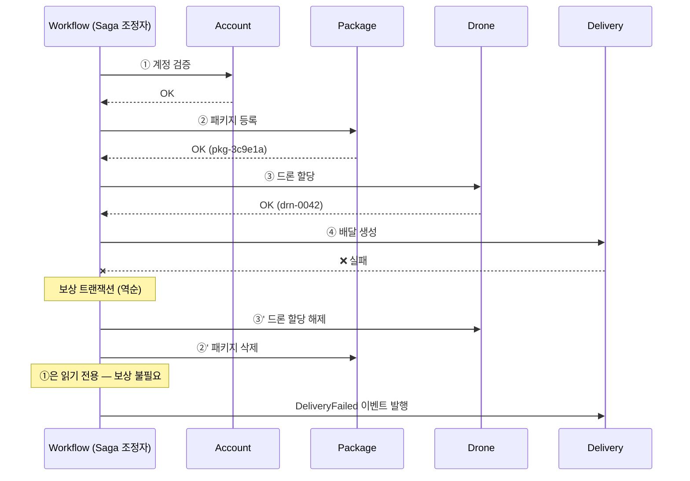

# 06. 데이터 설계서

> **목적** — 「마이크로 서비스에 대한 데이터 고려 사항」의 원칙에 따라 **서비스별 저장소**를 선택하고,
> 일관성·파티셔닝·이벤트 스키마를 확정합니다.
> 앞: [05_API_게이트웨이_설계서.md](05_API_게이트웨이_설계서.md) · 다음: [07_디자인패턴_적용_설계서.md](07_디자인패턴_적용_설계서.md)

---

## 1. 원칙

| # | 원칙 | 위반 시 벌어지는 일 |
| --- | --- | --- |
| 1 | **서비스는 데이터 저장소를 공유하지 않는다** | 스키마 변경이 여러 서비스를 깨뜨림 → 독립 배포 불가 |
| 2 | **각 서비스가 자기 데이터를 소유한다** | 다른 서비스가 몰래 쓰면 불변식이 우회됨 |
| 3 | **저장소는 접근 패턴이 고른다** (폴리글랏) | 모든 걸 한 DB 에 넣으면 어느 것도 최적이 아님 |
| 4 | **애그리거트 간에는 최종 일관성** | 분산 트랜잭션은 확장성·가용성을 파괴 |
| 5 | **이벤트 스키마를 게시하고 하위 호환을 지킨다** | 소비자가 예고 없이 깨짐 |

```
❌ 공유 데이터베이스                        ✅ 서비스별 저장소
──────────────────                        ──────────────────
Delivery ─┐                                Delivery ──▶ Redis
Package  ─┼──▶ [ 하나의 SQL DB ]           Package  ──▶ Cosmos (Mongo)
Drone    ─┤                                Drone    ──▶ Cosmos (NoSQL)
History  ─┘                                History  ──▶ Cosmos + Data Lake
```

---

## 2. 접근 패턴 분석 (선택의 근거)

> 저장소를 고르기 **전에** 각 데이터의 «어떻게 쓰이는가»를 먼저 측정 가능한 형태로 적습니다.

| 데이터 | 읽기 빈도 | 쓰기 빈도 | 수명 | 조회 방식 | 크기 | 일관성 요구 |
| --- | --- | --- | --- | --- | --- | --- |
| **배달 상태** | 🔴 매우 높음 (추적 화면 폴링) | 🟠 높음 (상태·ETA 갱신) | 🟢 짧음 (수 시간) | **ID 조회 1건** | 작음 (~1 KB) | 최종 (≤5초) |
| **패키지** | 🟡 중간 | 🟠 높음 (예약마다 1건) | 🟡 중간 (수 일) | ID 조회 · 속성 필터 | 작음 | 강함 (단일 문서 내) |
| **드론** | 🟠 높음 (할당 시 조회) | 🔴 매우 높음 (텔레메트리) | 🔴 김 (자산) | ID 조회 · **가용 드론 검색** | 작음 | **강함** (INV‑03) |
| **배달 이력(핫)** | 🟡 중간 (콜 센터) | 🟡 중간 (완료 시 1건) | 🟠 1개월 | ID 조회 | 중간 | 최종 |
| **배달 이력(콜드)** | 🟢 낮음 (분석) | 🟡 중간 | 🔴 수년 | **기간·계정 스캔** | 큼 (누적) | 최종 |

---

## 3. 저장소 선택

### 3.1 배달 상태 → **Azure Managed Redis**

| 요구 | Redis 가 충족하는가 |
| --- | --- |
| 읽기 p95 ≤ 150 ms (NFR‑02) | ✅ 인메모리 — 1 ms 미만 |
| 높은 쓰기 처리량 | ✅ |
| 짧은 수명 | ✅ **TTL 자동 만료** |
| ID 단건 조회 | ✅ 키‑값의 본령 |
| JSON 문서 저장 | ✅ Managed Redis 의 JSON 데이터 형식 |
| 영속성 | ⚠️ 프리미엄 계층 AOF/RDB. **원본은 이벤트 스트림에 있음** |

```
   키 설계
   ───────
   delivery:{deliveryId}                → JSON 문서 (배달 상태 전체)   TTL 72h
   delivery:status:{deliveryId}         → 경량 상태 뷰 (추적 API 전용)  TTL 72h
   idem:{idempotencyKey}                → 멱등 응답 캐시               TTL 24h
   event:processed:{eventId}            → 멱등 소비자 중복 제거        TTL 24h
   drone:location:{droneId}             → 최신 위치 (드론당 1건)        TTL 5m
```

> **왜 TTL 을 두는가** — 완료된 배달은 이력 서비스로 넘어갑니다. Redis 에 계속 두면 메모리가
> 무한정 늘고 비용이 오릅니다. **핫 저장소는 «지금 필요한 것»만** 담습니다.

### 3.2 패키지 → **Cosmos DB for MongoDB**

| 요구 | 충족 |
| --- | --- |
| 문서형 (무게·크기·태그 목록이 중첩) | ✅ |
| 높은 쓰기 처리량 | ✅ 파티션 분산 |
| 스키마 유연 (패키지 유형이 늘어남) | ✅ |
| Spring Data 지원 | ✅ **Spring Data MongoDB** 그대로 사용 |
| 파티션 키 | `packageId` — 모든 접근이 ID 기준 |

```json
// 문서 구조
{
  "_id": "pkg-3c9e1a",
  "deliveryId": "dlv-7f3a9c",
  "weight": { "value": 2.5, "unit": "KG" },
  "size": "SMALL",
  "description": "서류 봉투",
  "tags": [ { "tagId": "tag-01", "code": "FRAGILE" } ],
  "version": 3,
  "createdAt": "2026-08-29T10:00:01Z"
}
```

### 3.3 드론 → **Cosmos DB (NoSQL API)**

| 요구 | 충족 |
| --- | --- |
| INV‑03 «드론 하나 = 배달 하나» | ✅ **`_etag` 낙관적 동시성** — 조건부 쓰기로 경합 해결 |
| 매우 높은 쓰기(텔레메트리) | ✅ 자동 확장 처리량 |
| ID 조회 | ✅ 파티션 키 = `droneId` → 단일 파티션 조회 |
| **가용 드론 검색** | ⚠️ **교차 파티션 쿼리** — 비쌈 |

> ⚠️ **«가용 드론 검색»이 유일한 난제입니다.** `SELECT * WHERE status='AVAILABLE'` 는 모든 파티션을 스캔합니다.
>
> **해결** — 가용 드론 목록을 **Redis 집합(Set)** 에 별도 유지합니다.
> ```
> drone:available            → SET {drn-0042, drn-0107, ...}   (구체화된 뷰)
> ```
> 드론 상태 이벤트가 이 집합을 갱신합니다. 할당 시 Redis 에서 후보를 뽑고,
> **최종 확정은 Cosmos DB 의 조건부 쓰기**로 합니다 (Redis 는 힌트, Cosmos 가 진실).

```java
// INV-03 을 보장하는 조건부 쓰기
public DroneAssignment assign(DroneId droneId, DeliveryId deliveryId) {
    Drone drone = repository.findById(droneId);          // _etag 포함
    drone.assign(deliveryId);                            // ← 도메인 불변식 검사
    try {
        return repository.saveIfMatch(drone, drone.etag()); // 조건부 쓰기
    } catch (PreconditionFailedException e) {
        throw new DroneUnavailableException(droneId);     // 다른 요청이 먼저 가져감
    }
}
```

### 3.4 배달 이력 → **Cosmos DB (핫) + Data Lake Storage (콜드)**

```
   DeliveryCompleted 이벤트
          │
          ▼
   ┌─────────────────┐        1개월 경과 (TTL)        ┌────────────────────┐
   │ Cosmos DB       │  ─────────────────────────▶   │ Data Lake Storage  │
   │ (핫 · ID 조회)   │   Event Hubs 캡처가 병행 적재   │ (콜드 · 분석)       │
   │ TTL 30일        │                               │ /year=/month=/day= │
   └─────────────────┘                               └────────────────────┘
        콜 센터 조회                                        분석 · 리포트
```

| 계층 | 저장소 | 파티션/경로 | 보존 | 조회 방식 |
| --- | --- | --- | --- | --- |
| **핫** | Cosmos DB NoSQL | 파티션 키 = `deliveryId` | TTL 30일 | ID 단건 |
| **콜드** | Data Lake Gen2 | `/history/year=2026/month=08/day=29/` | 무기한 | 기간 스캔 · 분석 도구 |

> **Event Hubs 캡처**를 켜면 이벤트가 자동으로 Data Lake 에 Avro 로 적재됩니다.
> 애플리케이션 코드가 «두 번 쓰지» 않아도 됩니다. → COST‑04 자동 계층화

---

## 4. 저장소 요약표

| 서비스 | 저장소 | API | 파티션 키 | 일관성 수준 | 접근 방식 |
| --- | --- | --- | --- | --- | --- |
| Delivery | Azure Managed Redis | Redis | (키 해시) | — | 워크로드 ID |
| Package | Cosmos DB | MongoDB | `packageId` | 세션(Session) | 워크로드 ID |
| Drone Scheduler | Cosmos DB | NoSQL | `droneId` | **강력(Strong)** | 워크로드 ID |
| Delivery History | Cosmos DB | NoSQL | `deliveryId` | 세션 | 워크로드 ID |
| Delivery History | Data Lake Gen2 | Blob | 날짜 경로 | — | 워크로드 ID |

### 4.1 Cosmos DB 일관성 수준 선택

| 수준 | 지연 | 이 시스템 적용 |
| --- | --- | --- |
| 강력(Strong) | 높음 | **드론** — INV‑03 은 «읽은 뒤 바로 쓰기»가 정확해야 함 |
| 제한된 부실(Bounded Staleness) | 중간 | 미사용 |
| **세션(Session)** | 낮음 | **패키지·이력** — «내가 쓴 것은 내가 읽는다»면 충분 |
| 일관된 접두사 | 낮음 | 미사용 |
| 최종(Eventual) | 가장 낮음 | 미사용 (분석 쿼리는 콜드 계층에서) |

> 강력한 일관성은 **비용과 지연을 지불**합니다. 필요한 곳(드론)에만 씁니다.

---

## 5. 일관성 설계 — Saga

애그리거트 간에는 트랜잭션이 없습니다. **배달 예약**은 4개 서비스에 걸친 Saga 입니다.



### 5.1 보상 트랜잭션 정의

| 단계 | 정방향 | 보상 | 멱등성 |
| --- | --- | --- | --- |
| ① 계정 검증 | `GET /accounts/{id}/validity` | **불필요** (읽기 전용) | ✅ |
| ② 패키지 등록 | `PUT /packages/{id}` | `DELETE /packages/{id}` | ✅ |
| ③ 드론 할당 | `PUT /drones/assignments/{deliveryId}` | `DELETE /drones/assignments/{deliveryId}` | ✅ |
| ④ 배달 생성 | `PUT /deliveries/{id}` | `DELETE /deliveries/{id}` | ✅ |

> **보상 트랜잭션의 3가지 규칙**
> 1. **멱등해야 한다** — 보상이 두 번 실행돼도 안전
> 2. **실패할 수 있다** — 보상 실패 시 **재시도 + 최종적으로 수동 개입 큐**로
> 3. **«되돌리기»가 아니라 «상쇄»** — 삭제가 불가능한 것(발송된 알림)은 «취소 알림»을 추가 발송

### 5.2 Supervisor 의 역할

```
   Workflow 가 ③ 이후 죽으면?
   ──────────────────────────
   · 큐 메시지의 락이 5분 후 해제 → 다른 Workflow 가 재처리
   · 재처리 시 ②③은 멱등이므로 안전
   · 그러나 «③까지 했는데 계속 죽는» 경우 → 무한 재시도

   Supervisor 가 감시
   ─────────────────
   · 각 Saga 시작 시 Redis 에 { deliveryId, step, startedAt } 기록
   · 주기적으로 «시작 후 N분 경과 & 미완료» 를 스캔
   · 발견 시 보상 트랜잭션 실행 → DeliveryFailed 발행 → 상태 정리
```

| 임계값 | 값 |
| --- | --- |
| Saga 타임아웃 | 5분 |
| Supervisor 스캔 주기 | 30초 |
| 보상 재시도 | 3회 (지수 백오프) |
| 최종 실패 시 | 수동 개입 큐 + 경고 |

---

## 6. 데이터 파티셔닝

| 저장소 | 전략 | 파티션 키 | 핫 파티션 위험 | 완화 |
| --- | --- | --- | --- | --- |
| Cosmos DB (패키지) | 수평 | `packageId` (UUID) | 낮음 — 균등 분포 | — |
| Cosmos DB (드론) | 수평 | `droneId` | ⚠️ 인기 드론에 텔레메트리 집중 | 드론 수가 많아 실질 위험 낮음 |
| Cosmos DB (이력) | 수평 | `deliveryId` | 낮음 | — |
| Data Lake | 디렉터리 | `year/month/day` | ⚠️ 당일 디렉터리 집중 | 시간 단위 추가 가능 |
| Event Hubs | 파티션 | `deliveryId` / `droneId` | 낮음 | 파티션 수 16 |
| Redis | 해시 슬롯 | 키 자체 | 낮음 | — |

> ❗ **파티션 키를 «날짜」로 잡으면 안 되는 이유** — 모든 신규 쓰기가 오늘 파티션에 몰려
> 그 파티션만 한도에 걸립니다(핫 파티션). 애그리거트 ID 처럼 **균등 분포하는 값**을 씁니다.

---

## 7. 데이터 마이그레이션 · 스키마 진화

| 변경 유형 | 절차 |
| --- | --- |
| **필드 추가** | ① 코드가 «없으면 기본값» 처리 ② 배포 ③ (선택) 백필 |
| **필드 삭제** | ① 코드에서 읽기 중단 ② 배포 후 관찰 ③ 다음 릴리스에서 쓰기 중단 ④ 백필 삭제 |
| **필드 이름 변경** | 삭제 + 추가로 분해. **동시에 하지 않음** |
| **타입 변경** | 새 필드 추가 → 이중 쓰기 → 읽기 전환 → 이전 필드 제거 |

> 📌 문서형 저장소는 «스키마가 없다»는 것이지 «규칙이 없다»는 뜻이 아닙니다.
> 코드가 스키마이므로 **하위 호환을 코드가 지켜야** 합니다.

---

## 8. Spring Data 구성 (암호 없는 연결)

### 8.1 Redis

```yaml
spring:
  data:
    redis:
      host: ${REDIS_HOST}
      port: 10000
      ssl.enabled: true
  cloud.azure:
    credential:
      managed-identity-enabled: true
      client-id: ${AZURE_CLIENT_ID}          # 앱별 사용자 할당 관리 ID
    redis:
      # 접근 키 대신 Entra 토큰 사용 (SEC-01)
      enabled: true
```

### 8.2 Cosmos DB (NoSQL)

```yaml
spring:
  cloud.azure:
    cosmos:
      endpoint: ${COSMOS_ENDPOINT}
      database: dronedelivery
      consistency-level: STRONG              # 드론 서비스만
      # key 없음 — 관리 ID 로 인증
    credential:
      managed-identity-enabled: true
      client-id: ${AZURE_CLIENT_ID}
```

### 8.3 Cosmos DB (MongoDB API)

```yaml
spring:
  data:
    mongodb:
      # MongoDB API 는 현재 Entra 토큰 인증 미지원 경로가 있으므로
      # Key Vault + CSI 드라이버로 연결 문자열을 «마운트»한다 (2순위 수단)
      uri: ${MONGO_URI}                      # /mnt/secrets/mongo-uri 에서 주입
```

> ⚠️ **정직하게 기록** — Cosmos DB for MongoDB 의 인증 경로는 NoSQL API 와 다릅니다.
> 워크로드 ID 로 완전히 대체되지 않는 경우 **Key Vault 를 2순위 수단**으로 씁니다.
> 이것이 [분석/07](../분석/07_품질속성_및_제약사항.md) §3.1 의 «2순위» 항목입니다.
> 실제 구축 시 현재 지원 상태를 확인하고, 지원되면 1순위(워크로드 ID)로 전환합니다.

---

## 9. 백업 · 복구

| 저장소 | 백업 | RPO | RTO | 복구 절차 |
| --- | --- | --- | --- | --- |
| Redis | 프리미엄 AOF (prd) | 1분 | 15분 | **원본은 이벤트 스트림** — 재생으로 복구 가능 |
| Cosmos DB | 연속 백업 (30일) | 초 단위 | 1시간 | 지정 시점 복원 |
| Data Lake | GRS 복제 + 버전 관리 | 15분 | 4시간 | 지역 간 장애 조치 |
| Event Hubs | 캡처 (Data Lake) | — | — | 보존 기간 내 재생 |

> 🔑 **가장 중요한 복구 자산은 이벤트 스트림입니다.** Redis 가 통째로 날아가도
> `DeliveryTracking` 이벤트를 재생하면 배달 상태를 재구성할 수 있습니다.
> 이것이 이벤트를 «부수 효과»가 아니라 **1급 데이터**로 다루는 이유입니다.

---

## 10. 데이터 보호

| 항목 | 조치 |
| --- | --- |
| 미사용 암호화 | 모든 저장소 기본 활성 (플랫폼 관리 키) |
| 전송 중 암호화 | TLS 1.2+ 강제 |
| 접근 제어 | 워크로드 ID + **데이터 평면 RBAC** (예: Cosmos DB 기본 제공 데이터 기여자) |
| 공용 네트워크 | **차단** — 프라이빗 엔드포인트만 (prd·stg) |
| 개인정보 | 전화번호·이름은 **마스킹 저장** (`010-****-1234`) |
| 감사 | 진단 로그 → Log Analytics |
| 데이터 보존 | 이력 콜드 계층 무기한 · 개인정보 필드는 **완료 후 90일 익명화** |

---

## 11. ADR‑007 · 폴리글랏 저장소

| 항목 | 내용 |
| --- | --- |
| **상태** | 승인 |
| **결정** | Delivery=Redis / Package=Cosmos(Mongo) / Drone=Cosmos(NoSQL, 강력 일관성) / History=Cosmos+Data Lake |
| **근거** | §2 접근 패턴 분석 — 읽기·쓰기 빈도, 수명, 조회 방식이 서비스마다 근본적으로 다름 |
| **결과** | ➕ 각 서비스가 최적 저장소 사용 · 독립 확장 ➖ 운영해야 할 저장소 종류 증가 · 분산 트랜잭션 불가 |
| **대안** | 단일 PostgreSQL — NFR‑02(150 ms)·NFR‑04(10,000 msg/s) 동시 충족 불가로 기각 |
| **되돌릴 조건** | 데이터 규모가 작아 단일 저장소로 모든 NFR 을 충족하게 되면 통합 검토 |

---

## 12. 체크리스트

- [x] 저장소를 고르기 전에 **접근 패턴**을 먼저 분석했다
- [x] 서비스 간 저장소를 공유하지 않는다
- [x] 각 저장소의 파티션 키를 정하고 핫 파티션 위험을 평가했다
- [x] Cosmos DB 일관성 수준을 **필요한 곳에만** 강력으로 설정했다
- [x] Saga 의 각 단계에 **멱등 보상 트랜잭션**을 정의했다
- [x] Supervisor 의 타임아웃·스캔 주기를 수치로 정했다
- [x] 스키마 진화 절차를 정의했다
- [x] 암호 없는 연결을 1순위로 하고, **불가능한 경우를 정직하게 기록**했다
- [x] 이벤트 스트림을 복구 자산으로 설계했다
