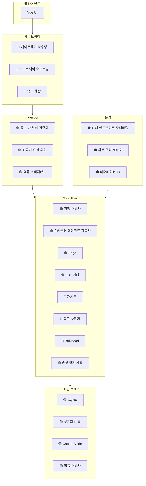

# 07. 디자인 패턴 적용 설계서

> **목적** — 「마이크로 서비스에 대한 디자인 패턴」과 「클라우드 디자인 패턴」 카탈로그에서
> **이 시스템이 실제로 쓰는 패턴만** 골라, «어디에·왜·어떻게» 적용했는지 기록합니다.
> 앞: [06_데이터_설계서.md](06_데이터_설계서.md) · 다음: [08_인프라_설계서.md](08_인프라_설계서.md)

---

## 1. 패턴 적용 지도



---

## 2. 패턴 요약표

| # | 패턴 | 분류 | 적용 위치 | 해결하는 문제 |
| --- | --- | --- | --- | --- |
| 1 | **게이트웨이 라우팅** | 게이트웨이 | Application Gateway | 클라이언트가 서비스 위치를 알아야 함 |
| 2 | **게이트웨이 오프로딩** | 게이트웨이 | App Gateway + WAF | 횡단 관심사 중복 구현 |
| 3 | **속도 제한 (Rate Limiting)** | 게이트웨이 | App Gateway | 한 클라이언트가 자원 독점 |
| 4 | **큐 기반 부하 평준화** | 메시징 | Ingestion → Service Bus | 요청 폭주가 하류를 무너뜨림 |
| 5 | **비동기 요청‑회신** | 메시징 | `202` + `statusUrl` | 긴 처리를 동기로 기다릴 수 없음 |
| 6 | **경쟁 소비자** | 메시징 | Workflow 다중 인스턴스 | 큐 처리량 확장 |
| 7 | **게시자‑구독자** | 메시징 | Event Hubs | 발행자가 소비자를 알아야 함 |
| 8 | **멱등 소비자** | 메시징 | 모든 이벤트 소비자 | 최소 1회 전달 → 중복 |
| 9 | **스케줄러 에이전트 감독자** | 복원력 | Workflow(Scheduler+Supervisor) | 다단계 처리 중 실패 복구 |
| 10 | **Saga** | 데이터 | Workflow | 분산 트랜잭션 불가 |
| 11 | **보상 거래** | 데이터 | 각 서비스의 `DELETE` | Saga 롤백 |
| 12 | **재시도** | 복원력 | 모든 서비스 간 호출 | 일시적 오류 |
| 13 | **회로 차단기** | 복원력 | 동일 | 지속적 실패의 연쇄 전파 |
| 14 | **Bulkhead** | 복원력 | Workflow 호출 풀 | 한 의존성이 전체 자원 잠식 |
| 15 | **손상 방지 계층** | 통합 | Third‑party 어댑터 | 외부 모델이 도메인 오염 |
| 16 | **CQRS** | 데이터 | 쓰기(큐) / 읽기(Redis) 분리 | 읽기·쓰기 요구가 상이 |
| 17 | **구체화된 뷰** | 데이터 | `delivery:status:*`, `drone:available` | 조인·스캔이 비쌈 |
| 18 | **Cache‑Aside** | 성능 | Account 검증 결과 | 반복 조회 비용 |
| 19 | **상태 엔드포인트 모니터링** | 운영 | `/actuator/health/*` | 장애 감지 |
| 20 | **외부 구성 저장소** | 운영 | Spring Cloud Config Server | 환경별 구성이 이미지에 고정됨 |
| 21 | **페더레이션 ID** | 보안 | Entra ID + 워크로드 ID | 서비스마다 자격 증명 관리 |
| 22 | **정적 콘텐츠 호스팅** | 성능 | Storage + Front Door | 앱 서버가 정적 파일 서빙 |

**적용: 22개 패턴**

---

## 3. 핵심 패턴 상세

### 3.1 큐 기반 부하 평준화 (Queue‑Based Load Leveling)

**문제** — 배달 예약이 피크에 500 req/s 로 몰립니다. 하류 서비스(Package·Drone·Delivery)는
그 속도를 감당할 수 없고, 감당하도록 확장하면 유휴 시간에 비용을 낭비합니다.

```
❌ 직접 호출                                ✅ 큐 완충
────────────                                ──────────
500 req/s ──▶ Workflow ──▶ 하류 서비스        500 req/s ──▶ [큐] ──▶ Workflow ──▶ 하류
                    │                                       │            (100 req/s로 소비)
              하류가 무너짐                              큐가 흡수
              (연쇄 실패)                          사용자는 이미 202 받음
```

| 설계 결정 | 값 | 근거 |
| --- | --- | --- |
| 큐 | Service Bus `delivery-requests` | 유실 불가 (REL‑05) |
| 소비자 확장 | 큐 깊이 기준, 인스턴스당 20건 | 적체를 지표로 |
| 최대 큐 깊이 경고 | 5,000건 | 이 이상이면 처리 능력 부족 |
| 사용자 응답 | `202 Accepted` 즉시 | NFR‑01 (p95 ≤ 300 ms) |

> ⚠️ **부작용 — 최종 일관성.** 사용자가 예약 직후 조회하면 아직 없을 수 있습니다.
> `202` + `Retry-After: 2` + `statusUrl` 로 클라이언트에 **명시적으로 알립니다.**

### 3.2 스케줄러 에이전트 감독자 (Scheduler Agent Supervisor)

**문제** — 배달 예약은 4개 서비스를 순서대로 호출합니다. 중간에 Workflow 자신이 죽으면?

```
   ┌──────────────────────────────────────────────────────────┐
   │  Scheduler                                                │
   │   · 단계 목록을 알고 순서대로 실행                          │
   │   · 각 단계 시작·완료를 상태 저장소에 기록                   │
   │   · 단계 실패 시 재시도 → 회로 차단기 → Saga 보상            │
   └──────────────────────┬───────────────────────────────────┘
                          │ 상태 기록
                    ┌─────▼──────────────────────┐
                    │ Redis                       │
                    │ saga:{deliveryId} = {       │
                    │   step: "DRONE_ASSIGNED",   │
                    │   startedAt: "...",         │
                    │   completedSteps: [...] }   │
                    └─────▲──────────────────────┘
                          │ 30초마다 스캔
   ┌──────────────────────┴───────────────────────────────────┐
   │  Supervisor                                               │
   │   · «시작 후 5분 경과 & 미완료» 항목을 찾는다               │
   │   · 발견 시 완료된 단계의 보상을 역순 실행                   │
   │   · DeliveryFailed 이벤트 발행 · 경고                       │
   └───────────────────────────────────────────────────────────┘
```

| 구성 요소 | 책임 | 이 시스템에서 |
| --- | --- | --- |
| **Scheduler** | 작업 단계를 조정 | `WorkflowService` |
| **Agent** | 각 원격 서비스 호출을 감싸고 실패를 격리 | `PackageAgent`, `DroneAgent`, `DeliveryAgent` (재시도·회로 차단기 포함) |
| **Supervisor** | 진행 감시 · 실패 복구 | `SupervisorService` (`@Scheduled(fixedDelay = 30s)`) |
| **상태 저장소** | 진행 상황 영속화 | Redis `saga:{deliveryId}` |

> 🔑 **왜 «에이전트」가 별도 개념인가** — Scheduler 가 직접 HTTP 를 호출하면 재시도·회로 차단기 로직이
> Scheduler 에 섞입니다. 에이전트로 감싸면 Scheduler 는 «순서»에만 집중하고,
> 각 에이전트가 «그 서비스 고유의 실패 특성»(외부 API 는 회로를 빨리 연다 등)을 갖습니다.

### 3.3 Saga + 보상 거래

[06 데이터 설계서](06_데이터_설계서.md) §5 에서 상세히 다뤘습니다. 핵심만 재확인:

| Saga 유형 | 이 시스템 | 이유 |
| --- | --- | --- |
| **오케스트레이션** ✅ | Workflow 가 중앙에서 조정 | 흐름이 복잡하고 «어디까지 갔는지»를 알아야 보상 가능 |
| 안무(Choreography) ❌ | 미사용 | 각 서비스가 이벤트로 연쇄하면 **전체 흐름을 아무도 모름** → 디버깅·보상 곤란 |

> ⚠️ **안무를 쓰지 않은 이유를 명확히 기록합니다.** 안무는 결합도가 낮지만,
> «지금 이 배달이 어느 단계인가»를 알려면 여러 서비스의 로그를 짜맞춰야 합니다.
> 배달 예약은 **실패 시 반드시 보상해야 하므로** 중앙 조정자가 유리합니다.
>
> **되돌릴 조건** — 단계가 10개를 넘어 조정자가 비대해지면 하위 Saga 로 분해.

### 3.4 손상 방지 계층 (Anti‑Corruption Layer)

```java
// 도메인 계층 — 외부를 전혀 모른다
public interface ThirdPartyTransportPort {
    DelegationResult delegate(Delivery delivery);
}

// 인프라 계층 — ACL
@Component
class ThirdPartyTransportAdapter implements ThirdPartyTransportPort {

    @Override
    @Bulkhead(name = "thirdParty")
    @CircuitBreaker(name = "thirdParty", fallbackMethod = "unavailable")
    public DelegationResult delegate(Delivery delivery) {
        //  ① 도메인 → 외부 스키마 번역
        var request = new ShipmentRequest(
            delivery.id().value(),                        // deliveryId  → ref_no
            toExternalPoint(delivery.pickup()),           // Location    → orig
            toExternalPoint(delivery.dropoff()),          // Location    → dest
            delivery.packageWeight().toKilograms());      // PackageWeight → wt_kg

        var response = client.post("/v2/shipments", request);

        //  ② 외부 → 도메인 번역
        return new DelegationResult(
            new ExternalTrackingId(response.trackingRef()),
            toDomainStatus(response.statCd()));           // "IN_TR" → InTransit
    }

    private DelegationResult unavailable(Delivery d, Throwable t) {
        return DelegationResult.unavailable();            // 폴백
    }
}
```

| ACL 이 막는 것 | 예 |
| --- | --- |
| 외부 용어의 침투 | `ref_no`, `stat_cd`, `wt_kg` 가 도메인 코드에 나타나지 않음 |
| 외부 스키마 변경의 파급 | 외부가 `stat_cd` → `status_code` 로 바꿔도 어댑터만 수정 |
| 외부 장애의 전파 | 회로 차단기 + Bulkhead 가 어댑터 안에 |
| 단위 불일치 | 외부는 kg, 우리는 `PackageWeight` 값 개체 |

### 3.5 CQRS

```
   ┌──────────── 쓰기 측 (Command) ────────────┐
   POST /api/v1/deliveries
      → Ingestion → Service Bus → Workflow
      → Delivery.create() (불변식 검사)
      → Redis 쓰기 + DeliveryTracking 이벤트 발행
   └───────────────────────────────────────────┘
                        │ 이벤트
                        ▼
   ┌──────────── 읽기 측 (Query) ──────────────┐
   GET /api/v1/deliveries/{id}/status
      → Redis 의 delivery:status:{id} 단건 조회
      (조인 없음 · 계산 없음 · 1ms 미만)

   GET /api/v1/history?from=&to=
      → Cosmos DB / Data Lake (다른 모델·다른 저장소)
   └───────────────────────────────────────────┘
```

| 측면 | 쓰기 모델 | 읽기 모델 |
| --- | --- | --- |
| 형태 | 애그리거트 (불변식 포함) | 평평한 뷰 (비정규화) |
| 저장소 | Redis (JSON) | Redis (경량 뷰) / Cosmos / Data Lake |
| 최적화 | 일관성 | **지연 시간** |
| 확장 | 큐 깊이 | 요청 수 |

> ⚠️ **CQRS 를 «모든 곳에» 적용하지 않습니다.** Package·Account 는 읽기와 쓰기 요구가 비슷하므로
> 단일 모델입니다. CQRS 는 **읽기와 쓰기 요구가 크게 다를 때만** 이익입니다.

### 3.6 구체화된 뷰 (Materialized View)

| 뷰 | 저장 위치 | 갱신 계기 | 대체하는 비싼 연산 |
| --- | --- | --- | --- |
| `delivery:status:{id}` | Redis | 상태·위치 이벤트 | Delivery + Drone + Eta 조인 |
| `drone:available` (SET) | Redis | 드론 상태 이벤트 | Cosmos DB 교차 파티션 스캔 |
| `history:summary:{account}:{month}` | Cosmos DB | `DeliveryCompleted` | Data Lake 전체 스캔 |

> **구체화된 뷰의 대가** — 원본과 뷰가 잠시 어긋납니다(최종 일관성).
> `drone:available` 이 부정확할 수 있으므로 **최종 확정은 Cosmos DB 조건부 쓰기**로 합니다
> ([06 데이터 설계서](06_데이터_설계서.md) §3.3). **뷰는 힌트, 원본이 진실.**

### 3.7 페더레이션 ID + 워크로드 ID

```
   ❌ 서비스마다 자격 증명                ✅ 페더레이션 ID
   ──────────────────────                ──────────────────
   delivery ─ Redis 접근 키                delivery ─┐
   package  ─ Mongo 연결 문자열            package  ─┼─▶ Entra ID ─▶ 토큰 ─▶ 리소스
   drone    ─ Cosmos 키                    drone    ─┘      ▲
              ▲                                             │
        각각을 Key Vault 에 보관              앱별 관리 ID (비밀 없음)
        회전·감사·유출 관리 필요                    자동 회전
```

상세 → [09 보안 아이덴티티 설계서](09_보안_아이덴티티_설계서.md)

---

## 4. 적용을 **검토했으나 쓰지 않은** 패턴

> 쓰지 않기로 한 결정도 설계입니다. 근거를 남깁니다.

| 패턴 | 왜 쓰지 않았는가 | 다시 검토할 조건 |
| --- | --- | --- |
| **안무 (Choreography)** | 보상이 필요한 흐름에서 전체 상태를 아무도 모르게 됨 | 보상이 불필요한 단순 전파 흐름이 생기면 |
| **이벤트 소싱** | 상태 재구성 비용·학습 곡선이 이익을 넘음. 이벤트는 «전파용»으로만 사용 | 감사 요구가 «모든 상태 변경 이력 보존»으로 강화되면 |
| **Sidecar** | Spring Apps 는 사이드카를 노출하지 않음. 필요 기능은 라이브러리로 해결 | AKS 이전 시 |
| **Ambassador** | 위와 동일 | AKS 이전 시 |
| **Strangler Fig** | 대체할 레거시 시스템이 없음 (신규 구축) | 기존 시스템 통합 시 |
| **BFF** | 클라이언트가 Vue SPA 하나뿐 | 모바일 앱 추가 시 |
| **게이트웨이 집계** | 읽기 모델 비정규화로 해결됨 | 왕복 비용이 큰 클라이언트 추가 시 |
| **Geode** | 단일 지역 운영 | 다중 지역 능동‑능동 요구 시 |
| **Sharding (직접 구현)** | Cosmos DB·Event Hubs 가 파티셔닝을 제공 | 관리형 서비스로 부족할 때 |
| **Claim Check** | 메시지가 작음 (~2 KB) | 이미지·영상 첨부가 생기면 |
| **Gatekeeper** | WAF + 게이트웨이가 역할 수행 | 극도로 민감한 데이터 취급 시 |
| **Leader Election** | Supervisor 가 여러 인스턴스여도 멱등 보상이라 안전 | 단일 실행이 반드시 필요한 작업 추가 시 |
| **Deployment Stamp** | 테넌트 규모가 작음 | 대규모 멀티테넌시 요구 시 |
| **Pipes and Filters** | 처리 단계가 독립적이지 않고 보상이 필요 | 순수 변환 파이프라인이 생기면 |

---

## 5. 패턴 조합의 함정

### 5.1 재시도 + 회로 차단기의 순서

```
❌ Retry(CircuitBreaker(call))              ✅ CircuitBreaker(Retry(call))
   회로가 열려도 재시도가 반복                 회로가 열리면 재시도조차 안 함
```
→ 코드로는 [03 통신 설계서](03_서비스간_통신_설계서.md) §4.4 의 어노테이션 순서

### 5.2 재시도 + 멱등성

```
   재시도는 «같은 요청을 다시 보낸다»는 뜻입니다.
   요청이 멱등하지 않으면 재시도가 데이터를 망칩니다.

   ❌ POST /drones/assign         → 재시도가 드론 2대 할당
   ✅ PUT  /drones/assignments/{deliveryId} → 재시도해도 결과 동일
```

### 5.3 큐 + 멱등 소비자

```
   큐는 «최소 1회» 전달입니다. 락 만료·재배포·네트워크 오류로 중복이 옵니다.
   멱등 소비자가 없으면 «배달이 두 번 생성」됩니다.
```

### 5.4 Saga + 보상의 멱등성

```
   보상도 재시도됩니다. DELETE /packages/{id} 가 이미 없는 것을 지울 때
   404 를 던지면 보상이 «실패»로 기록됩니다. → 204 를 반환해야 합니다.
```

---

## 6. 패턴 → 요구사항 추적

| 요구사항 | 충족 패턴 |
| --- | --- |
| FR‑B‑03 즉시 응답 | 큐 기반 부하 평준화 · 비동기 요청‑회신 |
| FR‑B‑05 타사 위탁 | 손상 방지 계층 · 회로 차단기 폴백 |
| FR‑E‑02 자동 보상 | Saga · 보상 거래 · 스케줄러 에이전트 감독자 |
| NFR‑01 예약 p95 300 ms | 큐 기반 부하 평준화 |
| NFR‑02 추적 p95 150 ms | CQRS · 구체화된 뷰 · Cache‑Aside |
| NFR‑03 500 req/s | 큐 · 경쟁 소비자 |
| NFR‑05 가용성 99.9 % | 회로 차단기 · Bulkhead · 상태 엔드포인트 모니터링 |
| NFR‑06 연쇄 실패 격리 | Bulkhead · 회로 차단기 |
| NFR‑07 최종 일관성 ≤5초 | 게시자‑구독자 · 구체화된 뷰 |
| REL‑05 메시지 유실 0 | 큐(피어‑락·DLQ) · 멱등 소비자 |
| SEC‑01 평문 비밀 0 | 페더레이션 ID |
| OPS‑06 다른 지역 재배포 | 외부 구성 저장소 |
