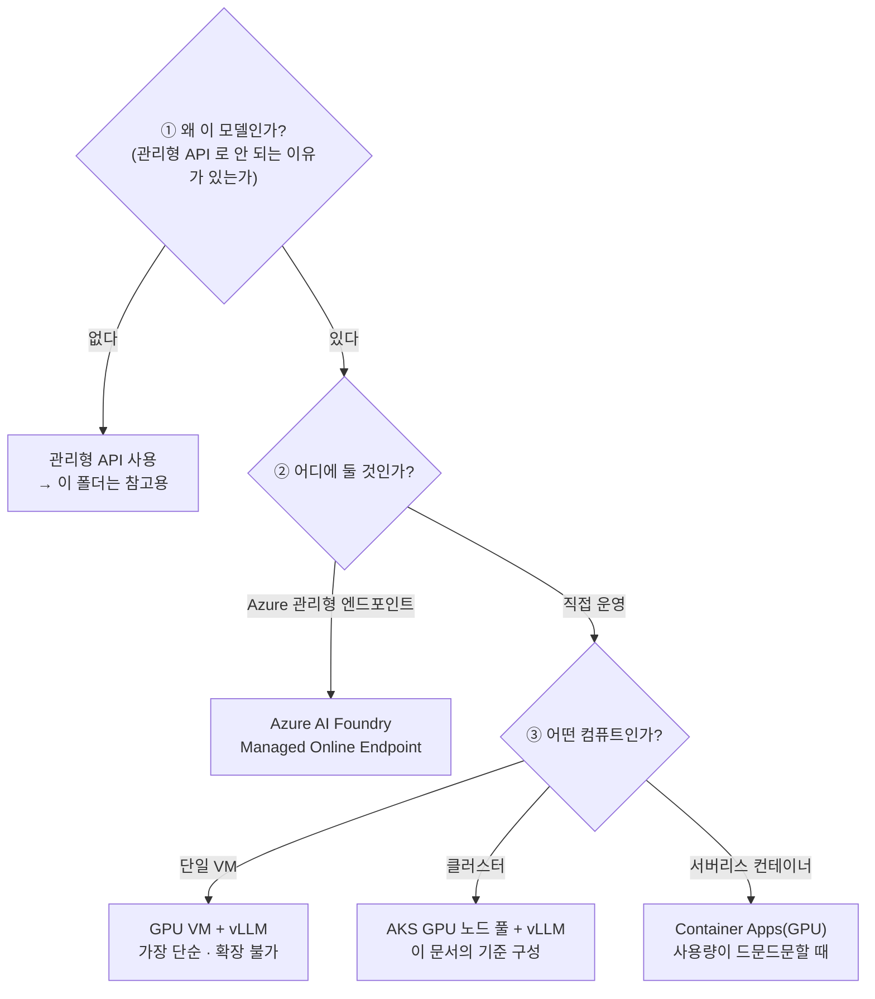

# 01. 배포 방안 검토 — «자체 배포가 정말 맞는가»

> **이 문서의 목적**: 배포 방법을 고르기 전에 **배포할지 말지**를 먼저 결정합니다.
> **가장 비싼 실수는 «필요 없는 것을 잘 만드는 것»입니다.**

---

## 1. 결정해야 할 것은 하나가 아니다

| 결정 | 잘못 고르면 |
| --- | --- |
| ① 왜 이 모델인가 | **필요 없는 인프라를 운영**하게 된다 |
| ② 어디에 둘 것인가 | 운영 부담이 팀 역량을 넘어선다 |
| ③ 어떤 컴퓨트인가 | 유휴 GPU 요금이 계속 나간다 |

---

## 2. 공개 가중치 모델을 «직접» 배포한다는 것의 의미

| 관리형 API 가 대신 해 주던 것 | 자체 배포 시 내가 져야 하는 것 |
| --- | --- |
| GPU 확보·용량 관리 | **쿼터 신청 · 지역 재고 · Spot 회수 대응** |
| 모델 로딩·버전 관리 | 가중치 저장·배포·롤백 |
| 확장·축소 | HPA/KEDA · 노드 오토스케일 · **콜드 스타트** |
| 가용성 | 다중 복제본 · PDB · 영역 분산 |
| 보안 패치 | 이미지·드라이버·CUDA 버전 관리 |
| 사용량 과금 | **유휴 시간에도 나가는 GPU 요금** |

> 🔑 **자체 배포의 본질은 «싸게 만드는 것»이 아니라 «통제권을 가져오는 것»입니다.** 비용은 사용률이 충분히 높을 때만 유리해집니다([03 §5](03_비용최적화_설계.md)).

---

## 3. 자체 배포가 정당화되는 세 가지 경우

| # | 조건 | 판단 기준 | 확인 방법 |
| --- | --- | --- | --- |
| **①** | **지속적 고사용량** | GPU 사용률이 꾸준히 높다 | 월 토큰 수 × 관리형 단가 vs GPU 시간당 요금([03 §5](03_비용최적화_설계.md)) |
| **②** | **데이터 반출 제약** | 규제·계약상 데이터가 조직 경계를 나갈 수 없다 | 개인정보·영업비밀 분류 결과 |
| **③** | **모델 커스터마이징** | 파인튜닝·LoRA·프롬프트 캐싱 등 **모델 자체를 손봐야** 한다 | 실제 튜닝 계획이 있는가 |

> ⚠️ **«언젠가 필요할 것 같아서»는 근거가 아닙니다.** ①~③ 중 어느 것도 지금 해당하지 않는다면, 관리형 API 로 시작하고 필요해질 때 옮기는 편이 거의 항상 쌉니다.

---

## 4. 배포 방안 4종 비교 (MECE)

| 축 | **A. 관리형 API** | **B. Azure AI Foundry Managed Endpoint** | **C. AKS GPU 노드 풀** (이 문서 기준) | **D. 단일 GPU VM** |
| --- | --- | --- | --- | --- |
| 과금 | **토큰당** | **GPU 시간당**(엔드포인트) | GPU 시간당(노드) | GPU 시간당(VM) |
| 유휴 비용 | **0** | 있음(축소 설정 가능) | **0 가능**(scale-to-zero) | 있음(수동 중지 필요) |
| 확장 | 자동·무제한 | 자동 | **HPA + 노드 오토스케일** | **불가** |
| 운영 부담 | 없음 | 낮음 | **높음** | 중간 |
| 모델 자유도 | 제공 모델만 | 등록한 모델 | **완전 자유** | 완전 자유 |
| 데이터 경계 | 서비스 경계 | **구독 내** | **구독 내 · VNet** | 구독 내 · VNet |
| 콜드 스타트 | 없음 | 수십 초~수 분 | **수 분**(이미지+가중치 로딩) | 없음(상시 기동) |
| 적합한 상황 | 사용량 적음·빠른 시작 | 팀에 K8s 역량이 없음 | **고사용량 · 통제 필요 · 다른 워크로드와 공유** | PoC · 단일 사용자 |

### 4-1. 왜 이 문서는 C(AKS)를 기준으로 삼는가

| 이유 | 설명 |
| --- | --- |
| **앞선 실습과 이어진다** | `배포/prd` 에서 만든 AKS·워크로드 ID·관측 구성을 **그대로 재사용**합니다 |
| **비용 레버가 가장 많다** | Spot · scale-to-zero · 노드 풀 분리 · 공유가 모두 가능합니다([03](03_비용최적화_설계.md)) |
| **다른 워크로드와 공유** | 앱과 모델이 같은 클러스터의 **다른 노드 풀**에 놓입니다 |

> 📌 **B(Managed Endpoint)가 나쁜 선택이라는 뜻이 아닙니다.** 팀에 Kubernetes 운영 역량이 없다면 B 가 더 낫습니다. 이 문서는 «C 를 고른 경우 어떻게 하는가»를 다룹니다.

---

## 5. 서빙 엔진 선택

| 엔진 | 강점 | 약점 | 언제 |
| --- | --- | --- | --- |
| **vLLM** | PagedAttention · 연속 배칭 · **OpenAI 호환 API** · 생태계 최대 | 신규 아키텍처 지원이 늦을 수 있음 | **기본 선택** |
| **SGLang** | 구조화 출력·프리픽스 캐싱에 강점 | 생태계가 상대적으로 작음 | 프롬프트 재사용이 많을 때 |
| **TensorRT-LLM** | NVIDIA GPU 에서 최고 처리량 | **엔진 빌드 필요** · 유연성 낮음 | 고정 워크로드·최대 성능 |
| **Ollama / llama.cpp** | 가볍고 단순 · CPU 도 가능 | 동시성·처리량 낮음 | 개발·PoC |

**이 문서의 선택: vLLM**

| 근거 | 설명 |
| --- | --- |
| **OpenAI 호환 API** | 앱 코드를 바꾸지 않고 관리형 API ↔ 자체 배포를 **바꿔 낄 수 있다** |
| 연속 배칭 | 동시 요청이 많을수록 GPU 사용률이 올라간다 → **비용/토큰이 내려간다** |
| 양자화 지원 | FP8 · AWQ · GPTQ 를 지원해 **VRAM 을 줄인다**([03 §3](03_비용최적화_설계.md)) |

> ⚠️ **첫 번째 확인 사항** — vLLM 이 이 모델의 아키텍처를 지원하는지 릴리스 노트에서 확인하세요. 지원되지 않으면 «지원 버전을 기다리거나 다른 엔진을 쓰거나»의 선택만 남습니다.

---

## 6. 의사결정 기록 양식

이 폴더의 설계를 채택하기 전에 아래를 채워 남기세요. **나중에 «왜 이렇게 했지»를 답할 수 있게 하는 것**이 목적입니다.

| 항목 | 기록 | 예시 |
| --- | --- | --- |
| 자체 배포 근거(§3 중 택1 이상) | | ② 데이터 반출 제약 — 사내 문서 기반 RAG |
| 예상 월 토큰 수 | | 입력 200M · 출력 40M |
| 손익분기 판단 결과 | | [03 §5](03_비용최적화_설계.md) 계산 결과 자체 배포가 유리 |
| 모델 라이선스 확인 | | 상업적 사용 가능 여부 · 재배포 조건 |
| 서빙 엔진·버전 | | vLLM x.y.z — 아키텍처 지원 확인함 |
| 정밀도 | | FP8 (VRAM 절반) |
| 목표 지연(TTFT/TPOT) | | TTFT < 1s · TPOT < 50ms |
| 폐기 조건 | | 3개월 평균 GPU 사용률 < 30% 면 관리형으로 회귀 |

> 🔑 **«폐기 조건»을 미리 적어 두는 것이 중요합니다.** 자체 배포는 한 번 만들면 «있으니까 계속 쓰는» 관성이 생깁니다. 되돌릴 기준을 처음에 정해 두세요.
