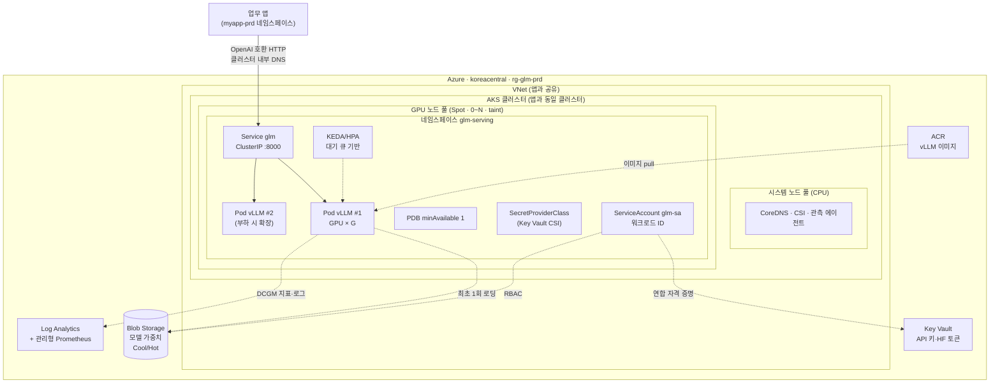
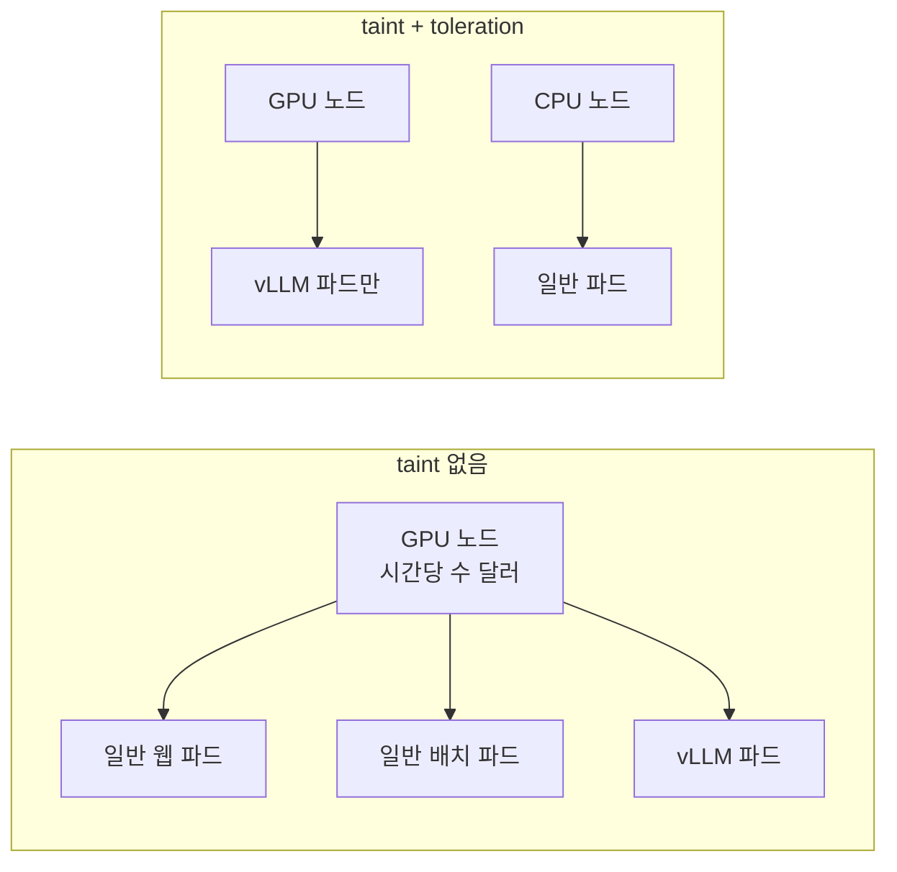
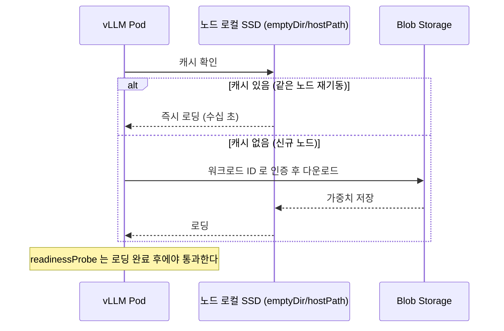
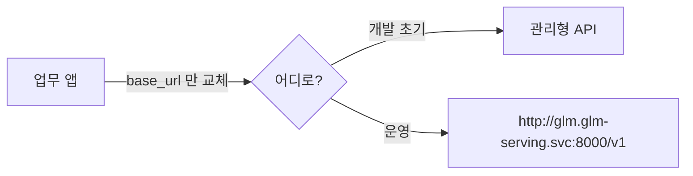

# 02. 아키텍처 설계 — «무엇을 어디에 두는가»

> **전제**: [01](01_배포방안_검토.md) 에서 **AKS GPU 노드 풀 + vLLM** 을 선택한 경우.
> **원칙**: 앱 배포(`배포/prd`)에서 정한 **보안·관측·신원 규칙을 그대로 적용**합니다 — 모델이라고 예외를 두지 않습니다.

---

## 1. 전체 토폴로지



---

## 2. 구성 요소와 선택 근거

| 구성 요소 | 선택 | 왜 |
| --- | --- | --- |
| 클러스터 | **앱과 동일한 AKS** · 별도 노드 풀 | 관측·신원·네트워크 구성을 재사용 · 운영 지점을 늘리지 않음 |
| GPU 노드 풀 | **전용 풀 + taint** | 일반 파드가 **GPU 노드를 점유하지 못하게** 막는다 |
| 노드 수 | **최소 0 ~ 최대 N** | 유휴 시 **0으로 축소**([03 §3](03_비용최적화_설계.md)) |
| 구매 옵션 | **Spot 우선 + 온디맨드 예비** | 실측 70~82% 절감 · 회수 대응은 설계로 흡수 |
| 서빙 엔진 | **vLLM**(OpenAI 호환) | 앱 코드를 바꾸지 않고 교체 가능 |
| 모델 가중치 | **Blob Storage** + 노드 로컬 캐시 | 이미지에 넣지 않아 **이미지가 가벼워지고 교체가 쉬움** |
| 노출 | **ClusterIP(내부 전용)** | 모델 엔드포인트를 **인터넷에 두지 않는다** |
| 신원 | **워크로드 ID** | 저장소 키·HF 토큰을 파드에 두지 않는다 |
| 관측 | Container Insights + **관리형 Prometheus + DCGM** | GPU 사용률·메모리·온도를 봐야 비용 판단이 가능 |

### 2-1. GPU 노드 풀을 «전용 + taint» 로 두는 이유



| taint 가 없으면 | 있으면 |
| --- | --- |
| 스케줄러가 **가장 비싼 노드에 아무 파드나** 올린다 | vLLM 파드만 올라간다 |
| GPU 노드가 «일반 파드 때문에» 축소되지 않는다 | **비면 즉시 0으로 축소**된다 |

```yaml
# 노드 풀에 부여
nodeTaints: ["sku=gpu:NoSchedule"]
nodeLabels:  { workload: "llm", "kubernetes.azure.com/scalesetpriority": "spot" }
```

---

## 3. 모델 가중치를 어디에 둘 것인가 (MECE)

| 방식 | 최초 기동 | 이미지 크기 | 모델 교체 | 비용 | 판단 |
| --- | --- | --- | --- | --- | --- |
| **① 컨테이너 이미지에 포함** | 빠름(pull 후 즉시) | **수십~수백 GB** | 이미지 재빌드 | ACR 저장 비용 큼 | ❌ 이미지가 비대해져 pull 이 병목 |
| **② Blob → 노드 로컬 디스크 캐시** | 최초만 느림 | 작음 | **파일 교체** | Blob 저장 + 전송 | ✅ **권장** |
| **③ Azure Files Premium 공유 마운트** | 중간 | 작음 | 파일 교체 | 공유 스토리지 비용 지속 | ⭕ 복제본이 많을 때 |
| **④ 매번 Hugging Face 에서 다운로드** | 느림·불안정 | 작음 | 자동 | 이그레스·외부 의존 | ❌ 운영 부적합 |

**② 의 동작**



> ⚠️ **Spot 노드가 회수되면 로컬 캐시도 사라집니다.** 그래서 «콜드 스타트 시간»이 Spot 채택의 실질적 비용입니다 — [03 §6](03_비용최적화_설계.md) 에서 이 트레이드오프를 다룹니다.

---

## 4. GPU 메모리 산정 — 몇 장이 필요한가

**필요 VRAM = 가중치 + KV 캐시 + 활성화/오버헤드**

| 항목 | 계산식 | 비고 |
| --- | --- | --- |
| **가중치** | `총_파라미터 × 정밀도_바이트` | FP16=2 · FP8=1 · INT4=0.5 |
| **KV 캐시**(토큰당) | `2 × 레이어수 × KV헤드수 × 헤드차원 × 정밀도_바이트` | GQA/MQA 면 KV헤드가 적어 크게 줄어든다 |
| KV 캐시(총) | `토큰당 × 최대_동시_토큰수` | 동시 요청 × 평균 컨텍스트 |
| 오버헤드 | 가중치의 **약 5~10%** | 활성화·단편화·CUDA 컨텍스트 |

```
필요 GPU 수 ≒ ceil( 필요_VRAM / (GPU_VRAM × 활용률) )      # 활용률 0.85~0.90 권장
```

> 🔎 **MoE 모델의 함정** — 활성 파라미터가 적어도 **가중치 전체가 VRAM 에 올라가야** 합니다. 연산량은 활성 파라미터를 따르지만 **메모리는 총 파라미터를 따릅니다.** 이 둘을 혼동하면 GPU 수를 크게 잘못 잡습니다.

```powershell
# 제원을 config/model.json 에 채운 뒤 실행
python 모델\GLM5.2\config\scripts\sizing.py
```

---

## 5. 텐서 병렬 · 파이프라인 병렬

| 방식 | 언제 | 대가 |
| --- | --- | --- |
| **텐서 병렬**(`--tensor-parallel-size`) | 한 장에 모델이 안 들어갈 때 | GPU 간 **통신 대역폭**이 성능을 좌우(NVLink 유무가 중요) |
| **파이프라인 병렬** | 노드를 넘어야 할 때 | 지연 증가 · 구성 복잡 |
| **복제(Replica)** | 모델이 한 노드에 들어갈 때 **처리량**을 늘리려면 | 가장 단순 — **가능하면 이것** |

> 🔑 **«한 노드에 들어가게 만드는 것»이 가장 큰 최적화입니다.** 양자화로 한 노드에 들어가면 통신 병목·구성 복잡도·장애 지점이 모두 사라집니다([03 §3-1](03_비용최적화_설계.md)).

---

## 6. 보안 · 신원 — 앱과 동일한 규칙

| 통제 | 적용 | 근거 |
| --- | --- | --- |
| **노출** | ClusterIP 내부 전용 · 필요 시 내부 LB | 모델 엔드포인트를 인터넷에 두지 않는다 |
| **인증** | 앱 ↔ 모델 사이 **API 키**(Key Vault 보관) 또는 mTLS | 클러스터 내부라도 무인증은 금지 |
| **저장소 접근** | **워크로드 ID + `Storage Blob Data Reader`** | 저장소 키를 파드에 두지 않는다 |
| **비밀 주입** | Key Vault + CSI(`SecretProviderClass`) | [설계/공통/07 §4](../../설계/공통/07_아이덴티티·시크릿_설계서.md) |
| **컨테이너** | 비루트 · `drop: [ALL]` · 읽기 전용 루트FS(+`/tmp`·캐시는 볼륨) | prd 와 동일 |
| **네트워크 정책** | `glm-serving` 은 **앱 네임스페이스에서만** 인바운드 허용 | 측면 이동 차단 |
| **로그** | **프롬프트·응답 본문을 기본 미기록** | 개인정보·영업비밀 유출 경로 |

> 🚫 **가장 흔한 사고는 «디버깅하려고 프롬프트를 로그에 남기는 것»입니다.** 로그는 수집·보관·공유되므로, 본문 기록은 **명시적 동의와 마스킹**을 전제로만 켜야 합니다.

```yaml
# ServiceAccount — 앱과 같은 방식(설계/공통/07 §3)
apiVersion: v1
kind: ServiceAccount
metadata:
  name: glm-sa
  namespace: glm-serving
  annotations:
    azure.workload.identity/client-id: CLIENT_ID_PLACEHOLDER
```

---

## 7. 앱과의 연동 — OpenAI 호환이 주는 것



| 환경 변수 | dev | stg | prd |
| --- | --- | --- | --- |
| `LLM_BASE_URL` | 관리형 API 또는 로컬 | 클러스터 내부 주소 | 클러스터 내부 주소 |
| `LLM_MODEL` | 모델 이름 | 〃 | 〃 |
| `LLM_API_KEY` | 환경 변수 | K8s Secret | **Key Vault → CSI** |

> 🔑 **앱 코드는 «어디에 붙는지»를 모릅니다.** `base_url` 만 바뀝니다 — 앱 배포에서 지킨 «같은 이미지, 다른 설정» 원칙([설계/공통/01 NFR-07](../../설계/공통/01_기능명세서.md))이 여기서도 그대로 적용됩니다.

---

## 8. 아키텍처 결정 기록 (ADR)

| ID | 결정 | 대안 | 선택 이유 | 트레이드오프 |
| --- | --- | --- | --- | --- |
| **ADR-G-01** | 앱과 **같은 클러스터의 별도 노드 풀** | 전용 클러스터 | 관측·신원·네트워크 재사용 · 운영 지점 최소화 | 클러스터 장애가 둘 다 영향 |
| **ADR-G-02** | **GPU 노드 풀에 taint** | taint 없음 | 비싼 노드를 vLLM 전용으로 · 축소 가능 | toleration 설정 필요 |
| **ADR-G-03** | **Spot 우선 + 온디맨드 예비** | 전부 온디맨드 | 실측 70~82% 절감 | **회수 대응 설계 필요** |
| **ADR-G-04** | 가중치를 **Blob + 로컬 캐시** | 이미지에 포함 | 이미지 경량 · 교체 용이 | 최초 기동 지연 |
| **ADR-G-05** | **vLLM(OpenAI 호환)** | 자체 서버 · TensorRT-LLM | 앱 코드 무변경 교체 · 생태계 | 신규 아키텍처 지원 지연 가능 |
| **ADR-G-06** | **ClusterIP 내부 전용** | 공용 엔드포인트 | 공격면 최소화 | 외부 접근 시 게이트웨이 필요 |
| **ADR-G-07** | **워크로드 ID로 Blob 접근** | 저장소 키 | 비밀을 만들지 않는다 | 초기 설정 복잡도 |
| **ADR-G-08** | **프롬프트 본문 미기록** | 전체 로깅 | 개인정보·기밀 유출 방지 | 디버깅 난이도 상승 |

---

## 9. 알려진 한계

| 한계 | 영향 | 완화 |
| --- | --- | --- |
| Spot 회수 | 수 분간 용량 감소 | 온디맨드 예비 1대 · PDB · 재시도 |
| 콜드 스타트 | 첫 요청 지연 수 분 | 노드 로컬 캐시 · 최소 1대 상시(비용↑) |
| GPU 쿼터 | 확장 상한 | **사전 쿼터 신청**([05 §1](05_배포_가이드.md)) |
| 단일 리전 | 리전 장애 시 중단 | 다중 리전은 별도 설계 영역 |
| 모델 라이선스 | 상업적 사용 제약 가능 | **배포 전 확인**(README §0) |
