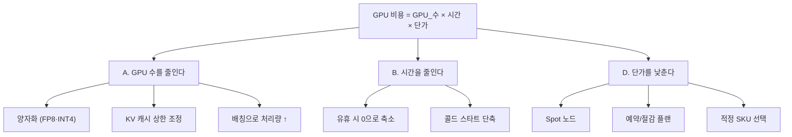

# 03. 비용 최적화 설계 — «비용이 어디서 나오고 무엇을 줄일 수 있는가»

> **원칙**: 비용은 «싼 것을 고르는 문제»가 아니라 **«쓰지 않는 시간을 없애는 문제»**입니다.
> **모든 단가는 실측값입니다** — Azure 소매가 API(`prices.azure.com`, 인증 불필요)에서 **2026-08-22 · koreacentral · Linux 기준**으로 조회했습니다. `config/scripts/price_check.py` 로 언제든 다시 확인할 수 있습니다.

---

## 1. 비용 구조 분해 (MECE)

```
월 총비용 = ① GPU 컴퓨트 + ② 저장소 + ③ 네트워크 + ④ 관측 + ⑤ 부대 서비스
             ▲ 보통 90% 이상
```

| # | 항목 | 무엇에 비례하나 | 대략 비중 | 줄이는 방법 |
| --- | --- | --- | --- | --- |
| **①** | **GPU 컴퓨트** | **GPU 시간 × 단가** | **90%+** | §3 의 레버 8종 |
| ② | 저장소(Blob·디스크) | 가중치 크기 · 노드 OS 디스크 | 수% | Cool 계층 · 불필요 복제 제거 |
| ③ | 네트워크 | 리전 간·인터넷 이그레스 | 수% | **같은 리전에 배치** |
| ④ | 관측 | 로그·지표 수집량 | 수% | 프롬프트 본문 미기록(보안 이득도 있음) |
| ⑤ | 부대(ACR·Key Vault) | 고정 | <1% | – |

> 🔑 **①이 90% 이상이므로, ②~⑤ 최적화는 대부분 시간 낭비입니다.** GPU 시간을 줄이는 데 집중하세요.

---

## 2. GPU 시간을 줄이는 두 방향



---

## 3. 최적화 레버 8종 — 효과가 큰 순서

| # | 레버 | 효과 | 대가 | 적용 난이도 |
| --- | --- | --- | --- | --- |
| **L1** | **양자화**(FP16 → FP8 / INT4) | **VRAM 1/2 ~ 1/4** → **GPU 수 감소** | 정확도 소폭 저하 · 검증 필요 | 중 |
| **L2** | **Spot 노드** | **실측 72~82% 절감** | **회수 대응 설계 필요** | 중 |
| **L3** | **유휴 시 0으로 축소** | 사용률이 낮을수록 절감 폭이 큼 | **콜드 스타트 수 분** | 중 |
| **L4** | **적정 SKU 선택** | 같은 VRAM 을 더 싸게 | 성능 특성이 다름 | 하 |
| **L5** | **연속 배칭 · 처리량 최적화** | 같은 GPU 로 더 많은 토큰 | 지연 소폭 증가 | 하(vLLM 기본) |
| **L6** | **예약/절감 플랜** | 실측 1년 25~36% · 3년 45~63% 절감 | **약정 — 중도 변경 어려움** | 하 |
| **L7** | 프리픽스 캐싱 | 반복 프롬프트에서 큰 절감 | 워크로드 의존 | 하 |
| **L8** | 저장소·관측 절감 | 수% | 관측 범위 축소 | 하 |

### 3-1. L1 양자화 — 왜 가장 효과가 큰가

| 정밀도 | 파라미터당 바이트 | 100B 모델 가중치 | 한 노드(8×80GB=640GB)에 | 정확도 |
| --- | :---: | --- | --- | --- |
| FP16/BF16 | 2 | 200 GB | 들어감 | 기준 |
| **FP8** | **1** | **100 GB** | **여유 있게 들어감** | 실무상 손실 작음 |
| INT4(AWQ/GPTQ) | 0.5 | 50 GB | **더 작은 노드로 가능** | 작업에 따라 저하 체감 |

> 🔑 **양자화의 진짜 이득은 «GPU 수 감소»입니다.** VRAM 이 절반이 되면 **노드 수가 절반**이 되고, 그것이 곧 비용 절반입니다. 정확도 손실은 [06 §3](06_테스트_설계.md) 의 정확도 회귀 테스트로 **측정해서 판단**하세요 — 감으로 결정하지 않습니다.

### 3-2. L3 유휴 시 0으로 축소 — 사용 패턴이 결정한다

| 사용 패턴 | 하루 실사용 | 상시 기동 대비 절감 | 적합성 |
| --- | --- | --- | --- |
| 사내 업무 시간만 | 9시간 | **약 62%** | ✅ 매우 적합 |
| 배치 처리(야간) | 3시간 | **약 87%** | ✅ 매우 적합 |
| 24시간 서비스 | 24시간 | 0% | ❌ 상시 기동이 맞음 |
| 드문드문(하루 수십 건) | 1시간 미만 | 95%+ | ⚠️ **콜드 스타트가 UX 를 해침** → 관리형 API 재검토([01 §3](01_배포방안_검토.md)) |

```yaml
# 노드 풀: 최소 0
--min-count 0 --max-count 4 --enable-cluster-autoscaler
```

> ⚠️ **0으로 축소하려면 GPU 노드에 «다른 파드가 없어야» 합니다.** taint 를 걸지 않으면 시스템 파드가 남아 **축소가 영원히 일어나지 않습니다**([02 §2-1](02_아키텍처_설계.md)).

---

## 4. 실측 단가 — koreacentral · Linux · 2026-08-22 조회

**시간당 USD (소매가, 할인 미적용)**

| SKU | GPU | 온디맨드 | **Spot** | 1년 예약(시간 환산) | 3년 예약(시간 환산) |
| --- | --- | ---: | ---: | ---: | ---: |
| `Standard_NV36ads_A10_v5` | A10 | 4.320 | **0.798 (−82%)** | 2.765 (−36%) | 1.901 (−56%) |
| `Standard_NV72ads_A10_v5` | A10 ×2 | 8.802 | **1.627 (−82%)** | 5.633 (−36%) | 3.873 (−56%) |
| `Standard_NC24ads_A100_v4` | A100 80GB ×1 | 4.959 | **0.916 (−82%)** | 3.241 (−35%) | 1.840 (−63%) |
| `Standard_NC48ads_A100_v4` | A100 80GB ×2 | 9.917 | **1.833 (−82%)** | 6.483 (−35%) | 3.680 (−63%) |
| `Standard_NC96ads_A100_v4` | A100 80GB ×4 | 19.834 | **3.665 (−82%)** | 12.966 (−35%) | 7.360 (−63%) |
| `Standard_NC40ads_H100_v5` | H100 94GB ×1 | 9.423 | **2.679 (−72%)** | 7.067 (−25%) | 5.183 (−45%) |
| `Standard_NC80adis_H100_v5` | H100 94GB ×2 | 18.846 | **5.358 (−72%)** | 14.134 (−25%) | 10.365 (−45%) |
| `Standard_ND96isr_H100_v5` | H100 80GB ×8 (NVLink) | 132.732 | **24.529 (−82%)** | 84.949 (−36%) | 58.269 (−56%) |

> 📌 **예약 가격은 «총 선불액»으로 제공되므로 1년=8,760시간 · 3년=26,280시간으로 나눠 환산했습니다.**
> ⚠️ **가격은 수시로 바뀝니다.** 반드시 `python config/scripts/price_check.py` 로 다시 확인하세요.

### 4-1. SKU 선택 — «GPU 1장당 단가»로 보면 달라진다

| SKU | GPU 수 | 온디맨드/시간 | **GPU 1장당** | Spot/시간 | **Spot GPU 1장당** |
| --- | :---: | ---: | ---: | ---: | ---: |
| `NC24ads_A100_v4` | 1 | 4.959 | **4.959** | 0.916 | **0.916** |
| `NC48ads_A100_v4` | 2 | 9.917 | 4.959 | 1.833 | 0.917 |
| `NC96ads_A100_v4` | 4 | 19.834 | 4.959 | 3.665 | 0.916 |
| `NC40ads_H100_v5` | 1 | 9.423 | **9.423** | 2.679 | **2.679** |
| `ND96isr_H100_v5` | 8 | 132.732 | 16.592 | 24.529 | **3.066** |

| 관찰 | 의미 |
| --- | --- |
| A100 계열은 **GPU 1장당 단가가 크기와 무관하게 동일** | 필요한 만큼만 고르면 된다 — 큰 SKU 를 쓸 이유가 없다 |
| H100 은 A100 의 **약 1.9배 단가** | 성능이 1.9배 이상 나오는 워크로드에서만 유리 |
| `ND96isr_H100_v5` 는 GPU 1장당 **가장 비싸다** | **NVLink 가 필요한 대형 텐서 병렬**에서만 정당화된다 |

> 🔑 **«GPU가 많으니 싸겠지»는 틀립니다.** 총액이 아니라 **GPU 1장당 단가**로 비교하세요. NVLink 가 필요 없다면 작은 SKU 여러 대가 더 쌉니다.

---

## 5. 손익분기 — 자체 배포가 언제부터 유리해지나

**비교식**

```
관리형 API 월비용 = (입력토큰/1M × 입력단가) + (출력토큰/1M × 출력단가)
자체 배포 월비용  = GPU수 × 시간당단가 × 월가동시간 × (1 - 할인율) + 부대비용
```

### 5-1. 계산 예 — A100 1장(Spot) 기준

| 조건 | 값 |
| --- | --- |
| SKU | `NC24ads_A100_v4` · Spot **0.916 USD/시간** |
| 가동 | ① 24시간 상시 = 730시간/월 → **약 669 USD** |
|  | ② 업무시간(9h×22일)=198시간 → **약 181 USD** |
| 부대비용(저장소·관측·ACR) | 약 20~50 USD/월 |

| 월 처리 토큰 | 관리형 API 가정 단가 | 관리형 월비용 | 자체(상시 669) | 자체(업무시간 181) |
| ---: | --- | ---: | :---: | :---: |
| 10M | $0.5/1M 혼합 | $5 | ❌ 자체가 훨씬 비쌈 | ❌ |
| 100M | 〃 | $50 | ❌ | ❌ |
| **500M** | 〃 | $250 | ❌ | **✅ 자체가 유리** |
| **2,000M** | 〃 | $1,000 | **✅ 자체가 유리** | ✅✅ |

> ⚠️ **관리형 API 단가는 서비스·모델마다 크게 다릅니다.** 위 `$0.5/1M` 은 **예시일 뿐**이며, 실제 계약 단가를 넣어 다시 계산해야 합니다. `config/scripts/breakeven.py` 가 이 계산을 대신합니다.
>
> 🔑 **결론의 형태**: «월 토큰이 수억 개를 넘고, GPU 를 상시가 아니라 **필요한 시간만** 켤 수 있을 때» 자체 배포가 유리해집니다. 둘 중 하나라도 아니면 관리형이 낫습니다.

---

## 6. Spot 노드 — 절감과 위험의 교환

| 관점 | 내용 |
| --- | --- |
| **절감** | 실측 **72~82%** — 단일 레버로는 가장 큼 |
| **위험** | Azure 가 **30초 통보 후 회수** 가능 |
| 회수 시 발생 | 진행 중 요청 실패 · 노드 로컬 가중치 캐시 소실 · **콜드 스타트 재발생** |

**설계로 흡수하는 방법**

| 대책 | 구현 | 효과 |
| --- | --- | --- |
| **온디맨드 예비 1대** | 온디맨드 노드 풀 `min-count 1` | 회수되어도 **서비스가 끊기지 않음** |
| PodDisruptionBudget | `minAvailable: 1` | 동시 축출 방지 |
| 클라이언트 재시도 | 앱에서 지수 백오프 | 순간 오류 흡수 |
| 가중치 캐시 | 노드 로컬 SSD | 같은 노드 재기동은 빠름 |
| **eviction 이벤트 모니터링** | `kubernetes.azure.com/scalesetpriority=spot` 노드 이벤트 | 회수 빈도를 **측정**해 판단 |

```
권장 조합:  온디맨드 1대(기본 용량)  +  Spot N대(피크 용량)
            └ 안정성 확보              └ 비용 절감
```

> 📌 **«전부 Spot»은 개발·배치에는 좋지만 대화형 서비스에는 위험합니다.** 사용자가 응답을 기다리는 워크로드라면 **최소 1대는 온디맨드**로 두세요.

---

## 7. 예약/절감 플랜 — 언제 약정할 것인가

| 조건 | 권장 |
| --- | --- |
| 워크로드가 **1년 이상 지속**될 것이 확실 | 1년 예약(−25~36%) |
| 3년 지속 + SKU 변경 계획 없음 | 3년 예약(−45~63%) |
| **모델·SKU 가 바뀔 가능성이 있음** | ❌ **약정하지 말 것** |
| 유휴 시간이 많음 | ❌ Spot + scale-to-zero 가 더 유리 |

> ⚠️ **예약은 «항상 켜 두는 것»을 전제로 합니다.** scale-to-zero 로 절감하려는 계획과 **정면으로 충돌**합니다. 둘 중 하나를 고르세요 — 동시에 이득을 볼 수는 없습니다.

| 전략 | 잘 맞는 상황 |
| --- | --- |
| **Spot + scale-to-zero** | 사용 시간이 몰려 있고 중단에 강한 워크로드 |
| **예약(온디맨드)** | 24시간 안정 서비스 · 사용률이 꾸준히 높음 |

---

## 8. 비용 관측 — 측정하지 않으면 최적화할 수 없다

| 지표 | 어디서 | 왜 |
| --- | --- | --- |
| **GPU 사용률**(`DCGM_FI_DEV_GPU_UTIL`) | 관리형 Prometheus | 낮으면 **과대 프로비저닝** |
| **GPU 메모리 사용률** | 〃 | 낮으면 더 작은 SKU 로 가능 |
| 노드 가동 시간 | Azure Monitor | scale-to-zero 가 실제로 동작하는지 |
| Spot 회수 횟수 | K8s 이벤트 | 회수가 잦으면 다른 리전·SKU 검토 |
| **토큰 처리량**(vLLM 지표) | `/metrics` | 비용/1M토큰 산출의 분모 |
| **비용/1M 토큰** | 위 둘의 조합 | **유일하게 의미 있는 단위 비용** |

```
비용/1M토큰 = (GPU 시간당 단가 × 가동 시간) / (처리한 토큰 수 / 1,000,000)
```

> 🎯 **«시간당 얼마»가 아니라 «1M 토큰당 얼마»로 봐야 합니다.** 배칭·양자화로 처리량이 오르면 시간당 비용은 같아도 **단위 비용이 내려갑니다** — 그것이 실제 최적화입니다.

**태그 규칙**(비용 배분용)

```powershell
--tags workload=llm model=glm5.2 env=prd owner=<팀> costcenter=<코드>
```

---

## 9. 절감 체크리스트

| # | 확인 | 상태 |
| --- | --- | :---: |
| 1 | 양자화를 적용했고 **정확도를 측정**했다 | ☐ |
| 2 | 모델이 **한 노드에 들어간다**(텐서 병렬 불필요) | ☐ |
| 3 | GPU 노드 풀에 **taint** 가 걸려 있다 | ☐ |
| 4 | 유휴 시 노드가 **실제로 0으로 축소**된다(로그로 확인) | ☐ |
| 5 | Spot 을 쓰고 **온디맨드 예비 1대**가 있다 | ☐ |
| 6 | **GPU 1장당 단가**로 SKU 를 비교했다 | ☐ |
| 7 | GPU 사용률·메모리 사용률을 **수집하고 있다** | ☐ |
| 8 | **비용/1M 토큰**을 계산할 수 있다 | ☐ |
| 9 | 리소스에 **비용 태그**가 붙어 있다 | ☐ |
| 10 | **폐기 조건**([01 §6](01_배포방안_검토.md))을 정해 두었다 | ☐ |
