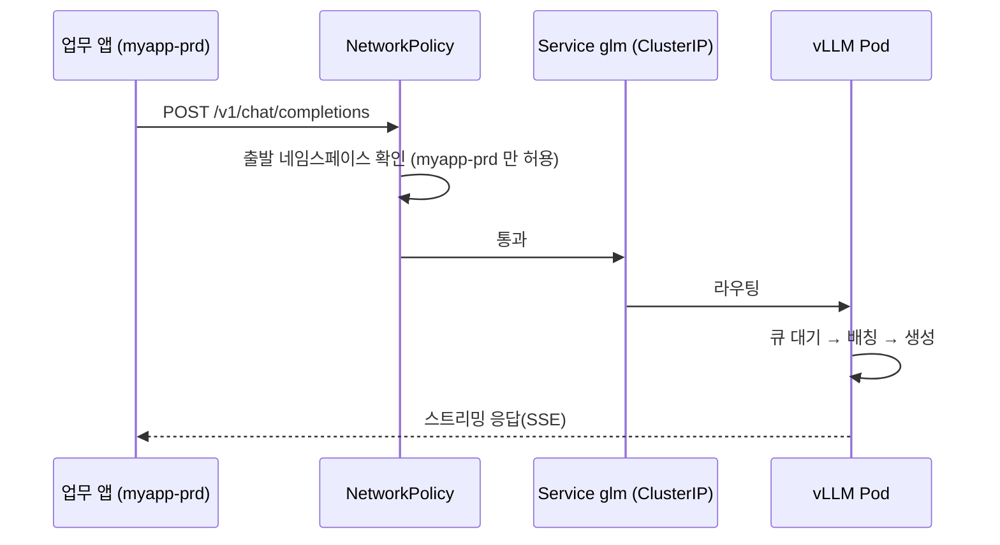

# 04. 배포 설계 — «클러스터·매니페스트·스케일을 어떻게 구성하는가»

> **전제**: [02 아키텍처](02_아키텍처_설계.md) · [03 비용 최적화](03_비용최적화_설계.md) 의 결정을 구현으로 옮깁니다.
> **정본**: [`config/env.glm.json`](config/env.glm.json) · [`config/model.json`](config/model.json) · [`config/k8s/`](config/k8s/)

---

## 1. 9단계 골격 — 앱 배포와 동일

```
 10 전제조건 → 20 구성 → 30 빌드 → 40 배포 → 50 스모크 → 60 성능 → 70 정확도 → 80 검증 → 90 정리
 ──────────   ─────    ─────    ─────   ──────────────────────────────   ─────   ─────
  쿼터·도구    노드풀    이미지   매니페스트   테스트 3단계                  합격판정  뒷정리
```

| 단계 | 앱 배포(`배포/prd`)와 같은 것 | 모델 배포에서 달라지는 것 |
| --- | --- | --- |
| 10 전제조건 | 도구·로그인·이름 규칙 | **GPU 쿼터** · 모델 라이선스 확인 |
| 20 구성 | RG·네트워크·Key Vault·관측 | **GPU 노드 풀(taint·Spot)** · Blob 가중치 업로드 |
| 30 빌드 | 이미지 빌드·태그 | vLLM 베이스 이미지 + **기동 스크립트** |
| 40 배포 | 매니페스트 적용·롤아웃 대기 | **모델 로딩 대기**(수 분) |
| 50 스모크 | 헬스 엔드포인트 | `/v1/models` · 짧은 생성 요청 |
| 60 성능 | – | **TTFT · 처리량 · 동시성** |
| 70 정확도 | – | **양자화 전후 회귀 비교** |
| 80 검증 | 가용성·보안·관측 | + **GPU 사용률 · 비용/1M토큰** |
| 90 정리 | 리소스 삭제 | **노드 풀 우선 삭제**(비용이 가장 큼) |

---

## 2. GPU 노드 풀 설계

| 항목 | 값 | 근거 |
| --- | --- | --- |
| 이름 | `gpu` | – |
| SKU | `env.glm.json` 의 `gpu.sku` | [03 §4-1](03_비용최적화_설계.md) GPU 1장당 단가로 선택 |
| 우선순위 | **Spot** (`--priority Spot`) | 실측 72~82% 절감 |
| 축출 정책 | `--eviction-policy Delete` | 회수 시 노드 삭제(디스크 비용 방지) |
| 최대 입찰가 | `-1`(온디맨드가 상한) | 가격 급등 시에도 회수만 감수 |
| 오토스케일 | `--min-count 0 --max-count N` | **유휴 시 0** |
| **taint** | `sku=gpu:NoSchedule` | 일반 파드 배제 → **축소 가능** |
| 라벨 | `workload=llm` | 스케줄링·비용 태깅 |
| OS 디스크 | Ephemeral(가능 시) | 가중치 캐시 I/O · 비용 |
| 예비 풀 | `gpu-od` 온디맨드 `min-count 1`(선택) | Spot 회수 대비 |

```powershell
az aks nodepool add -g $RG --cluster-name $AKS -n gpu `
  --node-vm-size $SKU --node-count 0 `
  --enable-cluster-autoscaler --min-count 0 --max-count 4 `
  --priority Spot --eviction-policy Delete --spot-max-price -1 `
  --node-taints "sku=gpu:NoSchedule" --labels workload=llm `
  --node-osdisk-type Ephemeral --mode User
```

> ⚠️ **`--min-count 0` 만으로는 0이 되지 않습니다.** taint 가 없으면 DaemonSet 이외의 파드가 남아 축소가 막힙니다. **taint 와 세트**로 봐야 합니다.

---

## 3. GPU 드라이버 — 무엇을 설치해야 하나

| 방식 | 설명 | 권장 |
| --- | --- | --- |
| **AKS GPU 이미지 사용** | 노드 이미지에 드라이버 포함 | ✅ 가장 단순 |
| NVIDIA Device Plugin DaemonSet | 드라이버 별도 · 플러그인 설치 | 세밀 제어 필요 시 |
| GPU Operator | 드라이버·플러그인·DCGM 일괄 | 대규모 운영 |

**확인 방법**

```powershell
kubectl get nodes -l workload=llm -o jsonpath='{range .items[*]}{.metadata.name}{"\t"}{.status.allocatable.nvidia\.com/gpu}{"\n"}{end}'
```

> 🔑 **`nvidia.com/gpu` 가 allocatable 에 보이지 않으면 파드가 영원히 Pending 입니다.** 40 배포 전에 반드시 확인하세요.

---

## 4. Deployment 설계

| 항목 | 값 | 근거 |
| --- | --- | --- |
| `replicas` | 1 (시작) · HPA 로 확장 | 콜드 스타트 비용이 크므로 신중히 |
| `resources.limits."nvidia.com/gpu"` | `env.glm.json` 의 `gpu.perPod` | **GPU 는 requests=limits 로 고정 할당** |
| `tolerations` | `sku=gpu:NoSchedule` | 노드 풀 taint 대응 |
| `nodeSelector` | `workload: llm` | GPU 노드에만 |
| **`startupProbe`** | `/health` · **실패 허용 60회 × 10초 = 10분** | **모델 로딩이 수 분 걸린다** |
| `livenessProbe` | `/health` · 30초 간격 | 죽은 프로세스 회수 |
| `readinessProbe` | `/v1/models` · 10초 간격 | **로딩 완료 전 트래픽 차단** |
| `terminationGracePeriodSeconds` | 60 | 진행 중 요청 마무리 |
| 볼륨 | 가중치 캐시(노드 로컬) · `/dev/shm`(크게) | **`/dev/shm` 이 작으면 텐서 병렬이 실패** |
| `securityContext` | 비루트 · `drop: [ALL]` | prd 규칙 동일 |
| SA | `glm-sa`(워크로드 ID) | Blob·Key Vault 접근 |

> ⚠️ **`startupProbe` 를 짧게 잡는 것이 가장 흔한 실패입니다.** 모델 로딩이 끝나기 전에 liveness 가 죽여서 **무한 재시작 루프**에 빠집니다. 가중치 크기 ÷ 디스크 대역폭으로 최소 시간을 추정해 **넉넉히** 잡으세요.
>
> ⚠️ **`/dev/shm` 기본값(64MB)은 텐서 병렬에 부족합니다.** `emptyDir: {medium: Memory, sizeLimit: 8Gi}` 이상으로 마운트하세요.

---

## 5. 스케일링 설계

### 5-1. 두 계층

| 계층 | 트리거 | 도구 | 반응 시간 |
| --- | --- | --- | --- |
| **파드** | **대기 큐 길이**(vLLM 지표) | KEDA(Prometheus 스케일러) 또는 HPA(커스텀 지표) | 수십 초 |
| **노드** | 스케줄 불가 파드 | 클러스터 오토스케일러 | **수 분**(노드 프로비저닝) |

> 🔎 **CPU 사용률로 LLM 을 스케일하면 안 됩니다.** GPU 워크로드는 CPU 가 한가해도 GPU 가 포화됩니다. **대기 큐 길이나 GPU 사용률**을 지표로 쓰세요.

```yaml
# KEDA — vLLM 의 대기 요청 수를 보고 확장한다
triggers:
  - type: prometheus
    metadata:
      serverAddress: http://prometheus.monitoring:9090
      metricName: vllm_num_requests_waiting
      threshold: "5"
      query: sum(vllm:num_requests_waiting)
```

### 5-2. 콜드 스타트 비용

```mermaid
gantt
    dateFormat X
    axisFormat %s
    section 확장 과정
    노드 프로비저닝     :0, 180
    이미지 pull        :180, 300
    가중치 다운로드/로딩 :300, 540
    준비 완료          :540, 560
```



| 구간 | 대략 시간 | 단축 방법 |
| --- | --- | --- |
| 노드 프로비저닝 | 2~4분 | 온디맨드 예비 1대 상시 |
| 이미지 pull | 1~3분 | **이미지 경량화**(가중치 미포함) · ACR 같은 리전 |
| 가중치 로딩 | 2~10분 | 노드 로컬 캐시 · Premium 디스크 · **양자화(크기↓)** |

> 🔑 **콜드 스타트가 «비용 절감의 대가»입니다.** scale-to-zero 로 아끼는 돈과, 첫 사용자가 기다리는 수 분을 저울질하세요. 대화형 서비스라면 **최소 1대 상시**가 현실적입니다.

---

## 6. 매니페스트 구성

```
config/k8s/
├── namespace.yaml            glm-serving
├── serviceaccount.yaml       워크로드 ID 주석(치환)
├── secretprovider.yaml       Key Vault CSI (API 키·HF 토큰)
├── configmap.yaml            모델 이름·정밀도·최대 길이 등 비밀 아닌 설정
├── deployment.yaml           vLLM · GPU 할당 · 프로브 · 볼륨
├── service.yaml              ClusterIP :8000 (내부 전용)
├── hpa.yaml                  파드 확장(지표 기반)
├── pdb.yaml                  minAvailable 1
└── networkpolicy.yaml        앱 네임스페이스에서만 인바운드 허용
```

**ConfigMap 에 담는 것 / 담지 않는 것**

| 담는 것 | 담지 않는 것 |
| --- | --- |
| `MODEL_ID` · `DTYPE` · `MAX_MODEL_LEN` · `GPU_MEMORY_UTILIZATION` · `TENSOR_PARALLEL_SIZE` | **API 키 · HF 토큰 · 저장소 키** |

> 📐 비밀은 [설계/공통/07](../../설계/공통/07_아이덴티티·시크릿_설계서.md) 규칙대로 **Key Vault → CSI → Secret** 경로로만 주입합니다.

---

## 7. 앱 연동 설계



| 앱 측 설정 | 값 |
| --- | --- |
| `LLM_BASE_URL` | `http://glm.glm-serving.svc.cluster.local:8000/v1` |
| `LLM_MODEL` | ConfigMap 의 `MODEL_ID` 와 동일 |
| `LLM_API_KEY` | Key Vault → CSI 로 주입 |
| 타임아웃 | **길게**(생성은 수십 초 걸릴 수 있음) |
| 재시도 | 지수 백오프 · **멱등하지 않은 요청은 재시도 금지** |

---

## 8. 관측 설계

| 신호 | 수집 | 확인할 것 |
| --- | --- | --- |
| **vLLM 지표** (`/metrics`) | 관리형 Prometheus | 대기 큐 · 처리량 · TTFT |
| **GPU 지표** (DCGM) | 〃 | 사용률 · 메모리 · 온도 |
| 파드 로그 | Container Insights | 기동 실패·OOM |
| K8s 이벤트 | 〃 | **Spot 회수** · 스케줄 실패 |
| 비용 | Azure Cost Management(태그별) | 월 추이 |

```kusto
// GPU 노드에서 최근 1시간 축출(회수) 이벤트
KubeEvents
| where TimeGenerated > ago(1h)
| where Reason has_any ("Preempted", "NodeNotReady", "FailedScheduling")
| project TimeGenerated, Name, Reason, Message
| order by TimeGenerated desc
```

> 🚫 **프롬프트·응답 본문은 기본적으로 기록하지 않습니다.** 로그는 수집·보관·공유되므로, 본문 기록은 마스킹과 동의를 전제로만 켭니다([02 §6](02_아키텍처_설계.md)).
