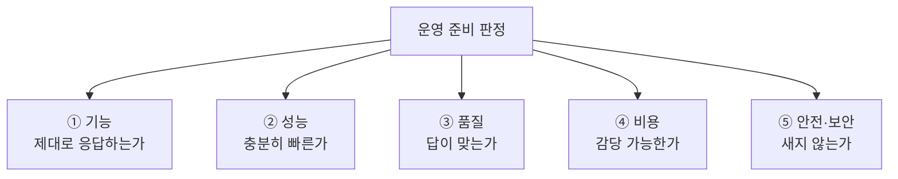
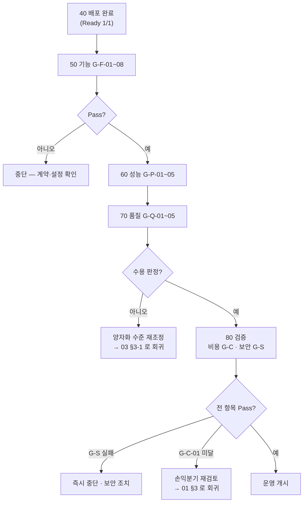

# 06. 테스트 설계 — «되었는지 무엇으로 판정하는가»

> **원칙**: 모델 서빙은 «떴다»가 성공이 아닙니다. **품질·속도·비용·안전**이 함께 기준을 넘어야 합니다.
> **연결**: 앱 테스트 체계 [설계/공통/06](../../설계/공통/06_테스트설계서.md) 와 같은 방식(TC·판정 기준·리포트)을 씁니다.

---

## 1. 5축 판정 (MECE)



| 축 | 무엇을 보나 | 실패 시 |
| --- | --- | --- |
| **① 기능** | API 계약대로 응답하는가 | 앱이 붙지 못한다 |
| **② 성능** | TTFT · 처리량 · 동시성 | 사용자가 기다린다 |
| **③ 품질** | **양자화 후에도 답이 맞는가** | 싸졌지만 못 쓴다 |
| **④ 비용** | 비용/1M 토큰 | 손익분기를 넘지 못한다 |
| **⑤ 안전·보안** | 노출·유출·주입 | 사고가 난다 |

---

## 2. ① 기능 테스트 (G-F)

| TC | 시나리오 | 방법 | 통과 기준 |
| --- | --- | --- | --- |
| **G-F-01** | 모델 등록 확인 | `GET /v1/models` | 200 · `MODEL_ID` 포함 |
| **G-F-02** | 기본 생성 | `POST /v1/chat/completions` | 200 · 응답 본문 비어 있지 않음 |
| **G-F-03** | **스트리밍** | `stream: true` | SSE 청크가 순차 도착 · `[DONE]` 종료 |
| **G-F-04** | 최대 길이 경계 | `max_tokens` 상한 요청 | 잘려도 **오류 없이** 종료 |
| **G-F-05** | 컨텍스트 초과 | `MAX_MODEL_LEN` 초과 입력 | **400 계열 오류** · 프로세스 생존 |
| **G-F-06** | 동시 요청 | 10건 동시 | 전부 200 · 순서 뒤섞여도 무방 |
| **G-F-07** | 잘못된 모델명 | 존재하지 않는 `model` | 404 계열 · 500 아님 |
| **G-F-08** | 헬스·준비 | `/health` · `/v1/models` | 로딩 중에는 **Ready 아님** |

> 🔎 **G-F-05 가 중요한 이유** — 컨텍스트 초과는 운영에서 반드시 발생합니다. 이때 **프로세스가 죽으면** 다른 사용자 요청까지 함께 끊깁니다.

---

## 3. ② 성능 테스트 (G-P)

### 3-1. 측정 지표

| 지표 | 정의 | 사용자 체감 |
| --- | --- | --- |
| **TTFT** (Time To First Token) | 요청 → 첫 토큰 | **«반응이 빠르다»의 실체** |
| **TPOT** (Time Per Output Token) | 토큰 간 간격 | 읽는 속도와 비교됨 |
| **처리량** (tokens/s) | 전체 출력 토큰 ÷ 시간 | 동시 사용자 수용력 |
| **동시성** | 동시 처리 요청 수 | 큐 대기 발생 지점 |

| TC | 시나리오 | 통과 기준(예시 — **워크로드에 맞게 재설정**) |
| --- | --- | --- |
| **G-P-01** | 단일 요청 TTFT | 짧은 프롬프트에서 **< 1s** |
| **G-P-02** | 단일 요청 TPOT | **< 50ms** (초당 20토큰 이상) |
| **G-P-03** | 동시 10 처리량 | 목표 tokens/s 이상 |
| **G-P-04** | **포화점 탐색** | 동시성을 올리며 TTFT 가 급증하는 지점 기록 |
| **G-P-05** | 긴 컨텍스트 | 컨텍스트 8K/32K 에서 TTFT 열화 정도 기록 |

> 📌 **«기준 미달»보다 «기준이 없는 것»이 더 위험합니다.** 목표 TTFT/TPOT 를 **먼저 정하고** 측정하세요. 정하지 않으면 «느리지만 되니까»로 넘어가게 됩니다.

### 3-2. 포화점을 찾는 이유

```
동시성 ↑  →  처리량 ↑ (배칭 효과)  →  어느 지점부터 TTFT 급증
                                        ▲
                                   여기가 «수용 한계»
```

이 지점이 **HPA 임계값**과 **필요 복제본 수**의 근거가 됩니다([04 §5](04_배포_설계.md)).

---

## 4. ③ 품질 테스트 (G-Q) — 양자화 검증

> **이 축이 없으면 [03 §3-1](03_비용최적화_설계.md) 의 양자화 결정을 «감»으로 하게 됩니다.**

| TC | 시나리오 | 방법 | 통과 기준 |
| --- | --- | --- | --- |
| **G-Q-01** | **회귀 세트 비교** | 대표 프롬프트 50~200건을 **FP16 과 양자화본**에 각각 실행 | 합의 기준 이상 일치 |
| **G-Q-02** | 형식 준수 | JSON 출력 요구 프롬프트 | 파싱 성공률 기준 이상 |
| **G-Q-03** | 한국어 품질 | 한국어 요약·번역 세트 | 사람 평가 또는 기준 모델 대비 |
| **G-Q-04** | 도메인 과제 | **실제 업무 프롬프트** | 담당자 수용 판정 |
| **G-Q-05** | 결정성 | `temperature=0` 반복 실행 | 동일 입력 → 동일 출력 |

**회귀 세트 만드는 법**

```
① 실제 사용될 프롬프트 유형을 5~10가지로 분류한다
② 유형마다 10~20건씩 모은다 (개인정보 제거 · 가상 데이터로 치환)
③ 기준 모델(FP16 또는 관리형 API)의 응답을 «정답»이 아니라 «기준»으로 저장한다
④ 양자화본 응답과 비교해 «허용 가능한 차이»를 팀이 합의한다
```

> ⚠️ **자동 점수만으로 판정하지 마세요.** 요약·작문 과제는 문자열 일치로 평가되지 않습니다. **담당자가 실제 업무 프롬프트로 수용 판정**하는 단계(G-Q-04)를 반드시 넣으세요.
>
> 🚫 **회귀 세트에 실제 개인정보를 넣지 마세요.** 이 세트는 반복 실행되고 결과가 저장·공유됩니다.

---

## 5. ④ 비용 테스트 (G-C)

| TC | 시나리오 | 방법 | 통과 기준 |
| --- | --- | --- | --- |
| **G-C-01** | **비용/1M 토큰 산출** | 부하 테스트 중 처리 토큰 수 ÷ GPU 가동 시간·단가 | 손익분기([03 §5](03_비용최적화_설계.md)) 이하 |
| **G-C-02** | **유휴 시 0으로 축소** | 부하 중단 후 대기 | 정해진 시간 내 노드 수 **0** |
| **G-C-03** | 콜드 스타트 시간 | 0 → 첫 응답까지 | 목표 이내(예: 10분) |
| **G-C-04** | GPU 사용률 | DCGM 지표 | 부하 시 **충분히 높음**(낮으면 과대 프로비저닝) |
| **G-C-05** | 비용 태그 | 리소스 태그 확인 | `workload=llm` 등 부착 |

```
비용/1M토큰 = (GPU 시간당 단가 × 가동 시간) / (처리 토큰 수 / 1,000,000)
```

> 🎯 **G-C-02 가 실패하면 «절감 설계가 문서에만 있는» 상태입니다.** taint·min-count·잔여 파드를 확인하세요([04 §2](04_배포_설계.md)).

---

## 6. ⑤ 안전·보안 테스트 (G-S)

| TC | 시나리오 | 통과 기준 | 실패 시 의미 |
| --- | --- | --- | --- |
| **G-S-01** | **외부 노출 없음** | Service 가 ClusterIP · 공용 IP 없음 | 모델이 인터넷에 열려 있다 |
| **G-S-02** | **네트워크 격리** | 허용되지 않은 네임스페이스에서 호출 시 차단 | 측면 이동 가능 |
| **G-S-03** | **워크로드 ID 작동** | 파드에 `AZURE_CLIENT_ID`·토큰 파일 주입 | 비밀 없는 접근이 허구 |
| **G-S-04** | **저장소 공유 키 차단** | `allowSharedKeyAccess = false` | 키 유출 시 가중치 접근 |
| **G-S-05** | **프롬프트 미기록** | 로그에 요청 본문이 없음 | **개인정보·기밀 유출 경로** |
| **G-S-06** | 비루트 실행 | `runAsNonRoot: true` | 침해 시 피해 확대 |
| **G-S-07** | 인증 필수 | API 키 없이 호출 시 거부 | 내부 무인증 접근 |
| **G-S-08** | 이미지 태그 불변 | `:latest` 아님 | 재현 불가 |

> 🎯 **G-S-05 는 실제로 로그를 뒤져서 확인해야 합니다.** «설정했다»가 아니라 «남지 않았다»를 봐야 합니다.

```kusto
// 최근 로그에 프롬프트로 보이는 본문이 남았는지 확인
ContainerLogV2
| where TimeGenerated > ago(1h)
| where PodNamespace == "glm-serving"
| where LogMessage has_any ("messages", "\"content\"", "prompt")
| project TimeGenerated, PodName, LogMessage
| take 20
```

---

## 7. 실행 순서와 게이트



| 게이트 | 조건 |
| --- | --- |
| 기능 → 성능 | G-F 전부 Pass |
| 성능 → 품질 | 목표 TTFT/TPOT 충족 |
| **품질 → 운영** | **담당자 수용 판정(G-Q-04)** |
| **운영 개시** | G-S 전부 Pass **AND** G-C-01 이 손익분기 이하 |

> 🔑 **G-Q 에서 실패하면 «더 좋은 GPU»가 아니라 «양자화 수준»으로 돌아가야 합니다.** 품질 문제를 하드웨어로 푸는 것은 대개 가장 비싼 해법입니다.

---

## 8. 리포트 산출물

| 파일 | 내용 |
| --- | --- |
| `config/scripts/reports/glm_prereq_*.json` | 쿼터·SKU·라이선스 확인 |
| `config/scripts/reports/glm_smoke_*.json` | 기능 G-F |
| `config/scripts/reports/glm_perf_*.json` | TTFT·TPOT·처리량·포화점 |
| `config/scripts/reports/glm_accuracy_*.json` | 회귀 비교 결과 |
| **`config/scripts/reports/glm_verify_*.json`** | **비용 G-C · 보안 G-S 종합 — 운영 게이트** |
| `config/scripts/reports/sizing_*.json` | VRAM·GPU 수 산출 근거 |
| `config/scripts/reports/price_*.json` | 조회 시점 단가(비용 계산 근거) |

> 📌 **`price_*.json` 을 남기는 이유** — 비용 판단의 근거가 «그때의 단가»이기 때문입니다. 나중에 «왜 이렇게 결정했지»를 답하려면 근거 데이터가 함께 남아야 합니다.

---

## 9. 운영 전환 체크리스트

| # | 확인 | 근거 문서 |
| --- | --- | --- |
| 1 | 모델 라이선스가 사용 목적을 허용한다 | [README §0](README.md) |
| 2 | 자체 배포 근거 ①~③ 중 하나 이상에 해당한다 | [01 §3](01_배포방안_검토.md) |
| 3 | 손익분기 계산 결과 자체 배포가 유리하다 | [03 §5](03_비용최적화_설계.md) |
| 4 | 양자화 품질을 **담당자가 수용 판정**했다 | §4 G-Q-04 |
| 5 | 목표 TTFT/TPOT 를 정하고 충족했다 | §3 |
| 6 | 유휴 시 노드가 **실제로 0이 된다** | §5 G-C-02 |
| 7 | 모델 엔드포인트가 **외부에 노출되지 않는다** | §6 G-S-01 |
| 8 | 저장소 접근이 **워크로드 ID** 로만 이뤄진다 | §6 G-S-03·04 |
| 9 | **프롬프트 본문이 로그에 남지 않는다** | §6 G-S-05 |
| 10 | **폐기 조건**을 정해 두었다 | [01 §6](01_배포방안_검토.md) |
