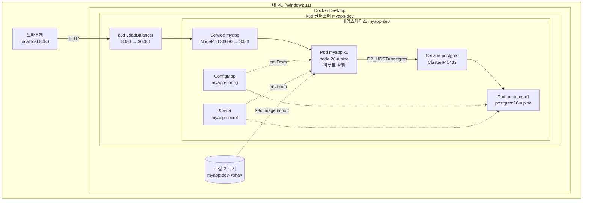
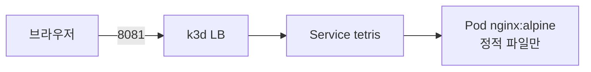

# dev 01. 아키텍처 설계서 — 로컬 k3d 개발 환경

> **이 환경이 답하는 질문**: «**내 코드가 도는가?**»
> **최우선 품질 속성**: **반복 속도** > 비용 > (가용성·보안은 최소)
> **연결**: 실행 스크립트 [`배포/dev/`](../../배포/dev/README.md) · 기능 정의 [공통 01](../공통/01_기능명세서.md)

---

## 1. 설계 목표와 비목표

| 목표 (이 환경이 책임지는 것) | 비목표 (여기서 검증하지 않는 것) |
| --- | --- |
| 코드 변경 → 배포 → 확인을 **수 분 안에** 반복 | 고가용성 · 무중단 배포 |
| **비용 0원** 으로 전 과정 수행 | 실 트래픽 성능 |
| Kubernetes 인터페이스(`kubectl`) 를 stg·prd 와 **동일하게** 사용 | 배포 방식(GitOps) 검증 → **stg** |
| 단위·통합·E2E 3단계를 모두 실행 | PaaS 연동·비밀 관리 → **prd** |

---

## 2. 배포 토폴로지

### 2-1. 구성 요소

| 구성 요소 | 선택 | 대안 대비 이유 |
| --- | --- | --- |
| 오케스트레이터 | **k3d** (Docker 안의 k3s) | Minikube 대비 **기동·삭제가 수 초** · AKS 와 동일한 `kubectl` 인터페이스 |
| 이미지 전달 | **`k3d image import`** | 레지스트리 왕복 없이 **로컬 이미지 직접 반입** — 빌드→배포 사이클 단축 |
| 외부 노출 | **NodePort + k3d 포트 매핑** | Ingress 컨트롤러 설치 없이 최단 경로. 인증서·도메인 불필요 |
| 데이터베이스 | **in-cluster PostgreSQL (Deployment)** | PaaS 비용 0 · **버려도 되는 데이터** |
| 비밀 관리 | `kubectl create secret` (환경 변수 원천) | dev 한정. Key Vault 는 prd 에서 |
| 복제본 | **1** | 가용성 검증은 이 환경의 목표가 아님 |

### 2-2. APP-B 테트리스 배치 (선택)

| 항목 | 값 | 근거 |
| --- | --- | --- |
| 런타임 | `nginx:alpine` | 정적 서빙 — 애플리케이션 서버 불필요 |
| 상태 | **없음** | 점수·보드는 클라이언트 메모리 |
| DB | **없음** | 서버 상태 없음(공통 05 참조) |
| 프로브 | `/healthz` (nginx `return 200`) | 공통 03 §6 |

---

## 3. 네트워크 경로

| 구간 | 프로토콜 | 주소 | 비고 |
| --- | --- | --- | --- |
| 브라우저 → k3d LB | HTTP | `localhost:8080` | 포트 충돌 시 `env.dev.json` 의 `hostPort` 변경 |
| k3d LB → Service | TCP | NodePort `30080` | k3d 가 자동 포워딩 |
| Service → Pod | TCP | `targetPort 8080` | `app=myapp` 셀렉터 |
| Pod → PostgreSQL | TCP | `postgres:5432` | **클러스터 내부 DNS** · TLS 없음(`DB_SSL=false`) |

> ⚠️ **TLS 를 쓰지 않는 이유** — 트래픽이 내 PC 밖으로 나가지 않습니다. 인증서 관리 비용이 학습 가치를 초과합니다. **stg·prd 에서는 반드시 적용**합니다.

---

## 4. 데이터 아키텍처

| 항목 | 값 |
| --- | --- |
| 저장소 | in-cluster PostgreSQL 16 |
| 영속성 | **없음** (`emptyDir` 상당 — Pod 재생성 시 초기화) |
| 스키마 | 앱 기동 시 `CREATE TABLE IF NOT EXISTS` (공통 05 §4) |
| 백업 | **없음** |
| 데이터 수명 | 클러스터 삭제 시 소멸 |

> 📌 **의도된 설계** — dev 데이터는 «언제든 버릴 수 있어야» 합니다. 영속성을 붙이면 «지우기 아까운 데이터»가 생기고, 그때부터 dev 가 운영처럼 무거워집니다.

---

## 5. 보안 경계

| 영역 | dev 수준 | 근거 |
| --- | --- | --- |
| 네트워크 노출 | **localhost 만** | 외부 유입 없음 |
| 컨테이너 실행 | **비루트** (`runAsNonRoot: true`) | NFR-04 — dev 에서도 유지(습관화) |
| 비밀 전달 | 환경 변수 → K8s Secret | **평문 하드코딩 금지**(NFR-03) |
| 실데이터 | **금지** — 가상 데이터만 | 실습 안전 수칙 |
| 이미지 스캔 | 미적용 | prd 에서 적용 |
| **관리 ID · 워크로드 ID** | **사용 불가** — 로컬은 Azure 밖 | 신원을 증명해 줄 플랫폼이 없음 |

> 🔎 **왜 dev 에서도 비루트를 유지하나** — 여기서 루트로 돌리면 prd 로 옮길 때 «갑자기 안 되는» 문제를 만납니다. **환경 간 차이는 최소화**하는 것이 원칙입니다.

> 🔑 **dev 에서 관리 ID 를 흉내 내지 않습니다.** 로컬은 Azure 밖이라 신원을 증명해 줄 플랫폼이 없습니다. 대신 **비밀번호를 환경 변수로만 받는 구조**를 유지해, prd 에서 토큰 인증으로 바뀔 때 **앱 코드가 그대로**이도록 합니다 — 인증 방식 선택은 [`authmode.js`](../../배포/common/app/src/lib/authmode.js) 가 **환경을 보고 스스로** 결정합니다([공통 07 §5](../공통/07_아이덴티티·시크릿_설계서.md)).

---

## 6. 리소스 사양

| 워크로드 | requests | limits | 근거 |
| --- | --- | --- | --- |
| `myapp` | cpu 50m · mem 64Mi | cpu 300m · mem 256Mi | 단일 요청 처리용 최소 |
| `postgres` | cpu 100m · mem 128Mi | cpu 500m · mem 512Mi | 소규모 데이터 |

> ⚠️ **requests 를 반드시 지정합니다.** 값이 없으면 stg·prd 로 갔을 때 **HPA·클러스터 오토스케일러가 판단 자체를 못 합니다**(9차시 심화). dev 에서부터 습관화합니다.

---

## 7. 아키텍처 결정 기록 (ADR)

| ID | 결정 | 대안 | 선택 이유 | 트레이드오프 |
| --- | --- | --- | --- | --- |
| **ADR-D-01** | k3d 사용 | Docker Compose | **stg·prd 와 동일한 `kubectl`·매니페스트** 사용 → 학습이 이어짐 | Compose 보다 초기 설정이 조금 복잡 |
| **ADR-D-02** | 레지스트리 없이 `image import` | 로컬 레지스트리 구동 | 구성 요소 하나를 줄여 **실패 지점 감소** | 이미지 이력이 남지 않음(dev 에선 불필요) |
| **ADR-D-03** | NodePort 노출 | Ingress 컨트롤러 | 설치·인증서 없이 **즉시 접속** | 경로 기반 라우팅 불가(dev 에선 불필요) |
| **ADR-D-04** | in-cluster DB | Azure PaaS DB | **비용 0 · 오프라인 가능** | HA·백업 검증 불가 → prd 에서 |
| **ADR-D-05** | 복제본 1 | 2 이상 | 자원 절약 · 로그 추적 단순 | 무중단 배포 검증 불가 → stg 에서 |

---

## 8. 제약과 알려진 한계

| 한계 | 영향 | 어디서 보완하나 |
| --- | --- | --- |
| 단일 복제본 | 롤링 업데이트 중 순단 발생 | stg (`maxUnavailable: 0`) |
| 데이터 비영속 | 재배포 시 데이터 초기화 | stg (PVC) · prd (PaaS 백업) |
| TLS 없음 | 암호화 경로 검증 불가 | prd (Ingress TLS · `DB_SSL=true`) |
| 비밀이 K8s Secret(base64) | 실제 비밀 관리 검증 불가 | prd (Key Vault + CSI) |
| 이미지 스캔 없음 | 취약점 검증 불가 | prd (Defender for Containers) |

---

## 9. 참조

| 문서 | 내용 |
| --- | --- |
| [공통 01 기능명세서](../공통/01_기능명세서.md) | FR · AC · 환경별 활성화 매트릭스 |
| [공통 05 데이터모델](../공통/05_데이터모델설계서.md) | ERD · 환경별 저장소 매핑 |
| [dev 02 프로세스설계서](02_프로세스설계서_dev.md) | 빌드·배포 시퀀스 |
| [dev 03 구성설계서](03_구성설계서_dev.md) | 설정 값·매니페스트 매핑 |
| [`배포/dev/README.md`](../../배포/dev/README.md) | 실행 절차 |
