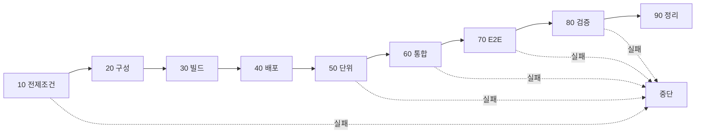
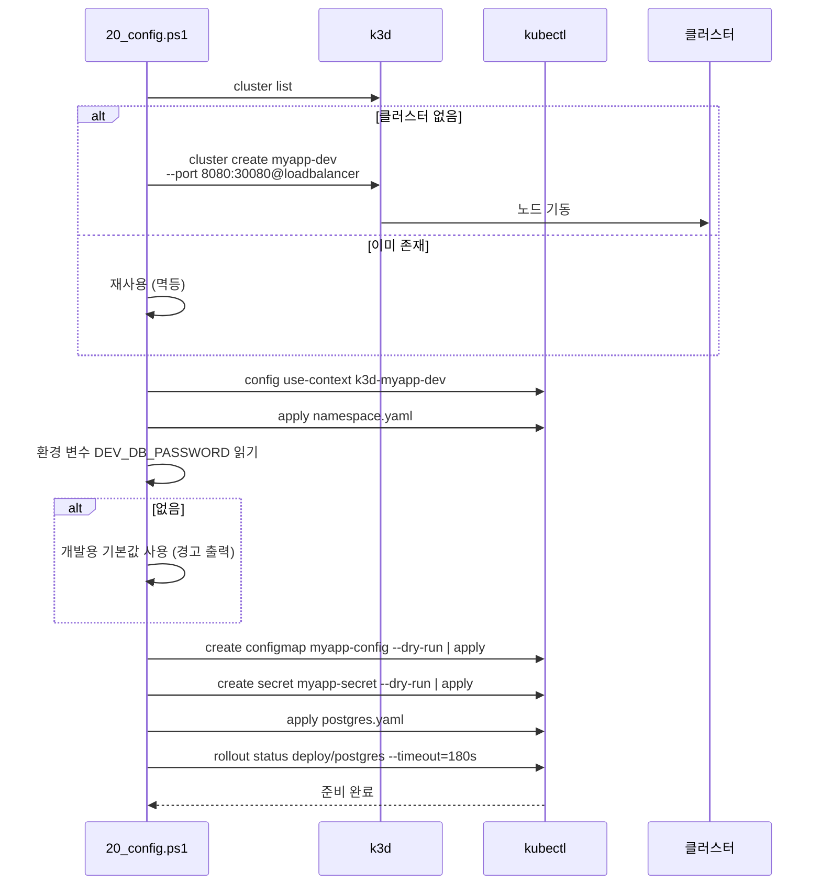
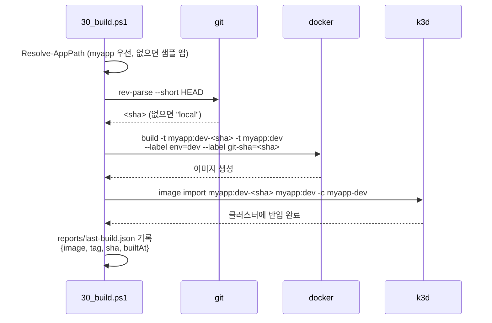
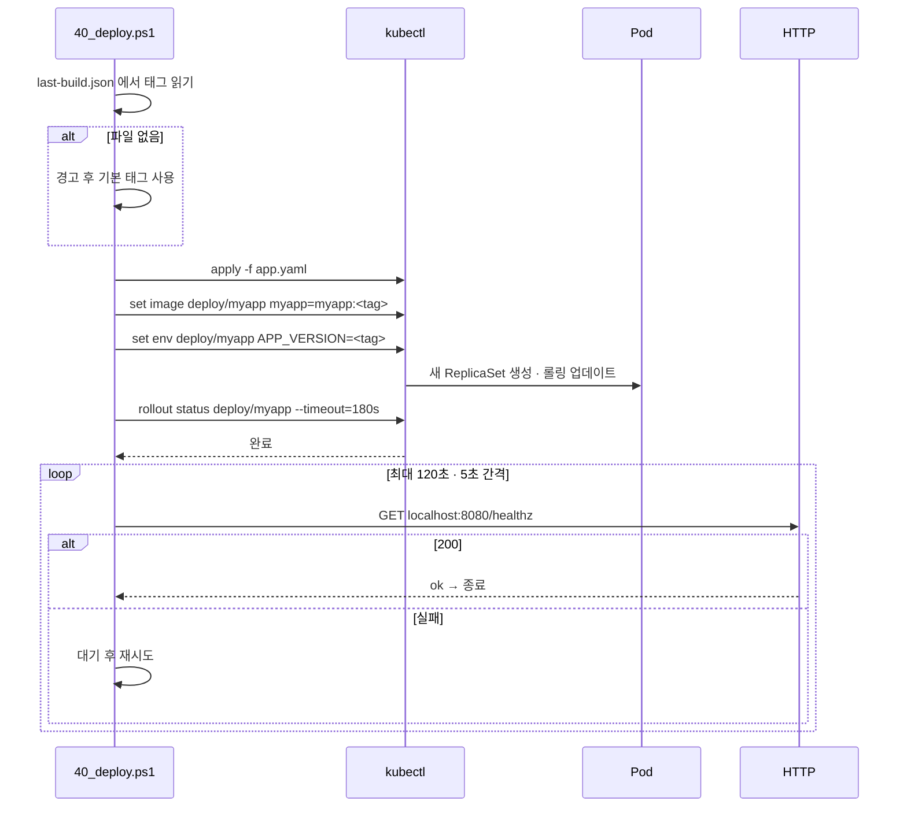
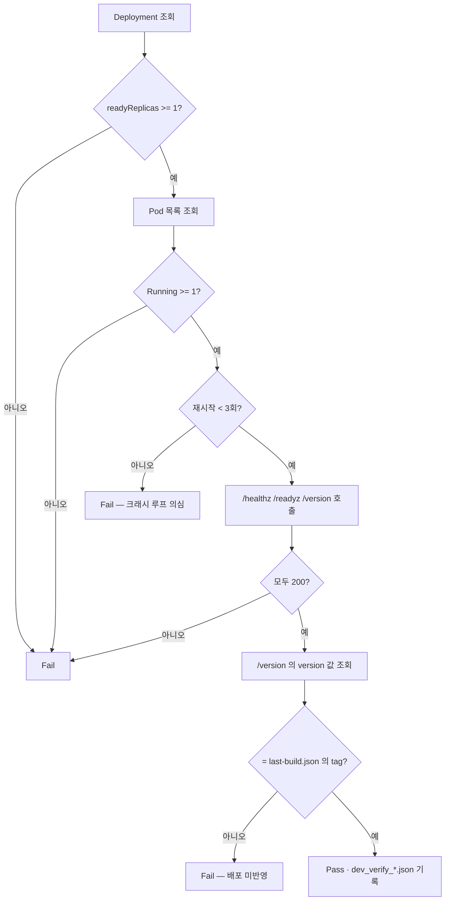

# dev 02. 프로세스 설계서 — 빌드 · 배포 · 검증 · 롤백

> **답하는 질문**: «어떤 순서로 무엇이 일어나는가»
> **대상 스크립트**: [`배포/dev/10_prereq ~ 90_cleanup`](../../배포/dev/README.md)

---

## 1. 전체 파이프라인

| 단계 | 입력 | 산출물 | 실패 시 |
| --- | --- | --- | --- |
| 10 전제조건 | – | `dev_prereq_*.json` | 중단 — 도구 설치 안내 |
| 20 구성 | `env.dev.json` | 클러스터 · CM/Secret · postgres | 중단 |
| 30 빌드 | 앱 소스 | 이미지 · `last-build.json` | 중단 |
| 40 배포 | `last-build.json` · 매니페스트 | 실행 중인 Deployment | 중단 |
| 50~70 테스트 | 배포된 앱 | `dev_unit/integration/e2e_*.json` · 캡처 | 중단(다음 미실행) |
| 80 검증 | 배포 상태 | `dev_verify_*.json` | 중단 — **stg 승격 불가** |
| 90 정리 | – | – | – |

---

## 2. 구성 프로세스 (20_config)

> 📌 **`--dry-run=client -o yaml | kubectl apply -f -` 패턴** — ConfigMap·Secret 을 **멱등하게** 갱신합니다. `create` 만 쓰면 두 번째 실행에서 «이미 존재» 오류가 납니다.

---

## 3. 빌드 프로세스 (30_build)

### 3-1. 태그 전략

| 태그 | 용도 | 특성 |
| --- | --- | --- |
| `myapp:dev-<sha>` | **배포에 사용** | 불변 · 추적 가능 |
| `myapp:dev` | 편의용 별칭 | 가변 |

> 🔎 **dev 에서도 SHA 태그를 쓰는 이유** — `80_verify` 가 «배포 버전 = 빌드 태그»를 검증합니다. 가변 태그만 쓰면 **배포가 안 됐는데 됐다고 착각**하는 상황을 잡을 수 없습니다.

---

## 4. 배포 프로세스 (40_deploy)

### 4-1. 롤링 업데이트 동작 (복제본 1)

| 시점 | 상태 | 사용자 영향 |
| --- | --- | --- |
| t0 | 구 Pod 1개 실행 | 정상 |
| t1 | 신 Pod 생성 · 준비 대기 | 정상(구 Pod 처리) |
| t2 | 신 Pod Ready → 구 Pod 종료 | **짧은 순단 가능** |
| t3 | 신 Pod 1개 | 정상 |

> ⚠️ **복제본이 1 이므로 완전 무중단이 아닙니다.** dev 에서는 허용하고, **stg 에서 `maxUnavailable: 0` + 복제본 2** 로 무중단을 검증합니다.

---

## 5. 검증 프로세스 (80_verify)

| 검증 항목 | 무엇을 잡아내나 |
| --- | --- |
| readyReplicas ≥ 1 | 스케줄 실패 · 이미지 오류 |
| Pod Running | 컨테이너 기동 실패 |
| **재시작 < 3회** | **크래시 루프**(설정 오류·의존성 누락) |
| 프로브 3종 200 | 앱 미준비 · DB 연결 실패 |
| **버전 일치** | **배포가 실제로 반영되지 않은 상태** |

---

## 6. 롤백 프로세스

> dev 는 전용 롤백 스크립트가 없습니다. 두 가지 경로를 사용합니다.

| 방법 | 명령 | 사용 상황 |
| --- | --- | --- |
| **리비전 롤백** | `kubectl rollout undo deploy/myapp -n myapp-dev` | 직전 배포가 문제일 때 |
| **재생성** | `90_cleanup` → `run_all` | 클러스터 상태가 꼬였을 때 (**dev 의 기본 해법**) |

> 📌 **dev 에서는 «고치기»보다 «다시 만들기»가 빠릅니다.** 클러스터 생성이 수 초이므로, 원인 분석에 10분 이상 쓸 상황이면 재생성이 합리적입니다. prd 에서는 반대입니다.

---

## 7. 실패 처리 매트릭스

| 단계 | 증상 | 원인 | 조치 |
| --- | --- | --- | --- |
| 20 구성 | `k3d cluster create` 실패 | Docker 엔진 미기동 | Docker Desktop 실행 |
| 20 구성 | 포트 바인딩 실패 | 8080 사용 중 | `env.dev.json` 의 `hostPort` 변경 |
| 30 빌드 | `docker build` 실패 | Dockerfile 오류 · 의존성 | 빌드 로그 확인 |
| 40 배포 | `ImagePullBackOff` | 이미지 미반입 | `30_build` 재실행 |
| 40 배포 | `CrashLoopBackOff` | 앱 기동 실패 | `kubectl logs -n myapp-dev -l app=myapp` |
| 60 통합 | `/readyz` 503 | postgres 미준비 | `kubectl get pods -n myapp-dev` 확인 |
| 70 E2E | 타임아웃 | 앱 미배포 · URL 불일치 | `BASE_URL` · 40 단계 확인 |
| 80 검증 | 버전 불일치 | `set image` 미반영 | 40 단계 재실행 |

---

## 8. 소요 시간 기준

| 단계 | 최초 실행 | 재실행 |
| --- | --- | --- |
| 10 전제조건 | 5초 | 5초 |
| 20 구성 | 60~90초 (클러스터 생성) | 10초 (재사용) |
| 30 빌드 | 60~120초 (이미지 레이어) | 15~30초 (캐시) |
| 40 배포 | 30~60초 | 20~40초 |
| 50 단위 | 5초 | 5초 |
| 60 통합 | 15초 | 10초 |
| 70 E2E | 90~150초 (브라우저 다운로드) | 30~45초 |
| 80 검증 | 15초 | 15초 |
| **합계** | **약 5~8분** | **약 2~3분** |
