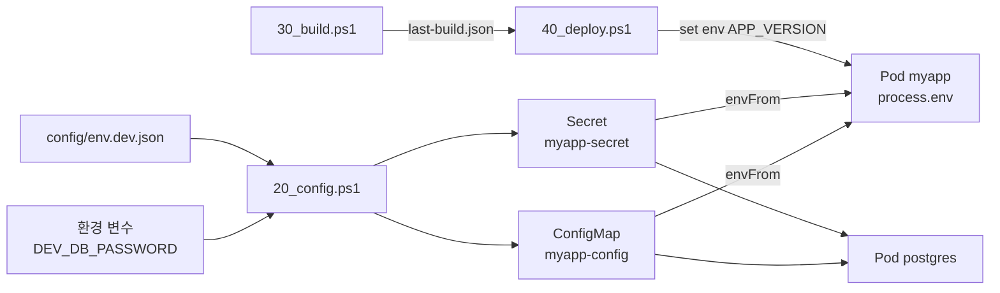
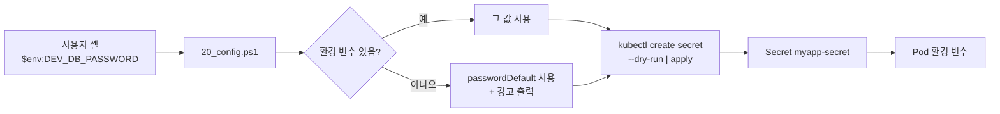

# dev 03. 구성 설계서 — 설정 · 매니페스트 · 비밀

> **답하는 질문**: «설정 값이 어디서 와서 어디로 들어가는가»
> **원칙(NFR-07)**: **이미지는 하나**, 환경 차이는 **주입**으로만 표현한다.

---

## 1. 설정 흐름 한눈에



| 원천 | 담는 것 | 담지 않는 것 |
| --- | --- | --- |
| `env.dev.json` | 클러스터·앱·DB·테스트의 **구조적 설정** | **비밀값** |
| 환경 변수 | **비밀값**(DB 비밀번호) | 구조적 설정 |
| `last-build.json` | 이번 배포의 이미지 태그 | – |

---

## 2. `config/env.dev.json` 키 명세

| 경로 | 타입 | 기본값 | 설명 | 변경 영향 |
| --- | --- | --- | --- | --- |
| `environment` | string | `dev` | 환경 식별자 | 리포트 파일명 |
| `cluster.name` | string | `myapp-dev` | k3d 클러스터 이름 | 컨텍스트·정리 대상 |
| `cluster.agents` | number | `1` | 워커 노드 수 | 자원 사용량 |
| `cluster.hostPort` | number | `8080` | **호스트 접속 포트** | **충돌 시 반드시 변경** |
| `cluster.nodePort` | number | `30080` | 클러스터 내 NodePort | `app.yaml` 과 일치해야 함 |
| `cluster.k3sImage` | string | `rancher/k3s:v1.30.2-k3s1` | k3s 버전 고정 | 재현성 |
| `app.name` | string | `myapp` | Deployment·Service 이름 | 매니페스트와 일치 |
| `app.namespace` | string | `myapp-dev` | 네임스페이스 | 매니페스트와 일치 |
| `app.image` | string | `myapp` | 이미지 리포지토리 | 빌드·배포 |
| `app.tag` | string | `dev` | 기본 태그 접두어 | `dev-<sha>` 생성 |
| `app.replicas` | number | `1` | 복제본 | 가용성(dev 는 1) |
| `app.containerPort` | number | `8080` | 컨테이너 수신 포트 | 프로브·Service |
| `db.mode` | string | `in-cluster` | DB 배치 방식 | 아키텍처 |
| `db.name` / `db.user` | string | `appdb` / `appuser` | DB 이름·계정 | ConfigMap |
| `db.passwordEnvVar` | string | `DEV_DB_PASSWORD` | **비밀번호를 읽어올 환경 변수 이름** | 보안 |
| `db.passwordDefault` | string | `devlocal-change-me` | 환경 변수 없을 때 기본값 | **dev 전용** |
| `test.baseUrl` | string | `http://localhost:8080` | 테스트 대상 | `hostPort` 와 일치 |
| `test.allowWrite` | boolean | `true` | 쓰기 TC 실행 | dev 는 허용 |

> ⚠️ **`hostPort` 를 바꾸면 `test.baseUrl` 도 함께 바꿔야 합니다.** 두 값이 어긋나면 배포는 되지만 통합·E2E 가 전부 실패합니다.

---

## 3. ConfigMap · Secret 매핑

### 3-1. `myapp-config` (ConfigMap — 비밀 아님)

| 키 | 값 | 소비자 | 근거 |
| --- | --- | --- | --- |
| `APP_ENV` | `dev` | 앱 (`/version`·화면 라벨) | FR-A-08·12 |
| `PORT` | `8080` | 앱 (수신 포트) | – |
| `DB_HOST` | `postgres` | 앱 (클러스터 DNS) | 아키텍처 §3 |
| `DB_PORT` | `5432` | 앱 | – |
| `DB_NAME` | `appdb` | 앱 · postgres 초기화 | 공통 05 |
| `DB_USER` | `appuser` | 앱 · postgres 초기화 | 공통 05 |
| `DB_SSL` | `false` | 앱 | dev 는 내부 통신 |

### 3-2. `myapp-secret` (Secret — 비밀)

| 키 | 원천 | 소비자 | 비고 |
| --- | --- | --- | --- |
| `DB_PASSWORD` | 환경 변수 `DEV_DB_PASSWORD` → 없으면 `passwordDefault` | 앱 · postgres | **Git 에 커밋하지 않음** |

### 3-3. 런타임 주입 (배포 시점)

| 변수 | 원천 | 주입 방법 |
| --- | --- | --- |
| `APP_VERSION` | `last-build.json` 의 `tag` | `kubectl set env deploy/myapp` |

---

## 4. 매니페스트 구조

```
배포/dev/config/k8s/
├── namespace.yaml     Namespace myapp-dev (라벨: env=dev)
├── postgres.yaml      Service(ClusterIP) + Deployment(postgres:16-alpine)
└── app.yaml           Deployment(myapp) + Service(NodePort 30080)
```

### 4-1. `app.yaml` 핵심 설정

| 항목 | 값 | 근거 |
| --- | --- | --- |
| `replicas` | 1 | ADR-D-05 |
| `imagePullPolicy` | `IfNotPresent` | **k3d 로 반입한 로컬 이미지를 쓰기 위해 필수** |
| `securityContext.runAsNonRoot` | `true` | NFR-04 |
| `envFrom` | ConfigMap + Secret | 설정 주입(NFR-07) |
| `resources.requests` | cpu 50m · mem 64Mi | 오토스케일 판단 기준(습관화) |
| `livenessProbe` | `/healthz` · 10s 후 · 15s 간격 | 공통 03 §3-1 |
| `readinessProbe` | `/readyz` · 5s 후 · 5s 간격 | 공통 03 §3-2 |
| Service type | `NodePort 30080` | ADR-D-03 |

> ⚠️ **`imagePullPolicy: Always` 로 두면 dev 가 깨집니다.** k3d 에 반입한 이미지는 외부 레지스트리에 없으므로 `ImagePullBackOff` 가 납니다.

### 4-2. `postgres.yaml` 핵심 설정

| 항목 | 값 | 근거 |
| --- | --- | --- |
| 워크로드 | **Deployment** (StatefulSet 아님) | 영속성 불필요(ADR-D-04) |
| 환경 변수 | `POSTGRES_DB/USER` ← ConfigMap, `POSTGRES_PASSWORD` ← Secret | 앱과 **동일 원천** 사용 |
| `readinessProbe` | `pg_isready -U appuser` | 앱의 `/readyz` 가 이것에 의존 |

---

## 5. 비밀 관리 설계



| 규칙 | dev 적용 | 근거 |
| --- | --- | --- |
| 비밀값을 **Git 에 커밋하지 않음** | ✅ | NFR-03 |
| 비밀값을 **화면에 출력하지 않음** | ✅ (기본값 사용 시 경고만) | NFR-03 |
| Secret 은 **base64 인코딩**일 뿐 암호화 아님 | ⚠️ 인지 필요 | prd 는 Key Vault |
| 기본값 존재 | ✅ **dev 전용** — 학습 진입 장벽 제거 | stg·prd 는 기본값 없음 |

> 🔎 **dev 에만 기본값이 있는 이유** — 첫 실행에서 «환경 변수부터 설정하라»는 벽에 막히면 학습이 끊깁니다. 대신 **경고를 출력**하고, stg·prd 에서는 기본값을 제거해 습관이 넘어가지 않게 합니다.

---

## 6. 설정 변경 시 영향 범위

| 변경 | 함께 바꿔야 할 것 |
| --- | --- |
| `cluster.hostPort` | `test.baseUrl` · (문서의 접속 URL) |
| `cluster.nodePort` | `app.yaml` 의 `Service.nodePort` |
| `app.namespace` | `namespace.yaml` · `postgres.yaml` · `app.yaml` 의 모든 `namespace` |
| `app.containerPort` | `app.yaml` 의 `containerPort` · 프로브 포트 · Service `targetPort` |
| `db.name` / `db.user` | ConfigMap(자동) · postgres 초기화(자동) — **기존 DB 가 있으면 재생성 필요** |
| `db.passwordEnvVar` | 사용자가 설정하는 환경 변수 이름 |

---

## 7. 구성 검증 체크리스트

| 확인 | 방법 | 기대 |
| --- | --- | --- |
| ConfigMap 반영 | `kubectl get cm myapp-config -n myapp-dev -o yaml` | 7개 키 존재 |
| Secret 반영 | `kubectl get secret myapp-secret -n myapp-dev -o jsonpath='{.data}'` | `DB_PASSWORD` 키 존재 |
| 환경 변수 주입 | `kubectl exec deploy/myapp -n myapp-dev -- env \| findstr DB_` | `DB_HOST=postgres` 등 |
| `APP_VERSION` 주입 | `curl localhost:8080/version` | 빌드 태그와 일치 |
| 포트 일관성 | `env.dev.json` ↔ `app.yaml` 대조 | `nodePort` 일치 |
