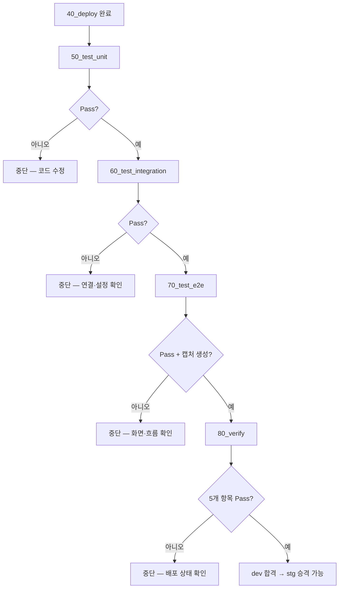

# dev 04. 테스트 설계서 — 실행 범위 · 절차 · 판정

> **답하는 질문**: «이 환경에서 무엇을 실행하고 무엇으로 합격을 판정하는가»
> **TC 정의**: [공통 06 테스트설계서](../공통/06_테스트설계서.md) — 여기서는 **범위와 판정**만 다룹니다.

---

## 1. dev 테스트의 위치

| 이 환경에서 검증하는 것 | 검증하지 않는 것 |
| --- | --- |
| **기능이 의도대로 동작하는가** (모든 AC) | 배포 방식의 정확성 → stg |
| 코드 회귀(regression) | 가용성·무중단 → stg |
| 화면·API·DB 3계층 연결 | PaaS 연동·비밀 관리 → prd |

> 📌 **dev 는 «기능 합격»의 1차 관문**입니다. 여기서 통과하지 못한 것은 stg 로 가지 않습니다.

---

## 2. 실행 범위

| TC 그룹 | 실행 | 근거 |
| --- | :---: | --- |
| 단위 U-A-01~06 | ✅ 전체 | DB 불필요 · 항상 실행 |
| 단위 U-B-01~10 | ✅ 전체 | 테트리스 엔진(심화 트랙 수행 시) |
| 통합 I-A-01~08 | ✅ 전체 | `ALLOW_WRITE=true` |
| 통합 I-A-09 (비밀 주입) | ⚠️ 축약 | K8s Secret 존재만 확인(Key Vault 는 prd) |
| E2E E-A-01~04 | ✅ 전체 | 쓰기 포함 |
| E2E E-B-01~04 | ✅ 전체 | 심화 트랙 수행 시 |

**환경 변수**

| 변수 | 값 |
| --- | --- |
| `BASE_URL` | `http://localhost:8080` (`env.dev.json` 의 `test.baseUrl`) |
| `APP_ENV` | `dev` |
| `ALLOW_WRITE` | `true` |

---

## 3. 실행 절차



### 3-1. 단위 (50_test_unit)

| 항목 | 내용 |
| --- | --- |
| 전제 | 없음 — **배포되지 않아도 실행 가능** |
| 명령 | `npm run test:unit` (`node --test "test/unit/**/*.test.js"`) |
| 판정 | 종료 코드 0 |
| 소요 | < 5초 |

### 3-2. 통합 (60_test_integration)

| 항목 | 내용 |
| --- | --- |
| 전제 | `40_deploy` 완료 · `/healthz` 200 (스크립트가 사전 확인) |
| 명령 | `npm run test:integration` (`BASE_URL` 주입) |
| 판정 | 종료 코드 0 |
| 소요 | 10~15초 |

> ⚠️ 스크립트는 실행 전에 `/healthz` 를 먼저 확인합니다. **앱이 없으면 «테스트 실패»가 아니라 «전제 미충족»으로 안내**합니다 — 원인을 혼동하지 않기 위함입니다.

### 3-3. E2E (70_test_e2e)

| 항목 | 내용 |
| --- | --- |
| 전제 | `40_deploy` 완료 · Playwright 브라우저(최초 1회 다운로드) |
| 명령 | `npx playwright test --project=chromium` |
| 판정 | 종료 코드 0 **AND 캡처 파일 ≥ 1개** |
| 캡처 | `<앱>/test/e2e/캡처/dev_01~04_*.png` |
| 소요 | 최초 90~150초 · 이후 30~45초 |

---

## 4. 판정 기준 (80_verify)

| # | 검증 항목 | 통과 기준 | 실패 시 원인 |
| --- | --- | --- | --- |
| 1 | Deployment readyReplicas | ≥ 1 | 스케줄·이미지 오류 |
| 2 | Pod Running | ≥ 1 | 기동 실패 |
| 3 | 컨테이너 재시작 | < 3회 | **크래시 루프** |
| 4 | `/healthz` `/readyz` `/version` | 모두 200 | 앱·DB 미준비 |
| 5 | **배포 버전 = 빌드 태그** | 일치 | **배포 미반영** |

> **5번이 dev 검증의 핵심**입니다. 1~4번이 통과해도 «이전 버전이 계속 돌고 있는» 상태를 잡아내는 것은 5번뿐입니다.

---

## 5. 리포트 산출물

| 파일 | 내용 | 다음 단계에서의 쓰임 |
| --- | --- | --- |
| `배포/dev/reports/dev_prereq_*.json` | 전제조건 점검 | – |
| `배포/dev/reports/last-build.json` | 이미지·태그·SHA | 40 배포 · 80 검증 |
| `배포/dev/reports/dev_unit_*.json` | 단위 결과 | 승격 판단 |
| `배포/dev/reports/dev_integration_*.json` | 통합 결과 | 승격 판단 |
| `배포/dev/reports/dev_e2e_*.json` | E2E 결과 + 캡처 수 | 승격 판단 |
| **`배포/dev/reports/dev_verify_*.json`** | **검증 결과 — `fail=0` 이 stg 승격 조건** | **게이트** |
| `배포/dev/reports/dev_pipeline_*.json` | 전체 요약 | 회고 |

**리포트 스키마**

```json
{
  "environment": "dev",
  "kind": "verify",
  "timestamp": "2026-03-09T02:10:00",
  "total": 5, "pass": 5, "fail": 0,
  "results": [ { "Name": "...", "Status": "Pass", "Detail": "..." } ]
}
```

---

## 6. 결함 진단 가이드

| 실패 TC | 가장 흔한 원인 | 첫 확인 명령 |
| --- | --- | --- |
| U-A-* | 순수 로직 회귀 | 실패 메시지의 기대값/실제값 대조 |
| I-A-01 `/healthz` | 앱 미기동 | `kubectl get pods -n myapp-dev` |
| I-A-02 `/readyz` 503 | postgres 미준비 · 비밀 불일치 | `kubectl logs -n myapp-dev -l app=myapp` |
| I-A-05 저장 왕복 | DB 쓰기 권한·스키마 | `kubectl exec deploy/postgres -n myapp-dev -- psql -U appuser -d appdb -c '\dt'` |
| I-A-08 버전 불일치 | `set env` 미반영 | `kubectl describe deploy myapp -n myapp-dev` |
| E-A-01 타임아웃 | 포트 매핑 오류 | `curl localhost:8080/healthz` |
| E-A-03 요소 없음 | `data-testid` 변경 | 화면 HTML 확인 |
| 80 #3 재시작 | 설정 오류로 반복 기동 실패 | `kubectl logs --previous` |

---

## 7. dev → stg 승격 게이트

| 조건 | 확인 위치 |
| --- | --- |
| 단위 전체 Pass | `dev_unit_*.json` 의 `fail=0` |
| 통합 전체 Pass | `dev_integration_*.json` 의 `fail=0` |
| E2E 전체 Pass + 캡처 생성 | `dev_e2e_*.json` 의 `fail=0` |
| **검증 5개 항목 Pass** | **`dev_verify_*.json` 의 `fail=0`** |
| 개인정보 미포함 | 캡처 육안 확인 |

> ✅ 위가 모두 충족되면 **stg 로 승격**합니다. stg 에서는 «기능»이 아니라 **«배포 방식»**을 검증합니다.
