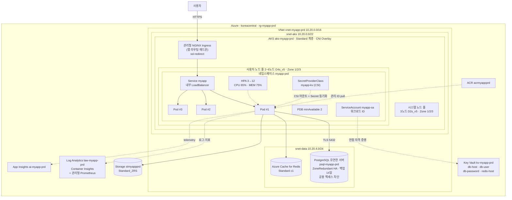
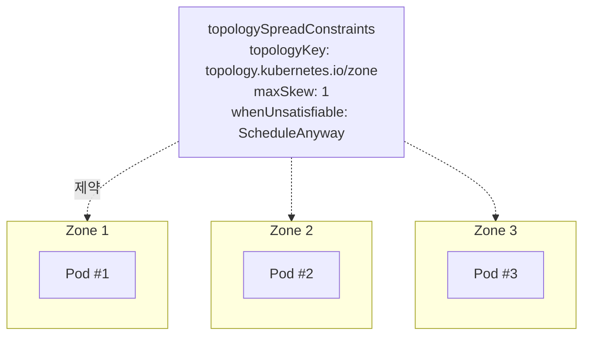
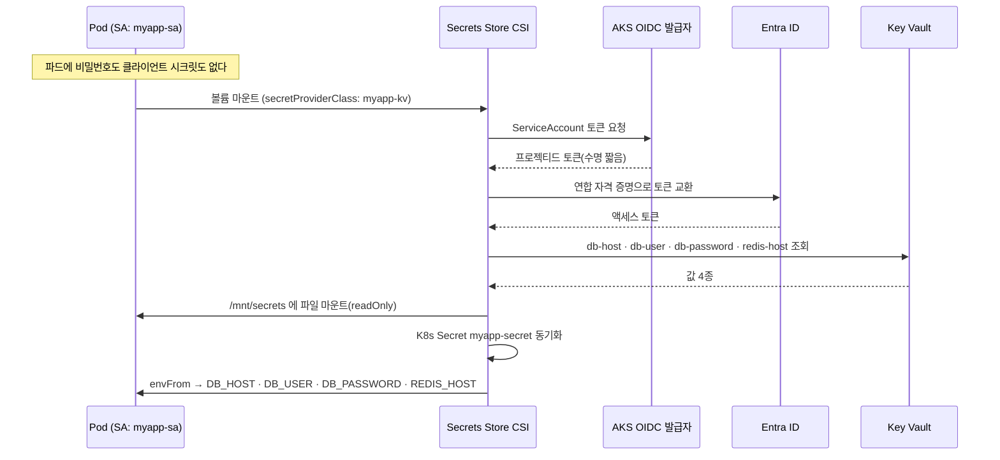
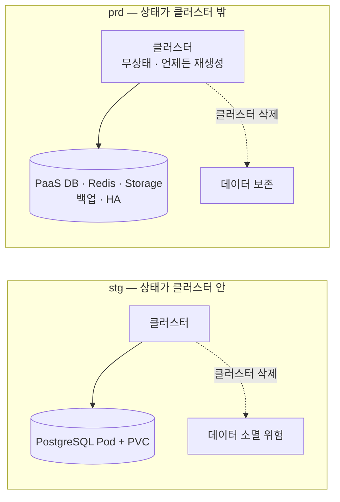
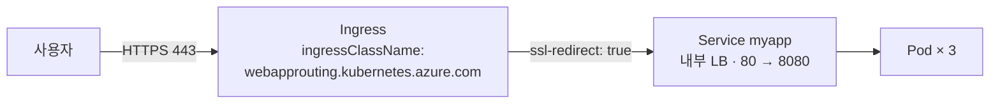
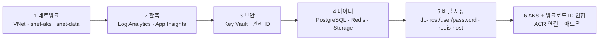

# prd 01. 아키텍처 설계서 — AKS + PaaS 운영 환경

> **이 환경이 답하는 질문**: «**장애가 나도 살아남는가?**»
> **최우선 품질 속성**: **가용성 · 보안 · 관측성 · 복구** > 성능 > 비용 > 반복 속도
> **정본**: 이 문서의 모든 값은 [`배포/prd/config/env.prd.json`](../../배포/prd/config/env.prd.json) 및 `config/k8s/base/*.yaml` 과 일치합니다.

---

## 1. 설계 목표와 비목표

| 목표 | 비목표 |
| --- | --- |
| **영역(Zone) 단위 장애를 견딘다** | 기능 검증 (dev 완료) |
| **비밀이 Git·이미지·앱 설정 어디에도 평문으로 없다** | 배포 방식 검증 (stg 완료) |
| **상태(데이터)를 클러스터 밖 PaaS 로 분리한다** | 다중 리전 재해 복구(DR) — 별도 설계 영역 |
| **장애를 발견하고(관측) 되돌릴 수 있다(롤백)** | 대규모 부하 성능 튜닝 |

> 🔑 **prd 설계의 한 문장** — «**상태는 밖으로, 비밀은 금고로, 부하는 여러 영역으로, 진입은 한 곳으로.**»

---

## 2. 배포 토폴로지



---

## 3. 환경 간 비교 (한 장 요약)

| 축 | dev | stg | **prd** | prd 선택 근거 |
| --- | --- | --- | --- | --- |
| 클러스터 | k3d 1노드 | AKS **Free** 2노드 | **AKS Standard · 시스템3 + 사용자2~6** | 제어 평면 SLA · 노드 풀 역할 분리 |
| 영역 | – | 미분산 | **Zone 1/2/3** | 영역 장애 격리 |
| 네트워크 | Docker 브리지 | 기본 VNet | **전용 VNet + 서브넷 분리**(앱/데이터) | 데이터 계층을 앱과 분리 |
| 복제본 | 1 | 2 | **3 + HPA 3~12** | 영역당 1개 + 부하 대응 |
| 중단 예산 | 없음 | minAvailable 1 | **minAvailable 2** | 노드 순환 중에도 2개 유지 |
| 배치 제약 | 없음 | 없음 | **topologySpreadConstraints(zone)** | 한 영역 편중 방지 |
| DB | in-cluster | in-cluster(PVC) | **PostgreSQL 유연한 서버 · ZoneRedundant · 백업 14일 · 공용 액세스 차단** | 백업·PITR·HA·패치 위임 |
| 캐시 | 없음 | 없음 | **Azure Cache for Redis (Standard c1)** | 세션 외부화 → 파드 자유 확장 |
| 객체 저장 | 없음 | 없음 | **Storage (ZRS)** | 첨부·리포트 보관 |
| 비밀 | K8s Secret(기본값 O) | K8s Secret(기본값 X) | **Key Vault + CSI + 워크로드 ID** | 비밀 값이 Git·이미지에 없음 |
| 레지스트리 | 없음 | ACR | **ACR + 불변 태그 강제** | 추적성·롤백 대상 특정 |
| 배포 | `kubectl apply` | Argo CD **자동**(selfHeal) | **Argo CD 수동 Sync** | 사람이 반영 시점을 결정 |
| 진입 | NodePort | 공용 LB | **관리형 NGINX Ingress + 내부 LB** | 앱은 내부에만, 진입은 한 곳으로 |
| 컨테이너 보안 | 비루트 | 비루트 | **비루트 + 읽기 전용 루트FS + cap drop ALL + seccomp** | 최소 권한 |
| 관측 | 로그 조회 | 로그 조회 | **Container Insights + 관리형 Prometheus + App Insights** | 장애 발견·원인 추적 |
| 쓰기 테스트 | 허용 | 허용 | **금지 (`allowWrite=false`)** | 운영 데이터 오염 방지 |
| 롤백 | 재생성 | Git revert | **`rollback.ps1`** + 리비전 이력 ≥ 2 | 사전 검증된 복귀 경로 |

---

## 4. 가용성 설계

### 4-1. 장애 시나리오별 대응

| 장애 | 영향 | 설계상 대응 | 복구 |
| --- | --- | --- | --- |
| **파드 1개 크래시** | 없음 | 복제본 3 · readinessProbe(5s) | kubelet 자동 재시작 |
| **노드 1대 장애** | 없음 | 영역 분산 · PDB minAvailable 2 | 다른 노드로 재스케줄 |
| **영역 1개 장애** | 용량 감소 | topologySpreadConstraints · **DB ZoneRedundant** | HPA 가 남은 영역에서 확장(최대 12) |
| **DB 기본 노드 장애** | 수십 초 순단 | PostgreSQL **대기 노드 자동 페일오버** | 자동 |
| **DB 논리적 손상**(잘못된 UPDATE 등) | 데이터 오류 | **백업 14일 · PITR** | 시점 복원 → `DB_HOST` 전환 |
| **잘못된 배포** | 기능 오류 | `maxUnavailable: 0` · 리비전 이력 5개 | **`rollback.ps1`** |
| **부하 급증** | 응답 지연 | **HPA 3→12** · 노드 오토스케일 2→6 | 자동 (축소는 300초 안정화) |

### 4-2. 배치 제약



> 📌 **`whenUnsatisfiable: ScheduleAnyway` 를 쓰는 이유** — `DoNotSchedule` 이면 한 영역이 자원 부족일 때 **파드가 아예 뜨지 않습니다**. 운영에서는 «완벽한 분산»보다 «일단 떠 있는 것»이 우선입니다. 대신 `80_verify` 가 **실제 영역 분산 수(≥2)를 사후 검증**합니다.

### 4-3. 자동 확장 2계층

| 계층 | 범위 | 트리거 | 축소 보호 |
| --- | --- | --- | --- |
| **파드**(HPA) | 3 → 12 | CPU 65% · MEM 75% | `stabilizationWindowSeconds: 300` |
| **노드**(클러스터 오토스케일러) | 사용자 풀 2 → 6 | 스케줄 불가 파드 발생 | 기본 정책 |

> ⚠️ **HPA 가 늘려도 노드가 없으면 파드는 Pending 입니다.** 두 계층이 함께 있어야 실제 확장이 완성됩니다. 그래서 파드 `requests`(cpu 200m·mem 256Mi)를 반드시 지정합니다 — 이것이 두 오토스케일러의 **공통 판단 근거**입니다.

---

## 5. 보안 설계

### 5-1. 비밀 관리 — 워크로드 ID + Key Vault CSI



| 특징 | 의미 |
| --- | --- |
| 파드에 **자격 증명이 없음** | 유출 대상 자체가 존재하지 않음 |
| **DB 호스트·계정까지 Key Vault 에** | ConfigMap 에는 접속 대상조차 남지 않음 |
| 토큰이 **짧고 자동 갱신** | 탈취되어도 유효 기간 제한 |
| Key Vault 감사 로그 | 누가 언제 조회했는지 추적 |

### 5-1-1. 데이터 계층까지 «비밀 없이» — 적용 범위

| 리소스 | 이전 | **적용 후** | 부여 역할 |
| --- | --- | --- | --- |
| **ACR** | (이미 MI) | AKS kubelet 관리 ID + 앱 MI 에 pull 전용 | `AcrPull` |
| **Key Vault** | 워크로드 ID + CSI | 동일 | `Key Vault Secrets User`(읽기 전용) |
| **Storage** | 공유 키 비활성만 | **+ 데이터 평면 역할 부여** | `Storage Blob Data Contributor` |
| **PostgreSQL** | 관리자 **비밀번호** | **Entra ID 인증 + 관리 ID 를 Entra DB 관리자로 등록** → 앱이 **토큰**으로 접속 | Entra DB 관리자 |
| **Redis** | 액세스 키 | **Entra 액세스 정책 할당** | `Data Contributor` |

> 🔑 **가장 큰 변화는 PostgreSQL 입니다.** 지금까지 «비밀번호를 Key Vault 에 잘 보관하는» 문제였다면, 이제 **비밀번호 자체가 필요 없는** 구조가 됩니다. 회전·감사·만료 관리 부담이 사라집니다.
>
> ⚠️ **암호 인증은 당장 끄지 않습니다.** `identity.postgresPasswordAuth` 기본값은 `Enabled` 로, Entra 인증을 **함께** 켜 둔 상태입니다. 앱이 토큰 인증으로 전환된 것을 확인한 뒤 `Disabled` 로 바꾸면 — `20_config.ps1` 이 **Key Vault 의 `db-password` 도 함께 삭제**합니다.
>
> 📐 자격 증명 유형 분류·선택 규칙·금지 목록은 [공통 07 아이덴티티·시크릿 설계서](../공통/07_아이덴티티·시크릿_설계서.md)에 한 번만 정의되어 있습니다.

### 5-2. 보안 통제 목록

| 계층 | 통제 | 구현 | 검증 |
| --- | --- | --- | :---: |
| 이미지 | **불변 태그**(`latest` 금지) | `prd-<sha>` | ✅ P-06 |
| 런타임 | 비루트 | `runAsNonRoot: true` | ✅ P-07 |
| 런타임 | **읽기 전용 루트FS** | `readOnlyRootFilesystem: true` + `/tmp` emptyDir | ✅ P-07 |
| 런타임 | Capability 전부 제거 | `capabilities.drop: [ALL]` | – |
| 런타임 | 권한 상승 금지 | `allowPrivilegeEscalation: false` | – |
| 런타임 | seccomp | `seccompProfile: RuntimeDefault` | – |
| 신원 | 워크로드 ID | SA 주석 + 연합 자격 증명 | ✅ P-05 |
| 네트워크 | **앱을 인터넷에 직접 두지 않음** | **내부 LB** + Ingress | – |
| 네트워크 | **DB 공용 액세스 차단** | `publicNetworkAccess=Disabled` · snet-data | ✅ P-08 |
| 데이터 | 전송 암호화 | `DB_SSL=true` | – |
| 데이터 | HA · 백업 | ZoneRedundant · 14일 | ✅ P-09·P-10 |
| 신원 | **워크로드 ID 토큰 주입** | 웹훅이 파드에 환경 변수·토큰 파일 주입 | ✅ P-21 |
| 신원 | **PostgreSQL Entra 인증** | `activeDirectoryAuth = Enabled` | ✅ P-22 |
| 신원 | **최소 권한** | 구독 범위 역할 할당 0건 | ✅ P-23 |

> 🚫 **절대 금지 6가지** — ① `latest` 등 가변 태그 배포 ② 비밀 값을 Git·이미지·ConfigMap 에 기록 ③ DB 공용 액세스 허용 ④ prd 에서 쓰기 스모크 실행 ⑤ **서비스 주체 클라이언트 시크릿 생성** ⑥ **구독 범위 역할 부여**.

### 5-3. 앱 설정 vs 비밀 — 무엇이 어디에 있나

| 값 | 위치 | 이유 |
| --- | --- | --- |
| `APP_ENV` `PORT` `DB_PORT` `DB_NAME` `DB_SSL` `DB_POOL_MAX` | **ConfigMap**(Git) | 비밀 아님 · 변경 이력이 남아야 함 |
| `DB_HOST` `DB_USER` `DB_PASSWORD` `REDIS_HOST` | **Key Vault → CSI → Secret** | 접속 대상·자격 증명 |

> 🔎 **`DB_HOST` 까지 Key Vault 에 두는 이유** — 서버 이름이 새면 공격 대상이 특정됩니다. 또한 **PITR 복원 후 새 서버로 전환**할 때 Key Vault 값만 바꾸고 파드를 재시작하면 되므로, Git 커밋 없이 전환이 가능합니다.

---

## 6. 데이터 아키텍처

| 역할 | 서비스 | 사양 | 왜 관리형으로 넘겼나 |
| --- | --- | --- | --- |
| 관계형 DB | **PostgreSQL 유연한 서버** `psql-myapp-prd` | GeneralPurpose `Standard_D2ds_v4` · 128GB · v16 · **ZoneRedundant** · **백업 14일** · **공용 액세스 차단** | 백업·HA·패치를 직접 지지 않고, **PITR 로 논리적 손상까지 복구** |
| 캐시·세션 | **Azure Cache for Redis** `redis-myapp-prd` | Standard `c1` | 세션을 외부화해야 파드를 자유롭게 늘리고 줄일 수 있음 |
| 객체 저장 | **Storage** `stmyappprd*` | `Standard_ZRS` | 첨부·리포트 보관 · 영역 중복 |
| 비밀 | **Key Vault** `kv-myapp-prd*` | 표준 | 값이 Git·이미지 어디에도 없음 |

> ⚠️ **`Burstable` 계층은 prd 에 부적합합니다.** 크레딧 소진 시 성능이 급락하고 **ZoneRedundant HA 를 지원하지 않습니다.**

### 6-1. 상태 분리의 의미



> 🔑 **«클러스터를 지워도 데이터가 남는다»** — 클러스터가 **교체 가능한 자원**이 되는 것이 prd 아키텍처의 가장 큰 변화입니다.

---

## 7. 진입 경로



| 구간 | 설정 | 근거 |
| --- | --- | --- |
| 사용자 → Ingress | 관리형 NGINX(앱 라우팅 애드온) | 컨트롤러를 직접 운영하지 않음 |
| Ingress → Service | `azure-load-balancer-internal: "true"` | **앱은 내부에만 노출** |
| Service → Pod | 80 → 8080 | 컨테이너 포트 |

> 📌 **내부 LB + Ingress 조합의 의미** — Service 를 공용 LB 로 두면 Ingress 를 우회하는 경로가 생깁니다. 내부 LB 로 두면 **모든 외부 트래픽이 Ingress 한 곳을 지나므로**, TLS·라우팅·로깅을 한 지점에서 통제할 수 있습니다.

---

## 8. 관측성 설계

| 신호 | 수집 | 대표 질문 |
| --- | --- | --- |
| **로그** | Container Insights → `law-myapp-prd` | «5분 전 오류 메시지가 무엇인가» |
| **컨테이너 지표** | Container Insights | «CPU 가 언제부터 올랐나» |
| **Prometheus 지표** | **관리형 Prometheus** | «커스텀 지표가 임계를 넘었나» |
| **앱 추적** | `ai-myapp-prd` (App Insights) | «느린 곳이 앱인가 DB인가» |
| **K8s 이벤트** | `kubectl get events` · Log Analytics | «왜 파드가 재시작됐나» |

```kusto
// 최근 30분 컨테이너 오류 로그
ContainerLogV2
| where TimeGenerated > ago(30m)
| where PodNamespace == "myapp-prd"
| where LogMessage has_any ("error", "ERROR", "FATAL")
| project TimeGenerated, PodName, LogMessage
| order by TimeGenerated desc
```

---

## 9. 인프라 생성 순서 — «참조당하는 것부터»



| 선행 | 후행 | 이유 |
| --- | --- | --- |
| VNet·서브넷 | AKS · DB | 서브넷 위임이 먼저 있어야 함 |
| Log Analytics | AKS(모니터링 애드온) | 작업 영역 ID 를 참조 |
| Key Vault · 관리 ID | 역할 할당 | 대상 주체가 있어야 부여 가능 |
| 데이터 리소스 | Key Vault 비밀 저장 | **호스트 이름이 생성 후에야 정해짐** |
| AKS OIDC 발급자 | 연합 자격 증명 | 발급자 URL 필요 |

---

## 10. 아키텍처 결정 기록 (ADR)

| ID | 결정 | 대안 | 선택 이유 | 트레이드오프 |
| --- | --- | --- | --- | --- |
| **ADR-P-01** | AKS **Standard 계층** | Free | 제어 평면 SLA | 클러스터당 월 요금 |
| **ADR-P-02** | **시스템(3) / 사용자(2~6) 노드 풀 분리** | 단일 풀 | 앱 부하가 CoreDNS 등 핵심 컴포넌트를 밀어내지 못함 | 노드 수 증가 |
| **ADR-P-03** | **Zone 1/2/3 분산** | 단일 영역 | 영역 장애 생존 | 영역 간 지연·비용 |
| **ADR-P-04** | **PaaS 데이터 계층**(PostgreSQL·Redis·Storage) | in-cluster | 백업·PITR·HA·패치 위임 · 세션 외부화 | 비용 · 외부 의존 |
| **ADR-P-05** | **DB 공용 액세스 차단 + 전용 서브넷** | 방화벽 IP 허용 | **IP 목록 관리 자체를 없앰** (노드 증가 시 누락 위험 제거) | 사설 접근 구성 필요 |
| **ADR-P-06** | **Key Vault + CSI + 워크로드 ID** | K8s Secret | 비밀·접속 대상이 Git·이미지에 없음 | 초기 설정 복잡도 |
| **ADR-P-12** | **PostgreSQL·Redis·Storage 를 Entra 인증으로 전환** | 비밀번호·액세스 키를 Key Vault 에 보관 | **비밀을 «만들지 않는다»** — 회전·감사 부담 소멸 | 앱이 토큰을 다뤄야 함 · Entra 전파 지연 |
| **ADR-P-13** | 앱이 **환경을 보고 인증 방식을 스스로 선택** | 환경별 이미지 분리 | 같은 이미지가 dev·stg·prd 에서 동작(NFR-07) | 선택 로직이 코드에 존재 → 단위 테스트로 고정 |
| **ADR-P-07** | **Argo CD 수동 Sync** | automated | 반영 시점을 사람이 결정 | 배포 지연(의도된 것) |
| **ADR-P-08** | **내부 LB + 관리형 NGINX Ingress** | 공용 LB 직접 | 진입점 단일화 · 컨트롤러 운영 부담 없음 | 애드온 의존 |
| **ADR-P-09** | **`allowWrite=false`** | 전체 테스트 | 운영 데이터 오염 방지 | 쓰기 경로는 stg 까지만 검증 |
| **ADR-P-10** | **HPA 3~12 + 노드 2~6** | 고정 복제본 | 2계층 자동 확장 | 스파이크 대응 지연(수십 초) |
| **ADR-P-11** | `revisionHistoryLimit: 5` | 기본(10) | 롤백 대상 유지 + 이력 과다 방지 | 6세대 이전은 Git 으로만 복귀 |

---

## 11. 알려진 한계

| 한계 | 영향 | 보완 |
| --- | --- | --- |
| 단일 리전 | 리전 장애 시 중단 | 다중 리전 DR — 별도 설계 |
| NetworkPolicy 미적용 | 네임스페이스 내 측면 이동 통제 없음 | 필요 시 `base/` 에 추가(구성 설계서 §5 참조) |
| 이미지 스캔 미연동 | 취약점 탐지 없음 | Defender for Containers 연동 |
| 스키마 변경이 앱 기동 시 자동 실행 | 대규모 변경에 부적합 | 마이그레이션 도구 도입 |

---

## 12. 비용 구조

| 항목 | 비중 | 절감 방법 | 주의 |
| --- | --- | --- | --- |
| AKS 노드(시스템3 + 사용자2~6) | 최대 | 사용자 풀 최소 2 유지 · 노드 크기 하향 | 영역 분산이 가용성의 근거 |
| PostgreSQL ZoneRedundant | 큼 | HA 비활성 시 절반 | **HA 는 prd 의 핵심 — 비활성은 등급 하락** |
| Redis Standard | 중 | Basic 하향 | Basic 은 SLA 없음 |
| AKS Standard 계층 · ACR | 고정 | 하향 | SLA·기능 상실 |
| Log Analytics | 사용량 | 보존 기간 단축 | 사후 분석 범위 축소 |

> 💸 **실습 종료 시 반드시 [`90_cleanup.ps1`](../../배포/prd/90_cleanup.ps1) 을 실행하세요.** prd 는 이 과정에서 **가장 비용이 큰 조합**입니다.

---

## 13. 참조

| 문서 | 내용 |
| --- | --- |
| [prd 02 프로세스설계서](02_프로세스설계서_prd.md) | 승인 배포 · 롤백 시퀀스 |
| [prd 03 구성설계서](03_구성설계서_prd.md) | env.prd.json · Key Vault · 매니페스트 |
| [prd 04 테스트설계서](04_테스트설계서_prd.md) | 읽기 전용 검증 P-01~15 |
| [prd 05 운영·이행설계서](05_운영·이행설계서_prd.md) | 승격 게이트 · 런북 · 정리 |
