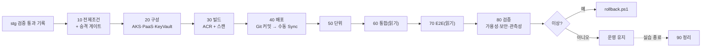
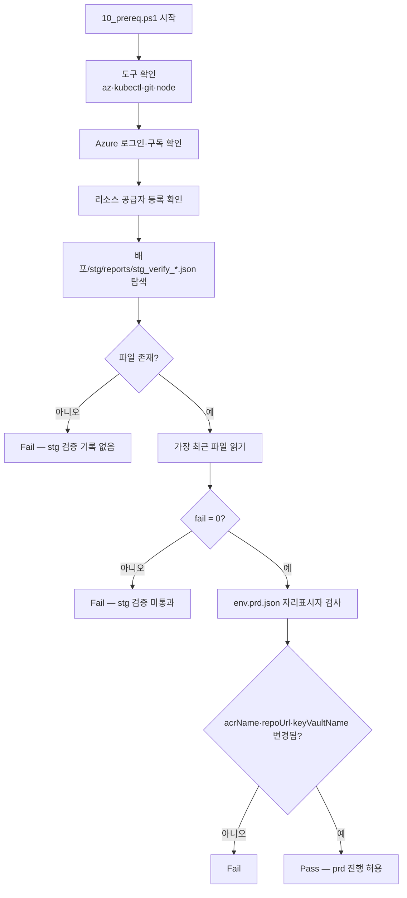
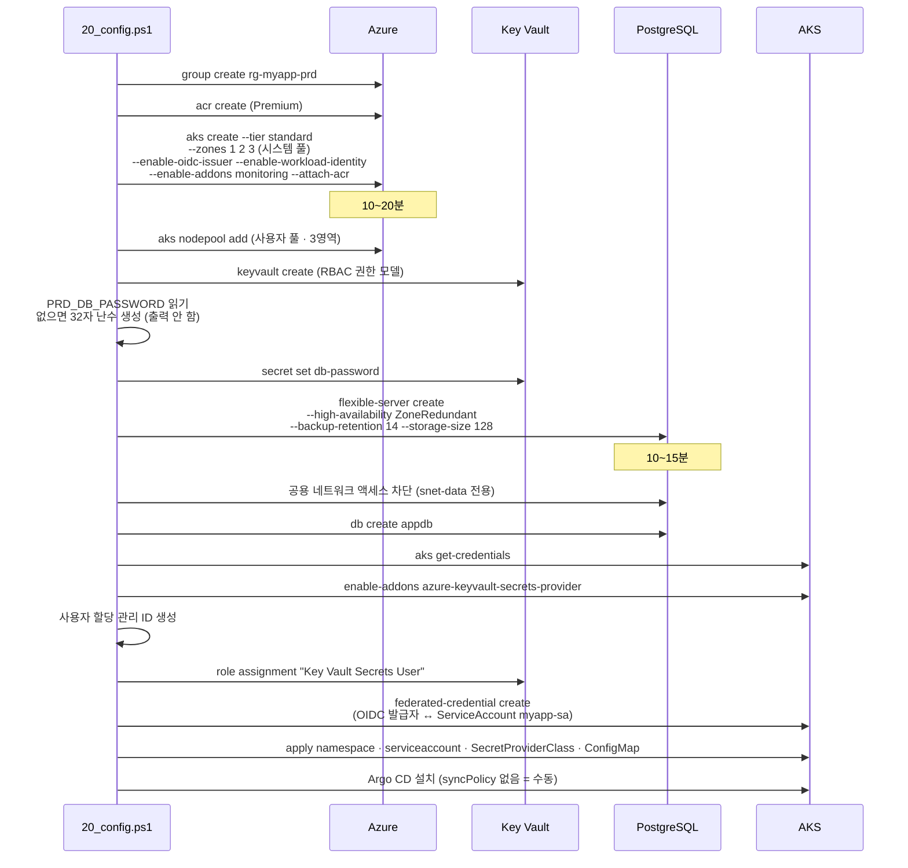
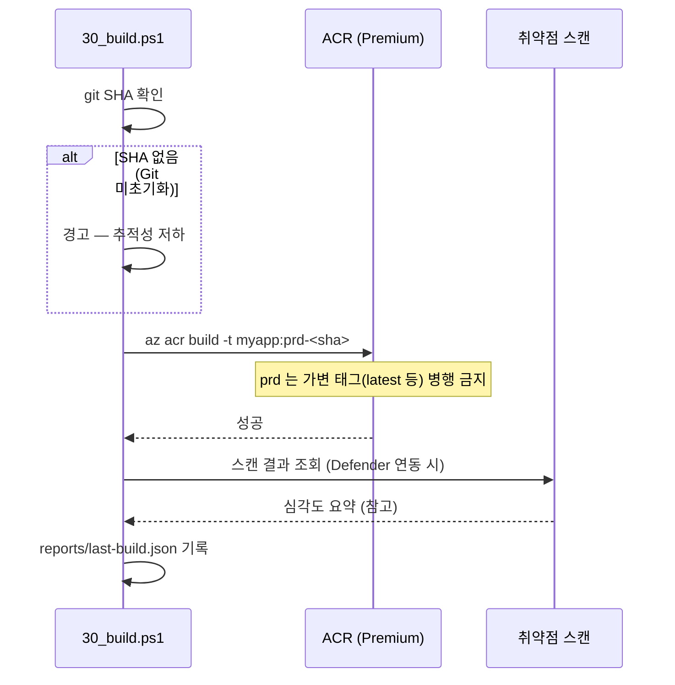
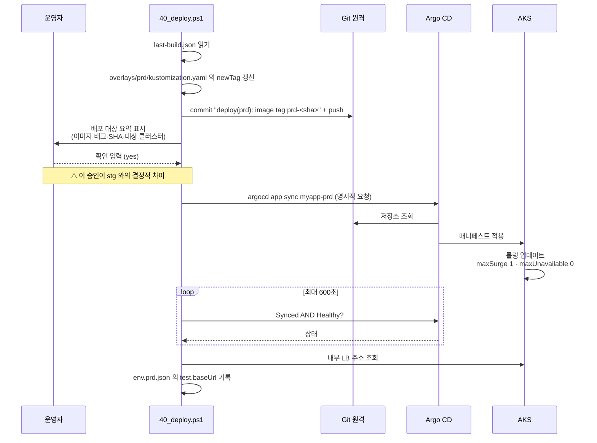
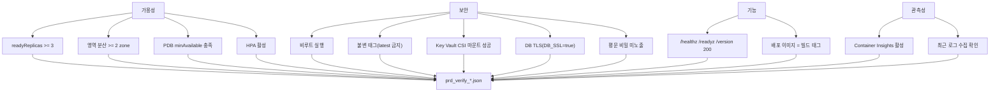
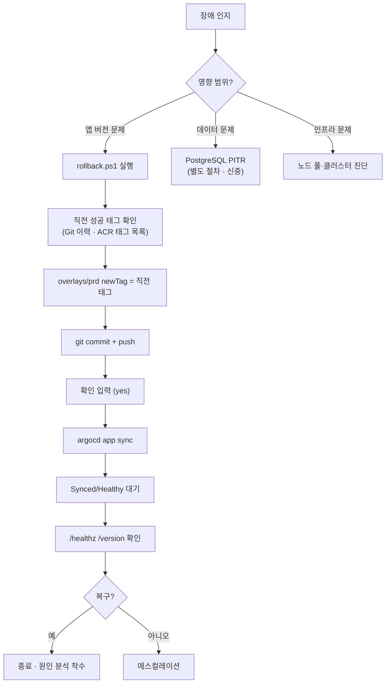

# prd 02. 프로세스 설계서 — 승인 배포 · 검증 · 롤백

> **답하는 질문**: «누가 무엇을 승인해야 운영에 반영되는가, 그리고 어떻게 되돌리는가»
> **stg 와의 결정적 차이**: **자동 동기화가 없다.** 사람이 «지금»을 결정한다.

> ⚠️ **myapp 적용 현황 (2026-08-29)** — myapp은 `skipPaasData=true`로 PostgreSQL을 생성하지 않아, 이 문서의 PostgreSQL 관련 구간(§1 시퀀스의 PG 참여자, PITR 절차, PostgreSQL HA 실패 대응)은 **N/A**입니다. 실제 20 구성 소요시간도 PostgreSQL·Redis 생성이 빠져 설계 예상(25~40분)보다 짧았습니다(Key Vault RBAC 전파 대기·vCPU 쿼터 재시도 포함 약 10분대). 실제 진행 경과는 [`실습산출물/3차시/11_최종검토_대조.md`](../../실습산출물/3차시/11_최종검토_대조.md) §4단계 참고.

---

## 1. 전체 파이프라인

---

## 2. 승격 게이트 (10_prereq)

> 🔑 **이것이 «품질 게이트»의 실체입니다.** 문서상의 규칙이 아니라 **스크립트가 파일을 읽어 강제**합니다. stg 를 건너뛰면 prd 는 시작되지 않습니다.

---

## 3. 구성 프로세스 (20_config) — 의존 순서

### 3-1. 순서가 중요한 이유

| 선행 | 후행 | 이유 |
| --- | --- | --- |
| AKS OIDC 발급자 활성화 | 연합 자격 증명 생성 | 발급자 URL 이 있어야 연합 설정 가능 |
| 관리 ID 생성 | Key Vault 역할 부여 | 대상 주체가 있어야 역할 할당 |
| Key Vault 시크릿 저장 | SecretProviderClass 적용 | 없는 시크릿을 마운트하면 파드 기동 실패 |
| VNet·서브넷 생성 | AKS · PostgreSQL | 앱(snet-aks)·데이터(snet-data) 계층을 분리 배치 |

---

## 4. 빌드 프로세스 (30_build)

| prd 태그 규칙 | 근거 |
| --- | --- |
| **`prd-<sha>` 만 사용** | 불변 태그 — «어느 코드가 돌고 있는가»가 항상 명확 |
| `latest` 등 가변 태그 **병행 금지** | 롤백 대상 특정 불가 · 재현 불가 |

---

## 5. 배포 프로세스 (40_deploy) — 수동 승인

### 5-1. 배포 중 가용성

| 시점 | 준비된 파드 | 사용자 영향 |
| --- | --- | --- |
| t0 | 구 3 | 없음 |
| t1 | 구 3 + 신 1(준비 중) | 없음 |
| t2 | 구 2 + 신 1 | 없음 (PDB minAvailable 2 유지) |
| t3~ | 점진 교체 | 없음 |
| tN | 신 3 | 없음 |

> **`maxUnavailable: 0` + `minAvailable: 2` 조합으로 가용 파드가 2 미만으로 내려가지 않습니다.**

---

## 6. 검증 프로세스 (80_verify)

---

## 7. 롤백 프로세스 (rollback.ps1)

### 7-1. 롤백 방식 비교

| 방식 | 속도 | 이력 | prd 적합성 |
| --- | --- | --- | --- |
| **`rollback.ps1` (Git 태그 되돌림 + sync)** | 보통(2~5분) | ✅ 남음 | ✅ **권장** |
| `git revert` + sync | 보통 | ✅ 남음 | ✅ 가능 |
| `kubectl rollout undo` | 빠름 | ❌ Git 과 불일치 | ⚠️ 긴급 시만 · 이후 Git 정합 필요 |
| 클러스터 재생성 | 매우 느림 | – | ❌ 부적합 |

> ⚠️ **`kubectl rollout undo` 를 쓰면 Git 과 클러스터가 어긋납니다.** prd 는 수동 동기화이므로 selfHeal 이 즉시 되돌리지는 않지만, **다음 sync 때 문제가 재현**됩니다. 반드시 Git 을 함께 맞추세요.

### 7-2. 롤백 판단 기준

| 신호 | 조치 |
| --- | --- |
| `/healthz` 실패율 상승 | 즉시 롤백 |
| 5xx 급증 (App Insights) | 즉시 롤백 |
| `CrashLoopBackOff` 발생 | 즉시 롤백 |
| 응답 시간 악화(임계 초과) | 원인 확인 후 판단 |
| 특정 기능만 오류 | 영향도 평가 후 판단 |

---

## 8. 실패 처리 매트릭스

| 단계 | 증상 | 원인 | 조치 |
| --- | --- | --- | --- |
| 10 | stg 검증 기록 없음 | stg 미수행 | **stg 파이프라인부터 수행** |
| 20 | AKS 생성 실패 | vCPU 쿼터 부족 | 쿼터 증설 또는 노드 크기 하향 |
| 20 | PostgreSQL HA 실패 | Burstable 계층 선택 | **GeneralPurpose 이상**으로 변경 |
| 20 | 연합 자격 증명 실패 | OIDC 발급자 미활성 | `az aks update --enable-oidc-issuer` |
| 40 | 파드 `CreateContainerConfigError` | SecretProviderClass 마운트 실패 | Key Vault 역할 할당·시크릿 이름 확인 |
| 40 | Argo CD `OutOfSync` 유지 | 수동 동기화 미실행 | `argocd app sync` (**정상 동작**) |
| 60 | DB 연결 실패 | 공용 액세스 차단 상태에서 사설 경로 미구성 | 서브넷·사설 DNS 확인 |
| 60 | TLS 오류 | `DB_SSL=false` | ConfigMap 수정 → 커밋 → sync |
| 80 | 영역 분산 미달 | 노드 풀 영역 설정 누락 | 노드 풀 `--zones 1 2 3` 확인 |
| 80 | 관측성 미수집 | monitoring 애드온 미설치 | `az aks enable-addons -a monitoring` |

---

## 9. 소요 시간 기준

| 단계 | 최초 | 재실행 |
| --- | --- | --- |
| 10 전제조건 | 30~60초 | 30초 |
| 20 구성 | **25~40분** (AKS 10~20 + PostgreSQL 10~15) | 1~2분 |
| 30 빌드 | 3~5분 | 2~3분 |
| 40 배포 | 3~8분 (승인 대기 제외) | 2~5분 |
| 50~70 테스트 | 2~4분 | 1~3분 |
| 80 검증 | 1~2분 | 동일 |
| **rollback** | – | **2~5분** |
| 90 정리 | 요청 즉시(백그라운드 10~20분) | – |
| **합계** | **약 40~60분** | **약 8~15분** |
