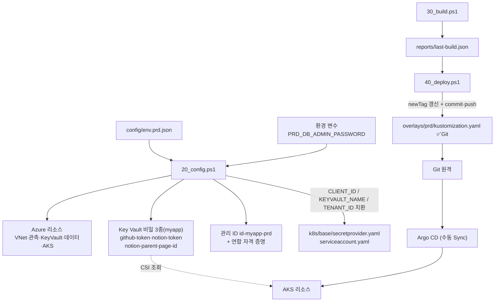
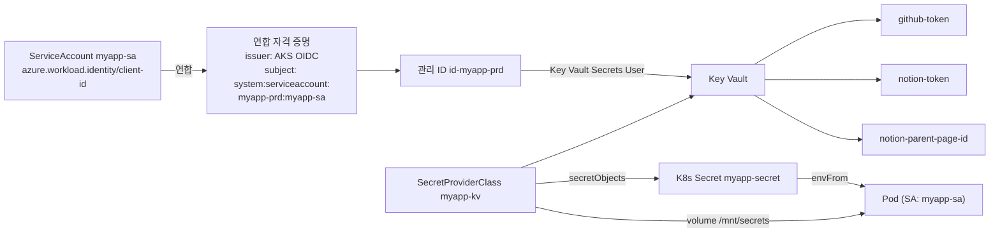

# prd 03. 구성 설계서 — 설정 · Key Vault · 매니페스트

> **답하는 질문**: «운영 설정과 비밀이 각각 어디에 살고, 어떻게 파드에 도달하는가»
> **핵심 원칙**: **설정은 Git 에, 비밀과 접속 대상은 Key Vault 에 — 어느 쪽도 이미지 안에 두지 않는다.**
> **정본**: [`배포/prd/config/`](../../배포/prd/config/) 의 실제 파일

> ⚠️ **myapp 적용 현황 (2026-08-29)** — `env.prd.json`에 `skipPaasData: true`가 있어 §2-3의 PostgreSQL·Redis·Storage는 **실제로 생성되지 않습니다**. Key Vault 비밀도 아래 §3·§6에 서술된 `db-host`/`db-user`/`db-password`/`redis-host` 4종이 아니라 **`github-token`·`notion-token`·`notion-parent-page-id` 3종**만 실제로 저장됩니다(`배포/prd/config/k8s/base/secretprovider.yaml` 참고 — CSI `objects`·`secretObjects`에서 DB/Redis 항목 제거됨). 아래 §2-3·§3·§6은 이 플랫폼이 지원하는 **목표 구성**을 그대로 남겨 두되, 실제 값과의 차이를 각 절에 표시합니다.

---

## 1. 설정 흐름



### 1-1. 저장 위치 3분할

| 위치 | 담는 것 | 예 |
| --- | --- | --- |
| **Git** | 구조 · 정책 · **이미지 태그** | base/overlay 매니페스트, ConfigMap, HPA, PDB |
| **Key Vault** | **비밀 + 접속 대상** | myapp 실제: `github-token` `notion-token` `notion-parent-page-id` (`db-host`/`db-user`/`db-password`/`redis-host`는 PostgreSQL·Redis를 쓰는 앱 배포 시에만 해당) |
| **Azure 리소스** | 인프라 상태 | VNet, 노드 풀, DB HA·백업, 공용 액세스 차단 |

> 🚫 **비밀 값은 Git·이미지·ConfigMap 어디에도 존재하지 않습니다.** 매니페스트에는 **참조만** 선언됩니다.

---

## 2. `config/env.prd.json` 키 명세

### 2-1. 네트워크

| 경로 | 값 | 설명 |
| --- | --- | --- |
| `azure.network.vnetName` / `vnetCidr` | `vnet-myapp-prd` / `10.20.0.0/16` | 전용 가상 네트워크 |
| `azure.network.aksSubnetName` / `aksSubnetCidr` | `snet-aks` / `10.20.0.0/22` | 앱(노드) 계층 |
| `azure.network.dataSubnetName` / `dataSubnetCidr` | `snet-data` / `10.20.4.0/24` | **데이터 계층 분리** |

### 2-2. AKS

| 경로 | 값 | 설명 | 변경 영향 |
| --- | --- | --- | --- |
| `azure.aks.tier` | **`standard`** | 제어 평면 SLA | 가용성 등급 |
| `azure.aks.systemNodeCount` / `Size` | `3` / `Standard_D2s_v5` | 시스템 풀 | 핵심 컴포넌트 안정성 |
| `azure.aks.userNodeCount` / `Size` | `2` / `Standard_D4s_v5` | 사용자 풀 초기 | 앱 용량 |
| `azure.aks.userNodeMin` / `userNodeMax` | `2` / `6` | **노드 오토스케일 범위** | HPA 확장의 상한 |
| `azure.aks.zones` | `[1, 2, 3]` | 영역 분산 | **P-02 판정 근거** |
| `azure.aks.networkPlugin` / `Mode` | `azure` / `overlay` | CNI Overlay | IP 소모 절감 |

### 2-3. 데이터

> ⚠️ **myapp은 이 절 전체가 N/A입니다** — `skipPaasData: true`로 PostgreSQL·Redis·Storage 생성 자체를 생략했습니다(SQLite만 사용). 아래 값은 이 플랫폼의 목표 구성이며, `env.prd.json`에는 여전히 정의값이 남아있지만 `20_config.ps1`이 생성을 건너뜁니다.

| 경로 | 값 | 설명 |
| --- | --- | --- |
| `azure.data.postgres.name` | `psql-myapp-prd` | **전역 고유** |
| `azure.data.postgres.tier` / `sku` | `GeneralPurpose` / `Standard_D2ds_v4` | **Burstable 금지**(HA 미지원) |
| `azure.data.postgres.storageGb` / `version` | `128` / `16` | 축소 불가 |
| `azure.data.postgres.haMode` | **`ZoneRedundant`** | 영역 이중화 |
| `azure.data.postgres.backupRetentionDays` | **`14`** | PITR 범위 |
| `azure.data.postgres.adminUser` | `pgadminuser` | Key Vault `db-user` 로 저장 |
| `azure.data.postgres.adminPasswordEnvVar` | `PRD_DB_ADMIN_PASSWORD` | **비밀번호 원천** |
| `azure.data.postgres.database` | `appdb` | ConfigMap `DB_NAME` |
| `azure.data.redis.name` / `sku` / `vmSize` | `redis-myapp-prd` / `Standard` / `c1` | 세션·캐시 |
| `azure.data.storage.namePrefix` / `sku` | `stmyappprd` / `Standard_ZRS` | 객체 저장 |
| `azure.data.keyvault.namePrefix` | `kv-myapp-prd` | **전역 고유** |

### 2-4. 관측 · 배포 · 앱 · 테스트

| 경로 | 값 | 설명 |
| --- | --- | --- |
| `azure.observability.logAnalytics` / `appInsights` | `law-myapp-prd` / `ai-myapp-prd` | 로그·추적 |
| `azure.observability.enableManagedPrometheus` / `enableContainerInsights` | `true` / `true` | 지표 수집 |
| **`argocd.repoUrl`** | 자리표시자 | **Git 저장소 — 반드시 변경** |
| `argocd.syncPolicy` | **`manual`** | 사람 승인 |
| `argocd.path` | `배포/prd/config/k8s/overlays/prd` | overlay 경로 |
| `app.replicas` / `containerPort` | `3` / `8080` | 영역당 1개 |
| `app.serviceAccount` | `myapp-sa` | **연합 자격 증명 대상** |
| `app.workloadIdentityName` | `id-myapp-prd` | 관리 ID 이름 |
| `test.baseUrl` | `""` | `40_deploy` 가 자동 기록 |
| **`test.allowWrite`** | **`false`** | **쓰기 스모크 금지** |
| **`skipPaasData`** | `true`(myapp) | **2026-08-29 추가** — PostgreSQL·Redis·Storage 생성 생략 여부. myapp처럼 해당 리소스를 쓰지 않는 앱을 배포할 때 사용. `20_config.ps1`이 §2-3 전체와 관련 Key Vault 비밀 저장을 건너뛰게 함 |

> ⚠️ **전역 고유 이름 4개**(`acrName` · `postgres.name` · `keyvault.namePrefix` · `storage.namePrefix`)와 **`argocd.repoUrl`** 은 자리표시자면 `10_prereq.ps1` 이 중단시킵니다.

---

## 3. Key Vault 연동 구성



### 3-0. 아이덴티티 적용 범위 (`env.prd.json` 의 `identity` 블록)

| 키 | 값 | 의미 |
| --- | --- | --- |
| `identity.userAssignedName` | `id-myapp-prd` | 앱이 사용할 사용자 할당 관리 ID |
| `identity.federatedCredentialName` | `fc-myapp` | 연합 자격 증명 이름 |
| `identity.audience` | `api://AzureADTokenExchange` | 토큰 교환 대상(고정값) |
| `identity.passwordless.acr` / `keyVault` / `storage` / `postgres` / `redis` | `true` | **리소스별 비밀 없는 접근 적용 여부** |
| `identity.postgresPasswordAuth` | `Enabled` | 실습 호환용 — 목표 상태는 `Disabled` |
| `identity.roleAssignments` | 3종 | 부여 역할과 **부여 이유**를 함께 기록 |
| `identity.forbidden` | 3종 | 금지 항목을 설정 파일에 명시 |

> 📌 **금지 목록을 설정 파일에 적어 두는 이유** — «하지 말 것»이 문서에만 있으면 잊힙니다. 설정 옆에 두면 값을 고치려는 순간 눈에 들어옵니다.

### 3-1. `secretprovider.yaml` 핵심 필드

| 필드 | 값 | 의미 |
| --- | --- | --- |
| `provider` | `azure` | Key Vault 공급자 |
| `usePodIdentity` / `useVMManagedIdentity` | `"false"` / `"false"` | **워크로드 ID 방식** |
| `clientID` | `CLIENT_ID_PLACEHOLDER` → 치환 | 관리 ID |
| `keyvaultName` / `tenantId` | 치환 | 대상 금고 |
| `objects` | 3종(secret) — myapp 실제: `github-token`·`notion-token`·`notion-parent-page-id` | 가져올 항목 |
| `secretObjects[].secretName` | `myapp-secret` | **K8s Secret 동기화** |
| `secretObjects[].data` | `GITHUB_TOKEN` `NOTION_TOKEN` `NOTION_PARENT_PAGE_ID` | 환경 변수 키 |

> 📌 **`secretObjects` 가 필요한 이유** — CSI 는 기본적으로 **파일만** 마운트합니다. 앱은 환경 변수를 읽으므로 K8s Secret 으로 동기화해 `envFrom` 으로 주입합니다.
>
> ⚠️ **볼륨 마운트를 생략하면 동기화도 일어나지 않습니다.** 파드에 반드시 CSI 볼륨(`/mnt/secrets`)을 마운트해야 합니다.

---

## 4. 매니페스트 구조

```
배포/prd/config/
├── env.prd.json
├── infra/                          인프라 생성 파라미터
├── argocd/application.yaml         syncPolicy 없음(= 수동 Sync)
└── k8s/
    ├── base/
    │   ├── namespace.yaml
    │   ├── serviceaccount.yaml     워크로드 ID 주석(치환)
    │   ├── configmap.yaml          비밀 아닌 값 6종
    │   ├── secretprovider.yaml     Key Vault CSI (치환)
    │   ├── deployment.yaml         replicas 3 · zone spread · 보안 컨텍스트 · CSI 볼륨
    │   ├── service.yaml            내부 LB + 관리형 NGINX Ingress
    │   ├── hpa.yaml                3~12 · CPU 65% · MEM 75%
    │   ├── pdb.yaml                minAvailable 2
    │   └── kustomization.yaml
    └── overlays/prd/
        └── kustomization.yaml      images.newName/newTag · replicas ← 배포의 단일 진실
```

### 4-1. `deployment.yaml` 운영 설정

| 항목 | 값 | 근거 |
| --- | --- | --- |
| `replicas` | 3 | 영역당 1개 |
| `revisionHistoryLimit` | **5** | 롤백 대상 유지 |
| `strategy` | `maxSurge 1` · **`maxUnavailable 0`** | 무중단 |
| `serviceAccountName` | `myapp-sa` | Key Vault 접근 주체 |
| `labels.azure.workload.identity/use` | `"true"` | 워크로드 ID 웹훅 활성화 |
| Pod `securityContext` | `runAsNonRoot` · `seccompProfile: RuntimeDefault` | 최소 권한 |
| Container `securityContext` | `readOnlyRootFilesystem` · `allowPrivilegeEscalation: false` · `drop: [ALL]` | 최소 권한 |
| `topologySpreadConstraints` | zone · maxSkew 1 · ScheduleAnyway | 영역 분산 |
| `resources` | req `200m`/`256Mi` · lim `1000m`/`1Gi` | **HPA·노드 오토스케일 판단 근거** |
| `startupProbe` | `/healthz` · 5s × 30회 = **최대 150초** | 느린 기동 허용 |
| `livenessProbe` | `/healthz` · 20s | 죽은 프로세스 회수 |
| `readinessProbe` | `/readyz` · 5s | **DB 준비 전 트래픽 차단** |
| `volumes` | CSI `kv`(readOnly) + `tmp` emptyDir | 비밀 · 읽기 전용 FS 보완 |

> 🔎 **`readOnlyRootFilesystem: true` + `/tmp` emptyDir 은 한 쌍입니다.** `/tmp` 를 주지 않으면 임시 파일을 쓰는 순간 앱이 실패합니다.
>
> 🔎 **`startupProbe` 가 있으면 `livenessProbe` 는 기동 완료 후에야 시작됩니다.** 느린 기동 때문에 무한 재시작에 빠지는 문제를 막습니다.

### 4-2. `service.yaml`

| 리소스 | 설정 | 근거 |
| --- | --- | --- |
| Service | `type: LoadBalancer` + `azure-load-balancer-internal: "true"` · 80→8080 | **내부에만 노출** |
| Ingress | `ingressClassName: webapprouting.kubernetes.azure.com` · `ssl-redirect: "true"` | 관리형 NGINX · HTTPS 강제 |

### 4-3. `hpa.yaml` · `pdb.yaml`

| 리소스 | 설정 | 근거 |
| --- | --- | --- |
| HPA | min 3 · max 12 · CPU 65% · MEM 75% · `scaleDown.stabilizationWindowSeconds: 300` | **급격한 축소 방지**(플래핑 억제) |
| PDB | `minAvailable: 2` | 노드 순환 중 최소 2개 |

> ⚠️ **`minAvailable` ≥ `replicas` 는 배포를 영구 교착시킵니다.** `2 < 3` 을 유지하세요.

---

## 5. NetworkPolicy — 현재 미적용

| 현황 | 이유 | 보완하려면 |
| --- | --- | --- |
| `base/` 에 NetworkPolicy **없음** | 진입은 Ingress 로 단일화, DB 는 공용 액세스 차단 + 전용 서브넷으로 이미 통제 | 네임스페이스 내 측면 이동까지 막으려면 `default-deny-ingress` + 명시 허용 정책을 `base/` 에 추가하고 overlay 에 포함 |

> 📌 **«없다»를 명시하는 것도 설계입니다.** 통제가 어디까지 적용됐는지 모호하면, 실제로는 열려 있는데 닫혔다고 믿게 됩니다.

---

## 6. ConfigMap · Secret 매핑

### 6-1. `myapp-config` (ConfigMap · Git 포함)

| 키 | 값 | stg 대비 |
| --- | --- | --- |
| `APP_ENV` | **`prd`** | 변경 |
| `PORT` | `8080` | 동일 |
| `DB_PORT` / `DB_NAME` | `5432` / `appdb` | 동일 |
| **`DB_SSL`** | **`true`** | **TLS 필수** |
| **`DB_POOL_MAX`** | **`10`** | **prd 신규** — 파드 3~12개 × 풀 크기가 DB 연결 상한을 넘지 않게 |
| ~~`DB_HOST`~~ ~~`DB_USER`~~ | **없음** | **Key Vault 로 이동** |

### 6-2. `myapp-secret` (**CSI 가 생성 · 수동 생성 금지**)

> ⚠️ **myapp 실제 매핑**은 아래 표(DB/Redis 대상 앱용 목표 구성)가 아니라 다음 3개입니다 — `GITHUB_TOKEN`←`github-token`, `NOTION_TOKEN`←`notion-token`, `NOTION_PARENT_PAGE_ID`←`notion-parent-page-id`. myapp은 PostgreSQL/Redis를 쓰지 않아(`skipPaasData=true`) 아래 표는 N/A입니다.

| 키 | Key Vault 객체 | 암호 인증 `Enabled` | 암호 인증 `Disabled`(목표) |
| --- | --- | :---: | :---: |
| `DB_HOST` | `db-host` | ✅ | ✅ |
| `DB_USER` | `db-user` | 서버 관리자 `pgadminuser` | **관리 ID 이름** `id-myapp-prd` |
| `DB_PASSWORD` | `db-password` | ✅ | **❌ 저장하지 않음 · 기존 값 삭제** |
| `REDIS_HOST` | `redis-host` | ✅ | ✅ |

> 🔑 **`identity.postgresPasswordAuth` 를 `Disabled` 로 바꾸면 `20_config.ps1` 이 자동으로**
> ① PostgreSQL 암호 인증을 끄고 ② `db-user` 를 관리 ID 이름으로 바꾸고 ③ **Key Vault 의 `db-password` 를 삭제**합니다.
> 앱은 [`authmode.js`](../../배포/common/app/src/lib/authmode.js) 의 규칙에 따라 **자동으로 토큰 인증(`entra`)으로 전환**됩니다 — 이미지도 매니페스트도 바꾸지 않습니다.

> 🚫 **prd 에서 `kubectl create secret` 으로 비밀을 만들지 마세요.** Key Vault 를 우회하면 회전·감사·최소 권한이 모두 무력화되고 CSI 동기화와 충돌합니다.

> 🔎 **`DB_POOL_MAX` 가 왜 중요한가** — HPA 가 12개까지 늘어나는데 파드당 풀이 크면 **DB 연결 상한을 순식간에 소진**합니다. 확장 가능한 아키텍처에서는 «파드 수 × 풀 크기»를 항상 함께 계산해야 합니다.

---

## 7. 설정 변경 영향 범위

| 변경 | 함께 확인할 것 | 위험 |
| --- | --- | --- |
| `postgres.name` | **Key Vault `db-host` 값**(공통 샘플 앱 전용 — myapp 은 미사용) | 전체 연결 실패(공통 샘플 앱 한정) |
| `keyvault.namePrefix` | SecretProviderClass `keyvaultName`(40_deploy 가 치환) · **`configmap.yaml` 의 `KEYVAULT_NAME`도 함께 치환**(myapp 의 자가 복구 경로용, [실습산출물/3차시/09_비밀없는접근.md](../../실습산출물/3차시/09_비밀없는접근.md)) | 파드 기동 실패 · myapp 의 Key Vault 직접 조회 실패 |
| `app.serviceAccount` | 연합 자격 증명 subject · Deployment SA | 인증 실패 |
| **GitHub PAT·Notion 토큰 회전**(`github-token`·`notion-token`·`notion-parent-page-id` Key Vault 시크릿) | CSI 폴링(기본 2분) 대기 또는 `kubectl rollout restart deploy/myapp` | 회전 전 값 사용 지속(즉시 반영 안 됨) — 절차: [09_비밀없는접근.md §3](../../실습산출물/3차시/09_비밀없는접근.md) |
| `app.replicas` | overlay `replicas` · PDB `minAvailable`(< replicas) · HPA `minReplicas` | **배포 교착** |
| `aks.userNodeMax` | HPA `maxReplicas` | 파드 Pending |
| `DB_POOL_MAX` | HPA `maxReplicas` × 풀 크기 vs DB 연결 상한 | **연결 고갈** |
| 네트워크 CIDR | 서브넷 위임 · CNI Overlay 대역 충돌 | 클러스터 재생성 필요 |

---

## 8. 구성 검증 체크리스트

| 확인 | 명령 | 기대 |
| --- | --- | --- |
| CSI 마운트 | `kubectl describe pod -n myapp-prd \| findstr secrets-store` | 마운트 성공 |
| 동기화 Secret | `kubectl get secret myapp-secret -n myapp-prd -o jsonpath='{.data}'` | myapp: 3개 키(GITHUB_TOKEN·NOTION_TOKEN·NOTION_PARENT_PAGE_ID) |
| **비밀 평문 미노출** | `kubectl get cm myapp-config -n myapp-prd -o yaml \| findstr -i "password host user"` | **결과 없음** |
| 워크로드 ID 치환 | `kubectl get sa myapp-sa -n myapp-prd -o yaml \| findstr client-id` | PLACEHOLDER 아님 |
| 영역 분산 | `kubectl get pods -n myapp-prd -o wide` → 노드 zone 라벨 대조 | 2개 이상 영역 |
| HPA | `kubectl get hpa -n myapp-prd` | `TARGETS` 값 표시 |
| PDB | `kubectl get pdb -n myapp-prd` | `ALLOWED DISRUPTIONS ≥ 1` |
| Ingress | `kubectl get ingress -n myapp-prd` | 주소 할당됨 |
| **DB 공용 액세스** | `az postgres flexible-server show -g rg-myapp-prd -n psql-myapp-prd --query network.publicNetworkAccess -o tsv` | **`Disabled`**(myapp은 N/A — PostgreSQL 미생성) |
| DB HA · 백업 | `--query "{ha:highAvailability.mode,bk:backup.backupRetentionDays}"` | `ZoneRedundant` · `14`(myapp은 N/A) |
| 불변 태그 | `kubectl get deploy myapp -n myapp-prd -o jsonpath='{..image}'` | `:latest` 아님 |
