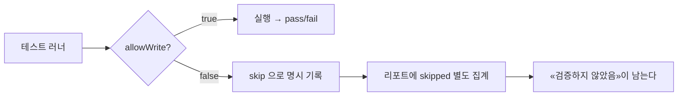
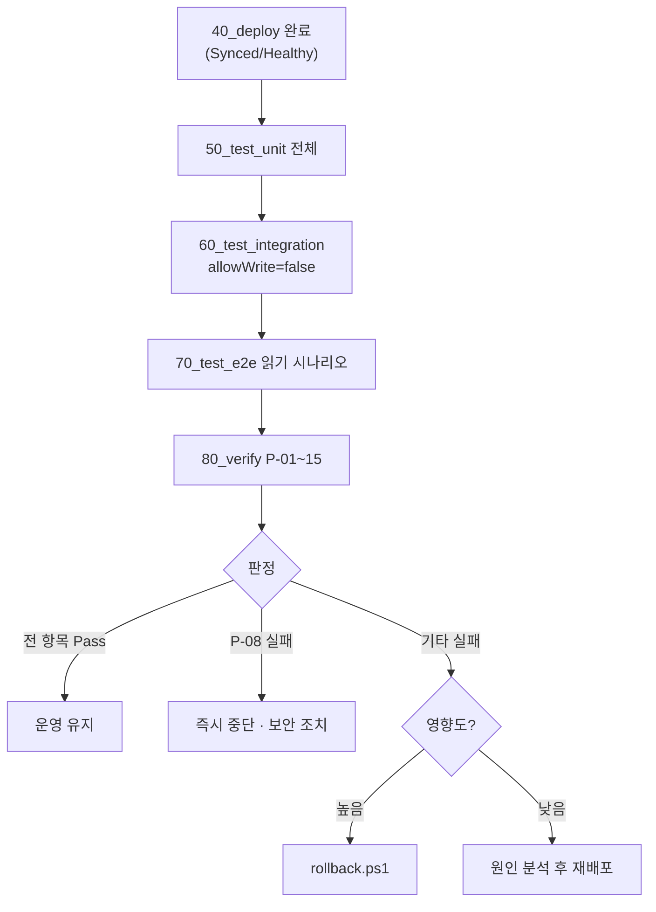

# prd 04. 테스트 설계서 — 읽기 전용 검증 · 운영 준비 판정

> **답하는 질문**: «운영 시스템을 손상시키지 않으면서 무엇을 확인할 수 있는가»
> **제1원칙**: **`test.allowWrite = false` — 운영 데이터에 쓰지 않는다.**
> **정본**: [`배포/prd/80_verify.ps1`](../../배포/prd/80_verify.ps1) 의 실제 검증 항목

---

## 1. prd 테스트의 위치

| 이 환경에서 검증하는 것 | 검증하지 않는 것 |
| --- | --- |
| **운영 구성이 설계대로인가** (가용성·보안·관측·복구) | 기능 정확성 (dev) |
| **읽기 경로가 정상인가** | 배포 방식·드리프트 교정 (stg) |
| **PaaS 보호 장치가 실제로 켜져 있는가** | **쓰기 경로** — stg 까지만 |

> 🔑 **prd 테스트는 «기능 시험»이 아니라 «운영 준비 감사(Production Readiness)»입니다.**

---

## 2. 실행 범위

| TC 그룹 | 실행 | 근거 |
| --- | :---: | --- |
| 단위 U-A-01~06 · U-B-01~10 | ✅ 전체 | 외부 의존 없음 — 부작용 없음 |
| **단위 U-A-07~10 (인증 방식 선택)** | ✅ | 순수 함수 — 비밀 미노출까지 검증 |
| 통합 I-A-01 `/healthz` | ✅ | 읽기 |
| 통합 I-A-02 `/readyz` | ✅ | 읽기 (**DB TLS 연결까지 확인**) |
| 통합 I-A-03 `/version` | ✅ | 읽기 |
| 통합 I-A-04 목록 조회 | ✅ | 읽기 |
| **통합 I-A-05 항목 생성** | **⏭ 건너뜀** | **운영 데이터 오염 금지** |
| **통합 I-A-06 검증 오류(쓰기 시도)** | **⏭ 건너뜀** | 쓰기 경로 |
| 통합 I-A-07 미존재 경로 404 | ✅ | 읽기 |
| 통합 I-A-08 버전 일치 | ✅ | 읽기 |
| **통합 I-A-09 비밀 주입** | ✅ **강화** | **Key Vault CSI 4종 확인** |
| **통합 I-A-10 `/version` auth 노출** | ✅ | 방식만 노출 · **비밀 문자열 없음** |
| E2E E-A-01 화면 로드 · E-A-02 목록 · E-A-04 요약 | ✅ | 읽기 |
| **E2E E-A-03 등록 흐름** | **⏭ 건너뜀** | 쓰기 |
| E2E E-B-01~04 (테트리스) | ✅ | 서버 상태 없음 — 안전 |
| **운영 준비 검증 P-01~15** | ✅ | **이 환경의 핵심** |
| **아이덴티티 검증 P-16~23** | ✅ | **비밀 없는 접근이 실제로 작동하는지** |

**환경 변수**

| 변수 | 값 |
| --- | --- |
| `BASE_URL` | Ingress/내부 LB 주소 (`40_deploy` 가 `env.prd.json` 에 기록) |
| `APP_ENV` | `prd` |
| **`ALLOW_WRITE`** | **`false`** |

### 2-1. 건너뛴 TC 를 «통과»로 보고하지 않는다



> ⚠️ **건너뛴 것을 «성공»으로 집계하면 리포트가 거짓말을 합니다.** `skipped` 를 별도로 남겨 무엇이 검증되지 않았는지 항상 보이게 합니다.

---

## 3. 운영 준비 검증 TC (P-01~15) — `80_verify.ps1` 정본

### 3-1. 가용성 (4)

| TC-ID | 검증 항목 | 통과 기준 | 실패 시 의미 |
| --- | --- | --- | --- |
| **P-01** | `readyReplicas` | ≥ 3 (`app.replicas`) | 용량 부족 · 스케줄 실패 |
| **P-02** | **영역 분산** | 파드가 **2개 이상 영역**에 배치 | 영역 장애에 취약 |
| **P-03** | PodDisruptionBudget 존재 | 존재(`minAvailable: 2`) | 노드 순환 중 전체 중단 가능 |
| **P-04** | HPA 구성 | 존재(min 3 · max 12) | 부하 대응 불가 |

### 3-2. 보안 (6)

| TC-ID | 검증 항목 | 통과 기준 | 실패 시 의미 |
| --- | --- | --- | --- |
| **P-05** | **워크로드 ID** | SA 주석의 client-id 가 PLACEHOLDER 아님 | 비밀번호 없는 접근 미구성 |
| **P-06** | **불변 이미지 태그** | 이미지가 `:latest` 로 끝나지 않음 | 추적·롤백 대상 특정 불가 |
| **P-07** | **비루트 + 읽기 전용 루트FS** | `runAsNonRoot=true` **AND** `readOnlyRootFilesystem=true` | 침해 시 피해 확대 |
| **P-08** | **DB 공용 네트워크 액세스 차단** | `publicNetworkAccess = Disabled` | **인터넷에서 DB 접근 가능** |
| **P-09** | **DB 고가용성** | `highAvailability.mode ≠ Disabled` | 영역 장애 시 DB 중단 |
| **P-10** | **DB 백업 보존** | ≥ 7일 (설정값 **14일**) | 논리적 손상 복구 불가 |

### 3-3. 관측 (1)

| TC-ID | 검증 항목 | 통과 기준 | 실패 시 의미 |
| --- | --- | --- | --- |
| **P-11** | Container Insights 사용 | `addonProfiles.omsagent.enabled = true` | **장애를 발견할 수 없음** |

### 3-4. 엔드포인트 (3)

| TC-ID | 검증 항목 | 통과 기준 |
| --- | --- | --- |
| **P-12** | `/healthz` | 200 |
| **P-13** | `/readyz` | 200 (**PaaS DB 연결 성립 의미**) |
| **P-14** | `/version` | 200 |

### 3-5. 복구 (1)

| TC-ID | 검증 항목 | 통과 기준 | 실패 시 의미 |
| --- | --- | --- | --- |
| **P-15** | **롤백 가능성** | `rollout history` 리비전 **2개 이상** | 되돌릴 곳이 없음 |

### 3-6. 아이덴티티 (8) — «적용했다»가 아니라 «작동한다»

> 구현: [`배포/common/identity.ps1`](../../배포/common/identity.ps1) 의 `Test-IdentityPosture` · 정의: [공통 07 §8](../공통/07_아이덴티티·시크릿_설계서.md)

| TC-ID | 검증 항목 | 통과 기준 | 실패 시 의미 | 공통 07 |
| --- | --- | --- | --- | --- |
| **P-16** | AKS **OIDC 발급자** 사용 | `oidcIssuerProfile.enabled = true` | 토큰 교환 불가 | ID-01 |
| **P-17** | AKS **워크로드 ID 애드온** 사용 | `securityProfile.workloadIdentity.enabled = true` | 파드에 토큰 미주입 | ID-02 |
| **P-18** | **Key Vault CSI 애드온** 사용 | `azureKeyvaultSecretsProvider.enabled = true` | 비밀 마운트 불가 | ID-03 |
| **P-19** | **연합 자격 증명 일치** | issuer·subject 가 실제 클러스터/SA 와 일치 | `AADSTS70021` 토큰 교환 실패 | ID-04 |
| **P-20** | **SA 주석 = 관리 ID clientId** | 자리표시자가 아닌 실제 GUID | `AZURE_CLIENT_ID` 미주입 | ID-05 |
| **P-21** | **파드에 토큰 주입** | `AZURE_CLIENT_ID` **AND** `AZURE_FEDERATED_TOKEN_FILE` 존재 | **워크로드 ID 가 실제로는 작동하지 않음** | ID-06 |
| **P-22** | **PostgreSQL Entra 인증 + 관리 ID 가 Entra 관리자** | `activeDirectoryAuth = Enabled` **AND** `ad-admin` 에 principalId 존재 | 토큰 접속 불가 | ID-07·08 |
| **P-23** | **최소 권한** | 관리 ID 에 **구독 범위 역할 할당 0건** | 하나가 뚫리면 전부 뚫림 | ID-11 |

추가로 `Test-IdentityPosture` 는 **Storage 공유 키 차단(ID-09)** 과 **Redis Entra 액세스 정책(ID-10)** 도 함께 확인합니다.

> 🎯 **P-21 이 아이덴티티 검증의 분기점입니다.** P-16~P-20 은 «설정이 되어 있다»를 보지만, P-21 은 **파드 안에서 `printenv` 로 토큰 주입을 직접 확인**합니다. 설정은 맞는데 파드 라벨(`azure.workload.identity/use`)이 빠져 웹훅이 건너뛴 경우, **P-21 만이 그것을 잡아냅니다.**
>
> ⚠️ **P-22 는 «전환 준비 완료»를 뜻하지 «전환 완료»를 뜻하지 않습니다.** `identity.postgresPasswordAuth` 가 `Enabled` 인 동안에는 암호 인증도 함께 살아 있습니다. 완전 전환은 그 값을 `Disabled` 로 바꾼 뒤 P-22 와 `/version` 의 `auth.mode = entra` 를 함께 확인해야 성립합니다.

> 🎯 **P-08 은 «사고를 막는» 검증**입니다. 다른 항목이 모두 통과해도 이것이 실패하면 **운영 배포를 중단**해야 합니다.
>
> 🎯 **P-15 는 «사고 후를 준비하는» 검증**입니다. 배포가 성공했는지가 아니라, **실패했을 때 돌아갈 곳이 있는지**를 봅니다.

---

## 4. 검증 항목 ↔ 설계 근거 추적성

| TC | 근거 설계 | 위치 |
| --- | --- | --- |
| P-01 · P-04 | 복제본 3 + HPA 3~12 | [prd 01 §4-3](01_아키텍처설계서_prd.md) |
| P-02 | topologySpreadConstraints(zone) | [prd 01 §4-2](01_아키텍처설계서_prd.md) |
| P-03 | PDB minAvailable 2 | [prd 03 §4-3](03_구성설계서_prd.md) |
| P-05 | 워크로드 ID + 연합 자격 증명 | [prd 01 §5-1](01_아키텍처설계서_prd.md) |
| P-06 | 불변 태그 `prd-<sha>` | [prd 02 §4](02_프로세스설계서_prd.md) |
| P-07 | 보안 컨텍스트 + `/tmp` emptyDir | [prd 03 §4-1](03_구성설계서_prd.md) |
| P-08 · P-09 · P-10 | PaaS DB 구성 | [prd 01 §6](01_아키텍처설계서_prd.md) |
| P-11 | 관측성 설계 | [prd 01 §8](01_아키텍처설계서_prd.md) |
| P-12~14 | 프로브·API 계약 | [공통 03 §3](../공통/03_REST_API_설계서.md) |
| P-15 | `revisionHistoryLimit: 5` · 롤백 절차 | [prd 02 §7](02_프로세스설계서_prd.md) |

**커버리지 15/15 = 100%** — 검증 항목 중 설계 근거가 없는 것은 없습니다.

---

## 5. 실행 절차



---

## 6. 판정 요약

| 구분 | 항목 | 하나라도 실패 시 |
| --- | :---: | --- |
| 가용성 P-01~04 | 4 | 용량·배치 조정 후 재검증 |
| **보안 P-05~10** | 6 | **P-08 은 즉시 중단** |
| 관측 P-11 | 1 | 애드온 활성화 후 재검증 |
| 엔드포인트 P-12~14 | 3 | 롤백 검토 |
| 복구 P-15 | 1 | 배포 이력 확보 전 운영 금지 |
| **아이덴티티 P-16~23 (+ID-09·10)** | 8~10 | **P-21 실패 시 비밀 없는 접근이 허구** |
| **합계** | **23~25** | `80_verify.ps1` 이 `exit 1` 로 중단 |

---

## 7. 리포트 산출물

| 파일 | 내용 |
| --- | --- |
| `배포/prd/reports/prd_prereq_*.json` | 전제조건 + **stg 승격 게이트 결과** |
| `배포/prd/reports/last-build.json` | 레지스트리·태그·SHA |
| `배포/prd/reports/prd_unit_*.json` | 단위 |
| `배포/prd/reports/prd_integration_*.json` | 통합 (**`skipped` 포함**) |
| `배포/prd/reports/prd_e2e_*.json` | E2E (**`skipped` 포함**) |
| **`배포/prd/reports/prd_verify_*.json`** | **P-01~15 운영 준비 검증** |
| `배포/prd/reports/prd_rollback_*.json` | 롤백 실행 기록 |
| `배포/prd/reports/prd_pipeline_*.json` | 전체 요약 |

```json
{
  "environment": "prd",
  "kind": "integration",
  "total": 9, "pass": 7, "fail": 0, "skipped": 2,
  "allowWrite": false,
  "results": [
    { "Name": "I-A-05 항목 생성", "Status": "Skip",
      "Detail": "allowWrite=false — 운영 데이터 보호" }
  ]
}
```

---

## 8. 결함 진단 가이드

| 실패 | 가장 흔한 원인 | 첫 확인 |
| --- | --- | --- |
| P-01 복제본 부족 | 노드 자원·쿼터 | `kubectl describe pod` 의 `FailedScheduling` |
| **P-02 영역 미분산** | 노드 풀 `--zones` 누락 | `kubectl get nodes -L topology.kubernetes.io/zone` |
| P-04 HPA 없음/`<unknown>` | 매니페스트 미적용 · metrics-server 이상 | `kubectl top pods -n myapp-prd` |
| **P-05 워크로드 ID** | `CLIENT_ID_PLACEHOLDER` 미치환 | `kubectl get sa myapp-sa -o yaml` |
| P-06 가변 태그 | overlay `newTag` 가 PLACEHOLDER/latest | `kubectl get deploy -o jsonpath='{..image}'` |
| **P-08 공용 액세스 허용** | 실습 편의로 열어둠 | **즉시 `Disabled` 로 변경** |
| P-09/P-10 | Burstable 계층 선택 · 백업 기본값 | `az postgres flexible-server show` |
| **P-13 `/readyz` 503** | CSI 마운트 실패 · DB 미도달 · TLS | `kubectl logs -n myapp-prd -l app=myapp` |
| P-15 리비전 부족 | 최초 배포 직후 | 두 번째 배포 후 재검증 |
| **P-19 연합 불일치** | subject 오타 · 네임스페이스/SA 이름 변경 | `az identity federated-credential list` 와 `kubectl get sa` 대조 |
| **P-21 토큰 미주입** | 파드 라벨 `azure.workload.identity/use` 누락 | `kubectl get pod --show-labels` |
| **P-22 Entra 관리자 없음** | 역할 전파 지연 | 2~3분 후 `20_config.ps1` 재실행(멱등) |
| **P-23 광역 권한** | 실습 편의로 구독 범위 부여 | 해당 역할 할당 제거 후 리소스 범위로 재부여 |
| 파드 `CreateContainerConfigError` | Key Vault 역할·시크릿 이름 | `kubectl describe pod` 이벤트 |

---

## 9. 쓰기 경로를 검증하고 싶다면

| 하지 말 것 | 대신 |
| --- | --- |
| prd 에서 `allowWrite=true` | **stg 에서 전체 실행** — 동일 이미지·동일 구조 |
| prd DB 에 테스트 데이터 삽입 | stg in-cluster PostgreSQL 사용 |
| prd 에서 드리프트(레플리카 강제 변경) 테스트 | **stg 에서만** (G-05) |

> 📌 **«운영에서만 확인할 수 있는 것»은 실은 «stg 가 운영과 충분히 닮지 않았다»는 신호입니다.** 그럴 때 고칠 대상은 테스트 정책이 아니라 **stg 구성**입니다.
