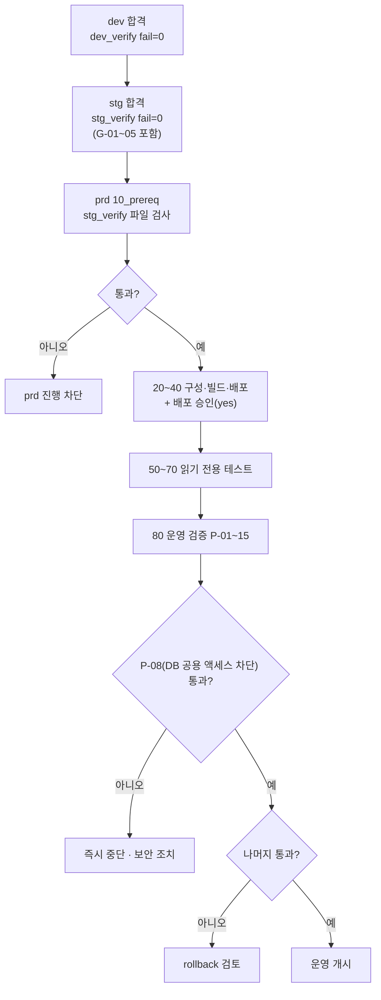
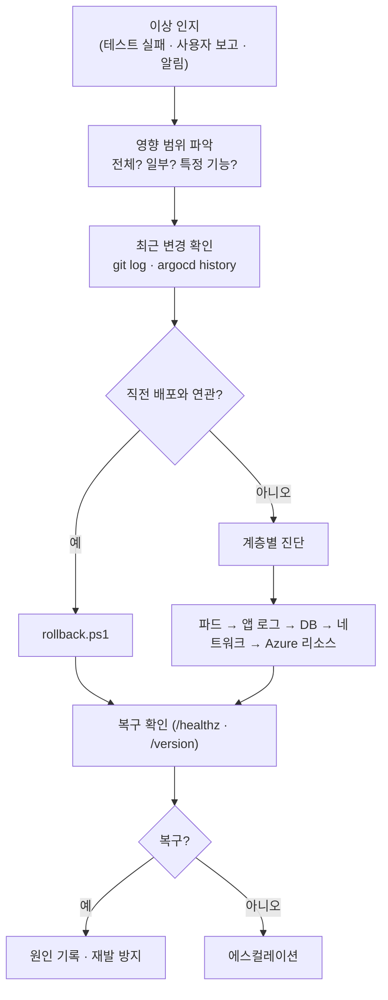
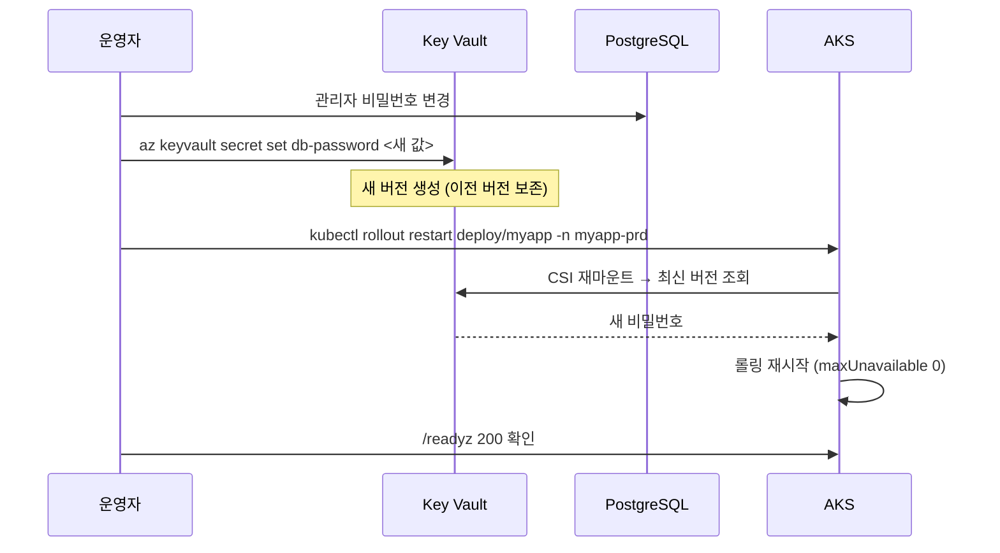
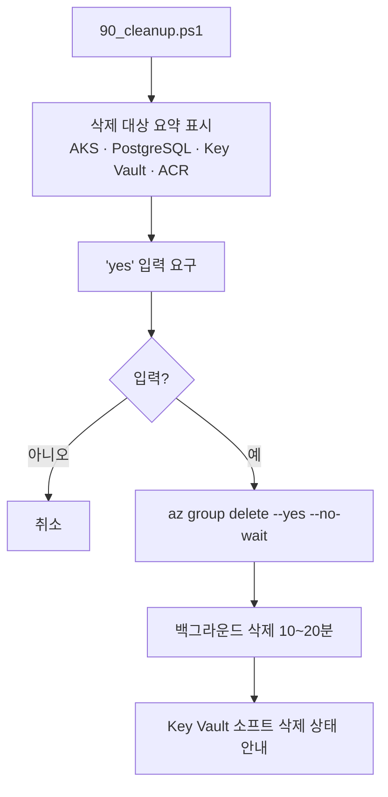

# prd 05. 운영 · 이행 설계서 — 승격 · 런북 · 정리

> **답하는 질문**: «무엇이 충족되어야 운영에 올리고, 문제가 생기면 어떤 순서로 대응하며, 언제 어떻게 걷어내는가»
> **prd 에만 존재하는 문서**입니다 — dev·stg 는 «만들고 검증»하면 끝이지만, prd 는 **그 이후의 시간**을 설계해야 합니다.

---

## 1. 이행(승격) 게이트



### 1-1. 게이트 체크리스트

| # | 조건 | 확인 방법 | 강제 |
| --- | --- | --- | :---: |
| 1 | dev 전 단계 Pass | `dev_verify_*.json` `fail=0` | 수동 |
| 2 | **stg 전 단계 Pass (GitOps 포함)** | `stg_verify_*.json` `fail=0` | **스크립트** |
| 3 | 전역 고유 이름 설정 완료 | `env.prd.json` 자리표시자 검사 | **스크립트** |
| 4 | 리소스 공급자 등록 | `az provider show` | **스크립트** |
| 5 | 배포 대상 확인 후 승인 | 콘솔 `yes` 입력 | **스크립트** |
| 6 | 워크로드 ID·불변 태그·비루트 | P-05~07 | **스크립트** |
| 7 | DB 공용 액세스 차단 · HA · 백업 | P-08~10 | **스크립트** |
| 8 | 개인정보 미사용 | 데이터·캡처 육안 확인 | 수동 |

---

## 2. 운영 지표와 관측 대상

| 범주 | 지표 | 정상 기준(실습) | 확인 위치 |
| --- | --- | --- | --- |
| 가용성 | 준비된 복제본 | ≥ 3 | `kubectl get deploy` |
| 가용성 | 파드 재시작 | 0~2회/시간 | `kubectl get pods` |
| 가용성 | 영역 분산 | ≥ 2 영역 | 노드 zone 라벨 |
| 성능 | `/healthz` 응답 | < 1초 | 통합 테스트 |
| 성능 | CPU 사용률 | < 65% (HPA 임계) | `kubectl top pods` |
| 확장 | HPA 현재 복제본 | 3~12 | `kubectl get hpa` |
| 데이터 | DB 연결 | `/readyz` 200 | 통합 테스트 |
| 데이터 | DB HA 상태 | `Healthy` | `az postgres flexible-server show` |
| 보안 | DB 공용 액세스 | `Disabled` | `az postgres flexible-server show` |
| 관측 | 로그 수집 | 최근 로그 존재 | Log Analytics KQL |

---

## 3. 장애 대응 런북

### 3-1. 대응 흐름



### 3-2. 증상별 1차 조치

| 증상 | 1차 확인 | 2차 확인 | 조치 |
| --- | --- | --- | --- |
| **전체 503** | `kubectl get pods -n myapp-prd` | `kubectl logs -l app=myapp --tail=100` | 파드 이상 → 롤백 / DB 이상 → HA·사설 경로 확인 |
| **일부 요청만 실패** | 파드별 로그 비교 | 노드별 배치 확인 | 특정 노드·영역에서만 CSI 마운트나 DB 경로가 실패할 가능성 |
| `CrashLoopBackOff` | `kubectl logs --previous` | `kubectl describe pod` | 설정·비밀 오류 → 구성 수정 후 재배포 |
| `CreateContainerConfigError` | `describe pod` 이벤트 | SecretProviderClass | Key Vault 역할·시크릿 이름 확인 |
| 응답 지연 | `kubectl top pods` | App Insights 의존성 | HPA 확장 확인 · DB 부하 확인 |
| **DB 연결 실패** | `/readyz` | `az postgres ... show` HA 상태 | 페일오버 중이면 대기 · CSI 마운트(db-host) 확인 |
| 파드 스케줄 안 됨 | `describe pod` `FailedScheduling` | `kubectl describe node` | 노드 풀 확장 |
| Argo CD `OutOfSync` | `argocd app get` | Git 이력 | **수동 sync 는 정상 동작** — 의도 확인 후 sync |

### 3-3. 진단 명령 모음

```powershell
$ns = "myapp-prd"
kubectl get deploy,po,svc,hpa,pdb -n $ns
kubectl get pods -n $ns -o wide
kubectl describe pod -n $ns -l app=myapp
kubectl logs -n $ns -l app=myapp --tail=200
kubectl logs -n $ns -l app=myapp --previous --tail=100
kubectl get events -n $ns --sort-by=.lastTimestamp | Select-Object -Last 30
kubectl top pods -n $ns
```

```powershell
# Azure 리소스 상태
az aks show -g rg-myapp-prd -n aks-myapp-prd --query "{tier:sku.tier,power:powerState.code}" -o json
az postgres flexible-server show -g rg-myapp-prd -n psql-myapp-prd --query "{state:state,ha:highAvailability.state,pub:network.publicNetworkAccess,bk:backup.backupRetentionDays}" -o json
```

---

## 4. 변경 관리

| 변경 유형 | 절차 | 승인 | 롤백 |
| --- | --- | --- | --- |
| **앱 코드 배포** | dev → stg → prd (30→40) | 배포 시 `yes` | `rollback.ps1` |
| **설정 변경**(ConfigMap) | Git 수정 → 커밋 → sync | 배포와 동일 | Git revert → sync |
| **복제본·HPA 조정** | overlay 수정 → 커밋 → sync | 배포와 동일 | Git revert |
| **네트워크 정책 추가** | Git 수정 → sync | 배포와 동일 | Git revert |
| **비밀 회전** | Key Vault 새 버전 → 파드 재시작 | 별도 | 이전 버전으로 복원 |
| **인프라 변경**(노드 풀 등) | `az` 명령 | 별도 | 수동 되돌림 |
| **DB 스키마 변경** | 공통 05 §5 5단계 | 별도 | 하위 호환 유지로 롤백 가능 |

> ⚠️ **`kubectl edit` 으로 직접 고치지 마세요.** Git 과 클러스터가 어긋나 다음 sync 때 되돌아가고, «왜 다시 바뀌었지?»를 추적하기 어려워집니다.

### 4-1. 비밀 회전 절차



> 📌 **순서가 중요합니다.** Key Vault 를 먼저 바꾸고 DB 를 나중에 바꾸면, 그 사이 파드가 재시작될 경우 **연결이 끊깁니다**. DB → Key Vault → 재시작 순서를 지킵니다.

---

## 5. 백업과 복구

| 대상 | 방법 | 보존 | 복구 방식 |
| --- | --- | --- | --- |
| **데이터베이스** | PostgreSQL 자동 백업 | **14일** | **PITR** — 새 서버로 복원 후 전환 |
| **매니페스트·설정** | Git | 영구 | `git checkout` → sync |
| **컨테이너 이미지** | ACR | 리포지토리 정책 | 이전 태그로 재배포 |
| **Key Vault 시크릿** | 버전 관리 · 소프트 삭제 | 기본 90일 | 이전 버전 복원 |
| **클러스터 자체** | **백업하지 않음** | – | **Git 으로 재생성**(무상태이므로 가능) |

> 🔑 **클러스터를 백업하지 않는 것이 정상입니다.** 상태를 PaaS 로 분리했기 때문에, 클러스터는 Git 으로부터 언제든 다시 만들 수 있는 **교체 가능한 자원**입니다.

### 5-1. PITR 개요 (참고)

```powershell
# 특정 시점으로 새 서버 복원 (기존 서버는 유지)
az postgres flexible-server restore `
  --resource-group rg-myapp-prd `
  --name psql-myapp-prd-restored `
  --source-server psql-myapp-prd `
  --restore-time "2026-03-09T02:00:00Z"
```

> ⚠️ **복원은 «새 서버 생성»입니다.** 기존 서버를 덮어쓰지 않으므로, 복원 후 **Key Vault 의 `db-host` 값**을 새 서버로 바꾸고 `kubectl rollout restart` 하면 전환이 완료됩니다 — Git 커밋 없이 전환할 수 있는 것이 `DB_HOST` 를 Key Vault 에 둔 이유입니다.

---

## 6. 정리(90_cleanup) 설계



| 항목 | 동작 | 주의 |
| --- | --- | --- |
| 리소스 그룹 삭제 | 모든 리소스 일괄 제거 | **되돌릴 수 없음** |
| 확인 입력 | **`yes` 필수** | 오조작 방지 |
| Key Vault | **소프트 삭제 상태로 남음**(기본 90일) | 같은 이름 재생성 시 `az keyvault purge` 또는 `--recover` 필요 |
| PostgreSQL 백업 | 서버 삭제 시 함께 제거 | 필요 시 **사전에 덤프** |
| Git 저장소 | 삭제하지 않음 | 설계·이력 보존 |

> 💸 **실습 종료 시 반드시 정리하세요.** prd 구성(AKS Standard + 5노드 + ZoneRedundant PostgreSQL + ACR Premium)은 이 과정에서 **가장 비용이 큰 조합**입니다.

---

## 7. 운영 인수인계 체크리스트

| 항목 | 확인 | 위치 |
| --- | :---: | --- |
| 아키텍처 이해 | ☐ | [prd 01](01_아키텍처설계서_prd.md) |
| 배포·롤백 절차 숙지 | ☐ | [prd 02](02_프로세스설계서_prd.md) |
| 설정·비밀 위치 파악 | ☐ | [prd 03](03_구성설계서_prd.md) |
| 검증 항목 P-01~15 | ☐ | [prd 04](04_테스트설계서_prd.md) |
| 장애 런북 | ☐ | 본 문서 §3 |
| 변경 관리 규칙 | ☐ | 본 문서 §4 |
| 백업·복구 절차 | ☐ | 본 문서 §5 |
| 정리 절차·비용 인지 | ☐ | 본 문서 §6 |
| 접근 권한 (Azure RBAC · Argo CD · Git) | ☐ | 별도 |
| 관측성 대시보드 위치 | ☐ | Log Analytics · App Insights |

---

## 8. 학습 정리 — 세 환경이 남기는 것

| 환경 | 한 문장 | 얻는 역량 |
| --- | --- | --- |
| **dev** | «내 코드가 도는가» | 컨테이너·Kubernetes 기본기 · 테스트 3계층 |
| **stg** | «배포 방식이 맞는가» | GitOps · 선언적 배포 · 드리프트 교정 · 무중단 |
| **prd** | «장애가 나도 살아남는가» | 가용성 설계 · 비밀 관리 · 관측성 · 운영 절차 |

> 🎓 **세 환경은 난이도의 계단이 아니라 «질문의 계단»입니다.** 각 환경이 던지는 질문이 다르기 때문에, 셋을 모두 거쳐야 «클라우드 애플리케이션을 만든다»가 완성됩니다.
