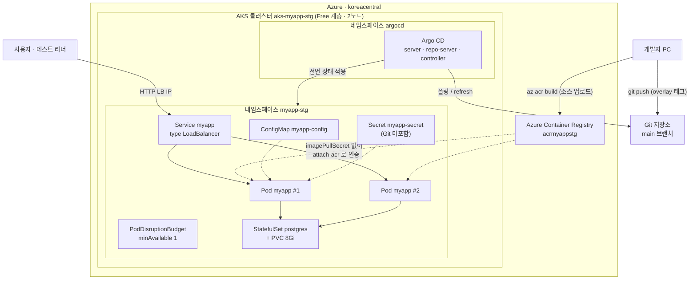
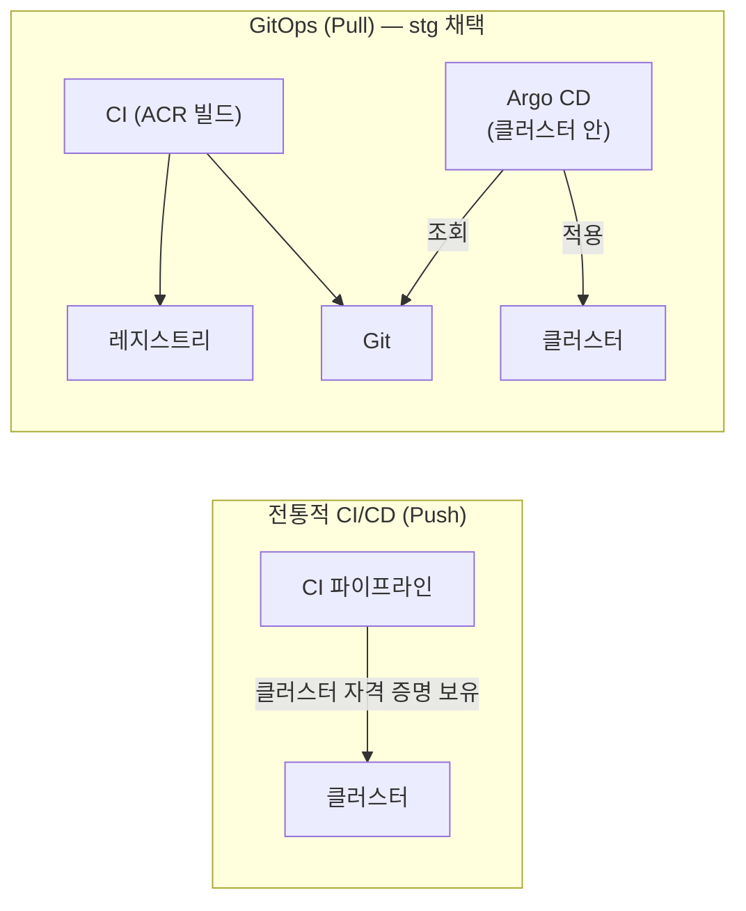
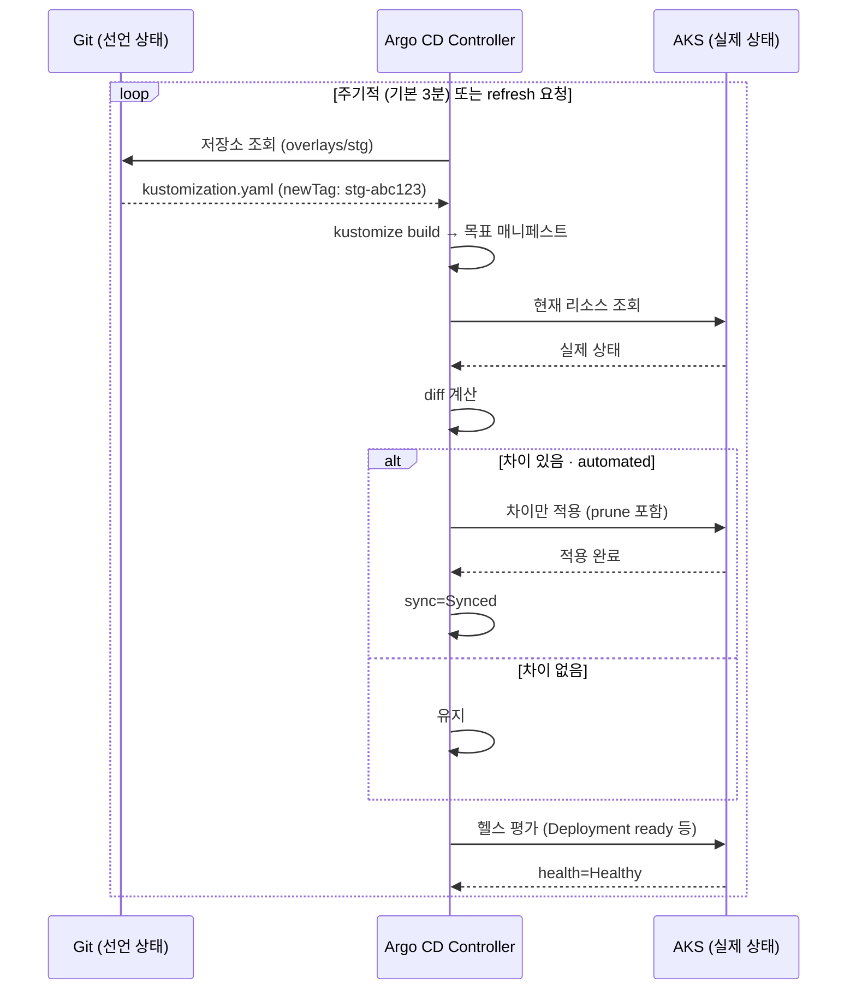

# stg 01. 아키텍처 설계서 — AKS + Argo CD GitOps 검증 환경

> **이 환경이 답하는 질문**: «**배포 방식이 맞는가?**»
> **최우선 품질 속성**: **배포의 재현성·추적성** > 무중단 > 비용 (가용성·성능은 최소)
> **연결**: 실행 스크립트 [`배포/stg/`](../../배포/stg/README.md) · 승격 조건 [dev 04 §7](../dev/04_테스트설계서_dev.md)

---

## 1. 설계 목표와 비목표

| 목표 | 비목표 |
| --- | --- |
| **Git 이 배포의 단일 진실**임을 실증 | 기능 검증 (dev 에서 완료) |
| **드리프트 자동 교정**(selfHeal) 동작 확인 | 운영 등급 가용성·성능 → prd |
| **무중단 롤링 업데이트** 검증 (복제본 2 · `maxUnavailable: 0`) | PaaS 데이터·비밀 관리 → prd |
| 클라우드 빌드(ACR) · 레지스트리 인증 검증 | 다중 리전·재해 복구 |

> 📌 **여기서 검증하는 것은 앱이 아니라 «배포 파이프라인»입니다.** 앱 기능이 통과했다는 전제(dev) 위에서, **어떻게 올라가는가**를 봅니다.

---

## 2. 배포 토폴로지



### 2-1. 구성 요소와 선택 근거

| 구성 요소 | 선택 | dev 대비 변화 | 근거 |
| --- | --- | --- | --- |
| 클러스터 | **AKS Free 계층 · 2노드** | k3d → 관리형 | 실제 클라우드 동작 검증 · SLA 불필요 |
| 네트워크 | **Azure CNI Overlay** | – | IP 소모가 적고 신규 클러스터 기본 권장(9차시 심화) |
| 이미지 빌드 | **`az acr build`** | 로컬 docker → 클라우드 | 개발 PC 사양·Docker 의존 제거 |
| 레지스트리 인증 | **`--attach-acr`** | image import → ACR | imagePullSecret 수동 관리 불필요 |
| 배포 방식 | **Argo CD (pull · automated · selfHeal)** | kubectl push → GitOps | **이 환경의 핵심 검증 대상** |
| 매니페스트 | **Kustomize base + overlays/stg** | 단일 yaml → 계층화 | 환경 차이를 «패치»로만 표현 |
| 복제본 | **2** + `maxUnavailable: 0` | 1 → 2 | **무중단 롤링 업데이트 검증** |
| 데이터베이스 | **StatefulSet + PVC 8Gi** | Deployment → StatefulSet | 재배포 시 데이터 유지(배포 검증에 필요) |
| 외부 노출 | **LoadBalancer** | NodePort | 클라우드 LB 프로비저닝 검증 |
| 비밀 | `kubectl create secret` (**Git 미포함**) | 동일 | Key Vault 는 prd |

---

## 3. GitOps 아키텍처 — 이 환경의 본질

### 3-1. 제어 흐름 (Push 대비 Pull)



| 관점 | Push | **Pull (채택)** |
| --- | --- | --- |
| 자격 증명 | CI 가 **클러스터 관리자 권한** 보유 | CI 는 클러스터 접근 **불필요** → 공격면 감소 |
| 드리프트 | 수동 변경이 그대로 남음 | **자동 교정(selfHeal)** |
| 배포 이력 | 파이프라인 로그 | **Git 이력 = 배포 이력** · `revert` 가 곧 롤백 |
| 다중 클러스터 | 파이프라인 N개 | 저장소 구조로 일괄 관리 |

### 3-2. 조정 루프 (Reconciliation)



### 3-3. syncPolicy 설계

| 옵션 | stg 값 | 근거 | prd 와의 차이 |
| --- | --- | --- | --- |
| `automated` | **활성** | 커밋 즉시 반영 → 배포 방식 검증이 빠름 | prd 는 **비활성**(사람 승인) |
| `automated.prune` | **true** | Git 에서 지운 리소스를 클러스터에서도 제거 | prd 는 신중 적용 |
| `automated.selfHeal` | **true** | **드리프트 자동 교정 — 핵심 검증 항목** | prd 도 권장 |
| `CreateNamespace` | true | 네임스페이스 자동 생성 | 동일 |
| `retry` | 3회 · 10s 백오프 | 일시 오류 흡수 | prd 는 2회 · 30s |

---

## 4. Kustomize 계층 설계

```
배포/stg/config/k8s/
├── base/                          ← 환경 공통 선언
│   ├── kustomization.yaml
│   ├── namespace.yaml
│   ├── configmap.yaml             APP_ENV=stg · DB 접속(비밀 제외)
│   ├── postgres.yaml              StatefulSet + PVC
│   ├── deployment.yaml            image: myapp:latest (자리표시자)
│   └── service.yaml               LoadBalancer
└── overlays/stg/
    └── kustomization.yaml         ← images.newName/newTag · replicas
```

| 계층 | 담는 것 | 담지 않는 것 |
| --- | --- | --- |
| **base** | 리소스 구조 · 프로브 · 리소스 사양 | 환경별 이미지 태그 · 복제본 수 |
| **overlays/stg** | **이미지 레지스트리·태그** · 복제본 | 리소스 구조 |

> 🔑 **`overlays/stg/kustomization.yaml` 의 `newTag` 가 «배포의 단일 진실»** 입니다. `40_deploy.ps1` 이 이 한 줄을 바꾸고 커밋하는 것이 곧 배포 지시입니다.

---

## 5. 네트워크 경로

| 구간 | 프로토콜 | 주소 | 비고 |
| --- | --- | --- | --- |
| 사용자 → LB | HTTP | `http://<LB-IP>` | Azure Load Balancer(공용 IP) |
| LB → Service | TCP 80 | – | `type: LoadBalancer` |
| Service → Pod | TCP 8080 | `app=myapp` | 2개 파드에 분산 |
| Pod → PostgreSQL | TCP 5432 | `postgres:5432` | 클러스터 내부 · `DB_SSL=false` |
| Argo CD → Git | HTTPS 443 | 원격 저장소 | **아웃바운드만** |
| AKS → ACR | HTTPS 443 | `<acr>.azurecr.io` | 관리 ID 인증 |

> ⚠️ **stg 는 공용 IP 로 노출됩니다.** 실데이터를 넣지 않고, 실습 종료 시 반드시 리소스 그룹을 삭제합니다.

---

## 6. 가용성 설계 (검증 목적)

| 항목 | 설정 | 검증하는 것 |
| --- | --- | --- |
| 복제본 | **2** | 한 파드가 죽어도 서비스 유지 |
| 롤링 업데이트 | `maxSurge: 1` · **`maxUnavailable: 0`** | **무중단 배포** |
| PodDisruptionBudget | `minAvailable: 1` | 노드 순환 중 최소 1개 유지 |
| readinessProbe | `/readyz` · 5s 간격 | 준비되지 않은 파드로 트래픽이 가지 않음 |

> 📌 **`maxUnavailable: 0` 의 의미** — 새 파드가 **Ready 가 된 뒤에야** 구 파드를 내립니다. dev(복제본 1)에서는 검증할 수 없던 항목입니다.

---

## 7. 보안 경계

| 영역 | stg 수준 | dev 대비 | prd 와의 차이 |
| --- | --- | --- | --- |
| 클러스터 접근 | Entra ID + kubeconfig | 로컬 → 클라우드 | prd 는 로컬 계정 비활성화 |
| 레지스트리 인증 | **관리 ID (`--attach-acr`)** | 없음 → 관리 ID | 동일 |
| 워크로드 ID | **활성화(OIDC 발급자)** | 없음 | prd 에서 실제 사용 |
| 비밀 저장 | K8s Secret (**Git 미포함**) | 동일 | prd 는 Key Vault + CSI |
| 컨테이너 실행 | 비루트 | 동일 | prd 는 + 읽기 전용 루트FS |
| 이미지 스캔 | 미적용 | 동일 | prd 는 Defender |
| 네트워크 노출 | 공용 LB | localhost → 공용 | prd 는 내부 LB + Ingress |

> 🔎 **워크로드 ID 를 stg 에서 «켜만 두는» 이유** — prd 에서 처음 켜면 OIDC 발급자·연합 자격 증명 설정에서 막힙니다. stg 에서 **활성화 상태를 미리 만들어** 차이를 줄입니다.

> ✅ **켜기만 하고 끝내지 않습니다.** `80_verify.ps1` 이 **G-06~G-09** 로 OIDC 발급자·워크로드 ID 애드온·kubelet 관리 ID·`imagePullSecret` 미사용을 실제 조회해 확인합니다. «켰다고 생각했는데 안 켜져 있던» 상태로 prd 에 가지 않게 하는 것이 목적입니다([공통 07 §6](../공통/07_아이덴티티·시크릿_설계서.md)).

---

## 8. 아키텍처 결정 기록 (ADR)

| ID | 결정 | 대안 | 선택 이유 | 트레이드오프 |
| --- | --- | --- | --- | --- |
| **ADR-S-01** | Argo CD **pull 방식** | GitHub Actions push | CI 가 클러스터 자격 증명을 갖지 않음 · 드리프트 교정 | 클러스터 안에 컴포넌트 추가 운영 |
| **ADR-S-02** | `automated + selfHeal` | manual sync | **드리프트 교정을 실증**하는 것이 이 환경의 목적 | 실수 커밋도 즉시 반영 → prd 는 manual |
| **ADR-S-03** | Kustomize | Helm | 자리표시자 없이 **평문 YAML 그대로** 읽힘 · 학습 부담 낮음 | 복잡한 조건 분기에 약함 |
| **ADR-S-04** | `az acr build` | 로컬 build + push | 개발 PC Docker 의존 제거 · 빌드 환경 통일 | 소스 업로드 시간 |
| **ADR-S-05** | in-cluster PostgreSQL 유지 | PaaS DB | stg 의 목적은 **배포 방식** 검증 · 비용 절감 | 데이터 계층 검증은 prd 에서 |
| **ADR-S-06** | LoadBalancer 직접 노출 | Ingress 컨트롤러 | 구성 요소 최소화 · 테스트 접근 단순 | TLS·경로 라우팅 미검증 → prd |

---

## 9. 제약과 알려진 한계

| 한계 | 영향 | 보완 위치 |
| --- | --- | --- |
| Free 계층 (SLA 없음) | 제어 평면 가용성 보장 없음 | prd (Standard 계층) |
| 단일 노드 풀 · 영역 미분산 | 영역 장애 대응 불가 | prd (3영역 · 시스템/사용자 분리) |
| in-cluster DB | 백업·HA 없음 | prd (PaaS · ZoneRedundant) |
| K8s Secret | 실제 비밀 관리 미검증 | prd (Key Vault + CSI) |
| TLS 없음 | 암호화 경로 미검증 | prd (Ingress TLS) |
| `automated` 동기화 | 잘못된 커밋도 즉시 반영 | prd (수동 승인) |

---

## 10. 참조

| 문서 | 내용 |
| --- | --- |
| [stg 02 프로세스설계서](02_프로세스설계서_stg.md) | GitOps 배포 시퀀스 · 드리프트 교정 |
| [stg 03 구성설계서](03_구성설계서_stg.md) | env.stg.json · Kustomize · Argo CD 매니페스트 |
| [stg 04 테스트설계서](04_테스트설계서_stg.md) | 실행 범위 · GitOps 검증 판정 |
| [`배포/stg/README.md`](../../배포/stg/README.md) | 실행 절차 |
