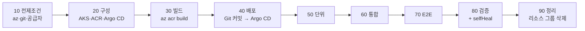
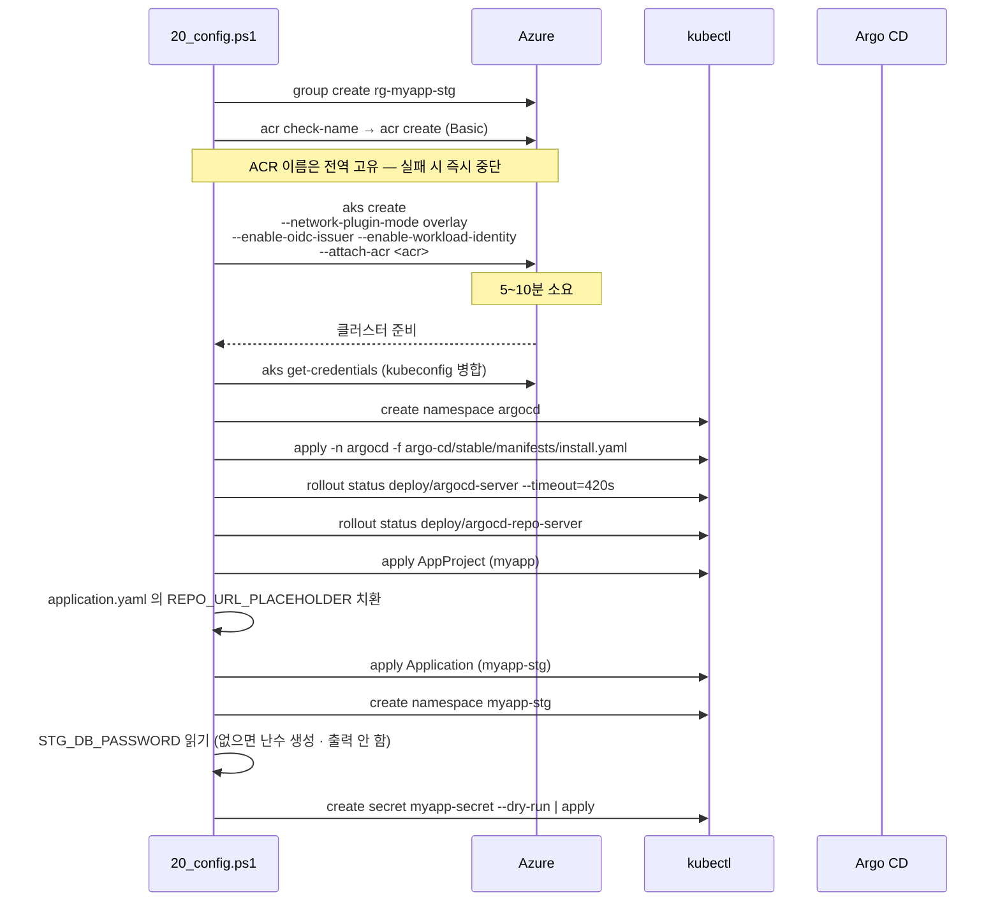
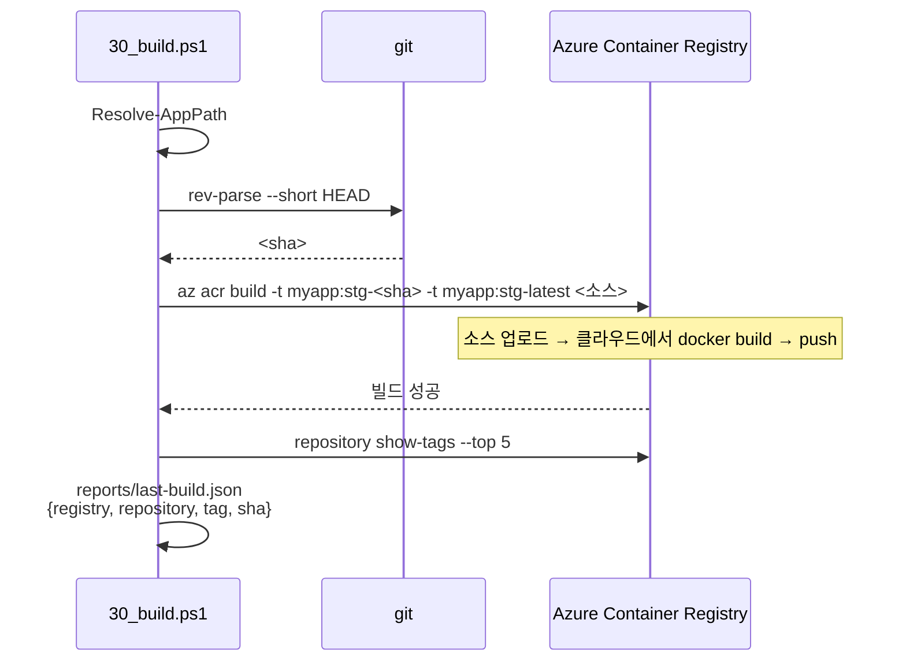
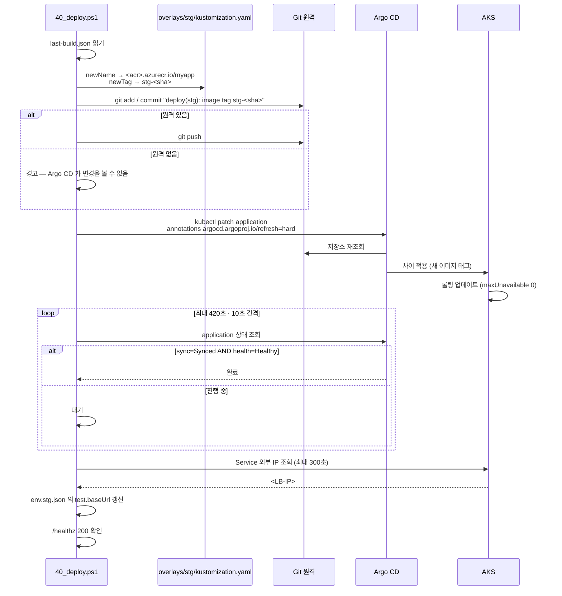
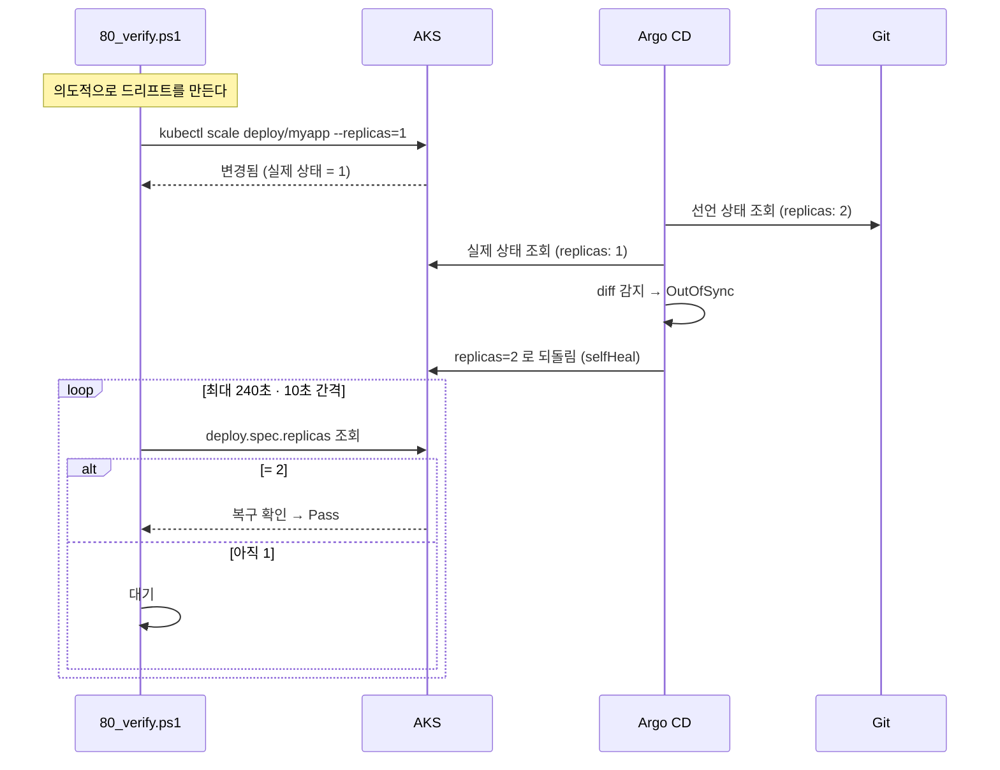

# stg 02. 프로세스 설계서 — GitOps 빌드 · 배포 · 검증 · 롤백

> **답하는 질문**: «커밋이 어떻게 클러스터에 도달하는가»
> **dev 와의 결정적 차이**: 배포 명령이 **`kubectl apply` 가 아니라 `git commit`** 이다.

---

## 1. 전체 파이프라인

---

## 2. 구성 프로세스 (20_config) — 의존 순서

### 2-1. `--attach-acr` 가 하는 일

| 없으면 | 있으면 |
| --- | --- |
| ACR 접근용 `imagePullSecret` 을 수동 생성·갱신 | AKS 관리 ID 에 **AcrPull 역할** 자동 부여 |
| 비밀 회전 부담 | 비밀 자체가 없음 |

---

## 3. 빌드 프로세스 (30_build)

| dev 대비 차이 | 이유 |
| --- | --- |
| 로컬 Docker 엔진 **불필요** | 개발 PC 사양·설치 상태에 의존하지 않음 |
| 이미지가 **레지스트리에 존재** | 클러스터가 pull 로 가져감(image import 불가) |
| 태그가 `stg-<sha>` | 환경 구분 · 추적성 |

---

## 4. 배포 프로세스 (40_deploy) — GitOps 핵심

### 4-1. 폴백 경로

| 상황 | 동작 | 표시 |
| --- | --- | --- |
| Argo CD Application 존재 | **GitOps 경로** (정상) | Synced/Healthy 대기 |
| Application 없음 | `kubectl apply -k` **직접 적용** | «비 GitOps 경로» 경고 |
| Git 원격 없음 | 커밋만 하고 push 생략 | «Argo CD 가 변경을 볼 수 없음» 경고 |

> 📌 **폴백이 있어도 «GitOps 를 검증했다»고 볼 수 없습니다.** `80_verify` 가 Application 상태를 확인하므로 폴백 경로로는 검증을 통과하지 못합니다.

### 4-2. 무중단 롤링 업데이트

```mermaid
gantt
    dateFormat X
    axisFormat %s
    section 구 버전
    Pod A (구)   :0, 40
    Pod B (구)   :0, 55
    section 신 버전
    Pod C (신·생성→Ready) :20, 90
    Pod D (신·생성→Ready) :35, 90
```

| 시점 | 상태 | 가용 파드 |
| --- | --- | --- |
| t0 | 구 2개 | 2 |
| t1 | 구 2 + 신 1(준비 중) | 2 |
| t2 | 신 1 Ready → 구 1 종료 | 2 |
| t3 | 구 1 + 신 2 | 2 |
| t4 | 신 2 | 2 |

> **가용 파드가 한 번도 2 미만으로 내려가지 않습니다** — `maxUnavailable: 0` 의 효과.

---

## 5. 드리프트 교정 프로세스 (selfHeal) — 검증 대상

> 🎯 **이 검증이 stg 의 존재 이유**입니다. «누가 `kubectl` 로 손대도 Git 상태로 돌아온다»를 **실제로 실행해서** 증명합니다.

---

## 6. 롤백 프로세스

| 방법 | 절차 | 특징 |
| --- | --- | --- |
| **Git revert (권장)** | `git revert <배포커밋>` → push → Argo CD 자동 동기화 | **이력이 남음** · GitOps 일관성 유지 |
| overlay 태그 수정 | 이전 태그로 `newTag` 변경 → 커밋 → push | 명시적 · 이력 남음 |
| `kubectl rollout undo` | 즉시 되돌림 | ⚠️ **selfHeal 이 다시 새 버전으로 되돌림** — GitOps 에서는 부적절 |

> ⚠️ **`kubectl rollout undo` 는 stg 에서 «작동하지 않는 것처럼» 보입니다.** selfHeal 이 Git 상태로 다시 수렴시키기 때문입니다. 이것은 결함이 아니라 **의도된 동작**이며, 그 사실을 체감하는 것이 학습 포인트입니다.

---

## 7. 실패 처리 매트릭스

| 단계 | 증상 | 원인 | 조치 |
| --- | --- | --- | --- |
| 10 | `repoUrl` Fail | 자리표시자 그대로 | `env.stg.json` 수정 |
| 10 | 공급자 미등록 | 구독 초기 상태 | `az provider register --namespace Microsoft.ContainerService --wait` |
| 20 | ACR 이름 사용 불가 | 전역 중복 | `acrName` 에 난수 추가 |
| 20 | AKS 생성 실패 | 쿼터·리전 용량 | 다른 리전 또는 노드 크기 변경 |
| 20 | argocd-server 대기 초과 | 노드 자원 부족 | 노드 수·크기 확인 |
| 30 | `az acr build` 실패 | Dockerfile 오류 | ACR 빌드 로그 확인 |
| 40 | Application `Unknown` | repoURL 오류 · 비공개 저장소 | URL 확인 · Argo CD 에 자격 증명 등록 |
| 40 | `OutOfSync` 유지 | push 누락 | `git log origin/main` 확인 |
| 40 | `ImagePullBackOff` | ACR 연결 끊김 | `az aks update --attach-acr` |
| 40 | LB IP `<pending>` | 공용 IP 쿼터 | 구독 쿼터 확인 |
| 80 | selfHeal 미복구 | `selfHeal: false` | Application `syncPolicy` 확인 |

---

## 8. 소요 시간 기준

| 단계 | 최초 | 재실행 |
| --- | --- | --- |
| 10 전제조건 | 20~40초 | 20초 |
| 20 구성 | **8~15분** (AKS 5~10 + Argo CD 2~3) | 30초 (재사용) |
| 30 빌드 | 2~4분 | 1~2분 |
| 40 배포 | 2~5분 (LB IP 할당 포함) | 1~3분 |
| 50~70 테스트 | 2~4분 | 1~2분 |
| 80 검증 | 1~5분 (selfHeal 대기 포함) | 동일 |
| 90 정리 | 요청 즉시(백그라운드 5~10분) | – |
| **합계** | **약 20~35분** | **약 6~12분** |
