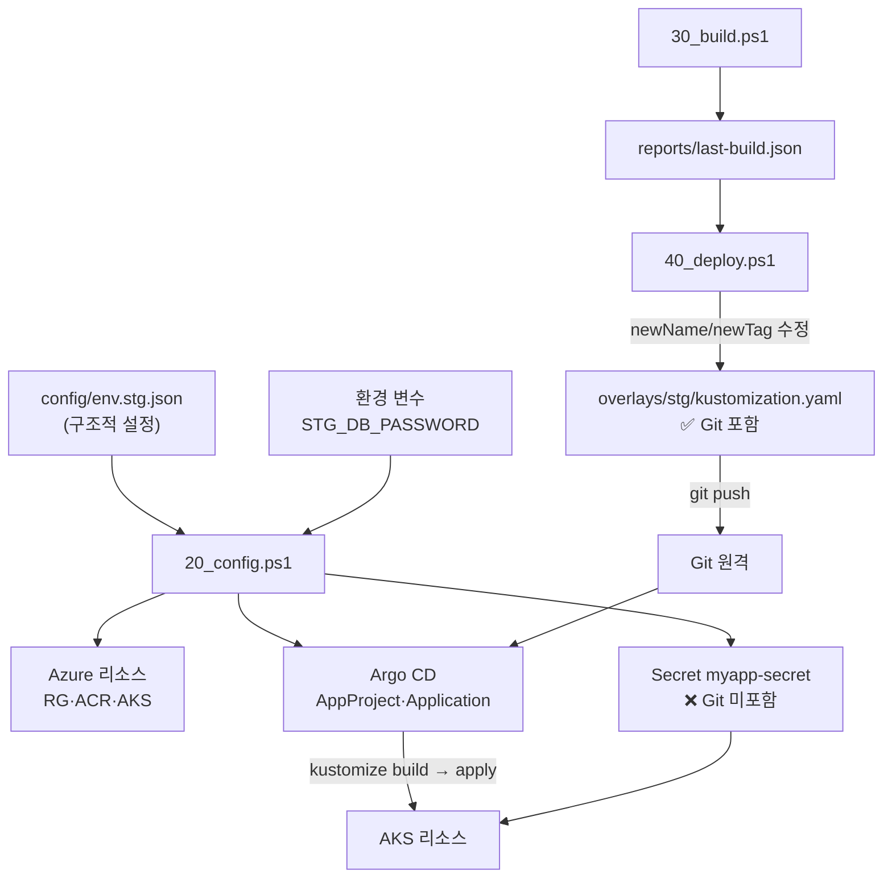

# stg 03. 구성 설계서 — 설정 · Kustomize · Argo CD

> **답하는 질문**: «설정과 매니페스트가 어떻게 조립되어 클러스터에 도달하는가»
> **핵심 원칙**: **Git 에 들어가는 것과 들어가지 않는 것을 명확히 가른다.**

---

## 1. 설정 흐름



### 1-1. Git 포함 / 미포함 경계 (가장 중요한 구분)

| Git 에 **포함** | Git 에 **미포함** |
| --- | --- |
| `base/*.yaml` (구조) | **Secret 값** (DB 비밀번호) |
| `overlays/stg/kustomization.yaml` (**이미지 태그**) | `env.stg.json` 의 `test.baseUrl` (배포 후 자동 기록) |
| `argocd/project.yaml` · `application.yaml` (자리표시자 상태) | `reports/*.json` (실행 결과) |
| ConfigMap (비밀 아닌 값) | kubeconfig |

> 🔐 **Secret 을 Git 에 넣는 순간 GitOps 저장소가 곧 유출 경로가 됩니다.** 이 경계가 stg 구성 설계의 제1원칙입니다.

---

## 2. `config/env.stg.json` 키 명세

| 경로 | 기본값 | 설명 | 변경 필수 |
| --- | --- | --- | :---: |
| `azure.resourceGroup` | `rg-myapp-stg` | 리소스 그룹 (정리 단위) | – |
| `azure.location` | `koreacentral` | 리전 | – |
| **`azure.acrName`** | `acrmyappstg` | **전역 고유** · 소문자+숫자 5~50자 | ✅ |
| `azure.aks.name` | `aks-myapp-stg` | 클러스터 이름 | – |
| `azure.aks.nodeCount` | `2` | 노드 수 | – |
| `azure.aks.nodeSize` | `Standard_D2s_v5` | 노드 VM 크기 | – |
| `azure.aks.networkPlugin` / `networkPluginMode` | `azure` / `overlay` | **CNI Overlay** | – |
| `azure.aks.enableWorkloadIdentity` / `enableOidcIssuer` | `true` | prd 대비 사전 활성화 | – |
| `azure.aks.tier` | `free` | SLA 없음(검증용) | – |
| `argocd.namespace` | `argocd` | Argo CD 설치 위치 | – |
| **`argocd.repoUrl`** | 자리표시자 | **Argo CD 가 감시할 Git 저장소** | ✅ |
| `argocd.targetRevision` | `main` | 추적 브랜치 | – |
| `argocd.path` | `배포/stg/config/k8s/overlays/stg` | 저장소 내 경로 | – |
| `argocd.syncPolicy` | `automated` | 자동 동기화 | – |
| `argocd.localPortForward` | `8090` | UI 접속 포트 | – |
| `app.namespace` | `myapp-stg` | 앱 네임스페이스 | – |
| `app.replicas` | `2` | **무중단 검증용** | – |
| `db.mode` | `in-cluster` | stg 는 컨테이너 DB | – |
| `db.passwordEnvVar` | `STG_DB_PASSWORD` | 비밀번호 원천 | – |
| `test.baseUrl` | `""` | **배포 후 자동 기록** | – |
| `test.allowWrite` | `true` | 쓰기 TC 허용 | – |

> ⚠️ **`acrName` 과 `repoUrl` 두 개는 반드시 바꿔야 합니다.** `10_prereq.ps1` 이 이를 검사하고 미변경 시 중단합니다.

---

## 3. Kustomize 구조

### 3-1. base

| 파일 | 리소스 | 핵심 설정 |
| --- | --- | --- |
| `namespace.yaml` | Namespace | `myapp-stg` |
| `configmap.yaml` | ConfigMap | `APP_ENV=stg` · `DB_HOST=postgres` · `DB_SSL=false` |
| `postgres.yaml` | Service + **StatefulSet** | PVC 8Gi · `PGDATA` 하위 경로 · `pg_isready` 프로브 |
| `deployment.yaml` | Deployment + **PDB** | replicas 2 · `maxUnavailable: 0` · `image: myapp:latest`(자리표시자) |
| `service.yaml` | Service | `type: LoadBalancer` · 80 → 8080 |

### 3-2. overlays/stg

```yaml
namespace: myapp-stg
resources:
  - ../../base
images:
  - name: myapp                                  # base 의 이미지 이름과 매칭
    newName: acrmyappstg.azurecr.io/myapp        # 40_deploy 가 갱신
    newTag: PLACEHOLDER                          # 40_deploy 가 갱신 ← 배포의 단일 진실
replicas:
  - name: myapp
    count: 2
```

| 패치 항목 | 왜 overlay 에 두는가 |
| --- | --- |
| `images.newName` | 레지스트리는 환경마다 다름 |
| **`images.newTag`** | **환경마다 배포 버전이 다름 — 이 줄이 배포 지시** |
| `replicas` | 환경마다 가용성 요구가 다름 |

> 📌 **base 의 `image: myapp:latest` 는 절대 그대로 배포되지 않습니다.** overlay 가 반드시 덮어씁니다. `80_verify` 가 «배포 이미지 = 빌드 태그»를 확인해 이를 보장합니다.

---

## 4. Argo CD 매니페스트

### 4-1. AppProject (`project.yaml`)

| 항목 | 값 | 보안 의미 |
| --- | --- | --- |
| `sourceRepos` | `*` (**실습용**) | 운영은 **특정 저장소만** 허용해야 함 |
| `destinations.namespace` | `myapp-*` | 다른 네임스페이스 배포 차단 |
| `clusterResourceWhitelist` | `Namespace` 만 | 클러스터 범위 리소스 생성 제한 |
| `namespaceResourceWhitelist` | `*` | 네임스페이스 안에서는 자유 |

### 4-2. Application (`application.yaml`)

| 필드 | 값 | 근거 |
| --- | --- | --- |
| `source.repoURL` | `REPO_URL_PLACEHOLDER` → 치환 | 저장소가 사람마다 다름 |
| `source.path` | `배포/stg/config/k8s/overlays/stg` | overlay 를 가리킴 |
| `syncPolicy.automated.prune` | `true` | Git 삭제 = 클러스터 삭제 |
| `syncPolicy.automated.selfHeal` | **`true`** | **드리프트 교정 검증** |
| `syncOptions` | `CreateNamespace=true` · `PrunePropagationPolicy=foreground` | 네임스페이스 자동 · 순서 있는 삭제 |
| `retry` | 3회 · 10s → 최대 3m | 일시 오류 흡수 |
| `finalizers` | `resources-finalizer.argocd.argoproj.io` | Application 삭제 시 리소스도 정리 |

---

## 5. ConfigMap · Secret 매핑

### 5-1. `myapp-config` (base 에 선언 · Git 포함)

| 키 | 값 | dev 대비 |
| --- | --- | --- |
| `APP_ENV` | **`stg`** | 변경 |
| `PORT` | `8080` | 동일 |
| `DB_HOST` | `postgres` | 동일(클러스터 내부) |
| `DB_PORT` · `DB_NAME` · `DB_USER` | `5432` · `appdb` · `appuser` | 동일 |
| `DB_SSL` | `false` | 동일(내부 통신) |

### 5-2. `myapp-secret` (스크립트 생성 · **Git 미포함**)

| 키 | 원천 | dev 대비 |
| --- | --- | --- |
| `DB_PASSWORD` | 환경 변수 `STG_DB_PASSWORD` → **없으면 난수 생성(출력 안 함)** | **기본값 없음** |

> 🔎 **dev 는 기본값이 있고 stg 는 없는 이유** — dev 는 학습 진입 장벽 제거가 우선, stg 부터는 «비밀은 항상 외부에서 주입»하는 습관을 강제합니다. 값을 **화면에 출력하지 않는 것**도 동일한 이유입니다.

---

## 6. 리소스 사양

| 워크로드 | requests | limits | 근거 |
| --- | --- | --- | --- |
| `myapp` × 2 | cpu 100m · mem 128Mi | cpu 500m · mem 512Mi | dev 대비 상향(2노드 클러스터) |
| `postgres` | cpu 100m · mem 256Mi | cpu 500m · mem 512Mi | PVC 기반 |
| PVC | 8Gi | – | 재배포 시 데이터 유지 |

---

## 7. 설정 변경 영향 범위

| 변경 | 함께 바꿔야 할 것 |
| --- | --- |
| `azure.acrName` | overlay 의 `newName` (40_deploy 가 자동 갱신) |
| `argocd.repoUrl` | Application 매니페스트(20_config 가 자동 치환) |
| `argocd.path` | 저장소 내 실제 폴더 경로 |
| `app.namespace` | base 의 모든 `namespace` · overlay 의 `namespace` · Application `destination` |
| `app.replicas` | overlay 의 `replicas.count` · PDB `minAvailable` 검토 |
| `db.*` | base `configmap.yaml` (**Git 커밋 필요**) |

> ⚠️ **stg 에서는 설정 변경이 «Git 커밋»을 동반합니다.** `kubectl edit` 으로 바꾸면 selfHeal 이 되돌립니다.

---

## 8. 구성 검증 체크리스트

| 확인 | 명령 | 기대 |
| --- | --- | --- |
| Application 등록 | `kubectl get application myapp-stg -n argocd` | `Synced` / `Healthy` |
| overlay 태그 반영 | `kubectl get deploy myapp -n myapp-stg -o jsonpath='{.spec.template.spec.containers[0].image}'` | `<acr>.azurecr.io/myapp:stg-<sha>` |
| ConfigMap | `kubectl get cm myapp-config -n myapp-stg -o yaml` | `APP_ENV: stg` |
| Secret 키 존재 | `kubectl get secret myapp-secret -n myapp-stg -o jsonpath='{.data}'` | `DB_PASSWORD` |
| **Secret 이 Git 에 없는지** | `git log -p -- 배포/stg/config \| findstr -i password` | **결과 없음** |
| PVC 바인딩 | `kubectl get pvc -n myapp-stg` | `Bound` |
| ACR 연결 | `kubectl get events -n myapp-stg \| findstr -i pull` | `ImagePullBackOff` 없음 |
