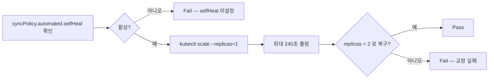
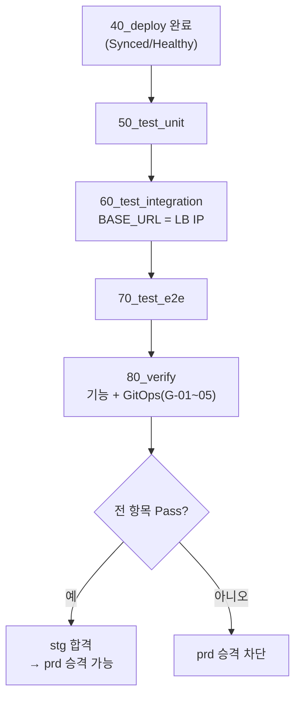

# stg 04. 테스트 설계서 — 실행 범위 · GitOps 검증 · 판정

> **답하는 질문**: «배포 방식이 맞다는 것을 무엇으로 증명하는가»
> **TC 정의**: [공통 06 테스트설계서](../공통/06_테스트설계서.md)

---

## 1. stg 테스트의 위치

| 이 환경에서 검증하는 것 | 검증하지 않는 것 |
| --- | --- |
| **Git → 클러스터 반영의 정확성** | 기능 정확성 (dev 에서 완료) |
| **드리프트 자동 교정(selfHeal)** | PaaS 데이터·비밀 관리 → prd |
| **무중단 롤링 업데이트** | 영역 분산·운영 등급 가용성 → prd |
| 클라우드 빌드·레지스트리 인증 | 성능·부하 |

> 📌 **기능 TC 를 다시 실행하는 이유** — 기능을 재검증하려는 것이 아니라, **«같은 이미지가 다른 환경에서도 동일하게 동작하는가»**(NFR-07)를 확인하기 위함입니다. 여기서 실패하면 원인은 코드가 아니라 **환경 구성**입니다.

---

## 2. 실행 범위

| TC 그룹 | 실행 | dev 대비 | 근거 |
| --- | :---: | --- | --- |
| 단위 U-A-01~06 · U-B-* | ✅ 전체 | 동일 | 코드 회귀 확인 |
| 통합 I-A-01~08 | ✅ 전체 | 동일 | `ALLOW_WRITE=true` |
| 통합 I-A-09 (비밀 주입) | ⚠️ 축약 | 동일 | K8s Secret 확인(Key Vault 는 prd) |
| E2E E-A-01~04 | ✅ 전체 | 동일 | 쓰기 포함 |
| E2E E-B-01~04 | ✅ 전체 | 동일 | 심화 트랙 |
| **GitOps 검증 G-01~05** | ✅ | **stg 신규** | **이 환경의 핵심** |
| **아이덴티티 전제 G-06~09** | ✅ | **stg 신규** | prd 에서 처음 막히지 않도록 |

**환경 변수**

| 변수 | 값 | 출처 |
| --- | --- | --- |
| `BASE_URL` | `http://<LB-IP>` | `40_deploy.ps1` 이 `env.stg.json` 에 자동 기록 |
| `APP_ENV` | `stg` | 캡처 파일 접두어 |
| `ALLOW_WRITE` | `true` | 쓰기 TC 실행 |

---

## 3. GitOps 검증 TC (stg 고유)

| TC-ID | 시나리오 | Given | When | Then | 실패 시 의미 |
| --- | --- | --- | --- | --- | --- |
| **G-01** | 동기화 상태 | 배포 완료 | Application 조회 | `sync.status = Synced` | Git 과 클러스터 불일치 |
| **G-02** | 헬스 상태 | 배포 완료 | Application 조회 | `health.status = Healthy` | 워크로드 비정상 |
| **G-03** | **배포 이미지 = 빌드 태그** | `last-build.json` 존재 | Deployment 이미지 조회 | `*:<빌드 태그>` 와 일치 | **커밋이 반영되지 않음** |
| **G-04** | 복제본 수 | overlay `replicas: 2` | Deployment 조회 | `readyReplicas ≥ 2` | 자원 부족·스케줄 실패 |
| **G-05** | **selfHeal 드리프트 교정** | selfHeal 활성 | `kubectl scale --replicas=1` 강제 변경 | **240초 내 replicas 가 2로 자동 복구** | **GitOps 가 작동하지 않음** |

### 3-0-1. 아이덴티티 전제 검증 (G-06~G-09) — prd 에서 처음 만나지 않기 위해

| TC-ID | 검증 | 통과 기준 | 실패 시 의미 | 공통 07 대응 |
| --- | --- | --- | --- | --- |
| **G-06** | AKS **OIDC 발급자** 사용 | `oidcIssuerProfile.enabled = true` | prd 에서 연합 자격 증명을 만들 수 없음 | ID-01 |
| **G-07** | AKS **워크로드 ID 애드온** 사용 | `securityProfile.workloadIdentity.enabled = true` | 파드에 토큰이 주입되지 않음 | ID-02 |
| **G-08** | **kubelet 관리 ID** 로 ACR pull | kubelet clientId 존재 | ACR 인증을 비밀로 해야 함 | – |
| **G-09** | **`imagePullSecret` 미사용** | Deployment 에 `imagePullSecrets` 없음 | 레지스트리 비밀을 직접 관리하게 됨 | ID-12 |

> 🔎 **stg 에서 워크로드 ID 를 «쓰지는» 않습니다.** stg 의 DB 는 클러스터 안에 있어 Entra 인증 대상이 아니기 때문입니다. 여기서 확인하는 것은 **«켜져 있는가»**뿐이며, **«작동하는가»는 prd(P-16~P-23)**에서 검증합니다. 이 구분이 두 환경의 MECE 경계입니다.

### 3-1. G-05 실행 절차 (`80_verify.ps1` 내장)



> ⚠️ **이 테스트는 «의도적으로 시스템을 망가뜨립니다».** stg 이므로 안전하며, **prd 에서는 실행하지 않습니다**(운영 중 레플리카 축소는 위험).

---

## 4. 실행 절차



### 4-1. 단계별 전제

| 단계 | 전제 | 미충족 시 |
| --- | --- | --- |
| 50 단위 | 없음 | – |
| 60 통합 | `test.baseUrl` 채워짐 · `/healthz` 200 | «baseUrl 이 비어 있습니다 — 40_deploy 를 먼저 실행» |
| 70 E2E | 위 + Playwright 브라우저 | 자동 설치 |
| 80 검증 | Argo CD Application 존재 | selfHeal 검증 불가 → Fail |

---

## 5. 판정 기준 (80_verify)

| # | 항목 | 통과 기준 | 구분 |
| --- | --- | --- | --- |
| 1 | `sync.status` | `Synced` | GitOps |
| 2 | `health.status` | `Healthy` | GitOps |
| 3 | `readyReplicas` | ≥ 2 | 가용성 |
| 4 | **배포 이미지 = 빌드 태그** | 일치 | GitOps |
| 5 | `/healthz` `/readyz` `/version` | 모두 200 | 기능 |
| 6 | **selfHeal 복구** | 240초 내 replicas 2 복구 | **GitOps 핵심** |
| 7~10 | **OIDC 발급자 · 워크로드 ID 애드온 · kubelet MI · imagePullSecret 미사용** | 모두 충족 | 아이덴티티 전제 |

---

## 6. 무중단 배포 확인 (선택 · 수동)

> 자동 TC 에는 없지만, stg 에서 직접 확인해 볼 가치가 큰 항목입니다.

```powershell
# 터미널 1 — 1초 간격으로 계속 호출
while ($true) {
  try { (Invoke-WebRequest "$base/healthz" -UseBasicParsing -TimeoutSec 2).StatusCode }
  catch { "FAIL $(Get-Date -Format HH:mm:ss)" }
  Start-Sleep -Seconds 1
}

# 터미널 2 — 새 태그로 재배포
pwsh -File .\30_build.ps1 ; pwsh -File .\40_deploy.ps1
```

| 기대 | dev 와의 차이 |
| --- | --- |
| **200 이 끊기지 않음** | dev(복제본 1)에서는 짧은 `FAIL` 이 나타남 |

---

## 7. 리포트 산출물

| 파일 | 내용 | 쓰임 |
| --- | --- | --- |
| `배포/stg/reports/stg_prereq_*.json` | 전제조건 | – |
| `배포/stg/reports/last-build.json` | 레지스트리·태그·SHA | 40 배포 · G-03 |
| `배포/stg/reports/stg_unit_*.json` | 단위 | 승격 판단 |
| `배포/stg/reports/stg_integration_*.json` | 통합 | 승격 판단 |
| `배포/stg/reports/stg_e2e_*.json` | E2E + 캡처 수 | 승격 판단 |
| **`배포/stg/reports/stg_verify_*.json`** | **기능 + GitOps 검증 — `fail=0` 이 prd 승격 조건** | **게이트** |
| `배포/stg/reports/stg_pipeline_*.json` | 전체 요약 | 회고 |

> 🔑 **`prd/10_prereq.ps1` 이 `stg_verify_*.json` 의 `fail=0` 을 직접 읽어 확인합니다.** 검증되지 않은 것이 운영으로 가지 못하도록 **스크립트가 강제**합니다.

---

## 8. 결함 진단 가이드

| 실패 | 가장 흔한 원인 | 첫 확인 |
| --- | --- | --- |
| G-01 `OutOfSync` | `git push` 누락 | `git log origin/main -1` |
| G-01 `Unknown` | repoURL 오류 · 비공개 저장소 | `kubectl describe application myapp-stg -n argocd` |
| G-02 `Degraded` | 파드 기동 실패 | `kubectl get pods -n myapp-stg` |
| **G-03 이미지 불일치** | overlay 커밋이 원격에 없음 | `git show HEAD -- 배포/stg/.../kustomization.yaml` |
| G-04 replicas 부족 | 노드 자원 부족 | `kubectl describe pod` 의 `FailedScheduling` |
| **G-05 미복구** | `selfHeal: false` | `kubectl get application -o jsonpath='{.spec.syncPolicy}'` |
| I-A-02 `/readyz` 503 | PVC 미바인딩 · postgres 미준비 | `kubectl get pvc,pods -n myapp-stg` |
| E-A-* 타임아웃 | LB IP 미할당 | `kubectl get svc myapp -n myapp-stg` |

---

## 9. stg → prd 승격 게이트

| 조건 | 확인 위치 |
| --- | --- |
| 단위·통합·E2E 전체 Pass | `stg_unit/integration/e2e_*.json` 의 `fail=0` |
| **GitOps 검증 G-01~05 Pass** | `stg_verify_*.json` 의 `fail=0` |
| **아이덴티티 전제 G-06~09 Pass** | `stg_verify_*.json` — prd 워크로드 ID 의 선행 조건 |
| **selfHeal 복구 확인** | `stg_verify` 의 해당 항목 Pass |
| 무중단 배포 확인 (권장) | 수동 관찰 |
| 개인정보 미포함 | 캡처 육안 확인 |

> ✅ 위가 충족되면 **prd 승격 가능**합니다. prd 에서는 «기능»도 «배포 방식»도 아닌 **«장애가 나도 살아남는가»**를 검증합니다.
