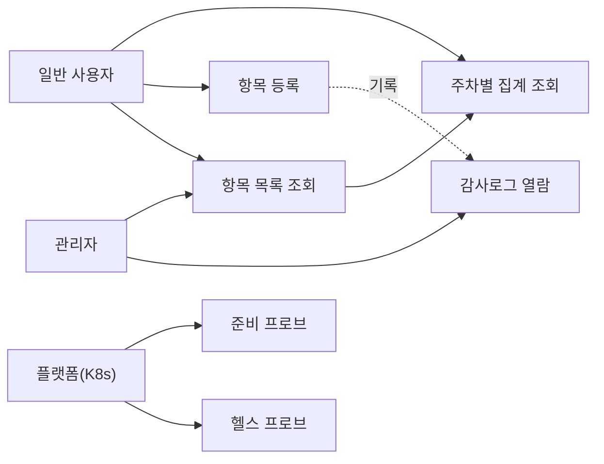

# 01. 기능명세서 (공통)

> **답하는 질문**: «무엇이 합격인가»
> **범위**: APP-A 나만의 업무 앱 · APP-B 웹 테트리스 게임 — **환경과 무관한 기능 정의**
> **연결**: 인수조건(AC) → [06 테스트설계서](06_테스트설계서.md) 의 TC 로 1:1 대응

---

## 1. 문서 개요

### 1-1. 목적

이 문서는 «완료»의 정의를 **검증 가능한 문장**으로 고정합니다. 여기에 없는 것은 만들지 않고, 여기 있는 것은 반드시 테스트로 증명합니다.

### 1-2. 용어

| 용어 | 정의 |
| --- | --- |
| **항목(Item)** | 업무 앱이 관리하는 최소 단위 레코드 (제목 · 금액 · 생성 시각) |
| **주차(Week)** | ISO 8601 주차. 월요일 시작, `YYYY-Www` 형식 |
| **집계(Summary)** | 항목을 주차 단위로 묶어 건수·금액 합계를 낸 결과 |
| **감사로그(Audit Log)** | 누가·언제·무엇을 했는지 기록한 변경 이력 |
| **테트로미노** | 정사각형 4개로 구성된 블록. I·O·T·S·Z·J·L 7종 |
| **월킥(Wall Kick)** | 회전 시 충돌하면 위치를 보정해 회전을 성립시키는 규칙 |

### 1-3. 액터

| 액터 | APP-A | APP-B |
| --- | --- | --- |
| **일반 사용자** | 항목 조회·등록, 집계 확인 | 게임 플레이 |
| **관리자** | + 전체 항목 관리, 감사로그 열람 | – |
| **플랫폼(K8s)** | 프로브 호출(`/healthz`·`/readyz`) | 프로브 호출(`/healthz`) |
| **테스트 러너** | API·화면 자동 검증 | 화면 자동 검증 |

---

## 2. APP-A 나만의 업무 앱

### 2-1. 유스케이스

### 2-2. 기능 요구사항 (FR)

| ID | 기능 | 설명 | 우선순위 | 관련 API |
| --- | --- | --- | --- | --- |
| **FR-A-01** | 항목 목록 조회 | 최근 항목을 생성 역순으로 최대 200건 반환. **중복 id 는 제거** | 필수 | `GET /api/items` |
| **FR-A-02** | 항목 등록 | 제목·금액을 받아 저장하고 생성된 항목을 반환 | 필수 | `POST /api/items` |
| **FR-A-03** | 입력 검증 | 제목은 **필수·공백 불가**, 금액은 **숫자**여야 함. 위반 시 400 + 사유 | 필수 | `POST /api/items` |
| **FR-A-04** | 주차별 집계 | 전체 항목을 **ISO 주차**로 묶어 건수·금액 합계를 주차 오름차순 반환 | 필수 | `GET /api/summary` |
| **FR-A-05** | 감사로그 기록 | 항목 등록 시 **행위자·행위·대상**을 자동 기록 | 필수 | 내부 |
| **FR-A-06** | 헬스 프로브 | 프로세스 생존을 200 으로 응답 | 필수 | `GET /healthz` |
| **FR-A-07** | 준비 프로브 | **DB 연결이 가능할 때만** 200, 아니면 503 | 필수 | `GET /readyz` |
| **FR-A-08** | 버전 노출 | 배포된 이미지 태그와 환경명을 반환 | 필수 | `GET /version` |
| **FR-A-09** | 목록 화면 | 항목을 표로 표시하고 새로고침 가능 | 필수 | 화면 |
| **FR-A-10** | 등록 화면 | 제목·금액 입력 후 추가. 실패 시 사용자에게 알림 | 필수 | 화면 |
| **FR-A-11** | 빈 상태 표시 | 데이터가 0건이면 **«데이터가 없습니다» 안내**를 표시하고 표는 숨김 | 필수 | 화면 |
| **FR-A-12** | 환경·버전 표시 | 화면 상단에 현재 환경과 버전 표시 | 권장 | 화면 |
| **FR-A-13** | 개인정보 마스킹 | 이름·사번을 규칙에 따라 마스킹하는 함수 제공 | 필수 | 내부 |
| **FR-A-14** | 스키마 자동 생성 | 기동 시 필요한 테이블이 없으면 생성 | 필수 | 내부 |

### 2-3. 인수조건 (AC) — Given / When / Then

| ID | 구분 | Given | When | Then |
| --- | --- | --- | --- | --- |
| **AC-A-01** | 정상 | 앱이 기동되어 DB 연결이 가능함 | `GET /readyz` 호출 | **200** 과 `{status:"ready"}` 반환 |
| **AC-A-02** | 정상 | 항목이 0건인 상태 | 화면 진입 | **«데이터가 없습니다»** 안내가 보이고 표는 숨겨짐 |
| **AC-A-03** | 정상 | 제목 «주간보고», 금액 500 입력 | 추가 버튼 클릭 | **201** 로 저장되고 목록 최상단에 표시됨 |
| **AC-A-04** | 예외 | 제목이 빈 문자열 | `POST /api/items` | **400** 과 «title 은 필수» 메시지, **저장되지 않음** |
| **AC-A-05** | 예외 | 금액이 숫자가 아님 | `POST /api/items` | **400** 반환, 저장되지 않음 |
| **AC-A-06** | 예외 | DB 가 연결 불가 상태 | `GET /readyz` | **503** 반환 (`/healthz` 는 200 유지) |
| **AC-A-07** | 정상 | 서로 다른 주에 속한 항목 3건 존재 | `GET /api/summary` | **주차 2개**가 오름차순으로, 각 건수·합계가 정확히 반환 |
| **AC-A-08** | 정상 | 항목이 등록됨 | 감사로그 조회 | `action=create`, `target=item:<id>` 레코드가 존재 |

> 📌 **AC-A-01 ~ 06 이 3차시 실습의 «인수조건 6개»** 에 해당합니다(정상 3 · 예외 3). 07·08 은 집계·감사 검증용으로 추가되었습니다.

### 2-4. 비기능 요구사항 (NFR)

| ID | 항목 | 기준 | 검증 위치 |
| --- | --- | --- | --- |
| **NFR-01** | 응답 시간 | 목록 조회 p95 < 500ms (200건 기준) | 통합 테스트 |
| **NFR-02** | 기동 시간 | 컨테이너 시작 후 60초 이내 `/readyz` 200 | 배포 검증 |
| **NFR-03** | 보안 — 비밀 | 비밀값이 **코드·이미지·Git 어디에도 평문으로 없을 것** | 환경별 구성 설계 |
| **NFR-04** | 보안 — 실행 | 컨테이너는 **비루트**로 실행 | 배포 검증 |
| **NFR-05** | 개인정보 | 산출물(캡처·엑셀·로그)에 실제 개인정보 없음 | 테스트 판정 |
| **NFR-06** | 관측 | 오류 발생 시 원인 추적 가능한 로그 출력 | 운영 설계 |
| **NFR-07** | 이식성 | **동일 이미지**가 dev·stg·prd 에서 동작(환경 차이는 주입으로만) | 구성 설계 |

### 2-5. 오류 정의

| 코드 | 상황 | 사용자 메시지 | HTTP |
| --- | --- | --- | --- |
| `E-VALIDATION` | 필수값 누락·형식 오류 | «입력값을 확인하세요 (제목은 필수)» | 400 |
| `E-NOT_FOUND` | 없는 경로 | «요청한 자원을 찾을 수 없습니다» | 404 |
| `E-DB_UNAVAILABLE` | DB 연결 불가 | (프로브 전용, 화면 노출 없음) | 503 |
| `E-INTERNAL` | 그 밖의 서버 오류 | «일시적인 오류가 발생했습니다» | 500 |

---

## 3. APP-B 웹 테트리스 게임

### 3-1. 기능 요구사항 (FR)

| ID | 기능 | 설명 | 우선순위 |
| --- | --- | --- | --- |
| **FR-B-01** | 테트로미노 7종 | I·O·T·S·Z·J·L 을 정의하고 무작위 출현 | 필수 |
| **FR-B-02** | 이동 | 좌·우 이동, 벽·블록 충돌 시 이동 불가 | 필수 |
| **FR-B-03** | 회전 + 월킥 | **SRS** 회전. 충돌 시 월킥으로 보정, 보정 불가면 회전 취소 | 필수 |
| **FR-B-04** | 중력 | 레벨에 따른 간격으로 자동 하강 | 필수 |
| **FR-B-05** | 소프트 드롭 | 아래 키로 가속 하강 | 필수 |
| **FR-B-06** | 하드 드롭 | 즉시 바닥까지 내리고 고정 | 필수 |
| **FR-B-07** | 라인 클리어 | 가득 찬 줄을 제거하고 위를 내림 (1~4줄 동시) | 필수 |
| **FR-B-08** | 점수·레벨 | 제거 줄 수에 따라 점수 부여, 누적으로 레벨·속도 상승 | 필수 |
| **FR-B-09** | 다음 블록 표시 | 다음에 나올 블록 미리보기 | 필수 |
| **FR-B-10** | 홀드 | 현재 블록을 보관하고 교체 (1회/블록) | 권장 |
| **FR-B-11** | 일시정지 | 진행 중 정지·재개 | 권장 |
| **FR-B-12** | 게임오버·재시작 | 스폰 위치 충돌 시 종료, 재시작 가능 | 필수 |

### 3-2. 점수 규칙

| 동시 제거 줄 수 | 명칭 | 점수 (레벨 n) |
| --- | --- | --- |
| 1 | Single | 100 × n |
| 2 | Double | 300 × n |
| 3 | Triple | 500 × n |
| 4 | **Tetris** | 800 × n |

> 레벨은 **누적 10줄마다 1 상승**하며, 중력 간격이 짧아집니다.

### 3-3. 인수조건 (AC) — 8개

| ID | 구분 | Given | When | Then |
| --- | --- | --- | --- | --- |
| **AC-B-01** | 정상 | 블록이 좌측 벽에 인접 | 왼쪽 이동 | **이동하지 않음** (보드 밖 진입 금지) |
| **AC-B-02** | 정상 | 블록 아래에 고정 블록 존재 | 하강 | **충돌 위치에서 고정**되고 다음 블록 생성 |
| **AC-B-03** | 정상 | I 블록이 벽에 붙어 회전 불가 위치 | 회전 | **월킥으로 위치 보정 후 회전 성공** |
| **AC-B-04** | 정상 | 한 줄이 가득 참 | 해당 줄 완성 | 줄이 제거되고 **점수 100 × 레벨** 증가 |
| **AC-B-05** | 정상 | 네 줄이 동시에 가득 참 | 하드 드롭으로 완성 | 4줄 제거, **점수 800 × 레벨** 증가 |
| **AC-B-06** | 예외 | 스폰 위치에 이미 블록이 있음 | 새 블록 생성 | **게임오버** 상태로 전환 |
| **AC-B-07** | 예외 | 게임오버 상태 | 키 입력 | **보드가 변경되지 않음** (재시작 키 제외) |
| **AC-B-08** | 예외 | 일시정지 상태 | 중력 틱 발생 | **블록이 하강하지 않음** |

### 3-4. 비기능 요구사항

| ID | 항목 | 기준 |
| --- | --- | --- |
| **NFR-B-01** | 실행 조건 | **빌드 도구 없이** 브라우저에서 바로 실행 (HTML5 Canvas + 바닐라 JS) |
| **NFR-B-02** | 테스트 용이성 | **순수 로직과 렌더/입력을 분리**해 DOM 없이 단위 테스트 가능 |
| **NFR-B-03** | 렌더 성능 | 60fps 목표, 저사양에서도 30fps 이상 |
| **NFR-B-04** | 배포 형태 | **nginx 정적 서빙** — 상태·DB 불필요 |

---

## 4. 환경별 기능 활성화 매트릭스

> 기능 «정의»는 하나지만, **환경에 따라 켜고 끄는 것**이 다릅니다. 이 표가 환경별 테스트 범위의 근거가 됩니다.

| 기능 / 동작 | dev | stg | prd | 근거 |
| --- | :---: | :---: | :---: | --- |
| APP-A 전체 기능 (FR-A-01~14) | ✅ | ✅ | ✅ | 동일 이미지 사용(NFR-07) |
| **쓰기 API 테스트** (`POST /api/items`) | ✅ | ✅ | ❌ | 운영 데이터 오염 방지 |
| 샘플/시드 데이터 자동 생성 | ✅ | ⚠️ 최소 | ❌ | 운영에는 실데이터만 |
| 감사로그 보존 | 임시(클러스터 삭제 시 소멸) | 임시 | ✅ **영구(PaaS 백업)** | 데이터 계층 차이 |
| 개인정보 마스킹(FR-A-13) | ✅ | ✅ | ✅ | NFR-05 |
| APP-B 게임 기능 (FR-B-01~12) | ✅ | ✅ | ⚠️ 선택 | 심화 트랙 |
| APP-B 홀드·일시정지 (FR-B-10·11) | ✅ | ✅ | ✅ | 권장 기능 |

**범례** — ✅ 활성 · ⚠️ 조건부 · ❌ 비활성

---

## 5. 추적성 매트릭스 (FR ↔ AC ↔ API ↔ TC)

| FR | AC | API / 화면 | 단위 TC | 통합 TC | E2E TC |
| --- | --- | --- | --- | --- | --- |
| FR-A-01 | AC-A-02 | `GET /api/items` | U-A-05 | I-A-03 | E-A-01 |
| FR-A-02 | AC-A-03 | `POST /api/items` | – | I-A-05 | E-A-03 |
| FR-A-03 | AC-A-04·05 | `POST /api/items` | – | I-A-04 | E-A-04 |
| FR-A-04 | AC-A-07 | `GET /api/summary` | U-A-02·03·04 | I-A-06 | – |
| FR-A-05 | AC-A-08 | 내부 | – | I-A-07 | – |
| FR-A-06 | – | `GET /healthz` | – | I-A-01 | – |
| FR-A-07 | AC-A-01·06 | `GET /readyz` | – | I-A-02 | – |
| FR-A-08 | – | `GET /version` | – | I-A-08 | E-A-02 |
| FR-A-11 | AC-A-02 | 화면 | – | – | E-A-01 |
| FR-A-13 | – | 내부 | U-A-06 | – | – |
| FR-B-02 | AC-B-01 | 엔진 | U-B-01 | – | E-B-02 |
| FR-B-03 | AC-B-03 | 엔진 | U-B-03 | – | – |
| FR-B-07 | AC-B-04·05 | 엔진 | U-B-04·05 | – | E-B-03 |
| FR-B-12 | AC-B-06·07 | 엔진 | U-B-06 | – | E-B-04 |

> TC 상세는 [06 테스트설계서](06_테스트설계서.md) 를 참조합니다.
