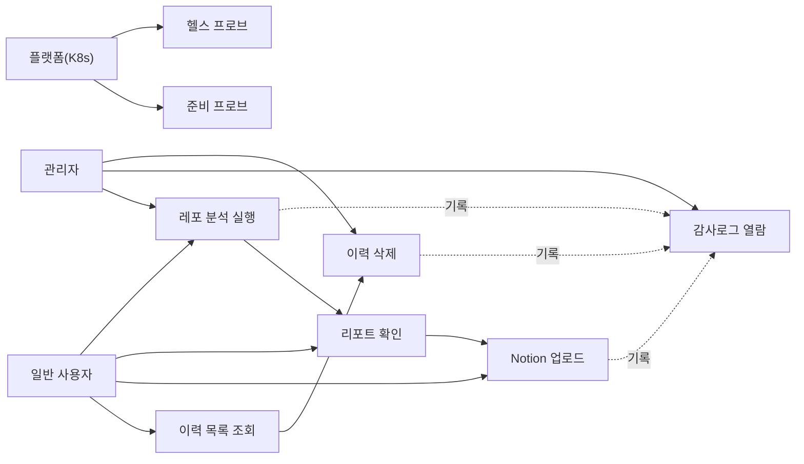

# 01. 기능명세서 (공통)

> **답하는 질문**: «무엇이 합격인가»
> **범위**: APP-A 레포 인사이트(GitHub → Notion 포트폴리오 리포트 도구) · APP-B 웹 테트리스 게임 — **환경과 무관한 기능 정의**
> **연결**: 인수조건(AC) → [06 테스트설계서](06_테스트설계서.md) 의 TC 로 1:1 대응
> **정본**: [`실습산출물/3차시/myapp/server.js`](../../실습산출물/3차시/myapp/server.js) (갱신: 2026-08-28)

---

## 1. 문서 개요

### 1-1. 목적

이 문서는 «완료»의 정의를 **검증 가능한 문장**으로 고정합니다. 여기에 없는 것은 만들지 않고, 여기 있는 것은 반드시 테스트로 증명합니다.

### 1-2. 용어

| 용어 | 정의 |
| --- | --- |
| **분석(Analysis)** | GitHub 공개 레포 URL 하나를 입력해 실행하는 최소 작업 단위. 결과는 이력(레코드) 1건으로 저장 |
| **리포트(Report)** | 분석 결과를 바탕으로 자동 생성되는 Markdown 문서(개요·프로젝트 주제·구조·아키텍처 패턴·기술스택·커밋 요약) |
| **프로젝트 주제(Topic)** | 레포 설명(description)과 README 첫 문단을 규칙 기반으로 발췌해 도출한 1~2문장 요약 |
| **아키텍처 패턴(추정)** | 최상위 디렉터리·파일 이름 규칙(예: `client`/`server`, `packages`, `controllers`/`models`/`views`)으로 모노레포·프론트-백엔드 분리·MVC 등을 추정한 결과. 항상 "추정" 문구를 동반 |
| **이력(History)** | 과거 실행한 분석·리포트·업로드 결과를 저장한 레코드. 관리자만 삭제 가능 |
| **감사로그(Audit Log)** | 누가·언제·무엇을 했는지(분석 실행·Notion 업로드·이력 삭제 시도/성공) 기록한 변경 이력 |
| **테트로미노** | 정사각형 4개로 구성된 블록. I·O·T·S·Z·J·L 7종 |
| **월킥(Wall Kick)** | 회전 시 충돌하면 위치를 보정해 회전을 성립시키는 규칙 |

### 1-3. 액터

| 액터 | APP-A | APP-B |
| --- | --- | --- |
| **일반 사용자** | 레포 분석 실행, 리포트 확인, Notion 업로드, 이력 조회 | 게임 플레이 |
| **관리자** | + 이력 삭제, 감사로그 열람 (`?role=admin`) | – |
| **플랫폼(K8s)** | 프로브 호출(`/healthz`·`/readyz`) | 프로브 호출(`/healthz`) |
| **테스트 러너** | API·화면 자동 검증 | 화면 자동 검증 |

---

## 2. APP-A 레포 인사이트 (GitHub 레포 분석 → Notion 포트폴리오 리포트)

> 개발자가 자신의 GitHub 공개 레포 URL을 입력하면 커밋 히스토리·언어 통계·프로젝트 구조를 분석해 포트폴리오용 리포트를 생성하고, 확인 후 버튼 클릭으로 Notion에 업로드하는 도구입니다.

### 2-1. 유스케이스

### 2-2. 기능 요구사항 (FR)

| ID | 기능 | 설명 | 우선순위 | 관련 API |
| --- | --- | --- | --- | --- |
| **FR-A-01** | 레포 분석 실행 | GitHub 공개 레포 URL을 받아 메타데이터·커밋 히스토리(최대 30건, SHA 중복 제거)·언어 통계를 수집 | 필수 | `POST /api/analyze` |
| **FR-A-02** | 프로젝트 구조 분석 | Git Trees API로 디렉터리·파일 구조를 수집해 최상위 디렉터리별 파일 수로 요약 | 필수 | 내부(`analyzeRepo`) |
| **FR-A-03** | 입력 검증 | 레포 URL이 `https://github.com/owner/repo` 형식이 아니면 400 + 사유 | 필수 | `POST /api/analyze` |
| **FR-A-04** | 프로젝트 주제 도출 | 레포 설명 + README 첫 문단을 규칙 기반으로 발췌·중복 제거해 1~2문장 요약 | 필수 | 내부(`insights.js`) |
| **FR-A-05** | 아키텍처 패턴 추정 | 디렉터리 이름 규칙으로 모노레포·프론트-백엔드 분리·MVC·평면 구조 등을 추정 | 필수 | 내부(`insights.js`) |
| **FR-A-06** | 리포트 생성 | 개요·프로젝트 주제·구조·아키텍처·기술스택·커밋 요약을 Markdown으로 생성 | 필수 | 내부(`report.js`) |
| **FR-A-07** | Notion 업로드 | 사용자가 리포트를 확인한 뒤 버튼을 클릭하면(수동 트리거) 생성된 리포트를 Notion 페이지로 업로드 | 필수 | `POST /api/analyses/:id/notion-upload` |
| **FR-A-08** | 이력 조회 | 분석 이력을 최신순으로 조회(목록/상세) | 필수 | `GET /api/analyses`, `GET /api/analyses/:id` |
| **FR-A-09** | 이력 삭제(관리자) | 관리자만 이력을 삭제할 수 있으며, 일반 사용자가 시도하면 403 | 필수 | `DELETE /api/analyses/:id` |
| **FR-A-10** | 감사로그 기록 | 분석 실행·Notion 업로드·이력 삭제(성공/거부)마다 **행위자·행위·결과·대상**을 자동 기록 | 필수 | 내부(`logAudit`) |
| **FR-A-11** | 감사로그 조회(관리자) | 관리자만 감사로그 최신 N건을 조회 가능(일반 사용자는 403) | 필수 | `GET /api/audit-log` |
| **FR-A-12** | 헬스 프로브 | 프로세스 생존을 200으로 응답 | 필수 | `GET /healthz` |
| **FR-A-13** | 준비 프로브 | **DB(SQLite) 연결이 가능할 때만** 200, 아니면 503 | 필수 | `GET /readyz` |
| **FR-A-14** | 버전·비밀 출처 노출 | 배포된 이미지 태그·환경명과 함께, GitHub/Notion 비밀을 **어디서 조달했는지(env/keyvault/unset, 값은 절대 제외)** 반환 | 필수 | `GET /version` |

### 2-3. 인수조건 (AC) — Given / When / Then

| ID | 구분 | Given | When | Then |
| --- | --- | --- | --- | --- |
| **AC-A-01** | 정상 | 유효한 공개 레포 URL이 주어짐 | `POST /api/analyze` | **200** 과 함께 프로젝트 구조·기술스택·커밋 요약이 포함된 리포트 반환 |
| **AC-A-02** | 정상 | 리포트가 생성된 상태(NOTION_TOKEN·NOTION_PARENT_PAGE_ID 설정됨) | `POST /api/analyses/:id/notion-upload` | **200** 과 함께 Notion 페이지가 생성되고 `notionUrl` 반환 |
| **AC-A-03** | 정상 | 분석 이력이 1건 이상 존재 | `GET /api/analyses` | **200** 과 이력 배열 반환, 상세 재조회 가능 |
| **AC-A-04** | 예외 | 존재하지 않거나 비공개인 레포 URL | `POST /api/analyze` | **404**, "비공개 레포이거나 존재하지 않는 레포입니다", 리포트는 생성되지 않음 |
| **AC-A-05** | 예외 | GitHub API Rate Limit이 소진된 상태 | `POST /api/analyze` | **429**, 재시도 가능 시각(UTC) 안내 |
| **AC-A-06** | 예외 | NOTION_TOKEN이 설정되지 않았거나 만료됨 | `POST /api/analyses/:id/notion-upload` | **401**, ".env 설정을 확인하세요" 안내, **토큰 값은 응답에 없음** |
| **AC-A-07** | 정상/예외 | 일반 사용자가 이력 삭제를 시도 | `DELETE /api/analyses/:id` (role 없음) | **403** 반환, 이력은 삭제되지 않음. 관리자(`?role=admin`)가 시도하면 **200** + 실제 삭제 |
| **AC-A-08** | 정상 | 분석 실행·Notion 업로드·이력 삭제 이벤트 발생 | `GET /api/audit-log?role=admin` | 각 이벤트에 대해 `actor_role`·`at`·`action`·`result` 가 채워진 레코드 존재 |

> 📌 **AC-A-01 ~ 06 이 3차시 실습의 «인수조건 6개»**(정상 3 · 예외 3, [실습산출물/3차시/01_앱기획_스펙.md](../../실습산출물/3차시/01_앱기획_스펙.md) §4)**에 해당합니다.** 07·08 은 5·6단계(로그인·권한, 감사로그 검증)에서 보완된 인수조건입니다.

### 2-4. 비기능 요구사항 (NFR)

| ID | 항목 | 기준 | 검증 위치 |
| --- | --- | --- | --- |
| **NFR-01** | 응답 시간 | 이력 목록 조회 p95 < 500ms | 통합 테스트 |
| **NFR-02** | 기동 시간 | 컨테이너 시작 후 60초 이내 `/readyz` 200 | 배포 검증 |
| **NFR-03** | 보안 — 비밀 | `GITHUB_TOKEN`·`NOTION_TOKEN`·`NOTION_PARENT_PAGE_ID` 가 **코드·이미지·Git 어디에도 평문으로 없을 것** | 환경별 구성 설계 |
| **NFR-04** | 보안 — 실행 | 컨테이너는 **비루트**로 실행 | 배포 검증 |
| **NFR-05** | 개인정보 | 커밋 작성자 이메일 등 개인식별 메타데이터가 리포트·Notion·산출물(캡처·로그)에 없음 | 테스트 판정 |
| **NFR-06** | 관측 | 오류 발생 시 원인 추적 가능한 로그 출력(비밀 값 제외) | 운영 설계 |
| **NFR-07** | 이식성 | **동일 이미지**가 dev·stg·prd 에서 동작(환경 차이는 주입으로만) | 구성 설계 |

### 2-5. 오류 정의

| 코드 | 상황 | 사용자 메시지 | HTTP |
| --- | --- | --- | --- |
| `E-VALIDATION` | 레포 URL 형식 오류 | «GitHub 레포 URL 형식이 올바르지 않습니다. 예: https://github.com/owner/repo» | 400 |
| `E-GITHUB_NOT_FOUND` | 비공개/존재하지 않는 레포 | «비공개 레포이거나 존재하지 않는 레포입니다.» | 404 |
| `E-GITHUB_RATE_LIMIT` | GitHub API 호출 한도 초과 | «GitHub API 호출 한도를 초과했습니다. 재시도 가능 시각(UTC): …» | 429 |
| `E-NOTION_AUTH` | Notion 토큰 미설정/만료 | «Notion 설정이 비어 있습니다. .env의 NOTION_TOKEN, NOTION_PARENT_PAGE_ID 설정을 확인하세요.» | 401 |
| `E-FORBIDDEN` | 관리자 전용 기능에 일반 사용자가 접근 | «관리자만 이력을 삭제할 수 있습니다. URL에 ?role=admin을 추가하세요.» | 403 |
| `E-NOT_FOUND` | 존재하지 않는 이력/경로 | «이력을 찾을 수 없습니다.» | 404 |
| `E-DB_UNAVAILABLE` | SQLite 연결 불가 | (프로브 전용, 화면 노출 없음) | 503 |
| `E-INTERNAL` | 그 밖의 서버 오류(GitHub·Notion API 기타 오류) | «GitHub/Notion API 호출 중 오류가 발생했습니다.» | 500/502 |

---

## 3. APP-B 웹 테트리스 게임

### 3-1. 기능 요구사항 (FR)

| ID | 기능 | 설명 | 우선순위 |
| --- | --- | --- | --- |
| **FR-B-01** | 테트로미노 7종 | I·O·T·S·Z·J·L 을 정의하고 무작위 출현 | 필수 |
| **FR-B-02** | 이동 | 좌·우 이동, 벽·블록 충돌 시 이동 불가 | 필수 |
| **FR-B-03** | 회전 + 월킥 | **SRS** 회전. 충돌 시 월킥으로 보정, 보정 불가면 회전 취소 | 필수 |
| **FR-B-04** | 중력 | 레벨에 따른 간격으로 자동 하강 | 필수 |
| **FR-B-05** | 소프트 드롭 | 아래 키로 가속 하강 | 필수 |
| **FR-B-06** | 하드 드롭 | 즉시 바닥까지 내리고 고정 | 필수 |
| **FR-B-07** | 라인 클리어 | 가득 찬 줄을 제거하고 위를 내림 (1~4줄 동시) | 필수 |
| **FR-B-08** | 점수·레벨 | 제거 줄 수에 따라 점수 부여, 누적으로 레벨·속도 상승 | 필수 |
| **FR-B-09** | 다음 블록 표시 | 다음에 나올 블록 미리보기 | 필수 |
| **FR-B-10** | 홀드 | 현재 블록을 보관하고 교체 (1회/블록) | 권장 |
| **FR-B-11** | 일시정지 | 진행 중 정지·재개 | 권장 |
| **FR-B-12** | 게임오버·재시작 | 스폰 위치 충돌 시 종료, 재시작 가능 | 필수 |

### 3-2. 점수 규칙

| 동시 제거 줄 수 | 명칭 | 점수 (레벨 n) |
| --- | --- | --- |
| 1 | Single | 100 × n |
| 2 | Double | 300 × n |
| 3 | Triple | 500 × n |
| 4 | **Tetris** | 800 × n |

> 레벨은 **누적 10줄마다 1 상승**하며, 중력 간격이 짧아집니다.

### 3-3. 인수조건 (AC) — 8개

| ID | 구분 | Given | When | Then |
| --- | --- | --- | --- | --- |
| **AC-B-01** | 정상 | 블록이 좌측 벽에 인접 | 왼쪽 이동 | **이동하지 않음** (보드 밖 진입 금지) |
| **AC-B-02** | 정상 | 블록 아래에 고정 블록 존재 | 하강 | **충돌 위치에서 고정**되고 다음 블록 생성 |
| **AC-B-03** | 정상 | I 블록이 벽에 붙어 회전 불가 위치 | 회전 | **월킥으로 위치 보정 후 회전 성공** |
| **AC-B-04** | 정상 | 한 줄이 가득 참 | 해당 줄 완성 | 줄이 제거되고 **점수 100 × 레벨** 증가 |
| **AC-B-05** | 정상 | 네 줄이 동시에 가득 참 | 하드 드롭으로 완성 | 4줄 제거, **점수 800 × 레벨** 증가 |
| **AC-B-06** | 예외 | 스폰 위치에 이미 블록이 있음 | 새 블록 생성 | **게임오버** 상태로 전환 |
| **AC-B-07** | 예외 | 게임오버 상태 | 키 입력 | **보드가 변경되지 않음** (재시작 키 제외) |
| **AC-B-08** | 예외 | 일시정지 상태 | 중력 틱 발생 | **블록이 하강하지 않음** |

### 3-4. 비기능 요구사항

| ID | 항목 | 기준 |
| --- | --- | --- |
| **NFR-B-01** | 실행 조건 | **빌드 도구 없이** 브라우저에서 바로 실행 (HTML5 Canvas + 바닐라 JS) |
| **NFR-B-02** | 테스트 용이성 | **순수 로직과 렌더/입력을 분리**해 DOM 없이 단위 테스트 가능 |
| **NFR-B-03** | 렌더 성능 | 60fps 목표, 저사양에서도 30fps 이상 |
| **NFR-B-04** | 배포 형태 | **nginx 정적 서빙** — 상태·DB 불필요 |

---

## 4. 환경별 기능 활성화 매트릭스

> 기능 «정의»는 하나지만, **환경에 따라 켜고 끄는 것**이 다릅니다. 이 표가 환경별 테스트 범위의 근거가 됩니다.

| 기능 / 동작 | dev | stg | prd | 근거 |
| --- | :---: | :---: | :---: | --- |
| APP-A 전체 기능 (FR-A-01~14) | ✅ | ✅ | ✅ | 동일 이미지 사용(NFR-07) |
| **쓰기 API 테스트** (`POST /api/analyze`·`/notion-upload`·`DELETE`) | ✅ | ✅ | ❌ | 운영 데이터·실제 Notion 워크스페이스 오염 방지 |
| Notion 실제 업로드(AC-A-02) | ⚠️ 토큰 설정 시 | ⚠️ 토큰 설정 시 | ❌ | 외부 SaaS 부수 효과 — prd 에서 실행하지 않음 |
| 감사로그 보존 | 임시(파드 재시작 시 소멸) | 임시 | 임시(§5 SQLite 한계 참고) | 데이터 계층이 SQLite 파일이라 환경 공통 |
| 관리자 접근 통제(FR-A-09·11) | ✅ | ✅ | ✅ | NFR-04 계열 |
| APP-B 게임 기능 (FR-B-01~12) | ✅ | ✅ | ⚠️ 선택 | 심화 트랙 |
| APP-B 홀드·일시정지 (FR-B-10·11) | ✅ | ✅ | ✅ | 권장 기능 |

**범례** — ✅ 활성 · ⚠️ 조건부 · ❌ 비활성

---

## 5. 추적성 매트릭스 (FR ↔ AC ↔ API ↔ TC)

| FR | AC | API / 화면 | 단위 TC | 통합 TC | E2E TC |
| --- | --- | --- | --- | --- | --- |
| FR-A-01 | AC-A-01·04·05 | `POST /api/analyze` | U-A-01·02 | I-A-03·04 | E-A-02·03·04 |
| FR-A-02 | AC-A-01 | 내부(`analyzeRepo`) | U-A-03 | I-A-03 | E-A-03 |
| FR-A-03 | AC-A-04 | `POST /api/analyze` | U-A-01 | I-A-04 | E-A-04 |
| FR-A-04 | AC-A-01 | 내부(`insights.js`) | U-A-06·07 | – | E-A-03 |
| FR-A-05 | AC-A-01 | 내부(`insights.js`) | U-A-08 | – | E-A-03 |
| FR-A-06 | AC-A-01 | 내부(`report.js`) | U-A-04·05 | I-A-03 | E-A-03 |
| FR-A-07 | AC-A-02·06 | `POST /api/analyses/:id/notion-upload` | – | I-A-06 | E-A-06·07 |
| FR-A-08 | AC-A-03 | `GET /api/analyses`(`/:id`) | – | I-A-05·07 | E-A-05 |
| FR-A-09 | AC-A-07 | `DELETE /api/analyses/:id` | – | I-A-08 | – |
| FR-A-10 | AC-A-08 | 내부(`logAudit`) | – | I-A-09 | – |
| FR-A-11 | AC-A-08 | `GET /api/audit-log` | – | I-A-09·10 | – |
| FR-A-12 | – | `GET /healthz` | – | I-A-01 | – |
| FR-A-13 | AC-A-01 | `GET /readyz` | – | I-A-02 | – |
| FR-A-14 | – | `GET /version` | U-A-09·10·11 | I-A-11 | – |
| FR-B-02 | AC-B-01 | 엔진 | U-B-01 | – | E-B-02 |
| FR-B-03 | AC-B-03 | 엔진 | U-B-03 | – | – |
| FR-B-07 | AC-B-04·05 | 엔진 | U-B-04·05 | – | E-B-03 |
| FR-B-12 | AC-B-06·07 | 엔진 | U-B-06 | – | E-B-04 |

> TC 상세는 [06 테스트설계서](06_테스트설계서.md) 를 참조합니다.
