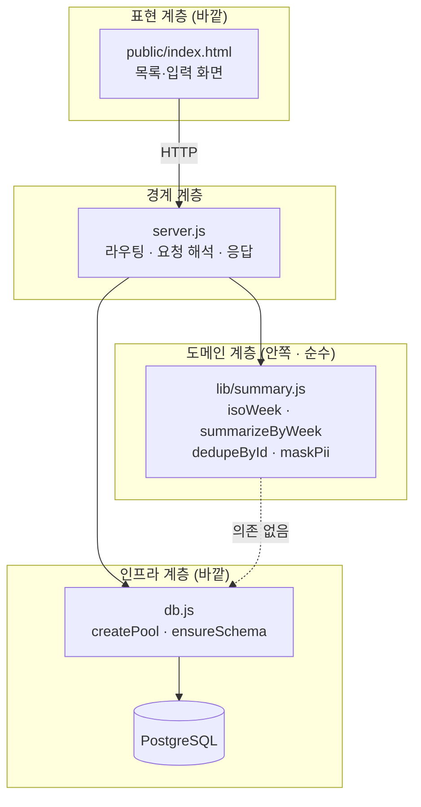
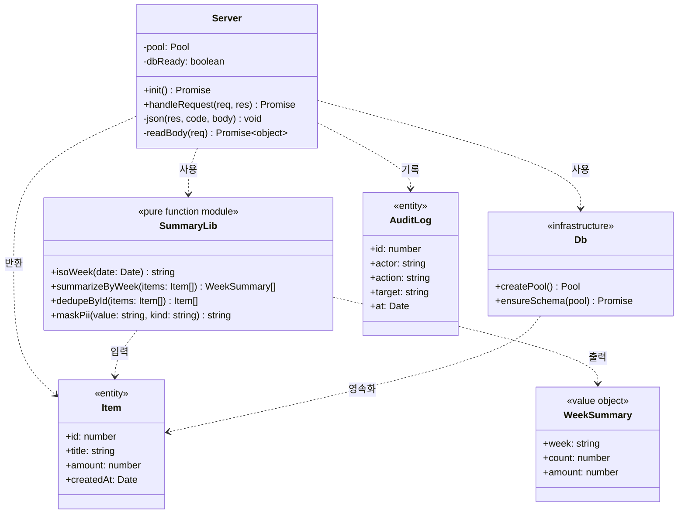
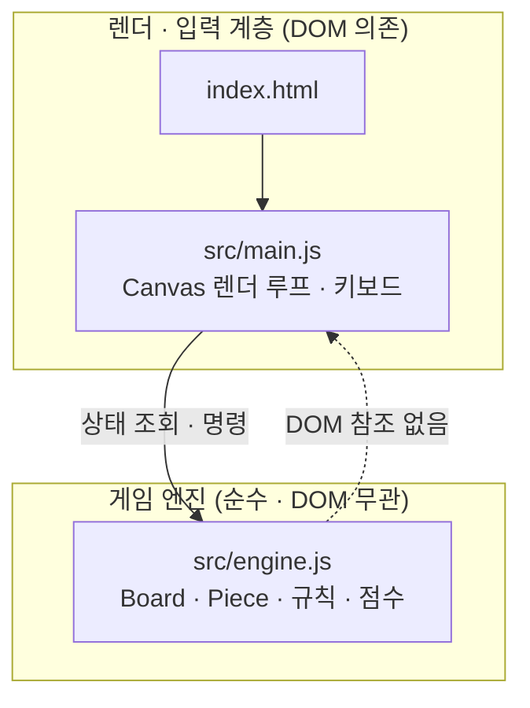
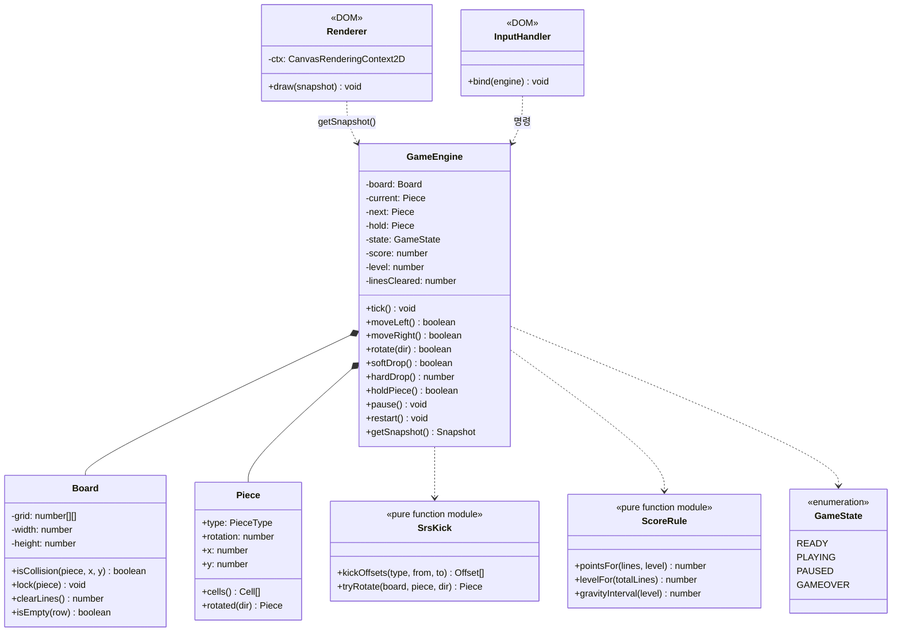

# 02. 도메인 · 클래스 설계서 (공통)

> **답하는 질문**: «코드를 어떻게 나누는가»
> **핵심 원칙**: **순수 로직을 바깥 세계(DB·HTTP·DOM)로부터 분리**한다 — 그래야 단위 테스트가 가능하다.

---

## 1. 설계 원칙

| 원칙 | 내용 | 위반 시 증상 |
| --- | --- | --- |
| **P1. 의존성 방향** | 바깥(HTTP·DOM) → 안쪽(도메인 로직) 한 방향. **도메인은 바깥을 모른다** | 단위 테스트에 DB·브라우저가 필요해짐 |
| **P2. 순수 함수 우선** | 계산·판정은 입력만으로 결정되는 함수로 | 테스트가 느리고 불안정해짐 |
| **P3. 부작용 격리** | I/O(DB·파일·네트워크)는 경계 모듈에만 | 어디서 무엇이 바뀌는지 추적 불가 |
| **P4. 설정 주입** | 환경 값은 **환경 변수로만** 들어온다 | 이미지가 환경에 종속됨(NFR-07 위반) |
| **P5. 얇은 컨트롤러** | 라우팅은 «해석 → 위임 → 응답»만 | 업무 규칙이 HTTP 계층에 흩어짐 |

---

## 2. APP-A 나만의 업무 앱

### 2-1. 계층 구조



> ⚠️ **점선이 «없어야 하는 의존»** 입니다. `summary.js` 는 `db.js` 를 절대 참조하지 않습니다 — 그래서 DB 없이 단위 테스트가 가능합니다.

### 2-2. 클래스 · 모듈 다이어그램



### 2-3. 책임 정의 (CRC)

| 모듈 | 책임 (Responsibility) | 협력자 (Collaborator) | 하지 않는 것 |
| --- | --- | --- | --- |
| **server.js** | HTTP 요청 해석 · 라우팅 · 검증 위임 · 응답 직렬화 · 감사로그 트리거 | SummaryLib · Db | 업무 계산 · SQL 문자열 조립 |
| **lib/summary.js** | 주차 계산 · 집계 · 중복 제거 · 마스킹 | **없음(순수)** | I/O · 로깅 · 예외 전파 |
| **db.js** | 연결 풀 생성 · 스키마 보장 | pg 드라이버 | 업무 규칙 |
| **public/index.html** | 화면 렌더 · 사용자 입력 수집 · API 호출 | server.js(HTTP) | 업무 계산 |

### 2-4. 입력 검증 규칙 (FR-A-03)

| 필드 | 규칙 | 위반 시 |
| --- | --- | --- |
| `title` | 문자열 · trim 후 길이 ≥ 1 | 400 `E-VALIDATION` |
| `amount` | 숫자로 변환 가능 (기본값 0) | 400 `E-VALIDATION` |

```javascript
// server.js 의 검증 지점 — 도메인에 들어가기 전에 «경계»에서 막는다
if (!body || typeof body.title !== "string" || !body.title.trim())
  return json(res, 400, { error: "title 은 필수이며 빈 문자열일 수 없습니다." });
const amount = Number(body.amount || 0);
if (Number.isNaN(amount))
  return json(res, 400, { error: "amount 는 숫자여야 합니다." });
```

---

## 3. APP-B 웹 테트리스 게임

### 3-1. 계층 구조



> **이 분리가 AC-B-01~08 을 «브라우저 없이» 단위 테스트할 수 있게 하는 유일한 근거**입니다.

### 3-2. 클래스 다이어그램



### 3-3. 책임 정의

| 모듈 | 책임 | 하지 않는 것 |
| --- | --- | --- |
| **GameEngine** | 게임 상태 보유 · 명령 처리 · 규칙 적용 · 스냅샷 제공 | 그리기 · 키 이벤트 수신 |
| **Board** | 격자 보유 · 충돌 판정 · 고정 · 라인 제거 | 점수 계산 |
| **Piece** | 모양·위치·회전 상태 · 셀 좌표 계산 | 충돌 판정 |
| **SrsKick** | 회전 시 보정 오프셋 계산 (순수) | 상태 변경 |
| **ScoreRule** | 점수·레벨·중력 간격 계산 (순수) | 상태 변경 |
| **Renderer / InputHandler** | Canvas 그리기 · 키 매핑 | 게임 규칙 |

### 3-4. 상수 정의

| 상수 | 값 | 근거 |
| --- | --- | --- |
| 보드 크기 | 10 × 20 (+ 스폰 여유 2행) | 표준 규격 |
| 테트로미노 | I · O · T · S · Z · J · L | FR-B-01 |
| 회전 방향 | CW(+1) · CCW(-1) | FR-B-03 |
| 레벨업 기준 | 누적 10줄 | FR-B-08 |
| 중력 간격 | `max(80, 800 - (level-1) × 70)` ms | FR-B-04 |

---

## 4. 공통 — 테스트 가능성 체크리스트

| 확인 | APP-A | APP-B |
| --- | --- | --- |
| 순수 로직 모듈이 I/O 를 참조하지 않는가 | `summary.js` ✅ | `engine.js`·`SrsKick`·`ScoreRule` ✅ |
| 단위 테스트에 외부 프로세스가 필요 없는가 | ✅ (DB 불필요) | ✅ (브라우저 불필요) |
| 경계 모듈이 얇은가 (규칙 없음) | `server.js` ✅ | `main.js` ✅ |
| 상태 조회가 스냅샷 한 번으로 가능한가 | API 응답 | `getSnapshot()` |
| 화면 요소에 테스트 식별자가 있는가 | `data-testid` ✅ | `data-testid` 권장 |
