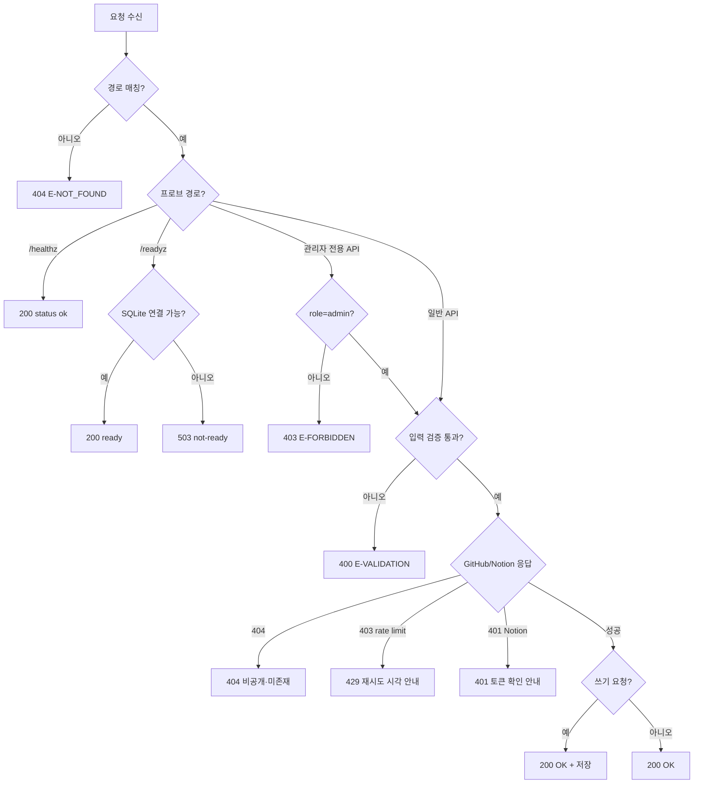

# 03. REST API 설계서 (공통)

> **답하는 질문**: «어떤 계약으로 주고받는가»
> **적용**: APP-A 레포 인사이트 (APP-B 는 정적 서빙 — 6장 참조)
> **원칙**: 계약은 **환경과 무관하게 동일**하다. 환경에 따라 달라지는 것은 **base URL · 쓰기 허용 여부 · 비밀 조달 방식(env/keyvault)**뿐이다.
> **정본**: [`실습산출물/3차시/myapp/server.js`](../../실습산출물/3차시/myapp/server.js)

---

## 1. 공통 규약

### 1-1. 기본

| 항목 | 값 |
| --- | --- |
| 프로토콜 | HTTP/1.1 (stg·prd 는 앞단에서 TLS 종료) |
| 인코딩 | UTF-8 |
| Content-Type | `application/json; charset=utf-8` |
| 시각 형식 | ISO 8601 (`2026-08-28T07:21:36.367Z`) |
| 정적 자원 | `/`, `/*.html` — `public/` 하위 파일(`index.html`·`history.html`·`common.css`) |

### 1-2. base URL (환경별)

| 환경 | base URL | 출처 |
| --- | --- | --- |
| dev | `http://localhost:8080` | k3d 포트 매핑(`env.dev.json` 의 `test.baseUrl`) |
| stg | `http://<LoadBalancer-IP>` | `40_deploy.ps1` 가 `env.stg.json` 에 자동 기록 |
| prd | `http://<Ingress-IP>` | `40_deploy.ps1` 가 `env.prd.json` 에 자동 기록 |

### 1-3. 상태 코드 사용 규칙

| 코드 | 사용 상황 |
| --- | --- |
| **200** | 조회·분석·업로드·삭제 성공 |
| **400** | 레포 URL 형식 검증 실패 (`E-VALIDATION`) |
| **401** | Notion 토큰 미설정/만료 (`E-NOTION_AUTH`) — **토큰 값은 응답에 포함하지 않음** |
| **403** | 관리자 전용 기능(이력 삭제·감사로그 조회)에 일반 사용자가 접근 (`E-FORBIDDEN`) |
| **404** | 비공개/존재하지 않는 GitHub 레포, 또는 존재하지 않는 이력 |
| **429** | GitHub API Rate Limit 초과 (`E-GITHUB_RATE_LIMIT`) — 재시도 가능 시각 포함 |
| **500/502** | 처리 중 예외, GitHub/Notion API 기타 오류 |
| **503** | 의존 서비스(SQLite) 미준비 — **`/readyz` 전용** |

### 1-4. 오류 응답 스키마

```json
{ "error": "<사용자에게 보여도 되는 짧은 사유>" }
```

> ⚠️ 오류 메시지에 **GitHub PAT·Notion 토큰·스택 전체·개인정보를 넣지 않습니다**(NFR-05). 예: NOTION_TOKEN 미설정 시 401 메시지는 ".env의 NOTION_TOKEN, NOTION_PARENT_PAGE_ID 설정을 확인하세요"이며, 토큰 값 자체는 어디에도 없습니다.

### 1-5. 파라미터

| 파라미터 | 방향 | 용도 |
| --- | --- | --- |
| `Content-Type` | 요청/응답 | JSON 명시 |
| `?role=admin` | 쿼리(선택) | 관리자 전용 기능(이력 삭제·감사로그 조회) 활성화. 없으면 일반 사용자로 처리 |

---

## 2. 엔드포인트 요약

| # | 메서드 | 경로 | 용도 | 인증 | 쓰기 | 관련 FR |
| --- | --- | --- | --- | :---: | :---: | --- |
| 1 | GET | `/healthz` | 프로세스 생존 | – | – | FR-A-12 |
| 2 | GET | `/readyz` | SQLite 포함 준비 상태 | – | – | FR-A-13 |
| 3 | GET | `/version` | 배포 버전·환경·비밀 출처 | – | – | FR-A-14 |
| 4 | POST | `/api/analyze` | 레포 분석 실행 | – | ✅ | FR-A-01·02·03·04·05·06 |
| 5 | GET | `/api/analyses` | 분석 이력 목록 | – | – | FR-A-08 |
| 6 | GET | `/api/analyses/:id` | 분석 이력 상세 | – | – | FR-A-08 |
| 7 | DELETE | `/api/analyses/:id` | 분석 이력 삭제 | `?role=admin` 필수 | ✅ | FR-A-09 |
| 8 | POST | `/api/analyses/:id/notion-upload` | Notion 업로드 | – | ✅(외부 SaaS) | FR-A-07 |
| 9 | GET | `/api/audit-log` | 감사로그 조회 | `?role=admin` 필수 | – | FR-A-11 |
| 10 | GET | `/api/env-status` | 비밀 설정 여부(값 제외) | – | – | NFR-03 |

---

## 3. 엔드포인트 상세

### 3-1. `GET /healthz` — 생존 프로브

**용도** — 프로세스가 응답 가능한 상태인지만 확인합니다. **SQLite 상태와 무관**합니다.

| 응답 | 조건 | 본문 |
| --- | --- | --- |
| 200 | 프로세스 정상 | `{"status":"ok","env":"dev"}` |

```http
GET /healthz HTTP/1.1
```
```json
{ "status": "ok", "env": "prd" }
```

> 📌 **왜 SQLite 를 보지 않는가** — 이 프로브가 실패하면 Kubernetes 가 **컨테이너를 재시작**합니다. 파일 시스템 일시 문제로 앱을 재시작하는 것은 상황을 악화시키므로 분리합니다.

### 3-2. `GET /readyz` — 준비 프로브

**용도** — **SQLite 연결(`SELECT 1`)이 가능할 때만** 트래픽을 받겠다는 선언입니다.

| 응답 | 조건 | 본문 |
| --- | --- | --- |
| 200 | `db.prepare('SELECT 1').get()` 성공 | `{"status":"ready"}` |
| 503 | 파일 접근 불가 등 | `{"status":"not-ready","error":"..."}` |

> 📌 **동작** — SQLite 는 컨테이너 내부 파일(`data/app.db`)이라 외부 네트워크 장애의 영향을 받지 않지만, 디스크·권한 문제를 잡기 위해 실제 쿼리로 확인합니다. (AC-A-01)

### 3-3. `GET /version` — 버전·환경·비밀 출처

| 응답 | 본문 |
| --- | --- |
| 200 | `{"version":"dev-7a76ec0","env":"dev","identity":{"workloadIdentity":false,"keyVaultConfigured":false,"sources":{"GITHUB_TOKEN":"env","NOTION_TOKEN":"env","NOTION_PARENT_PAGE_ID":"env"}}}` |

| 필드 | 출처 | 용도 |
| --- | --- | --- |
| `version` | 환경 변수 `APP_VERSION`(배포 스크립트가 주입) | **배포 버전 = 빌드 태그** 검증(`80_verify.ps1`) |
| `env` | 환경 변수 `APP_ENV` | 화면 라벨 · 실수 배포 감지 |
| `identity.workloadIdentity` | `AZURE_CLIENT_ID` 등 3종 존재 여부 | 워크로드 ID 사용 여부(진단) |
| `identity.sources.*` | `"env"`\|`"keyvault"`\|`"unset"` | GitHub/Notion 비밀을 **어디서 조달했는지**(값은 절대 없음, NFR-03) |

### 3-4. `POST /api/analyze` — 레포 분석 실행

**요청**

```json
{ "repoUrl": "https://github.com/owner/repo" }
```

| 필드 | 필수 | 규칙 |
| --- | :---: | --- |
| `repoUrl` | ✅ | `https://github.com/{owner}/{repo}` 형식(끝 `/`·`.git` 허용) |

**응답 200**

```json
{
  "analysisId": 45,
  "analysis": {
    "owner": "expressjs", "repo": "express", "defaultBranch": "master",
    "headSha": "023767f...", "license": "MIT", "collectedAt": "2026-08-28T...",
    "structure": { "totalFiles": 213, "topLevelDirs": [{"name":"test","fileCount":112}], "topLevelFiles": ["package.json"] },
    "languageStats": [{ "language": "JavaScript", "bytes": 499128, "ratio": 100 }],
    "commits": [{ "sha": "023767f...", "messageShort": "...", "committedAt": "..." }]
  },
  "markdown": "# expressjs/express 프로젝트 분석 리포트\n\n..."
}
```

**오류**

| 상황 | 코드 | 본문 |
| --- | --- | --- |
| `repoUrl` 형식 오류 | 400 | `{"error":"GitHub 레포 URL 형식이 올바르지 않습니다. 예: https://github.com/owner/repo"}` |
| 비공개/존재하지 않는 레포 | 404 | `{"error":"비공개 레포이거나 존재하지 않는 레포입니다."}` |
| GitHub Rate Limit 초과 | 429 | `{"error":"GitHub API 호출 한도를 초과했습니다. 재시도 가능 시각(UTC): ..."}` |

**부수 효과** — `analysis`·`language_stat`·`commit_summary`·`report` 4개 테이블에 저장, `audit_log` 에 `{actor_role, action:"analyze", result, detail: repoUrl}` 기록 (FR-A-10)

> ⚠️ **환경별 제약** — **prd 에서는 이 엔드포인트를 테스트하지 않습니다**(`ALLOW_WRITE=false`). GitHub API 실제 호출·SQLite 쓰기가 발생하기 때문입니다.

### 3-5. `GET /api/analyses` — 분석 이력 목록

**동작** — 전체 이력을 `id DESC`(최신순)로 반환. 페이징 없음(MVP 범위 밖).

```json
[
  { "id": 45, "owner": "expressjs", "repo": "express", "status": "success", "collected_at": "2026-08-28T...", "commit_sha": "023767f...", "license": "MIT", "error_reason": null }
]
```

### 3-6. `GET /api/analyses/:id` — 분석 이력 상세

**응답 200** — `{ analysis, languageStats, commits, report }` (report 는 Notion 업로드 결과 `notion_url`·`uploaded_at` 포함)
**응답 404** — `{"error":"이력을 찾을 수 없습니다."}`

### 3-7. `DELETE /api/analyses/:id` — 분석 이력 삭제 (관리자 전용)

| 조건 | 응답 |
| --- | --- |
| `?role=admin` 없음(일반 사용자) | **403** `{"error":"관리자만 이력을 삭제할 수 있습니다. URL에 ?role=admin을 추가하세요."}` |
| `?role=admin` 있음 + 이력 존재 | **200** `{"deleted":true,"id":45}` |
| `?role=admin` 있음 + 이력 없음 | **404** `{"error":"이력을 찾을 수 없습니다."}` |

**부수 효과** — 관련 4개 테이블 레코드 삭제, `audit_log` 에 `result:"forbidden"`(거부 시) 또는 `result:"success"`(삭제 시) 기록 — **거부된 시도도 감사로그에 남습니다**(FR-A-10·11 / AC-A-07·08).

### 3-8. `POST /api/analyses/:id/notion-upload` — Notion 업로드 (수동 트리거)

**동작** — 사용자가 리포트를 확인한 뒤 **버튼을 클릭해야** 실행됩니다(자동 업로드 아님, 2026-08-28 재확인).

| 응답 | 조건 | 본문 |
| --- | --- | --- |
| 200 | Notion 페이지 생성 성공 | `{"notionUrl":"https://app.notion.com/p/..."}` |
| 401 | `NOTION_TOKEN`·`NOTION_PARENT_PAGE_ID` 미설정 또는 Notion 인증 실패 | `{"error":"Notion 설정이 비어 있습니다. .env의 NOTION_TOKEN, NOTION_PARENT_PAGE_ID 설정을 확인하세요."}` |
| 403 | Notion 페이지 권한 부족(Integration 미연결) | `{"error":"Notion 접근 권한이 없습니다(403). 대상 페이지가 이 Integration과 Connect 되어 있는지 확인하세요."}` |
| 502 | 그 외 Notion API 오류 | `{"error":"Notion 업로드 중 오류가 발생했습니다: ..."}` |

> ⚠️ **환경별 제약** — prd 에서는 실행하지 않습니다. **실제 Notion 워크스페이스에 페이지가 생성되는 부수 효과**가 있어, stg 까지만 검증합니다.

### 3-9. `GET /api/audit-log` — 감사로그 조회 (관리자 전용)

| 조건 | 응답 |
| --- | --- |
| `?role=admin` 없음 | **403** `{"error":"관리자만 감사로그를 조회할 수 있습니다. URL에 ?role=admin을 추가하세요."}` |
| `?role=admin` 있음 | **200** — 최신 N건(`?limit`, 기본 50·최대 200) 배열, 각 레코드는 `{id, at, actor_role, action, result, detail}` |

### 3-10. `GET /api/env-status` — 비밀 설정 여부(값 제외)

**응답 200**

```json
{ "githubTokenSet": true, "notionTokenSet": true, "notionParentPageIdSet": true }
```

> 📌 `secretsDiagnostics()` 의 `sources` 가 `"unset"` 이 아니면 `true` — env 든 Key Vault 든 **조달 가능하면 true**입니다. 값은 어디에도 없습니다(NFR-03).

---

## 4. 상태 코드 결정 흐름



---

## 5. API 변경 규칙 (호환성)

| 변경 유형 | 허용 | 절차 |
| --- | :---: | --- |
| 응답에 **필드 추가** | ✅ | 클라이언트는 모르는 필드를 무시해야 함 |
| 요청에 **선택 필드 추가** | ✅ | 기본값 정의 필수 |
| 필드 **삭제·이름 변경** | ❌ | 신규 경로(`/api/v2/...`)로 분리 |
| 상태 코드 의미 변경 | ❌ | 테스트·프로브가 깨짐 |
| 검증 규칙 **강화** | ⚠️ | 기능명세 AC 갱신 → 통합 TC 갱신 후 |

---

## 6. APP-B 웹 테트리스 — 서빙 계약

> 테트리스는 **REST API 가 없습니다.** 상태를 서버에 두지 않는 순수 클라이언트 앱입니다.

| 경로 | 응답 | 비고 |
| --- | --- | --- |
| `/` | `index.html` | 게임 화면 |
| `/src/*.js` | JavaScript | `engine.js` · `main.js` |
| `/healthz` | 200 | nginx `return 200` 으로 구현 — 프로브용 |

**nginx 설정 요지**

```nginx
server {
  listen 8080;
  root /usr/share/nginx/html;
  location = /healthz { access_log off; return 200 "ok\n"; }
  location / { try_files $uri $uri/ /index.html; }
}
```

| 설계 판단 | 근거 |
| --- | --- |
| 서버 상태 없음 | 점수·보드는 **클라이언트 메모리**에만 존재 → 파드를 자유롭게 늘리고 줄일 수 있음 |
| `/readyz` 없음 | 의존 서비스가 없어 «준비» 개념이 불필요 |
| 세션 불필요 | 새로고침 시 초기화되는 것이 정상 동작 |

---

## 7. 환경별 차이 요약

| 항목 | dev | stg | prd |
| --- | --- | --- | --- |
| base URL | `localhost:8080` | LoadBalancer IP | Ingress IP |
| TLS 종료 | 없음 | LB(선택) | **Ingress** |
| `POST /api/analyze`·`/notion-upload`·`DELETE` 테스트 | ✅ | ✅ | ❌ (읽기 전용) |
| `?role=admin` 동작 | 동일(간이 스위치, 세션 없음) | 동일 | 동일 — 실제 인증은 아님(NFR-03 한계, [공통 01 §2-3](01_기능명세서.md) AC-A-07 참고) |
| GitHub/Notion 토큰 출처 | `env`(k8s Secret) | `env`(k8s Secret) | `env`(CSI 동기화) 평소, 비어 있으면 `keyvault` 자가 복구 |
| 응답 `env` 값 | `dev` | `stg` | `prd` |
