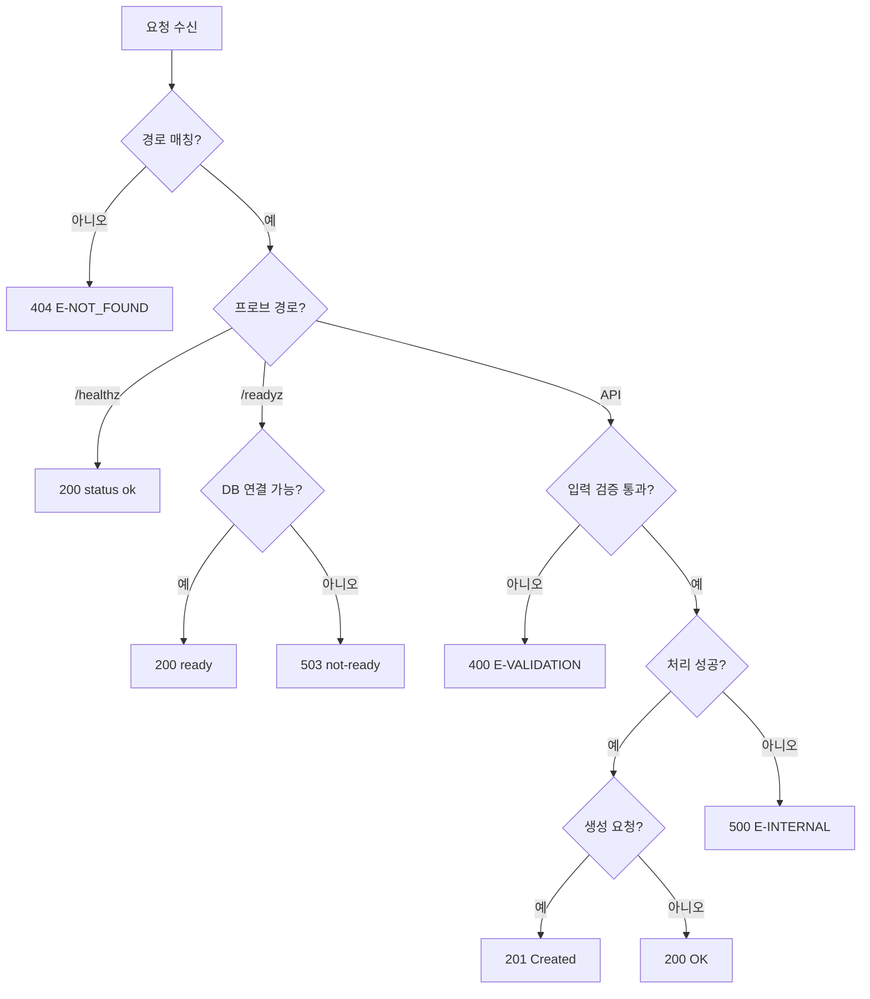

# 03. REST API 설계서 (공통)

> **답하는 질문**: «어떤 계약으로 주고받는가»
> **적용**: APP-A 나만의 업무 앱 (APP-B 는 정적 서빙 — 6장 참조)
> **원칙**: 계약은 **환경과 무관하게 동일**하다. 환경에 따라 달라지는 것은 **base URL · 쓰기 허용 여부**뿐이다.

---

## 1. 공통 규약

### 1-1. 기본

| 항목 | 값 |
| --- | --- |
| 프로토콜 | HTTP/1.1 (stg·prd 는 앞단에서 TLS 종료) |
| 인코딩 | UTF-8 |
| Content-Type | `application/json; charset=utf-8` |
| 시각 형식 | ISO 8601 (`2026-03-02T10:00:00.000Z`) |
| 정적 자원 | `/`, `/*.html` — `public/` 하위 파일 |

### 1-2. base URL (환경별)

| 환경 | base URL | 출처 |
| --- | --- | --- |
| dev | `http://localhost:8080` | k3d 포트 매핑 |
| stg | `http://<LoadBalancer-IP>` | `40_deploy.ps1` 가 `env.stg.json` 에 자동 기록 |
| prd | `http://<Ingress-IP>` | `40_deploy.ps1` 가 `env.prd.json` 에 자동 기록 |

### 1-3. 상태 코드 사용 규칙

| 코드 | 사용 상황 |
| --- | --- |
| **200** | 조회 성공 |
| **201** | 생성 성공 (`POST /api/items`) |
| **400** | 입력 검증 실패 (`E-VALIDATION`) |
| **404** | 존재하지 않는 경로 |
| **500** | 처리 중 예외 |
| **503** | 의존 서비스(DB) 미준비 — **`/readyz` 전용** |

### 1-4. 오류 응답 스키마

```json
{ "error": "<사용자에게 보여도 되는 짧은 사유>", "detail": "<선택 · 진단용>" }
```

> ⚠️ `detail` 에 **연결 문자열·스택 전체·개인정보를 넣지 않습니다**(NFR-05).

### 1-5. 헤더

| 헤더 | 방향 | 용도 |
| --- | --- | --- |
| `Content-Type` | 요청/응답 | JSON 명시 |
| `X-User` | 요청(선택) | 감사로그의 행위자. 없으면 `anonymous` |

---

## 2. 엔드포인트 요약

| # | 메서드 | 경로 | 용도 | 인증 | 쓰기 | 관련 FR |
| --- | --- | --- | --- | :---: | :---: | --- |
| 1 | GET | `/healthz` | 프로세스 생존 | – | – | FR-A-06 |
| 2 | GET | `/readyz` | DB 포함 준비 상태 | – | – | FR-A-07 |
| 3 | GET | `/version` | 배포 버전·환경 | – | – | FR-A-08 |
| 4 | GET | `/api/items` | 항목 목록 | – | – | FR-A-01 |
| 5 | POST | `/api/items` | 항목 등록 | `X-User` 권장 | ✅ | FR-A-02·03·05 |
| 6 | GET | `/api/summary` | 주차별 집계 | – | – | FR-A-04 |

---

## 3. 엔드포인트 상세

### 3-1. `GET /healthz` — 생존 프로브

**용도** — 프로세스가 응답 가능한 상태인지만 확인합니다. **DB 상태와 무관**합니다.

| 응답 | 조건 | 본문 |
| --- | --- | --- |
| 200 | 프로세스 정상 | `{"status":"ok","env":"dev"}` |

```http
GET /healthz HTTP/1.1
```
```json
{ "status": "ok", "env": "prd" }
```

> 📌 **왜 DB 를 보지 않는가** — 이 프로브가 실패하면 Kubernetes 가 **컨테이너를 재시작**합니다. DB 일시 장애로 앱을 재시작하는 것은 상황을 악화시키므로 분리합니다.

### 3-2. `GET /readyz` — 준비 프로브

**용도** — **DB 연결이 가능할 때만** 트래픽을 받겠다는 선언입니다.

| 응답 | 조건 | 본문 |
| --- | --- | --- |
| 200 | 스키마 확인 성공 | `{"status":"ready"}` |
| 503 | DB 연결 불가 | `{"status":"not-ready"}` |

> 📌 **동작** — `dbReady` 가 false 면 **재시도(ensureSchema)** 한 뒤 판정합니다. 일시 장애에서 자동 회복됩니다. (AC-A-01 · AC-A-06)

### 3-3. `GET /version` — 버전·환경

| 응답 | 본문 |
| --- | --- |
| 200 | `{"version":"prd-a1b2c3d","env":"prd"}` |

| 필드 | 출처 | 용도 |
| --- | --- | --- |
| `version` | 환경 변수 `APP_VERSION` (배포 스크립트가 주입) | **배포 버전 = 빌드 태그** 검증(`80_verify.ps1`) |
| `env` | 환경 변수 `APP_ENV` | 화면 라벨 · 실수 배포 감지 |

### 3-4. `GET /api/items` — 항목 목록

**동작** — 최신순 최대 **200건**, `dedupeById` 로 중복 제거 후 반환.

```json
{
  "count": 2,
  "items": [
    { "id": 12, "title": "주간보고 작성", "amount": 0,   "createdAt": "2026-03-09T01:20:00.000Z" },
    { "id": 11, "title": "비용 정산",     "amount": 1200,"createdAt": "2026-03-08T07:05:00.000Z" }
  ]
}
```

| 필드 | 타입 | 설명 |
| --- | --- | --- |
| `count` | number | `items` 의 길이 |
| `items[].id` | number | 항목 식별자 |
| `items[].title` | string | 제목 |
| `items[].amount` | number | 금액 (숫자 변환됨) |
| `items[].createdAt` | string(ISO) | 생성 시각 |

> 🔎 **정렬·상한** — `ORDER BY id DESC LIMIT 200`. 페이징은 현재 범위 밖(MVP «나중»).

### 3-5. `POST /api/items` — 항목 등록

**요청**

```json
{ "title": "주간보고 작성", "amount": 500 }
```

| 필드 | 필수 | 규칙 |
| --- | :---: | --- |
| `title` | ✅ | 문자열, trim 후 1자 이상 |
| `amount` | – | 숫자 변환 가능. 생략 시 0 |

**응답 201**

```json
{ "id": 13, "title": "주간보고 작성", "amount": "500", "created_at": "2026-03-09T02:00:00.000Z" }
```

**오류**

| 상황 | 코드 | 본문 |
| --- | --- | --- |
| `title` 누락·공백 | 400 | `{"error":"title 은 필수이며 빈 문자열일 수 없습니다."}` |
| `amount` 가 숫자 아님 | 400 | `{"error":"amount 는 숫자여야 합니다."}` |
| JSON 파싱 실패 | 400 | `{"error":"title 은 필수이며 빈 문자열일 수 없습니다."}` |

**부수 효과** — `audit_log` 에 `{actor: X-User ?? "anonymous", action:"create", target:"item:<id>"}` 기록 (FR-A-05)

> ⚠️ **환경별 제약** — **prd 에서는 이 엔드포인트를 테스트하지 않습니다**(`ALLOW_WRITE=false`). 운영 데이터 오염 방지.

### 3-6. `GET /api/summary` — 주차별 집계

**동작** — 전체 항목을 ISO 주차로 묶어 **주차 오름차순** 반환.

```json
{
  "weeks": [
    { "week": "2026-W10", "count": 2, "amount": 300 },
    { "week": "2026-W11", "count": 1, "amount": 50 }
  ]
}
```

| 필드 | 설명 | 규칙 |
| --- | --- | --- |
| `week` | ISO 주차 | `YYYY-Www` · **월요일 시작** |
| `count` | 해당 주 항목 수 | – |
| `amount` | 금액 합계 | `amount` 누락 시 0 으로 간주 |

> 📌 **경계 규칙** — 같은 주의 월요일과 일요일은 **동일 주차**로 묶입니다(U-A-01 로 검증). 데이터가 0건이면 `weeks: []` 를 반환하며 **예외가 아닙니다**(U-A-03).

---

## 4. 상태 코드 결정 흐름



---

## 5. API 변경 규칙 (호환성)

| 변경 유형 | 허용 | 절차 |
| --- | :---: | --- |
| 응답에 **필드 추가** | ✅ | 클라이언트는 모르는 필드를 무시해야 함 |
| 요청에 **선택 필드 추가** | ✅ | 기본값 정의 필수 |
| 필드 **삭제·이름 변경** | ❌ | 신규 경로(`/api/v2/...`)로 분리 |
| 상태 코드 의미 변경 | ❌ | 테스트·프로브가 깨짐 |
| 검증 규칙 **강화** | ⚠️ | 기능명세 AC 갱신 → 통합 TC 갱신 후 |

---

## 6. APP-B 웹 테트리스 — 서빙 계약

> 테트리스는 **REST API 가 없습니다.** 상태를 서버에 두지 않는 순수 클라이언트 앱입니다.

| 경로 | 응답 | 비고 |
| --- | --- | --- |
| `/` | `index.html` | 게임 화면 |
| `/src/*.js` | JavaScript | `engine.js` · `main.js` |
| `/healthz` | 200 | nginx `return 200` 으로 구현 — 프로브용 |

**nginx 설정 요지**

```nginx
server {
  listen 8080;
  root /usr/share/nginx/html;
  location = /healthz { access_log off; return 200 "ok\n"; }
  location / { try_files $uri $uri/ /index.html; }
}
```

| 설계 판단 | 근거 |
| --- | --- |
| 서버 상태 없음 | 점수·보드는 **클라이언트 메모리**에만 존재 → 파드를 자유롭게 늘리고 줄일 수 있음 |
| `/readyz` 없음 | 의존 서비스가 없어 «준비» 개념이 불필요 |
| 세션 불필요 | 새로고침 시 초기화되는 것이 정상 동작 |

---

## 7. 환경별 차이 요약

| 항목 | dev | stg | prd |
| --- | --- | --- | --- |
| base URL | `localhost:8080` | LoadBalancer IP | Ingress IP |
| TLS 종료 | 없음 | LB(선택) | **Ingress** |
| `POST /api/items` 테스트 | ✅ | ✅ | ❌ (읽기 전용) |
| `X-User` 헤더 | 임의 | 임의 | 실제 사용자 식별로 확장 권장 |
| 응답 `env` 값 | `dev` | `stg` | `prd` |
