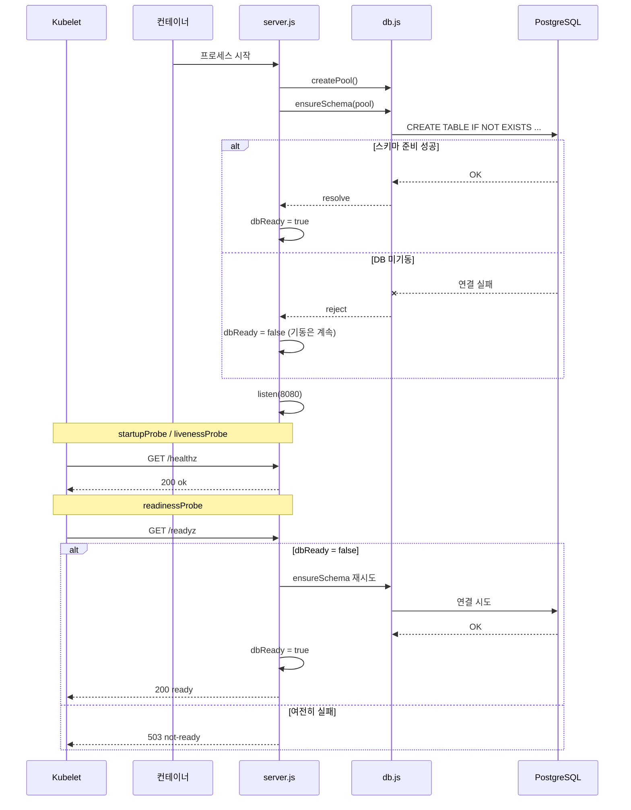
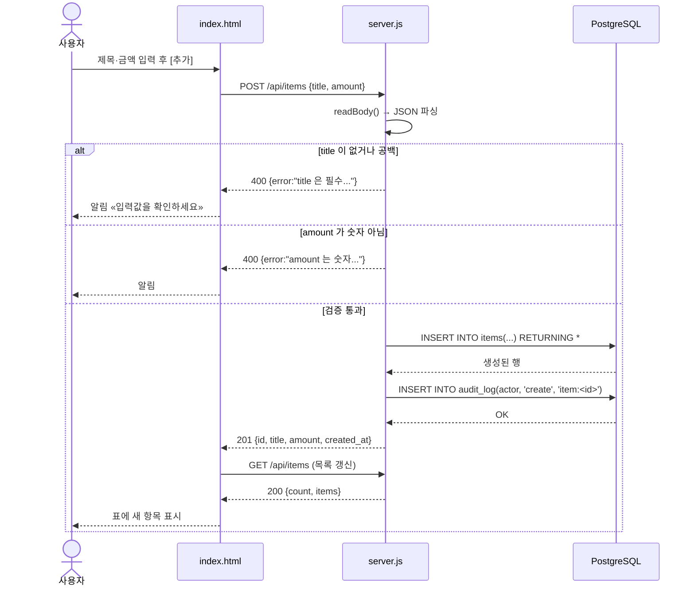
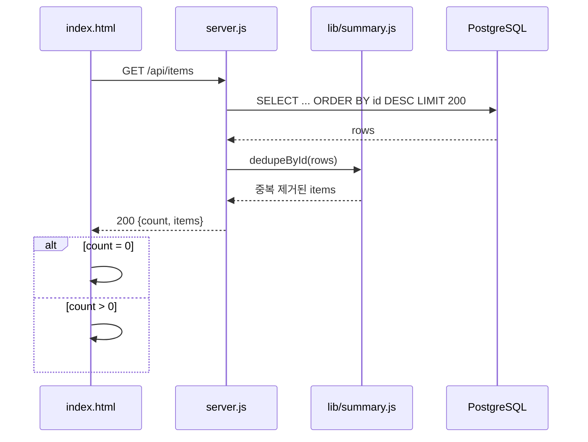
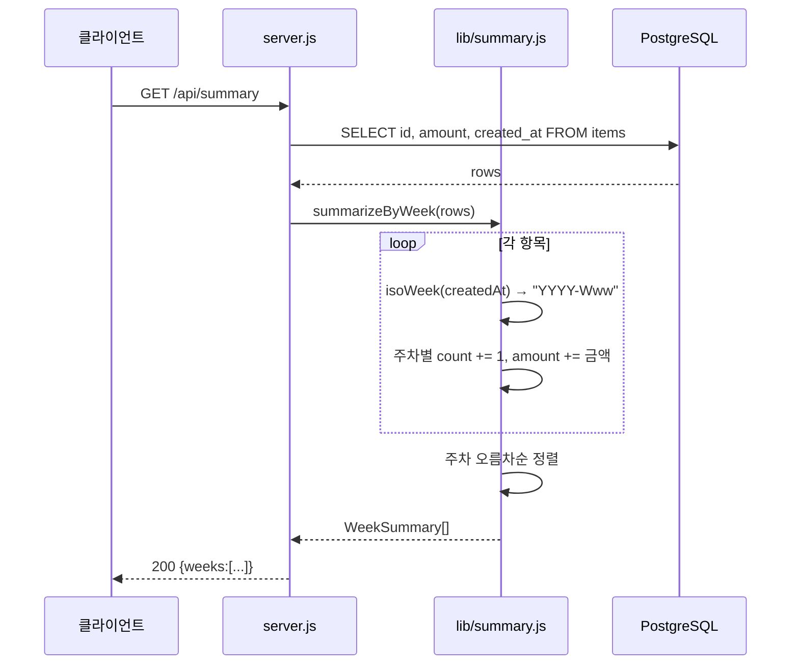
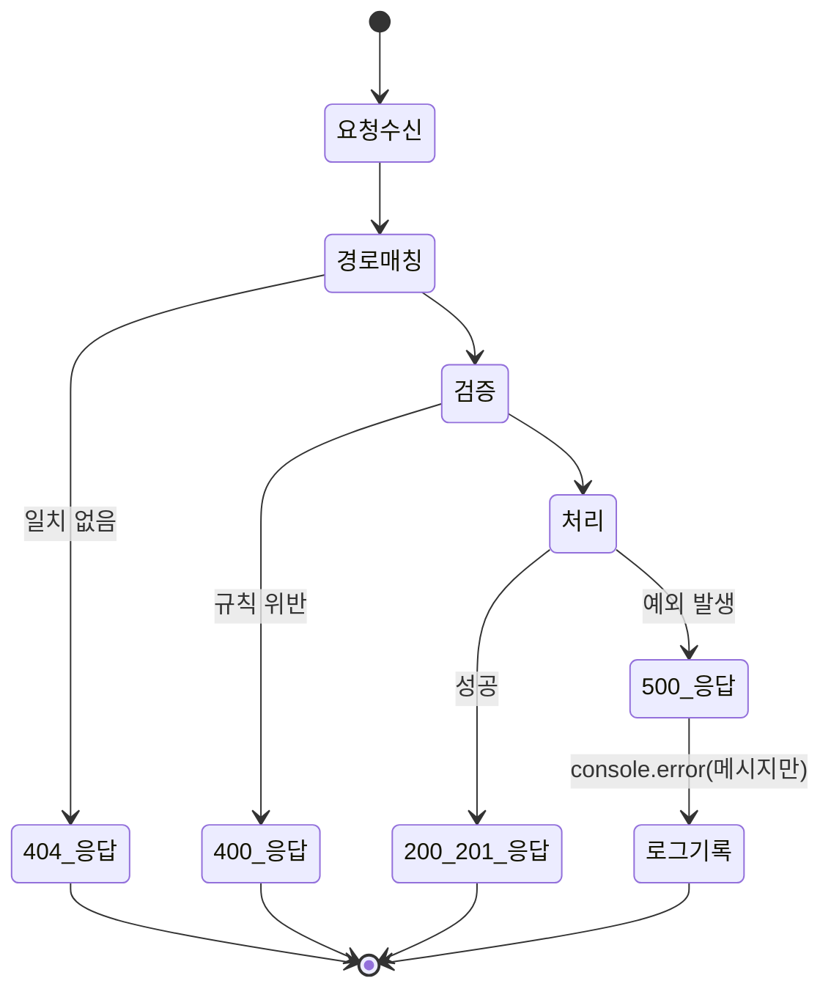
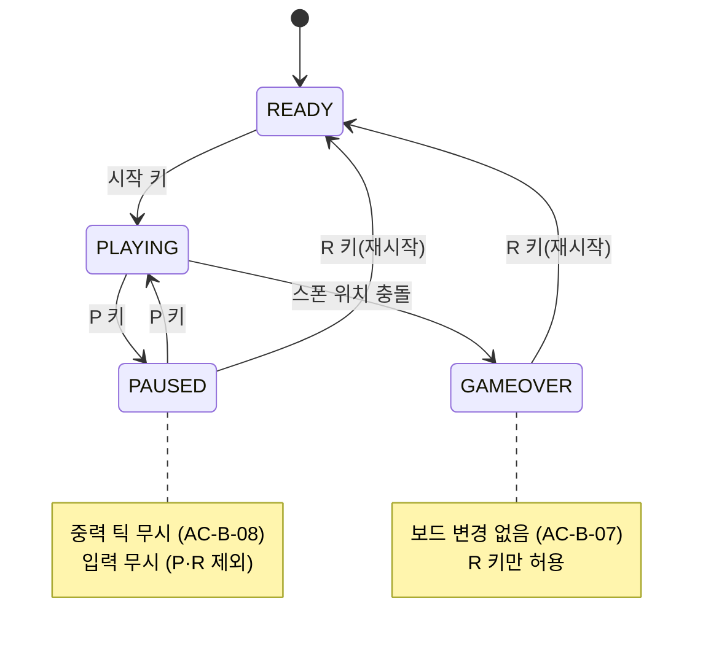
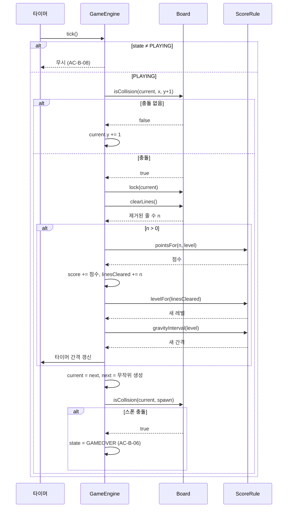
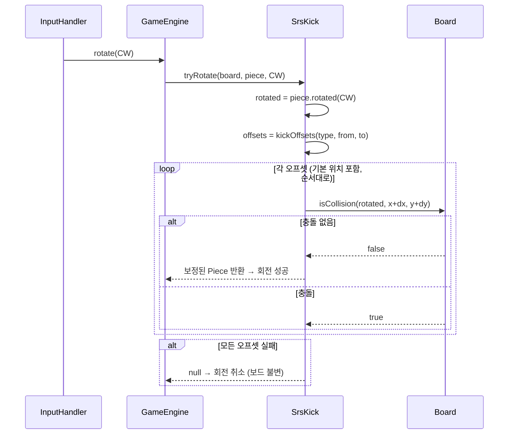
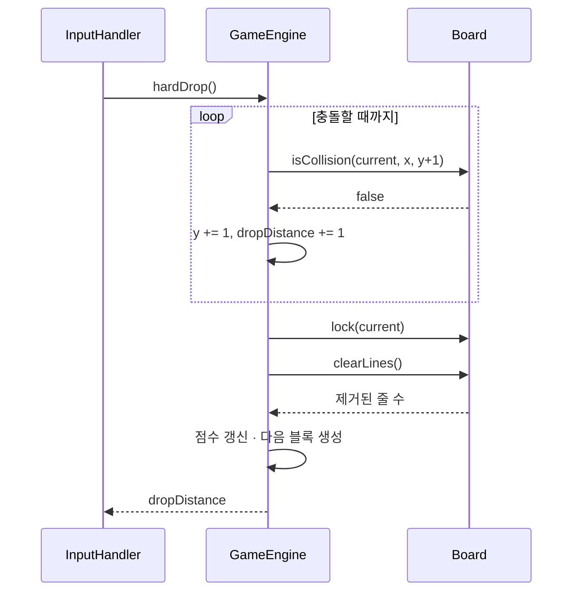

# 04. 시퀀스 · 상태 설계서 (공통)

> **답하는 질문**: «언제 무엇이 어떤 순서로 일어나는가»
> **범위**: 애플리케이션 런타임 흐름 (배포 프로세스는 환경별 `02_프로세스설계서` 참조)

---

## 1. APP-A 나만의 업무 앱

### 1-1. 기동 시퀀스 (프로브 계약의 근거)

> 📌 **설계 의도** — DB 가 늦게 뜨더라도 **앱은 기동에 실패하지 않습니다.** `/readyz` 가 트래픽을 막아 주고, DB 가 준비되면 **자동으로 회복**됩니다. (AC-A-01 · AC-A-06)

### 1-2. 항목 등록 시퀀스 (FR-A-02·03·05)

### 1-3. 목록 조회 · 빈 상태 (FR-A-01·11)

### 1-4. 주차 집계 시퀀스 (FR-A-04)

> 🔎 **집계를 왜 DB 가 아니라 앱에서 하는가** — 주차 계산 규칙(ISO 8601·월요일 시작)을 **순수 함수로 두어 단위 테스트**하기 위함입니다. 데이터가 커지면 DB 집계(`date_trunc`)로 옮기고, 그때도 순수 함수는 **회귀 검증의 기준**으로 남습니다.

### 1-5. 오류 처리 흐름

---

## 2. APP-B 웹 테트리스 게임

### 2-1. 게임 상태 머신 (FR-B-11·12)

### 2-2. 중력 틱 시퀀스 (FR-B-04·07)

### 2-3. 회전 + 월킥 시퀀스 (FR-B-03 · AC-B-03)

### 2-4. 하드 드롭 시퀀스 (FR-B-06)

> 📌 **AC-B-05(테트리스 4줄)** 은 이 경로로 검증합니다 — 하드 드롭으로 4줄을 동시에 완성시켜 `800 × level` 점수를 확인합니다.

---

## 3. 시퀀스 ↔ 테스트 매핑

| 시퀀스 | 검증 수준 | 대응 TC |
| --- | --- | --- |
| 1-1 기동 (프로브) | 통합 | I-A-01 · I-A-02 |
| 1-2 항목 등록 (정상) | 통합 · E2E | I-A-05 · E-A-03 |
| 1-2 항목 등록 (검증 실패) | 통합 · E2E | I-A-04 · E-A-04 |
| 1-3 목록 · 빈 상태 | 통합 · E2E | I-A-03 · E-A-01 |
| 1-4 주차 집계 | 단위 · 통합 | U-A-02·03·04 · I-A-06 |
| 2-1 상태 머신 | 단위 · E2E | U-B-06 · E-B-04 |
| 2-2 중력 틱 · 라인 클리어 | 단위 | U-B-02 · U-B-04 · U-B-05 |
| 2-3 회전 + 월킥 | 단위 | U-B-03 |
| 2-4 하드 드롭 | 단위 · E2E | U-B-05 · E-B-03 |
