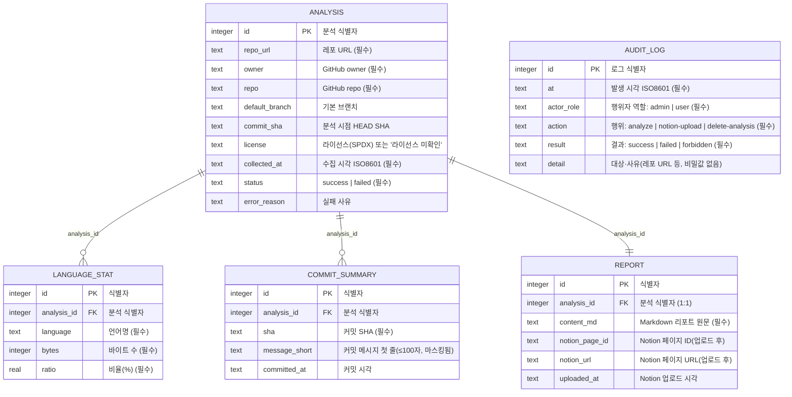

# 05. 데이터 모델 설계서 (공통)

> **답하는 질문**: «무엇을 어떻게 저장하는가»
> **적용**: APP-A 만 해당 (APP-B 는 서버 상태 없음 — 4장 참조)
> **정본**: [`실습산출물/3차시/myapp/src/db.js`](../../실습산출물/3차시/myapp/src/db.js)

---

## 1. ERD



> 📌 **왜 외래키(FK) 제약을 코드로 강제하지 않는가** — SQLite 는 `PRAGMA foreign_keys` 를 켜지 않으면 참조 무결성을 강제하지 않습니다. `audit_log` 는 **분석이 삭제되어도 남아야 하는 이력**이므로 `analysis_id` 를 아예 두지 않고 `detail` 문자열(레포 URL·이력 ID)로 **느슨하게** 기록합니다. 나머지 4개 테이블(`analysis`/`language_stat`/`commit_summary`/`report`)은 이력 삭제(`DELETE /api/analyses/:id`) 시 애플리케이션 코드가 **명시적으로 함께 삭제**합니다(`server.js`).

---

## 2. 테이블 정의

### 2-1. `analysis` — 분석 이력 (FR-A-01·08)

| 컬럼 | 타입 | 제약 | 설명 |
| --- | --- | --- | --- |
| `id` | INTEGER | **PK AUTOINCREMENT** | 분석 식별자 |
| `repo_url` | TEXT | **NOT NULL** | 사용자가 입력한 레포 URL 원문 |
| `owner` / `repo` | TEXT | **NOT NULL** | GitHub owner/repo(URL에서 파싱) |
| `default_branch` | TEXT | – | 기본 브랜치(실패 시 NULL) |
| `commit_sha` | TEXT | – | 분석 시점 HEAD SHA(실패 시 NULL) |
| `license` | TEXT | – | SPDX ID 또는 "라이선스 미확인" |
| `collected_at` | TEXT | **NOT NULL** | 수집 시각(ISO8601) |
| `status` | TEXT | **NOT NULL** | `success` \| `failed` |
| `error_reason` | TEXT | – | 실패 사유(성공 시 NULL) |

```sql
CREATE TABLE IF NOT EXISTS analysis (
  id             INTEGER PRIMARY KEY AUTOINCREMENT,
  repo_url       TEXT NOT NULL,
  owner          TEXT NOT NULL,
  repo           TEXT NOT NULL,
  default_branch TEXT,
  commit_sha     TEXT,
  license        TEXT,
  collected_at   TEXT NOT NULL,
  status         TEXT NOT NULL,
  error_reason   TEXT
);
```

### 2-2. `language_stat` · `commit_summary` — 분석 상세 (FR-A-01·02·06)

```sql
CREATE TABLE IF NOT EXISTS language_stat (
  id          INTEGER PRIMARY KEY AUTOINCREMENT,
  analysis_id INTEGER NOT NULL REFERENCES analysis(id),
  language    TEXT NOT NULL,
  bytes       INTEGER NOT NULL,
  ratio       REAL NOT NULL
);

CREATE TABLE IF NOT EXISTS commit_summary (
  id            INTEGER PRIMARY KEY AUTOINCREMENT,
  analysis_id   INTEGER NOT NULL REFERENCES analysis(id),
  sha           TEXT NOT NULL,
  message_short TEXT,
  committed_at  TEXT
);
```

> 🔎 **`message_short` 가 왜 마스킹인가** — 커밋 메시지 첫 줄(≤100자)만 저장하며, GitHub API 가 함께 주는 **커밋 작성자 이메일은 애초에 이 테이블에 컬럼 자체가 없습니다**(NFR-05). 저장 단계에서부터 개인정보가 들어올 여지를 차단합니다.

### 2-3. `report` — 생성 리포트 (FR-A-06·07)

```sql
CREATE TABLE IF NOT EXISTS report (
  id             INTEGER PRIMARY KEY AUTOINCREMENT,
  analysis_id    INTEGER NOT NULL REFERENCES analysis(id),
  content_md     TEXT NOT NULL,
  notion_page_id TEXT,
  notion_url     TEXT,
  uploaded_at    TEXT
);
```

> 📌 **`notion_page_id`/`notion_url`/`uploaded_at` 이 NULL 인 상태 = "아직 업로드하지 않음"**입니다. Notion 업로드는 수동 트리거(AC-A-02)이므로, 분석은 됐지만 업로드는 안 한 이력이 정상적으로 존재합니다.

### 2-4. `audit_log` — 감사 이력 (FR-A-10·11)

```sql
CREATE TABLE IF NOT EXISTS audit_log (
  id         INTEGER PRIMARY KEY AUTOINCREMENT,
  at         TEXT NOT NULL,
  actor_role TEXT NOT NULL,
  action     TEXT NOT NULL,
  result     TEXT NOT NULL,
  detail     TEXT
);
```

| 컬럼 | 값 예시 |
| --- | --- |
| `actor_role` | `admin` \| `user` (`?role=admin` 쿼리 유무로 결정 — NFR-03 §한계: 실제 인증 아님) |
| `action` | `analyze` \| `notion-upload` \| `delete-analysis` |
| `result` | `success` \| `failed` \| `forbidden`(권한 없는 관리자 기능 시도) |
| `detail` | 레포 URL, 오류 메시지, 또는 `analysisId=<id>` — **토큰·비밀값은 절대 포함하지 않음** |

---

## 3. 인덱스 설계

| 인덱스 | 대상 | 목적 | 적용 시점 |
| --- | --- | --- | --- |
| `analysis` PK | `analysis(id)` | PK · 목록 정렬(`ORDER BY id DESC`) | **자동 생성** |
| `language_stat`/`commit_summary`/`report`/`audit_log` PK | 각 `id` | PK | 자동 생성 |
| `idx_analysis_owner_repo` | `analysis(owner, repo)` | 특정 레포 재분석 이력 조회 | **데이터 1만 건 이상일 때** |
| `idx_commit_analysis_id` | `commit_summary(analysis_id)` | 이력 상세 조회 최적화 | 필요해질 때 |

```sql
-- 필요해질 때 추가 (미리 만들지 않는다 — 쓰기 비용만 늘어난다)
CREATE INDEX IF NOT EXISTS idx_analysis_owner_repo ON analysis (owner, repo);
CREATE INDEX IF NOT EXISTS idx_commit_analysis_id   ON commit_summary (analysis_id);
```

---

## 4. 스키마 진화 전략

### 4-1. 현재 방식 — 기동 시 `CREATE TABLE IF NOT EXISTS`

| 장점 | 한계 |
| --- | --- |
| 별도 마이그레이션 도구 불필요 · 실습에 적합 | **컬럼 변경·삭제를 표현할 수 없음** · 롤백 불가 |

### 4-2. 환경별 적용

| 환경 | 방식 | 근거 |
| --- | --- | --- |
| **dev·stg·prd 공통** | 기동 시 자동 생성(`better-sqlite3`), **파일은 컨테이너 로컬**이라 3환경 모두 동일 로직 | NFR-07(동일 이미지) |

> 🔎 **왜 환경별로 다르지 않은가** — SQLite 는 서버 프로세스가 아니라 파일이므로, "PostgreSQL 컨테이너냐 PaaS 냐"와 같은 환경별 분기가 애초에 없습니다. 대신 **데이터 수명(§5)** 이 환경별 차이의 핵심입니다.

### 4-3. 운영에서 스키마를 바꿔야 할 때 (확장 지침)

```
 ① 하위 호환 추가만 먼저   (nullable 컬럼 추가 · 새 테이블)
        ↓
 ② 앱 배포 (신·구 스키마 모두에서 동작하는 코드)
        ↓
 ③ 데이터 백필 (배치)
        ↓
 ④ 구 컬럼 사용 중단 (코드에서 제거)
        ↓
 ⑤ 구 컬럼 삭제 (충분한 관찰 기간 후)
```

> ⚠️ **한 번의 배포로 «컬럼 삭제 + 코드 변경»을 함께 하지 않습니다.** 롤백 시 구버전 코드가 없는 컬럼을 찾아 전면 장애가 납니다.

---

## 5. 환경별 데이터 저장소 매핑

| 항목 | dev | stg | prd |
| --- | --- | --- | --- |
| 엔진 | **SQLite**(`better-sqlite3`, 컨테이너 내부 파일) | **SQLite**(동일) | **SQLite**(동일) |
| 배포 형태 | Deployment(볼륨 없음) | Deployment(볼륨 없음) | Deployment + `emptyDir`(§5-1 한계) |
| 고가용성 | 없음(단일 파일, replicas=1) | 없음(replicas=2 — **각 파드가 독립된 파일**, §5-1) | 없음(replicas=3 — **각 파드가 독립된 파일**, §5-1) |
| 백업 | 없음 | 없음 | **없음(미해결 항목, §5-1)** |
| TLS | 해당 없음(로컬 파일 접근) | 해당 없음 | 해당 없음 |
| 접속 정보 출처 | 해당 없음(코드에 상대 경로 고정: `data/app.db`) | 해당 없음 | 해당 없음 |
| 네트워크 노출 | 해당 없음 | 해당 없음 | 해당 없음 |
| 데이터 수명 | 파드 재시작 시 소멸 | 파드 재시작 시 소멸 | **파드 재시작 시 소멸** |

### 5-1. 알려진 한계 — replicas > 1 일 때의 데이터 분산

> ⚠️ **stg(replicas=2)·prd(replicas=3)에서는 각 파드가 서로 다른 SQLite 파일을 가집니다.** 로드밸런서가 요청을 어느 파드로 보내느냐에 따라 사용자가 보는 이력이 달라질 수 있습니다. 이는 이 저장소의 공통 샘플 앱(PostgreSQL, 여러 파드가 **하나의 DB**를 공유)과 myapp 의 근본적인 차이이며, 아직 해결하지 않은 항목입니다.
>
> **후속 조치(미실행)**: Azure Files 등 PVC 기반 공유 볼륨으로 전환하거나, replicas=1 로 제한하거나, SQLite 대신 PaaS DB 로 전환. 상세: [실습산출물/3차시/06_배포스크립트_조정.md §4](../../실습산출물/3차시/06_배포스크립트_조정.md) · [09_비밀없는접근.md §6](../../실습산출물/3차시/09_비밀없는접근.md).

---

## 6. 데이터 보호 · 개인정보

| 항목 | 규칙 | 근거 |
| --- | --- | --- |
| **실데이터 금지** | 실제 인사·고객 데이터를 다루지 않는다 — 분석 대상은 **공개 GitHub 레포**뿐 | 실습 안전 수칙 |
| **개인정보 미수집** | 커밋 작성자 이메일 등은 GitHub API 응답에 있어도 **테이블 컬럼 자체를 두지 않음**(§2-2) | FR-A-06 · NFR-05 |
| **비밀값** | `GITHUB_TOKEN`·`NOTION_TOKEN`·`NOTION_PARENT_PAGE_ID` 는 코드·Git·이미지에 없음 | NFR-03 |
| **감사로그의 비밀 미포함** | `audit_log.detail` 에 토큰 값을 넣지 않는다(검증: 06 테스트설계서 U-A-11) | NFR-03 |
| **산출물 검사** | 캡처·리포트에 개인정보 없는지 확인 | 테스트 판정 기준 |
| **로그** | `console.error` 에 **메시지만** 기록(토큰·스택 전체 금지) | NFR-05·06 |

---

## 7. 테스트 데이터 설계

| 목적 | 데이터 | 사용 TC |
| --- | --- | --- |
| 정상 분석 | 실제 공개 레포(`octocat/Hello-World`, `expressjs/express` 등) | U-A-01~08, I-A-03 |
| 존재하지 않는 레포 | `this-org-does-not-exist-xyz/private-tool` | U-A-02, I-A-04, E-A-04 |
| 잘못된 URL 형식 | `not-a-valid-url` | U-A-01, I-A-04 |
| 빈 레포(커밋·언어 없음) | `languageStats: []`, `commits: []`(단위 테스트 리터럴) | U-A-05 |
| README 요약 대상 | 배지·이미지·헤딩이 섞인 실제 README(`sindresorhus/awesome` 등) | U-A-06·07 |
| 아키텍처 추정 대상 | 모노레포(`vuejs/core`) · 평면 구조(`octocat/Hello-World`) | U-A-08 |
| Notion 업로드 왕복 | 실제 분석 완료 이력 1건 | I-A-06, E-A-06·07 |
| 관리자 권한 분기 | 동일 이력에 대해 role 유/무 각각 요청 | I-A-08 |

> 📌 **개인정보 없이 반복 실행이 안전한 이유** — 위 데이터는 모두 **공개 GitHub 레포**(오픈소스)이며, 앱이 커밋 작성자 이메일 등을 애초에 저장하지 않으므로(§6) 실행 횟수·시점과 무관하게 개인정보가 산출물에 남지 않습니다.
