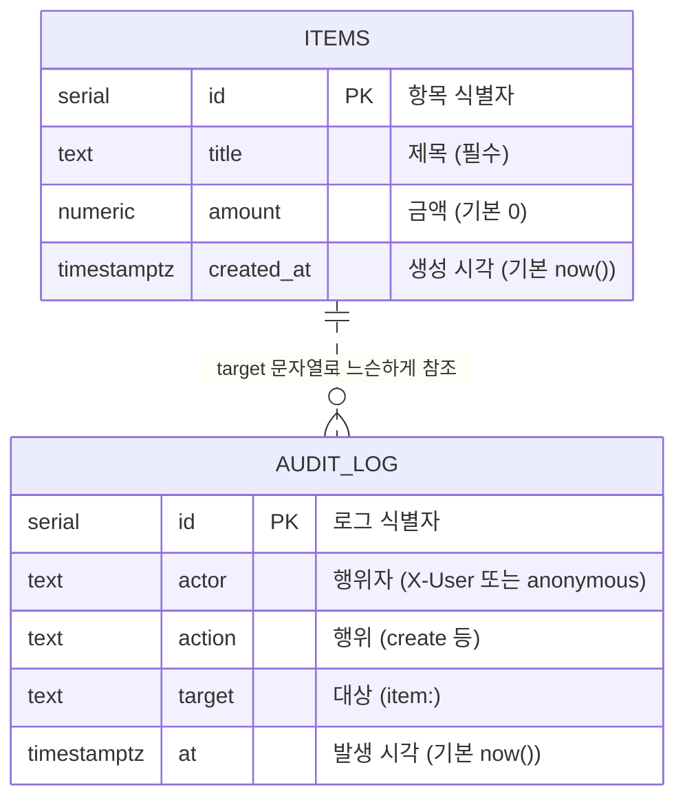

# 05. 데이터 모델 설계서 (공통)

> **답하는 질문**: «무엇을 어떻게 저장하는가»
> **적용**: APP-A 만 해당 (APP-B 는 서버 상태 없음 — 4장 참조)

---

## 1. ERD



> 📌 **왜 외래키(FK)가 없는가** — `audit_log` 는 **항목이 삭제되어도 남아야 하는 이력**입니다. FK 로 묶으면 삭제 시 로그까지 사라지거나 삭제가 막힙니다. 대신 `target` 에 `item:<id>` 형식 문자열로 **느슨하게** 참조합니다.

---

## 2. 테이블 정의

### 2-1. `items` — 업무 항목

| 컬럼 | 타입 | 제약 | 기본값 | 설명 |
| --- | --- | --- | --- | --- |
| `id` | SERIAL | **PK** | 자동 증가 | 항목 식별자 |
| `title` | TEXT | **NOT NULL** | – | 제목. 앱 계층에서 trim 후 1자 이상 검증(FR-A-03) |
| `amount` | NUMERIC | NOT NULL | `0` | 금액. 앱에서 `Number()` 변환 |
| `created_at` | TIMESTAMPTZ | NOT NULL | `now()` | 생성 시각. **주차 집계의 기준**(FR-A-04) |

```sql
CREATE TABLE IF NOT EXISTS items (
  id          SERIAL PRIMARY KEY,
  title       TEXT        NOT NULL,
  amount      NUMERIC     NOT NULL DEFAULT 0,
  created_at  TIMESTAMPTZ NOT NULL DEFAULT now()
);
```

### 2-2. `audit_log` — 감사 이력 (FR-A-05)

| 컬럼 | 타입 | 제약 | 기본값 | 설명 |
| --- | --- | --- | --- | --- |
| `id` | SERIAL | **PK** | 자동 증가 | 로그 식별자 |
| `actor` | TEXT | **NOT NULL** | – | 행위자. `X-User` 헤더 없으면 `anonymous` |
| `action` | TEXT | **NOT NULL** | – | `create` 등 |
| `target` | TEXT | – | – | `item:<id>` |
| `at` | TIMESTAMPTZ | NOT NULL | `now()` | 발생 시각 |

```sql
CREATE TABLE IF NOT EXISTS audit_log (
  id         SERIAL PRIMARY KEY,
  actor      TEXT        NOT NULL,
  action     TEXT        NOT NULL,
  target     TEXT,
  at         TIMESTAMPTZ NOT NULL DEFAULT now()
);
```

---

## 3. 인덱스 설계

| 인덱스 | 대상 | 목적 | 적용 시점 |
| --- | --- | --- | --- |
| `items_pkey` | `items(id)` | PK · 목록 정렬(`ORDER BY id DESC`) | **자동 생성** |
| `audit_log_pkey` | `audit_log(id)` | PK | 자동 생성 |
| `idx_items_created_at` | `items(created_at)` | 주차 집계·기간 조회 | **데이터 1만 건 이상일 때** |
| `idx_audit_target` | `audit_log(target)` | 특정 항목의 이력 추적 | 감사 조회 기능 추가 시 |

```sql
-- 필요해질 때 추가 (미리 만들지 않는다 — 쓰기 비용만 늘어난다)
CREATE INDEX IF NOT EXISTS idx_items_created_at ON items (created_at);
CREATE INDEX IF NOT EXISTS idx_audit_target     ON audit_log (target);
```

> 🔎 **인덱스를 미리 만들지 않는 이유** — 인덱스는 조회를 빠르게 하지만 **쓰기마다 갱신 비용**이 듭니다. 8차시 심화 「성능 문제 진단 순서」의 4단계(인덱스)는 **1~3단계 이후**에 옵니다.

---

## 4. 스키마 진화 전략

### 4-1. 현재 방식 — 기동 시 `CREATE TABLE IF NOT EXISTS`

| 장점 | 한계 |
| --- | --- |
| 별도 마이그레이션 도구 불필요 · 실습에 적합 | **컬럼 변경·삭제를 표현할 수 없음** · 롤백 불가 |

### 4-2. 환경별 적용

| 환경 | 방식 | 근거 |
| --- | --- | --- |
| **dev** | 기동 시 자동 생성 · **데이터는 언제든 폐기** | 반복 속도 우선 |
| **stg** | 기동 시 자동 생성 · StatefulSet PVC 로 유지 | 배포 방식 검증이 목적 |
| **prd** | 기동 시 자동 생성 + **PITR 백업** · 변경은 **사전 마이그레이션** | 데이터 손실 불가 |

### 4-3. 운영에서 스키마를 바꿔야 할 때 (확장 지침)

```
 ① 하위 호환 추가만 먼저   (nullable 컬럼 추가 · 새 테이블)
        ↓
 ② 앱 배포 (신·구 스키마 모두에서 동작하는 코드)
        ↓
 ③ 데이터 백필 (배치)
        ↓
 ④ 구 컬럼 사용 중단 (코드에서 제거)
        ↓
 ⑤ 구 컬럼 삭제 (충분한 관찰 기간 후)
```

> ⚠️ **한 번의 배포로 «컬럼 삭제 + 코드 변경»을 함께 하지 않습니다.** 롤백 시 구버전 코드가 없는 컬럼을 찾아 전면 장애가 납니다.

---

## 5. 환경별 데이터 저장소 매핑

| 항목 | dev | stg | prd |
| --- | --- | --- | --- |
| 엔진 | PostgreSQL 16 (컨테이너) | PostgreSQL 16 (컨테이너) | **Azure Database for PostgreSQL 유연한 서버** |
| 배포 형태 | Deployment (볼륨 없음) | **StatefulSet + PVC 8Gi** | **PaaS (관리형)** |
| 고가용성 | 없음 | 없음 | **영역 중복(ZoneRedundant)** |
| 백업 | 없음 | 없음 | **자동 · 보존 14일 · PITR** |
| TLS | `DB_SSL=false` | `DB_SSL=false` | **`DB_SSL=true` (필수)** |
| 접속 정보 출처 | ConfigMap + Secret | ConfigMap + Secret | **Key Vault → CSI → Secret** |
| 네트워크 노출 | 클러스터 내부 | 클러스터 내부 | **공용 액세스 차단(Private)** |
| 데이터 수명 | 클러스터 삭제 시 소멸 | PVC 유지 | **영구 · 백업 보존** |

---

## 6. 데이터 보호 · 개인정보

| 항목 | 규칙 | 근거 |
| --- | --- | --- |
| **실데이터 금지(dev·stg)** | 실제 인사·고객 데이터를 넣지 않는다 | 실습 안전 수칙 |
| **마스킹** | 이름 `홍*동`, 사번 `****1234` — `maskPii()` 사용 | FR-A-13 · NFR-05 |
| **비밀값** | DB 비밀번호는 코드·Git·이미지에 없음 | NFR-03 |
| **산출물 검사** | 캡처·엑셀·리포트에 개인정보 없는지 확인 | 테스트 판정 기준 |
| **로그** | `console.error` 에 **메시지만** 기록(연결 문자열·스택 전체 금지) | NFR-05 |

---

## 7. 테스트 데이터 설계

| 목적 | 데이터 | 사용 TC |
| --- | --- | --- |
| 주차 경계 검증 | `2026-03-02`(월) · `2026-03-08`(일) — **같은 주** | U-A-01 |
| 다중 주차 집계 | `2026-03-02`(100) · `2026-03-05`(200) · `2026-03-10`(50) | U-A-02 |
| 빈 결과 | `[]` | U-A-03 |
| 타입 오류 | `null` | U-A-04 |
| 중복 제거 | 동일 `id` 2건 + 다른 1건 | U-A-05 |
| 마스킹 | `홍길동` · `20231234` | U-A-06 |
| 통합 왕복 | `통합테스트-<timestamp>` (고유 제목) | I-A-05 |
| E2E 왕복 | `E2E-<timestamp>` | E-A-03 |

> 📌 **고유 제목 규칙** — 통합·E2E 는 **타임스탬프를 붙여** 이전 실행 데이터와 충돌하지 않게 합니다. 정리(cleanup) 없이 반복 실행이 가능해집니다.
