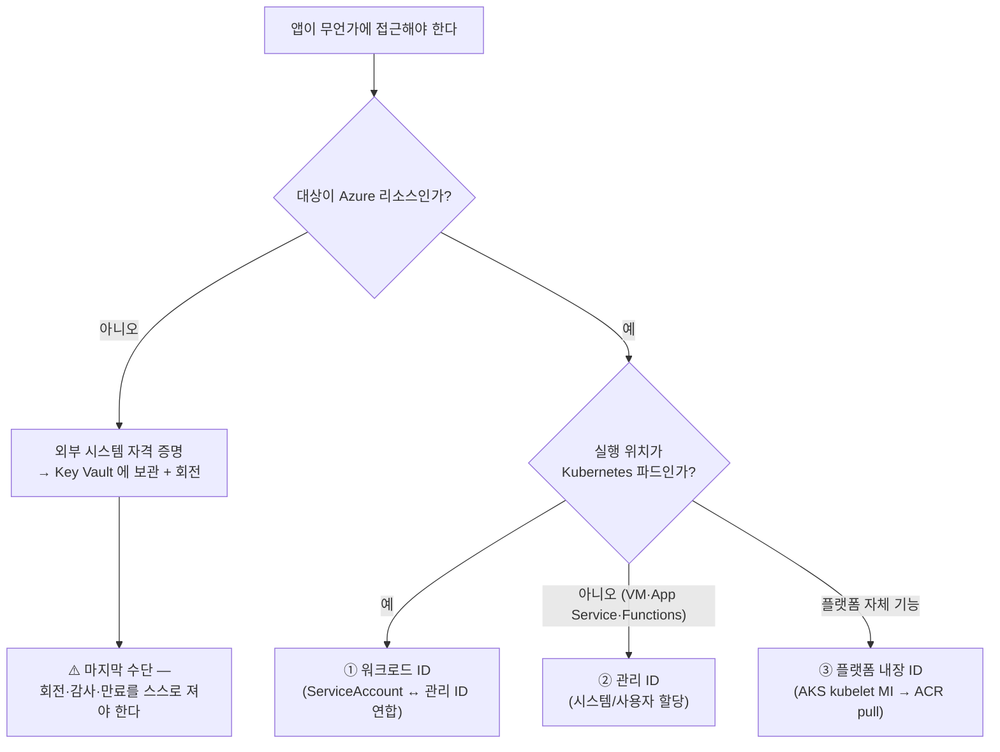
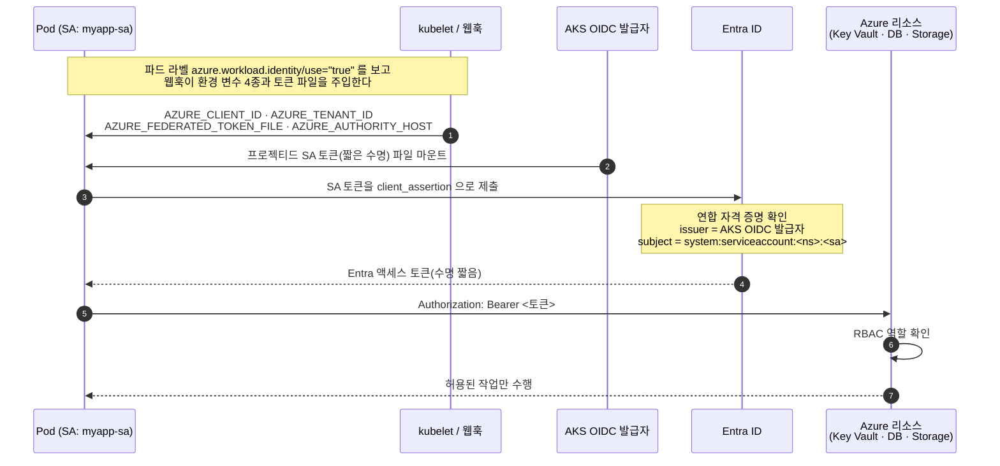
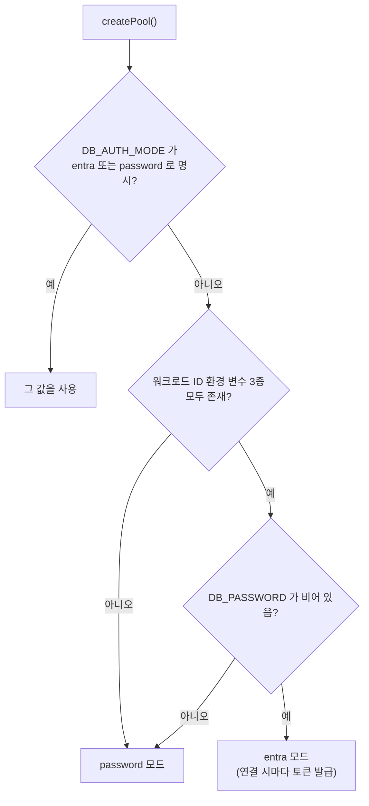
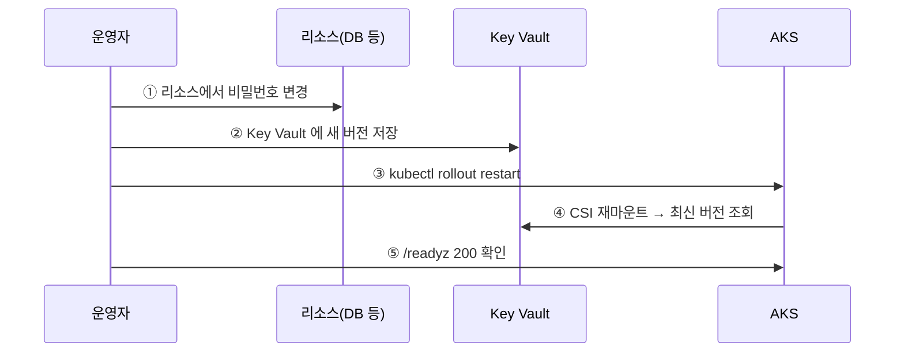

# 공통 07. 아이덴티티 · 시크릿 설계서

> **답하는 질문**: «앱은 **자기가 누구인지**를 어떻게 증명하고, **비밀은 어디에** 두는가»
> **제1원칙**: **비밀을 «잘 보관»하기 전에 «만들지 않는다».**
> **정본**: [`배포/common/identity.ps1`](../../배포/common/identity.ps1) · [`배포/prd/config/env.prd.json`](../../배포/prd/config/env.prd.json) 의 `identity` 블록

> ⚠️ **myapp 적용 현황 (2026-08-29)** — 이 문서의 PostgreSQL·Redis·Storage 관련 서술(§ 자격 증명 유형별 전환 표 등)은 이 플랫폼의 **일반 패턴**입니다. myapp은 SQLite+GitHub/Notion API만 써서 이 셋을 실제로 쓰지 않으며(`env.prd.json`의 `skipPaasData: true`), 실제로 적용된 것은 **ACR pull**과 **Key Vault(github-token·notion-token·notion-parent-page-id) 읽기**뿐입니다. PostgreSQL/Redis/Storage 패턴은 향후 이 셋을 실제로 쓰는 앱을 배포할 때 그대로 재사용하면 됩니다.

---

## 1. 이 문서가 공통에 있는 이유

| 환경 불변인 것 (여기) | 환경별인 것 (각 환경 01·03) |
| --- | --- |
| 자격 증명 **유형 분류**와 선택 규칙 | 어떤 리소스에 실제로 적용했는가 |
| **금지 목록**(안티패턴) | 검증 항목과 통과 기준 |
| 앱 코드의 **인증 방식 결정 로직** | 역할 이름·범위·리소스 이름 |

> 📌 «비밀번호를 코드에 두지 않는다»는 어느 환경에서나 참입니다. 반면 «Key Vault CSI 로 주입한다»는 prd 에서만 참입니다. 전자는 이 문서에, 후자는 [prd 03](../prd/03_구성설계서_prd.md)에 있습니다.

---

## 2. 자격 증명 유형 — MECE 분류

| # | 유형 | 무엇인가 | 쓰는 곳 | 비밀 존재 여부 |
| --- | --- | --- | --- | :---: |
| **①** | **워크로드 ID** (Workload Identity) | 파드의 ServiceAccount 토큰을 Entra 토큰으로 **교환** | AKS 안의 앱 → Key Vault · DB · Storage | **없음** |
| **②** | **관리 ID** (Managed Identity) | 플랫폼이 리소스에 부여한 신원 | VM · App Service · Functions · Container Apps | **없음** |
| **③** | **플랫폼 내장 ID** | 서비스가 자기 관리 ID 로 대신 인증 | AKS kubelet MI → ACR `pull` | **없음** |
| **④** | 시크릿·키·연결 문자열 | 값 자체가 곧 권한 | 외부 SaaS · 레거시 · Entra 미지원 리소스 | **있음** — 최소화 대상 |

> 🔑 **①②③ 은 «비밀이 존재하지 않는» 방식입니다.** 유출될 대상 자체가 없으므로, 회전·감사·만료 관리 부담이 사라집니다. ④ 로 내려갈수록 운영 비용이 늘어납니다.

### 2-1. ① 과 ② 의 차이 — 자주 혼동되는 지점

| | **관리 ID (②)** | **워크로드 ID (①)** |
| --- | --- | --- |
| 신원의 주인 | **Azure 리소스**(VM·App Service) | **Kubernetes ServiceAccount** |
| 왜 파드에 그대로 못 쓰나 | 노드(VM)의 ID 이므로 **같은 노드의 모든 파드가 공유** | 파드 단위로 분리됨 |
| 증명 방식 | IMDS 엔드포인트 | **OIDC 토큰 교환**(연합 자격 증명) |
| AKS 에서의 선택 | ❌ 파드 권한 분리 불가 | ✅ **권장** |

> ⚠️ **AKS 에서 노드의 관리 ID 를 앱이 쓰면, 같은 노드에 뜬 다른 파드도 같은 권한을 갖습니다.** 이것이 워크로드 ID 가 별도로 존재하는 이유입니다.

---

## 3. 워크로드 ID 가 작동하는 원리

### 3-1. 성립 조건 5가지 — 하나라도 빠지면 실패합니다

| # | 조건 | 확인 방법 | 빠졌을 때의 증상 |
| --- | --- | --- | --- |
| 1 | AKS **OIDC 발급자** 사용 | `az aks show --query oidcIssuerProfile.enabled` | 연합 자격 증명 생성 불가 |
| 2 | AKS **워크로드 ID 애드온** 사용 | `--query securityProfile.workloadIdentity.enabled` | 환경 변수·토큰이 주입되지 않음 |
| 3 | **연합 자격 증명**의 issuer·subject 일치 | `az identity federated-credential list` | `AADSTS70021` 토큰 교환 실패 |
| 4 | **ServiceAccount 주석** = 관리 ID clientId | `kubectl get sa -o yaml` | `AZURE_CLIENT_ID` 미주입 |
| 5 | **파드 라벨** `azure.workload.identity/use: "true"` | `kubectl get pod --show-labels` | 웹훅이 파드를 건너뜀 |

> 🔎 **subject 형식은 정확히 `system:serviceaccount:<네임스페이스>:<서비스계정>` 입니다.** 오타 한 글자면 토큰 교환이 실패하고, 오류 메시지는 «권한 없음»처럼 보여 원인을 찾기 어렵습니다. 그래서 [`identity.ps1`](../../배포/common/identity.ps1) 의 `Get-FederatedSubject` 가 이 문자열을 **한 곳에서만** 만듭니다.

---

## 4. 리소스별 «비밀 없는» 접근 방법

| 리소스 | 비밀을 쓰는 방식 (지양) | **비밀 없는 방식 (채택)** | 부여 역할 | az 명령 |
| --- | --- | --- | --- | --- |
| **ACR** | `imagePullSecret` | **AKS kubelet 관리 ID** | `AcrPull` | `az aks update --attach-acr` |
| **Key Vault** | 액세스 정책 + 앱 시크릿 | **워크로드 ID + RBAC + CSI** | `Key Vault Secrets User` | `az role assignment create` |
| **Storage** | 계정 키 · SAS | **공유 키 비활성 + RBAC** | `Storage Blob Data Contributor` | `az storage account create --allow-shared-key-access false` |
| **PostgreSQL** | 관리자 비밀번호 | **Entra ID 인증 + 토큰** | Entra DB 관리자 | `az postgres flexible-server update --active-directory-auth Enabled` `az postgres flexible-server ad-admin create` |
| **Redis** | 액세스 키 | **Entra 액세스 정책 할당** | `Data Contributor` | `az redis access-policy-assignment create` |

> ✅ 위 명령은 모두 **az CLI 2.60.0 에서 존재를 확인**한 것입니다. 문서상의 이상론이 아니라 이 과정의 스크립트가 실제로 실행하는 명령입니다.

### 4-1. 역할 선택 규칙 — «읽기만 필요하면 읽기만»

| 하고 싶은 일 | 올바른 역할 | 흔한 과다 부여 |
| --- | --- | --- |
| 시크릿 **읽기** | `Key Vault Secrets User` | ❌ `Key Vault Secrets Officer`(쓰기·삭제 포함) |
| 이미지 **pull** | `AcrPull` | ❌ `AcrPush` · ❌ `Contributor` |
| Blob 읽기만 | `Storage Blob Data Reader` | ❌ `Storage Account Contributor`(키 조회 가능) |
| 무엇이든 | **리소스 범위** | ❌ **구독 범위** |

> 🚫 **`Storage Account Contributor` 는 «데이터 역할»이 아니라 «관리 역할»입니다.** 이 역할이 있으면 **계정 키를 조회**할 수 있어, 공유 키를 비활성화한 의미가 사라집니다.

---

## 5. 앱 코드의 인증 방식 결정 로직

> 정본: [`배포/common/app/src/lib/authmode.js`](../../배포/common/app/src/lib/authmode.js) (순수 함수 — 단위 테스트 대상)

| 모드 | 사용 환경 | 자격 증명 |
| --- | --- | --- |
| `password` | dev · stg (in-cluster PostgreSQL) | `DB_PASSWORD` |
| `entra` | prd (PaaS PostgreSQL) | **Entra 액세스 토큰** — 코드·이미지·환경 변수 어디에도 값이 없음 |

**설계 포인트 3가지**

| 포인트 | 왜 |
| --- | --- |
| **환경이 스스로 고르게 한다** | 같은 이미지가 dev·stg·prd 에서 그대로 동작해야 한다(NFR-07) |
| **`password` 를 «함수»로 넘긴다** | `pg` 는 password 로 함수를 받는다 → **연결할 때마다 최신 토큰**을 쓰게 되어 만료 문제가 사라진다 |
| **토큰을 만료 5분 전까지 캐시한다** | 매 연결마다 토큰을 새로 받으면 Entra 호출이 폭증한다 |

> 🔎 **`@azure/identity` 를 쓰지 않은 이유** — 토큰이 «어디서 어떻게 나오는지»를 보이게 하는 것이 이 과정의 학습 목표이고, 의존성 하나를 줄이면 오프라인·폐쇄망 환경에서도 실습이 가능합니다. 운영 프로젝트에서는 라이브러리 사용을 권장합니다.

---

## 6. 환경별 적용 매트릭스 (MECE)

| 항목 | **dev** | **stg** | **prd** |
| --- | --- | --- | --- |
| 실행 위치 | 로컬 k3d | AKS Free | AKS Standard |
| **관리 ID 사용 가능** | ❌ (Azure 밖) | ✅ kubelet MI(ACR) | ✅ kubelet MI(ACR) |
| **워크로드 ID** | ❌ 불가 | ⚙️ **전제만 활성화**(OIDC·애드온) | ✅ **실제 사용** |
| ACR 인증 | 없음(로컬 이미지) | kubelet MI (`--attach-acr`) | kubelet MI + 앱 MI 에 `AcrPull` |
| Key Vault | ❌ | ❌ (K8s Secret) | ✅ 워크로드 ID + CSI |
| DB 인증 | 비밀번호(기본값 있음) | 비밀번호(기본값 없음) | **Entra 토큰**(목표) · 비밀번호(호환) |
| Redis | – | – | **Entra 액세스 정책** |
| Storage | – | – | **공유 키 비활성 + RBAC** |
| 검증 | – | **G-06~G-09** | **P-16~P-23** |

> 🔎 **stg 에서 «전제만 활성화»하는 이유** — prd 에서 워크로드 ID 를 처음 켜면 OIDC 발급자·애드온 설정에서 막힙니다. stg 에서 **켜진 상태를 미리 만들고 검증**해 두면, prd 에서는 연합 자격 증명과 역할 부여에만 집중할 수 있습니다.
>
> 🔎 **dev 에서는 대체할 수 없습니다.** 로컬은 Azure 밖이므로 관리 ID 가 존재하지 않습니다. 대신 **비밀번호를 환경 변수로만 받는 습관**을 유지해, prd 로 옮길 때 코드가 바뀌지 않게 합니다.

---

## 7. 금지 목록 (안티패턴)

| # | 금지 | 왜 위험한가 | 대신 |
| --- | --- | --- | --- |
| **A-01** | 서비스 주체 **클라이언트 시크릿** 생성·보관 | 만료·회전·유출을 사람이 책임져야 함 | 워크로드 ID |
| **A-02** | 액세스 키·연결 문자열을 **앱 설정·Git**에 기록 | 저장소가 곧 유출 경로 | RBAC + 토큰 |
| **A-03** | **구독 범위** 역할 부여 | 하나가 뚫리면 전부 뚫림 | 리소스 범위 |
| **A-04** | 관리 역할(`*Contributor`)로 **데이터 접근** | 키 조회가 가능해 통제가 무력화 | 데이터 평면 역할 |
| **A-05** | 노드(kubelet) 관리 ID 를 **앱 권한**으로 사용 | 같은 노드의 모든 파드가 권한 공유 | 워크로드 ID |
| **A-06** | 토큰·비밀번호를 **로그·응답**에 출력 | 로그 수집 경로로 유출 | 존재 여부만 노출 |
| **A-07** | `kubectl create secret` 으로 **prd 비밀 직접 생성** | Key Vault 우회 → 회전·감사 상실 | CSI 동기화 |
| **A-08** | 실습 편의로 **공유 키 다시 활성화** | 비밀 없는 설계의 근거가 사라짐 | RBAC 문제를 해결 |

---

## 8. 검증 케이스 (환경별 04 테스트설계서가 참조)

| TC-ID | 검증 | 통과 기준 | 어디서 |
| --- | --- | --- | --- |
| **ID-01** | AKS OIDC 발급자 사용 | `oidcIssuerProfile.enabled = true` | stg · prd |
| **ID-02** | 워크로드 ID 애드온 사용 | `securityProfile.workloadIdentity.enabled = true` | stg · prd |
| **ID-03** | Key Vault CSI 애드온 사용 | `addonProfiles.azureKeyvaultSecretsProvider.enabled = true` | prd |
| **ID-04** | 연합 자격 증명 일치 | issuer·subject 가 실제 클러스터/SA 와 일치 | prd |
| **ID-05** | SA 주석 = 관리 ID clientId | 자리표시자가 아닌 실제 GUID | prd |
| **ID-06** | **파드에 토큰 주입** | `AZURE_CLIENT_ID` · `AZURE_FEDERATED_TOKEN_FILE` 존재 | prd |
| **ID-07** | PostgreSQL Entra 인증 사용 | `authConfig.activeDirectoryAuth = Enabled` | prd |
| **ID-08** | 관리 ID 가 Entra DB 관리자 | `ad-admin list` 에 principalId 존재 | prd |
| **ID-09** | Storage 공유 키 차단 | `allowSharedKeyAccess = false` | prd |
| **ID-10** | Redis Entra 액세스 정책 | 할당 ≥ 1 | prd |
| **ID-11** | **구독 범위 광역 권한 없음** | 구독 스코프 역할 할당 = 0 | prd |
| **ID-12** | `imagePullSecret` 미사용 | Deployment 에 `imagePullSecrets` 없음 | stg · prd |
| **U-A-07~10** | 인증 방식 선택 로직 · 비밀 미노출 | 단위 테스트 4건 Pass | **모든 환경** |
| **I-A-10** | `/version` 이 방식만 노출 | `auth.mode` 존재 · 비밀 문자열 없음 | 모든 환경 |

> 🎯 **ID-06 이 «실제로 작동하는가»를 가르는 항목입니다.** ID-01~05 는 «설정했다»를 보지만, ID-06 은 **파드 안에서 토큰이 실제로 주입되었는지**를 확인합니다.

---

## 9. 비밀이 여전히 필요한 경우 — 최소화 원칙

| 상황 | 최소화 방법 |
| --- | --- |
| Entra 미지원 외부 SaaS | Key Vault 보관 + **CSI 로 마운트** · 앱은 값을 저장하지 않음 |
| 레거시 시스템 | 회전 주기 명시 + 감사 로그 확인 |
| 실습 호환용 DB 비밀번호 | **암호 인증을 끄면 Key Vault 에서도 삭제**(`20_config.ps1` 이 자동 수행) |

### 9-1. 비밀 회전 절차 (순서가 중요)

> ⚠️ **②→① 순서로 하면 그 사이 파드가 재시작될 때 연결이 끊깁니다.** 반드시 **리소스 → Key Vault → 재시작** 순서를 지킵니다.
>
> ✅ **Entra 토큰 인증에는 이 절차 자체가 없습니다.** 회전할 비밀이 없기 때문입니다 — 이것이 «비밀을 만들지 않는» 설계의 실질적 이득입니다.

---

## 10. 참조

| 문서 | 내용 |
| --- | --- |
| [prd 01 §5 보안 설계](../prd/01_아키텍처설계서_prd.md) | 워크로드 ID 흐름 · 통제 목록 |
| [prd 03 §3 Key Vault 연동](../prd/03_구성설계서_prd.md) | SecretProviderClass 필드 |
| [prd 04 테스트설계서](../prd/04_테스트설계서_prd.md) | P-16~P-23 판정 |
| [stg 04 테스트설계서](../stg/04_테스트설계서_stg.md) | G-06~G-09 전제 검증 |
| [`배포/common/identity.ps1`](../../배포/common/identity.ps1) | 적용·검증 함수 |
| [`배포/common/app/src/azureToken.js`](../../배포/common/app/src/azureToken.js) | 토큰 교환 구현 |
