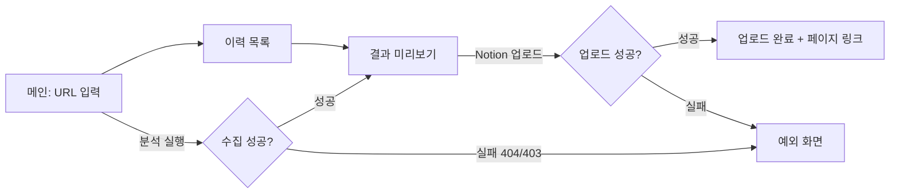
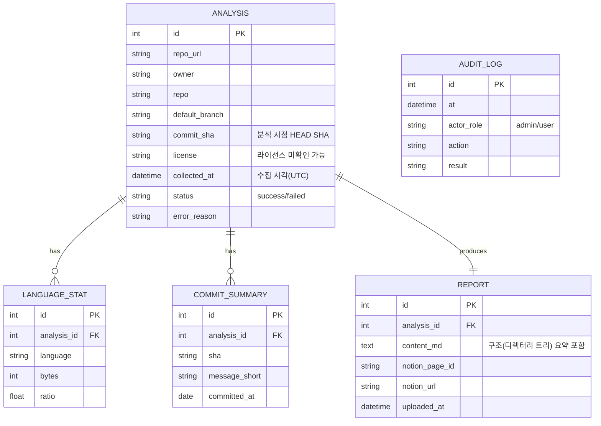
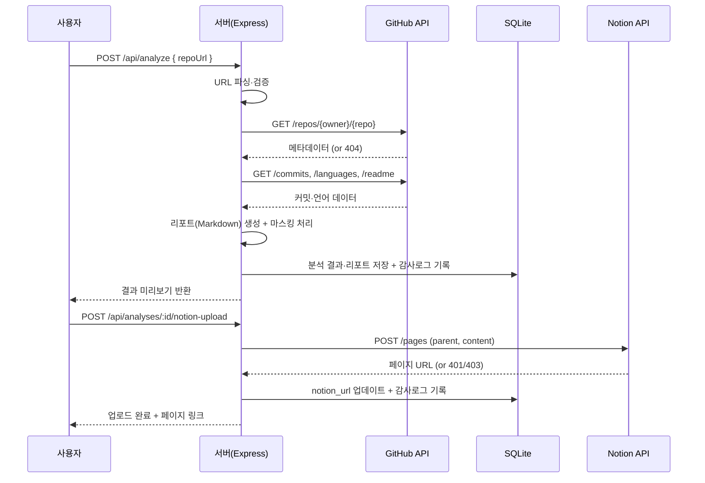

# 2단계 · 설계

작성일: 2026-08-28

## 1. 화면 목록 및 화면 흐름도

| 화면 | 설명 |
|---|---|
| 메인(분석 실행) | 레포 URL 입력 → 분석 실행 |
| 결과 미리보기 | 프로젝트 주제·프로젝트 구조(디렉터리 트리 요약)·아키텍처 패턴·기술스택 구성비(막대 그래프)·커밋 요약·리포트 본문 미리보기, Notion 업로드 버튼 |
| 이력 목록 | 과거 분석 이력 테이블, 상세 재조회 |
| 예외 화면 | 비공개/존재하지 않는 레포, Rate Limit 초과, Notion 업로드 실패 안내 |

- 대시보드형 요소: 언어 구성비 = 가로 막대 그래프(인라인 SVG), 커밋 활동 = 최근 30건 목록(테이블)
- ~~엑셀 내보내기~~ — 2026-08-28 범위 제외(3단계 산출물검토 후속조치, `01_앱기획_스펙.md` 참고). 이력은 화면·API로만 조회

### 1-1. 생성 리포트 목차 (2026-08-28 갱신 — 주제 도출·아키텍처 요약 추가)

`myapp/src/report.js`가 생성하는 Markdown 리포트는 아래 순서로 구성된다(README·구조·커밋을 앞에서 뒤로 자연스럽게 이어지도록 배치):

1. **개요** — 레포 URL·설명·기본 브랜치·HEAD SHA·라이선스·수집 시각
2. **프로젝트 주제** *(신규)* — GitHub 레포 설명 + README 첫 문단을 규칙 기반으로 발췌해 "이 프로젝트가 무엇을 위한 것인지" 1~2문장으로 요약(`src/insights.js`의 `deriveTopic()`)
3. **프로젝트 구조** — 최상위 디렉터리별 파일 수, 최상위 파일 목록
4. **아키텍처 패턴(추정)** *(신규)* — 디렉터리 이름 규칙(client/server, controllers/models/views, packages/apps 등)으로 모노레포·프론트-백엔드 분리·MVC 등을 추정(`src/insights.js`의 `inferArchitecture()`). 항상 "추정" 문구를 명시해 과신을 방지
5. **기술 스택 구성비** — 언어별 바이트 비율 표
6. **최근 커밋 요약** — 최대 30건, SHA 중복 제거

## 2. 데이터 모델 (mermaid erDiagram)

## 3. 기술스택 확정

| 영역 | 선택 | 이유 |
|---|---|---|
| 서버 | Node.js + Express | 설치·실행이 간단, 실습 환경(Node v24 기설치)에 바로 적합 |
| GitHub 연동 | @octokit/rest | 공식 SDK, Rate Limit 헤더 자동 파싱 |
| Notion 연동 | @notionhq/client | 공식 SDK |
| 저장소 | better-sqlite3 | 파일 기반, 별도 DB 서버 불필요 |
| 엑셀 내보내기 | exceljs | CSV/XLSX 동시 지원 |
| 프런트엔드 | 순수 HTML/CSS/JS (서버 사이드 EJS 템플릿 또는 정적 HTML + fetch) | 별도 빌드 도구 불필요, 목업을 그대로 재사용하기 쉬움 |
| 비밀값 관리 | dotenv(.env) | GITHUB_TOKEN, NOTION_TOKEN, NOTION_PARENT_PAGE_ID 분리 |

## 4. API 명세

| 메서드 | 경로 | 요청 예 | 응답 예 | 상태코드 |
|---|---|---|---|---|
| POST | /api/analyze | `{ "repoUrl": "https://github.com/owner/repo" }` | `{ "analysisId": 12, "structure": {...}, "stack": {...}, "commits": [...] }` | 200 / 400(URL 형식 오류) / 404(비공개·미존재) / 429(Rate Limit) |
| GET | /api/analyses | - | `[{ "id":12, "repo":"owner/repo", "collectedAt":"...", "status":"success" }]` | 200 |
| GET | /api/analyses/:id | - | `{ "analysis":{...}, "report":"# ..." }` | 200 / 404 |
| POST | /api/analyses/:id/notion-upload | - | `{ "notionUrl": "https://notion.so/..." }` | 200 / 401/403(토큰 오류) / 502(Notion 오류) |
| DELETE | /api/analyses/:id | (쿼리) `?role=admin` | `{ "deleted": true, "id": 12 }` | 200 / 403(관리자 아님) / 404 |

## 5. 시퀀스 다이어그램 — "레포 URL 입력 → 분석 → 리포트 생성 → Notion 업로드"

> Notion 업로드는 분석 완료 시 자동 실행되지 않고, 사용자가 결과를 확인한 뒤 "Notion에 업로드" 버튼을 클릭해야 실행되는 **수동 트리거**다(2026-08-28 재확인).

## 6. HTML Mockup

`myapp/mockup/` 에 3개 화면(분석 실행/결과 미리보기, 이력 목록, 예외 화면) 정적 HTML로 구현. 순수 HTML+CSS+최소 JS, 더미 데이터 하드코딩, 언어 구성비는 인라인 SVG 막대그래프로 렌더링. (다음 작업에서 파일 생성)

## 7. Mockup 배포·확인 방식

Docker Desktop 엔진이 이번 세션에서 아직 확인되지 않아 우선 **로컬 정적 서버(`npx serve`)** 로 목업을 열어 Playwright로 캡처합니다. nginx Dockerfile + k8s 매니페스트는 `myapp/mockup/k8s/`에 함께 만들어 두어 필요 시(Docker/k3d 가동 확인 후) 그대로 배포할 수 있게 준비합니다.

---
**입력 → 산출물 → 검증 결과**: `01_앱기획_스펙.md` → `02_앱설계.md` + `myapp/mockup/`(index.html·history.html·error.html·common.css·Dockerfile·k8s/) + `캡처/mockup_01~03_*.png` → 인수조건·집계기준이 화면/데이터/API에 반영됨(O), Docker 엔진 미기동으로 로컬 정적 서버(`npx serve`)로 목업을 열어 Playwright 캡처 완료(O), Docker/k3d 매니페스트는 준비만 완료
