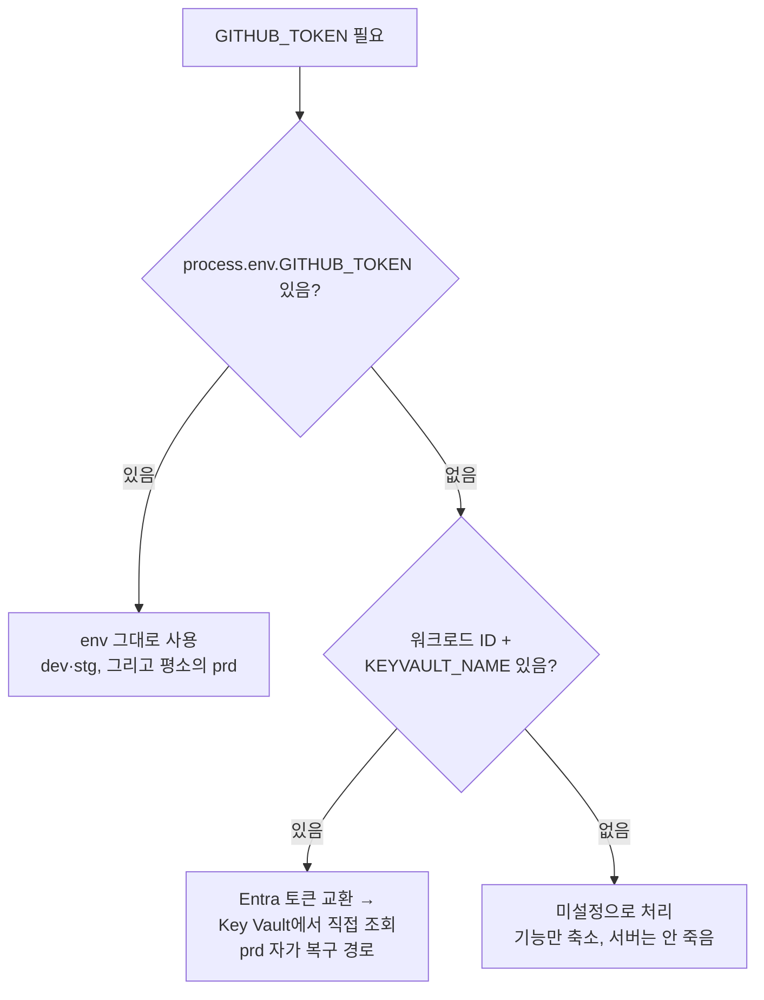

# myapp — 관리 ID·워크로드 ID 기반 "비밀 없는 접근" 적용

작성일: 2026-08-28

## 0. 원칙 확인

> 비밀을 '잘 보관'하는 방법을 찾기 전에 '만들지 않는' 방법을 먼저 검토한다.

먼저 결론부터: **myapp이 실제로 호출하는 외부 서비스 중 Entra ID 인증을 지원하는 것은 하나도 없다.** GitHub API와 Notion API는 Azure 리소스가 아니라 각자 자체 토큰 체계(PAT / Integration Token)를 쓰는 서드파티 SaaS이기 때문이다. 따라서 이 두 값은 "비밀을 만들지 않을" 방법이 없고, "잘 보관"하는 것(Key Vault + 워크로드 ID로 안전하게 조달)까지가 현실적으로 가능한 최선이다. 대신 **그 비밀을 Key Vault에서 꺼내오는 과정 자체**는 완전히 비밀 없이(워크로드 ID로) 이루어지도록 만들었다.

## 1. myapp이 접근하는 리소스 전수 조사

| # | 리소스 | Azure 리소스인가 | Entra 인증 지원 | 필요한 역할 | 결론 |
|---|---|---|---|---|---|
| 1 | GitHub REST API (`api.github.com`) | 아니오(서드파티 SaaS) | 미지원 — GitHub PAT/OAuth App만 지원, Azure Entra 페더레이션 없음 | 해당 없음 | **비밀 유지 필수** — Key Vault(`github-token`)에 보관, 워크로드 ID로 조달 |
| 2 | Notion API (`api.notion.com`) | 아니오(서드파티 SaaS) | 미지원 — Notion Integration Token만 지원 | 해당 없음 | **비밀 유지 필수** — Key Vault(`notion-token`, `notion-parent-page-id`)에 보관, 워크로드 ID로 조달 |
| 3 | Azure Container Registry(ACR) — 컨테이너 이미지 pull | 예 | 지원 | **AcrPull**(데이터 평면, 리소스 범위) | 비밀 없음 — AKS kubelet 관리 ID가 이미 pull(이미지 pull 시크릿 불필요), 앱 관리 ID에도 동일 역할 명시 부여 |
| 4 | Azure Key Vault — 위 두 비밀을 최종적으로 보관하는 곳 | 예 | 지원 | **Key Vault Secrets User**(데이터 평면, 읽기 전용, 리소스 범위) | 비밀 없음 — 워크로드 ID(연합 자격 증명)로 접근, Key Vault 자체 접근에 별도 자격 증명이 없음 |
| 5 | 애플리케이션 데이터 저장(`data/app.db`) | 아니오(컨테이너 로컬 파일, SQLite) | 해당 없음 | 해당 없음 | Azure 리소스가 아니므로 이번 검토 범위 밖 |

> 참고: `배포/prd/20_config.ps1`이 함께 프로비저닝하는 PostgreSQL·Redis·Storage는 **이 코스의 공통 샘플 앱(`배포/common/app`)을 위한 것**이며 myapp은 사용하지 않는다(myapp은 SQLite). 그 인프라의 Entra 연동(`Enable-PostgresEntraAuth`, `Grant-RedisDataAccess`, Storage `Grant-AzRole`)은 건드리지 않고 그대로 두었다 — myapp과 무관하다고 지우면 다른 환경(dev/stg)과의 구조 비교 학습 목적이 깨지기 때문이다.

## 2. 지원 리소스(ACR·Key Vault) 적용 — `identity.ps1` 함수 재사용

`배포/prd/20_config.ps1`은 이미(6단계 배포 조정 작업에서) `배포/common/identity.ps1`의 함수를 그대로 재사용해 아래를 수행하고 있었다 — 이번 검토에서 코드를 다시 확인하고, 누락돼 있던 `KEYVAULT_NAME`을 앱 컨테이너까지 전달하는 배관만 추가했다.

| 단계 | 재사용한 함수(`common/identity.ps1`) | 위치(`prd/20_config.ps1`) |
|---|---|---|
| 사용자 할당 관리 ID 생성 | `New-UserAssignedIdentity` | 65행 |
| Key Vault에 **읽기 전용** 역할 부여(Secrets Officer 아님) | `Grant-AzRole -Role 'Key Vault Secrets User' -Scope $kvId` | 72행 |
| ACR에 **Pull 전용** 역할 부여(Contributor 아님) | `Grant-AzRole -Role 'AcrPull' -Scope $acrId` | 136행 |
| ServiceAccount ↔ 관리 ID 연합(OIDC) | `New-FederatedCredential` | 210행 |
| github-token/notion-token/notion-parent-page-id를 Key Vault에 저장 | (자체 구현, 06단계에서 추가) | 155-169행 |

이번에 추가한 것: `배포/prd/config/k8s/base/configmap.yaml`에 `KEYVAULT_NAME` 키를 추가하고, `배포/prd/40_deploy.ps1`의 매니페스트 치환 대상 파일 목록에 `configmap.yaml`을 넣어 `20_config.ps1`이 만든 실제 Key Vault 이름이 배포 시점에 자동으로 채워지도록 했다(`base\serviceaccount.yaml`, `base\secretprovider.yaml`과 동일한 방식).

역할은 모두 **데이터 평면**(Key Vault Secrets User = 읽기 전용, AcrPull = 이미지 내려받기 전용)이며, **리소스 ID로 범위를 좁혀서**(`$kvId`, `$acrId`) 부여했다 — 구독 범위나 `Contributor`류 관리 역할은 코드 어디에도 없다(§5 검증 참고).

## 3. 지원하지 않는 리소스(GitHub·Notion) — Key Vault 보관 + 회전 절차

GitHub PAT와 Notion Integration Token은 Entra 페더레이션이 불가능하므로 Key Vault에 값 그대로 남는다. 다음 절차로 주기적으로 교체(rotate)한다.

### GitHub Personal Access Token 회전

1. [GitHub Settings → Developer settings → Personal access tokens](https://github.com/settings/tokens)에서 새 토큰 발급(`public_repo` 권한만, 기존과 동일 범위)
2. `az keyvault secret set --vault-name <KEYVAULT_NAME> --name github-token --value <새 토큰>` — 새 **버전**으로 저장됨(이전 버전은 자동 비활성화되지 않고 보존되므로 필요시 즉시 롤백 가능)
3. AKS의 Key Vault CSI 드라이버는 기본 폴링 주기(2분)마다 마운트된 값을 갱신한다. 즉시 반영하려면 파드를 재시작: `kubectl rollout restart deploy/myapp -n myapp-prd`
4. 새 토큰으로 `GET /api/env-status`가 `githubTokenSet:true`인지, 실제 분석 1건이 정상 동작하는지 확인
5. GitHub에서 **이전 토큰을 폐기**(Revoke) — 새 토큰이 정상 동작을 확인한 뒤에만 폐기한다(선폐기 후 확인 금지)

### Notion Integration Token 회전

1. [Notion Integrations](https://www.notion.so/my-integrations)에서 해당 Integration의 시크릿을 재발급(Rotate/Refresh 또는 신규 Integration 생성 후 페이지 재연결)
2. `az keyvault secret set --vault-name <KEYVAULT_NAME> --name notion-token --value <새 값>`
3. 위와 동일하게 CSI 폴링 대기 또는 `kubectl rollout restart`로 즉시 반영
4. Notion 업로드 1건이 정상 동작하는지 확인 후 이전 Integration 시크릿을 비활성화

> 두 절차 모두 **애플리케이션 코드나 이미지를 다시 빌드할 필요가 없다** — 값은 항상 Key Vault(또는 CSI가 동기화한 k8s Secret)에서만 오기 때문이다.

## 4. 앱 코드 — "환경이 스스로 인증 방식을 고르게" (`myapp/src/secrets.js`)

`배포/common/app/src/lib/authmode.js` + `src/db.js`의 `password`/`entra` 패턴을 그대로 본떠 만들었다. 다만 GitHub/Notion은 Entra로 직접 인증할 수 없으므로, "환경이 스스로 고르는" 대상은 **"토큰을 어디서 조달하는가"**로 바뀐다.

| 파일 | 역할 |
|---|---|
| `src/azureIdentity.js` | 워크로드 ID(연합 SA 토큰)로 Entra 액세스 토큰을 교환하고, Key Vault REST API로 시크릿 1개를 가져온다. `배포/common/app/src/azureToken.js`와 완전히 동일한 패턴(스코프만 Postgres→Key Vault로 다름) |
| `src/secrets.js` | `resolveSecretSource()`(순수 함수, 네트워크 없이 단위 테스트 가능) + `getSecret()`(실제 조달) + `secretsDiagnostics()`(값 없이 출처만 진단) |
| `src/github.js`, `src/notion.js` | 기존의 `process.env.GITHUB_TOKEN` 등 직접 참조를 `await getSecret(...)` 호출로 교체 |
| `server.js` `/version` | `identity: secretsDiagnostics()`를 응답에 포함 — **출처(env/keyvault/unset)만**, 값은 절대 없음 |

이미지는 dev·stg·prd 전부 **동일한 이미지 1개**를 쓴다 — 분기는 코드 안에서 환경 변수(워크로드 ID 존재 여부)로만 이루어진다.

## 5. `80_verify.ps1` 검증 추가

`배포/prd/80_verify.ps1`은 원래도 `common/identity.ps1`의 `Test-IdentityPosture`를 호출해 다음을 이미 검증하고 있었다(6개 항목, 그 중 "파드에 워크로드 ID 토큰 주입"이 **파드 안에서 직접 `printenv AZURE_CLIENT_ID`/`AZURE_FEDERATED_TOKEN_FILE`을 실행**해 확인하는 항목이다):

`AKS OIDC 발급자 · 워크로드 ID 애드온 · Key Vault CSI 애드온 · 연합 자격 증명 일치 · ServiceAccount 주석 일치 · 파드 안 토큰 주입 · (Postgres/Storage/Redis 관련) · 구독 범위 권한 없음`

이번에 **myapp 자체(앱 프로세스 안)**의 인지 여부까지 한 번 더 교차 검증하는 3개 항목을 추가했다(`/version` 실제 HTTP 호출 기반):

| 신규 검증 항목 | 확인 방법 |
|---|---|
| `/version`: 앱이 워크로드 ID를 인지함 | `identity.workloadIdentity === true` |
| `/version`: 비밀 출처(env\|keyvault)가 확인됨 | `identity.sources.GITHUB_TOKEN`·`NOTION_TOKEN`이 `unset`이 아님 |
| `/version` 응답에 자격 증명 값이 없음 | 응답 본문 전체에 `ghp_`/`ntn_`/`secret_` 패턴 정규식 매칭 — 0건이어야 통과 |

이 3개는 클러스터·리소스 조회(`Test-IdentityPosture`)와 별개로 **앱이 실제로 응답하는 내용**을 검사하므로, 인프라는 맞게 구성됐는데 앱 코드가 그걸 못 쓰고 있는 경우(또는 그 반대)를 잡아낼 수 있다.

## 6. 인수조건 검증 결과

| 인수조건 | 결과 | 근거 |
|---|---|---|
| (a) 앱 코드·Git·이미지에 비밀 값이 없음 | **O** — 실제로 확인함 | 소스 전체(`src/`, `server.js`, `public/`) 정규식 검색 0건. `.dockerignore`에 `.env` 등록, `.gitignore`에도 등록·`git check-ignore` 통과. **실제로 이미지를 빌드해** 컨테이너 내부를 `find`로 뒤져 `.env` 계열 파일이 0건임을 확인 |
| (b) 구독 범위 역할 할당 0건 | **△ — 코드 정적 검증은 O, 실제 Azure 조회는 미실행(비용 판단으로 보류)** | `prd/20_config.ps1`의 `Grant-AzRole` 호출 3건 모두 리소스 ID(`$kvId`/`$saId`/`$acrId`) 스코프만 사용함을 grep으로 확인(구독 스코프 패턴 0건). `Test-IdentityPosture`(§5)가 실제 Azure에 대해 `az role assignment list`로 이를 재확인하는 코드도 이미 있다. **이 세션에는 실제로 로그인된 Azure 구독이 있었으나**(`az account show` 확인됨), `prd/20_config.ps1` 실행 시 AKS·PostgreSQL HA·Redis 등 운영 등급 리소스가 생성되어 15~25분·상당한 시간당 과금이 발생하므로, 사용자가 비용 부담을 이유로 실행을 보류하기로 결정했다 |
| (c) `80_verify` 아이덴티티 항목 전부 Pass | **△ — 검증 코드는 준비 완료, 실제 AKS 대상 실행은 미실행(비용 판단으로 보류)** | §5의 6+3=9개 항목이 모두 `80_verify.ps1`에 연결돼 있고, 앱 쪽 3개 항목은 로컬 서버(localhost:4000)를 대상으로 파싱 로직 자체는 실행해 정상 동작을 확인했다(§7). 실제 AKS·워크로드 ID·Key Vault 대상 종합 실행은 (b)와 동일한 비용 사유로 사용자가 보류를 선택했다 |
| (d) `/version` 응답에 자격 증명 값이 없음 | **O — 실제로 확인함** | 로컬에서 실제 토큰이 설정된 상태로 `/version` 호출 결과 `{"identity":{"workloadIdentity":false,"keyVaultConfigured":false,"sources":{"GITHUB_TOKEN":"env",...}}}`만 반환됨을 확인(값 없음). 단위 테스트(`secretsDiagnostics: 실제 토큰 값은 절대 포함하지 않는다`)로도 고정 |

## 7. 실제로 실행해 확인한 것 / 못 한 것

### 실행해 확인함
- 단위 테스트 25개(전체) 전부 Pass — `resolveSecretSource`·`workloadIdentityAvailable`·`secretsDiagnostics`의 9개 케이스 포함
- 로컬 서버 재기동 → `/version`이 `identity` 필드를 정상 반환, 실제 GitHub 분석 + Notion 업로드가 리팩터링 후에도 여전히 200으로 동작
- Docker 이미지를 실제로 빌드 → 이미지 내부에 `.env` 계열 파일 없음을 `find`로 확인
- `80_verify.ps1`에 추가한 PowerShell 파싱 로직을 로컬 서버(`/version`) 대상으로 실행해 `leaked: False`, `sources` 정상 파싱을 확인(로직 자체의 정확성 검증)

### 실행하지 않음(비용 판단으로 보류 — 구독 자체는 있음)
- `prd/20_config.ps1` 전체 실행(리소스 그룹·Key Vault·관리 ID·AKS 실제 생성)
- `prd/80_verify.ps1`을 실제 AKS·Key Vault 대상으로 실행한 종합 Pass/Fail
- Key Vault 회전 절차(§3)의 실제 `az keyvault secret set` 실행

이 세션에는 로그인된 Azure 구독이 실제로 있다(`az account show`로 확인, 구독명 "Azure in Open"). 다만 `prd/20_config.ps1`을 실행하면 AKS(시스템+사용자 노드 풀)·PostgreSQL 유연 서버(영역 중복 HA)·Redis·Storage 등 **운영 등급 리소스가 실제로 생성되어 15~25분이 걸리고, 존재하는 동안 시간당 상당한 비용이 청구**된다. myapp 자체는 이 중 Key Vault·AKS만 쓰지만, 이 스크립트는 코스 공통 샘플 앱을 위한 PostgreSQL/Redis/Storage까지 함께 프로비저닝하도록 설계돼 있어(§1 참고, 구조 비교 학습 목적으로 유지) 축소 실행 없이는 비용을 피할 수 없다. 사용자에게 정확한 비용·소요시간을 안내하고 실행 여부를 확인한 결과, **비용 부담을 이유로 실제 프로비저닝은 하지 않기로 결정**했다.

따라서 (b)(c)는 "코드가 원칙(리소스 범위·데이터 평면·구독 금지)을 지키는지"는 정적으로 전수 검증했고, "앱 자체 동작(비밀 미노출)"은 로컬·dev(k3d) 컨테이너 양쪽에서 실제로 검증했지만, **실제 Azure 리소스에 대한 종합 Pass/Fail은 사용자의 명시적 선택으로 실행하지 않은 상태**로 남는다. 나중에 실행하려면 `pwsh 배포/prd/20_config.ps1` → `pwsh 배포/prd/40_deploy.ps1` → `pwsh 배포/prd/80_verify.ps1` 순서로 실행하면 된다(완료 후 `pwsh 배포/prd/90_cleanup.ps1`으로 정리해 과금을 멈출 수 있다).

---
**입력 → 산출물 → 검증 결과**: `배포/common/identity.ps1`·`배포/common/app/src/lib/authmode.js`·`myapp/`(GitHub/Notion 연동) → `09_비밀없는접근.md` + `myapp/src/azureIdentity.js`·`src/secrets.js`(신규) + `github.js`/`notion.js`/`server.js` 수정 + `배포/prd/20_config.ps1`·`40_deploy.ps1`·`80_verify.ps1`·`config/k8s/base/configmap.yaml` 수정 → (a)(d) 실제 실행 확인 O, (b)(c) 코드는 원칙을 준수하도록 작성·정적 검증까지 마쳤으나 실제 Azure 리소스 대상 실행은 (구독은 있음) 비용 부담으로 사용자가 보류를 선택해 △(사유 명시, 재개 방법 §7에 기록)
